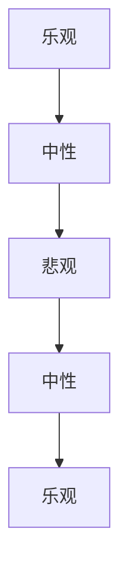
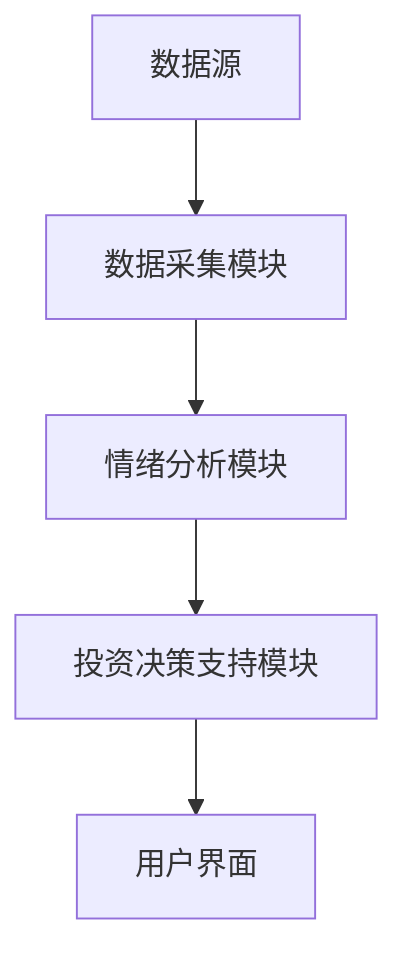

                 

# 巴菲特的市场情绪利用：在恐慌中寻找机会

## 关键词：
- 巴菲特，市场情绪，恐慌，投资策略，价值投资，情绪分析，数学模型

## 摘要：
本文深入探讨了巴菲特如何利用市场情绪，特别是在市场恐慌时寻找投资机会的策略。通过分析市场情绪的定义、量化方法、数学模型以及实际案例，本文揭示了如何在市场恐慌中做出明智的投资决策。结合系统设计和项目实战，本文为投资者提供了实用的工具和方法，帮助他们在市场波动中把握机会。

---

## 第1章：市场情绪概述

### 1.1 市场情绪的定义与重要性
市场情绪是指投资者在市场中的情感状态和态度，通常反映在他们的投资行为中。市场情绪可以是乐观、悲观、恐慌或贪婪。在投资决策中，市场情绪往往影响资产价格，尤其是在市场波动剧烈时。

#### 市场情绪的重要性
市场情绪是投资者决策的核心因素之一。它可以帮助投资者识别市场的非理性行为，从而在市场恐慌时发现低估资产，在市场狂热时避免过度投资。

### 1.2 巴菲特的市场情绪理论
巴菲特认为，市场情绪是价值投资的重要参考。他强调在市场恐慌时买入优质资产，因为恐慌会导致资产价格低于其内在价值。

#### 巴菲特的投资哲学
巴菲特的投资策略基于价值投资，即寻找那些市场价格低于其内在价值的资产。他相信市场情绪会在短期内影响价格，但长期来看，价值终将回归。

### 1.3 市场恐慌的来源与表现
市场恐慌通常由经济危机、市场崩盘或重大事件引发。投资者的恐慌情绪会导致抛售行为，进一步加剧市场下跌。

---

## 第2章：市场情绪周期分析

### 2.1 市场情绪的周期性
市场情绪呈现周期性波动，经历从乐观到悲观再到乐观的循环。了解情绪周期可以帮助投资者在不同阶段调整策略。

#### 市场情绪周期图（Mermaid）

### 2.2 市场情绪与资产配置
在不同市场情绪阶段，资产配置策略应有所不同。例如，在悲观阶段，增加防御性资产的配置比例。

---

## 第3章：市场情绪的量化分析

### 3.1 市场情绪指标的构建
市场情绪指标是量化市场情绪的重要工具。常用的指标包括恐慌指数、贪婪指数等。

#### 恐慌指数的计算公式
$$恐慌指数 = \sum_{i=1}^{n} (情绪强度_i \times 权重_i)$$

### 3.2 市场情绪的数学模型
市场情绪可以表示为一个时间序列模型。通过回归分析，可以预测市场情绪的变化趋势。

#### 回归分析示例
假设市场情绪与资产价格的关系可以用线性回归模型表示：
$$y = \beta_0 + \beta_1 x + \epsilon$$
其中，$y$ 是市场情绪指数，$x$ 是资产价格，$\epsilon$ 是误差项。

---

## 第4章：市场情绪与投资决策

### 4.1 市场情绪对投资决策的影响
市场情绪会影响投资者的理性决策，导致过度交易或误判市场趋势。

#### 克服情绪干扰的方法
1. 制定明确的投资计划
2. 避免频繁查看市场数据
3. 坚持长期投资

### 4.2 巴菲特的投资策略
巴菲特强调在市场恐慌时买入优质资产，因为他相信恐慌会导致价格低估。

---

## 第5章：市场情绪监控系统

### 5.1 系统功能设计
市场情绪监控系统可以帮助投资者实时跟踪市场情绪变化，提供投资决策支持。

#### 系统功能模块
1. 数据采集模块：收集市场数据
2. 情绪分析模块：计算市场情绪指数
3. 投资决策支持模块：提供投资建议

### 5.2 系统架构设计

---

## 第6章：项目实战

### 6.1 2008年金融危机案例分析
在2008年金融危机期间，巴菲特利用市场的恐慌情绪，大量买入优质资产，获得了丰厚的回报。

#### 投资策略总结
1. 识别市场恐慌的信号
2. 选择优质资产
3. 长期持有

### 6.2 项目小结
通过实际案例分析，我们可以看到市场情绪分析在投资中的实际应用价值。

---

## 第7章：总结与展望

### 7.1 投资中的注意事项
1. 保持理性，避免情绪驱动决策
2. 关注市场情绪变化，及时调整策略
3. 长期投资，耐心等待价值回归

### 7.2 拓展阅读
建议阅读巴菲特的《聪明的投资者》和《投资最重要的简单真理》。

---

## 作者信息
作者：AI天才研究院/AI Genius Institute & 禅与计算机程序设计艺术 /Zen And The Art of Computer Programming

