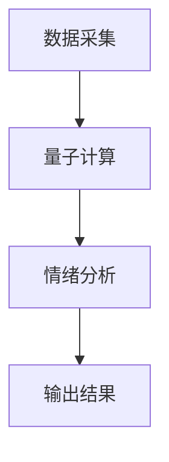

                 


# 巴菲特的市场情绪指标5.0：量子人工智能驱动的情绪分析

> 关键词：巴菲特，市场情绪指标，量子人工智能，情绪分析，投资策略

> 摘要：本文探讨了如何利用量子人工智能技术改进市场情绪指标的分析，结合巴菲特的投资理念，提出了一种基于量子神经网络的市场情绪分析模型。文章详细介绍了量子人工智能的基本原理、情绪分析的算法原理、数学模型的设计，以及系统的架构与实现方案。通过实际案例分析，展示了如何利用量子计算的优势提升市场情绪分析的准确性和效率。

---

## 第一部分：市场情绪指标的背景与巴菲特投资理念

### 第1章：市场情绪指标的核心概念

#### 1.1 巴菲特投资理念与市场情绪

##### 1.1.1 巴菲特价值投资理论
巴菲特的价值投资理论强调长期投资、安全边际和企业内在价值。他主张在市场恐慌时买入优质资产，在市场狂热时卖出。市场情绪在投资决策中起着至关重要的作用。

##### 1.1.2 市场情绪指标的定义与作用
市场情绪指标是用来量化市场参与者情绪的工具，能够反映市场的乐观或悲观程度。通过分析市场情绪，投资者可以更好地把握市场的短期波动，辅助投资决策。

##### 1.1.3 市场情绪指标的演变
从传统的市场情绪指标（如恐慌指数VIX）到现代的基于大数据和人工智能的情绪指标，市场情绪分析经历了多次升级。本文提出的“巴菲特市场情绪指标5.0”结合了量子人工智能技术，代表了该领域的最新进展。

---

### 第2章：量子人工智能的基本原理

#### 2.1 量子计算与人工智能的结合

##### 2.1.1 量子计算的基本概念
量子计算利用量子位（qubit）进行计算，具有并行计算能力和超高速度。量子位可以通过叠加态（superposition）和纠缠态（entanglement）处理复杂问题。

##### 2.1.2 人工智能的基本原理
人工智能通过数据训练模型，模拟人类的学习和推理能力。传统的人工智能依赖于经典计算，而量子人工智能则利用量子计算的优势。

##### 2.1.3 量子人工智能的优势
量子人工智能在处理高维数据、复杂模式和并行计算方面具有显著优势，能够显著提升情绪分析的精度和效率。

---

## 第二部分：市场情绪指标的量子人工智能算法

### 第3章：市场情绪分析的算法原理

#### 3.1 情绪分析的自然语言处理（NLP）基础

##### 3.1.1 自然语言处理的基本概念
自然语言处理（NLP）是人工智能的核心技术之一，用于理解和生成人类语言。传统的情绪分析方法包括词袋模型和词嵌入。

##### 3.1.2 情感分类的经典算法
经典的情感分类算法包括朴素贝叶斯、支持向量机（SVM）和随机森林等。这些算法在处理简单情绪分类任务时表现出色。

##### 3.1.3 量子神经网络在情绪分析中的应用
量子神经网络通过量子叠加和纠缠态处理高维数据，能够捕捉传统算法难以察觉的情绪细微差别。

---

#### 3.2 量子神经网络的结构与训练

##### 3.2.1 量子神经网络的基本结构
量子神经网络结合了量子计算和深度学习的优势，通过量子叠加和纠缠态处理数据。

##### 3.2.2 量子神经网络的训练方法
量子神经网络的训练需要结合量子计算和经典计算的优势，采用混合计算模式。

---

### 第4章：市场情绪指标的数学模型

#### 4.1 情绪指数的计算公式

##### 4.1.1 基于量子叠加的情绪指数
$$
E = \sum_{i=1}^{n} \lambda_i x_i
$$

##### 4.1.2 情绪指数的归一化处理
$$
E_{normalized} = \frac{E}{\max(E)}
$$

#### 4.2 量子人工智能的数学基础

##### 4.2.1 量子叠加与测量
$$
|\psi\rangle = \alpha|0\rangle + \beta|1\rangle
$$

##### 4.2.2 量子纠缠与信息传递
$$
|\psi\rangle = \frac{1}{\sqrt{2}}(|00\rangle + |11\rangle)
$$

---

### 第5章：系统架构与实现方案

#### 5.1 系统架构设计

##### 5.1.1 系统功能模块划分
- 数据采集模块：负责收集市场数据和情绪数据。
- 量子计算模块：处理高维数据和复杂计算。
- 情绪分析模块：结合量子计算结果进行情绪分析。

##### 5.1.2 系统架构图


#### 5.2 系统实现与代码示例

##### 5.2.1 环境安装
需要安装量子计算库（如Qiskit）和深度学习框架（如TensorFlow）。

##### 5.2.2 核心实现代码
```python
import numpy as np
from qiskit import QuantumCircuit, execute, Aer

def quantum_emotion_analysis(data):
    # 量子电路设计
    qc = QuantumCircuit(2, 2)
    qc.h(0)
    qc.cx(0, 1)
    qc.measure([0, 1], [0, 1])
    
    # 量子计算模拟
    backend = Aer.get_backend('qasm_simulator')
    result = execute(qc, backend).result()
    probabilities = result.get_counts()
    
    # 情绪分析
    emotion_score = np.dot(data, np.array(list(probabilities.values())))
    return emotion_score
```

---

## 第六部分：最佳实践与小结

### 6.1 最佳实践

- 数据质量：确保数据的多样性和代表性。
- 模型调优：通过多次实验优化量子神经网络的参数。
- 实际应用：结合具体场景调整模型。

### 6.2 小结

本文提出了基于量子人工智能的市场情绪分析模型，结合巴菲特的投资理念，为投资者提供了新的工具。量子人工智能技术的应用显著提升了情绪分析的精度和效率。

---

## 作者信息

作者：AI天才研究院/AI Genius Institute & 禅与计算机程序设计艺术 /Zen And The Art of Computer Programming

