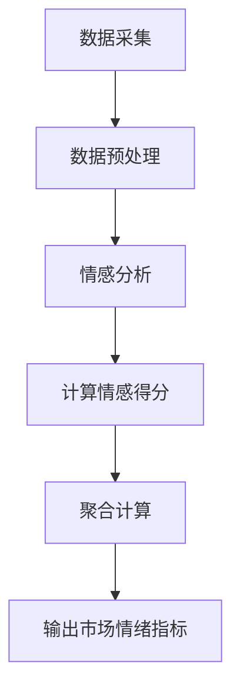
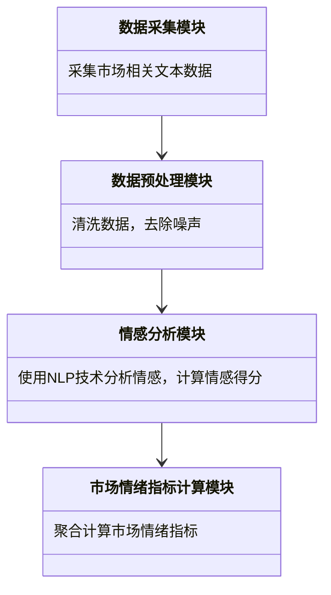

                 


# 巴菲特的市场情绪指标：利用大众心理做出明智决策

> **关键词：** 巴菲特, 市场情绪指标, 大众心理, 投资决策, 情绪分析

> **摘要：**  
> 本文深入探讨巴菲特如何利用市场情绪指标进行投资决策，分析其背后的逻辑与方法。通过介绍市场情绪指标的核心概念、计算方法、系统架构设计以及实际案例，结合技术手段如情绪分析算法、数学模型和系统架构设计，详细阐述如何通过分析大众心理来优化投资策略。文章内容涵盖背景介绍、算法原理、系统实现、项目实战和最佳实践，帮助读者全面理解并应用市场情绪指标。

---

## 第一部分：市场情绪指标概述

### 第1章：市场情绪指标的基本概念

#### 1.1 市场情绪指标的定义与分类

市场情绪指标是衡量市场参与者情绪状态的量化工具，反映了投资者对市场的乐观或悲观程度。这些指标可以帮助投资者识别市场趋势，预测市场行为，并做出更明智的投资决策。

- **定义：** 市场情绪指标通过分析市场参与者的言论、行为和交易数据，量化市场情绪的状态，如乐观、中性或悲观。
- **分类：** 
  - **情绪强度：** 衡量市场情绪的强弱，通常用数值表示，如-100到100。
  - **情绪趋势：** 分析市场情绪的变化方向，如上升、下降或持平。
  - **情绪波动：** 评估市场情绪的波动性，反映市场的不稳定程度。

市场情绪指标的重要性在于它能够揭示市场参与者的心理状态，从而帮助投资者预测市场行为和价格变动。

---

#### 1.2 巴菲特的投资理念与市场情绪

巴菲特是一位价值投资的倡导者，他强调长期投资和基本面分析。然而，他并非完全忽视市场情绪。在市场恐慌或狂热时，情绪指标可以帮助他识别市场的非理性行为，从而做出逆向投资决策。

- **巴菲特的投资哲学：** 价值投资，寻找被市场低估的企业，长期持有。
- **市场情绪对巴菲特的影响：** 当市场情绪过度乐观时，巴菲特可能选择观望或寻找被低估的投资标的；当市场情绪极度悲观时，他可能增加投资，利用市场的恐慌获取优质资产。

---

## 第二部分：市场情绪指标的分析方法

### 第2章：市场情绪指标的计算与应用

#### 2.1 市场情绪指标的计算方法

市场情绪指标的计算通常涉及多种数据源，如新闻、社交媒体、交易数据等。常用的方法包括：

- **情绪强度分析：** 通过自然语言处理（NLP）技术分析文本数据，计算情感得分。
- **情绪趋势分析：** 使用时间序列分析，观察情绪指标的变化趋势。
- **情绪波动分析：** 计算情绪指标的标准差或波动率，衡量市场的不确定性。

**计算步骤：**

1. **数据采集：** 收集相关的文本数据，如新闻、社交媒体帖子、投资者评论等。
2. **预处理：** 清洗数据，去除噪声，如停用词、标点符号等。
3. **情感分析：** 使用NLP技术对文本进行情感分类，计算每条数据的情感得分。
4. **聚合计算：** 将所有数据的情感得分进行聚合，计算整体市场情绪指标。

---

#### 2.2 市场情绪指标的应用场景

市场情绪指标在投资决策中具有广泛的应用，以下是几个典型场景：

- **投资决策：** 在市场情绪过度乐观时，投资者可能需要谨慎，避免追涨；在市场情绪极度悲观时，可能需要寻找投资机会。
- **风险管理：** 通过监控市场情绪波动，投资者可以提前识别潜在风险，制定风险管理策略。
- **市场周期分析：** 分析市场情绪指标的时间序列，识别市场的周期性变化，帮助投资者把握市场趋势。

---

## 第三部分：市场情绪指标的核心算法

### 第3章：市场情绪指标的算法原理

#### 3.1 市场情绪指标的算法流程

以下是市场情绪指标计算的算法流程：



**步骤说明：**

1. **数据采集：** 收集相关的文本数据，如新闻、社交媒体帖子等。
2. **数据预处理：** 清洗数据，去除噪声，提取有用的信息。
3. **情感分析：** 使用NLP技术对文本进行情感分类，计算每条数据的情感得分。
4. **计算情感得分：** 根据情感分析的结果，计算每条数据的情感得分，通常为-1（悲观）到1（乐观）。
5. **聚合计算：** 将所有数据的情感得分进行平均，得到整体市场情绪指标。

---

#### 3.2 市场情绪指标的数学模型

市场情绪指标的计算可以通过以下数学模型实现：

**情感得分计算公式：**

$$ \text{情感得分} = \frac{\text{正面词数} - \text{负面词数}}{\text{总词数}} $$

**市场情绪指标计算公式：**

$$ \text{市场情绪指标} = \frac{\sum \text{情感得分}}{\text{数据条数}} $$

**情绪趋势分析公式：**

$$ \text{趋势} = \frac{\text{当前情绪指标} - \text{上一期情绪指标}}{\text{时间间隔}} $$

---

## 第四部分：系统架构与实现

### 第4章：市场情绪指标分析系统的架构设计

#### 4.1 系统功能模块设计

以下是市场情绪指标分析系统的功能模块设计：



---

#### 4.2 系统架构设计

以下是系统的架构设计：


---

## 第五部分：项目实战与案例分析

### 第5章：基于市场情绪指标的实战案例

#### 5.1 项目环境与工具安装

**环境配置：**

- 操作系统：Linux/Windows/MacOS
- Python版本：3.6+
- 工具：Python、NLTK库、TensorFlow库

**工具安装：**

```bash
pip install numpy
pip install pandas
pip install nltk
pip install tensorflow
```

---

#### 5.2 核心代码实现

**数据采集模块：**

```python
import requests
from bs4 import BeautifulSoup

def collect_data(url):
    response = requests.get(url)
    soup = BeautifulSoup(response.text, 'html.parser')
    articles = soup.find_all('article')
    texts = [article.text for article in articles]
    return texts
```

**数据预处理模块：**

```python
import nltk
from nltk.corpus import stopwords

def preprocess(texts):
    processed_texts = []
    for text in texts:
        words = nltk.word_tokenize(text.lower())
        filtered_words = [word for word in words if word not in stopwords.words('english')]
        processed_texts.append(' '.join(filtered_words))
    return processed_texts
```

**情感分析模块：**

```python
from tensorflow.keras.models import load_model
import numpy as np

model = load_model('sentiment_model.h5')

def predict_emotion(text):
    sequence = tokenizer.texts_to_sequences([text])
    padded = pad_sequences(sequence, maxlen=500)
    prediction = model.predict(padded)
    return prediction[0][0]
```

**市场情绪指标计算模块：**

```python
def calculate_market_sentiment(emotion_scores):
    return np.mean(emotion_scores)
```

---

#### 5.3 案例分析与结果解读

**案例分析：**

假设我们收集了100条市场相关的文本数据，经过预处理和情感分析，得到每条数据的情感得分为[-0.2, 0.5, -0.7, ..., 0.3]。

**结果计算：**

$$ \text{市场情绪指标} = \frac{\sum \text{情感得分}}{100} $$

假设总和为20，市场情绪指标为0.2，表示当前市场情绪较为乐观。

---

## 第六部分：最佳实践与总结

### 6.1 小结

市场情绪指标是投资者分析市场行为和做出决策的重要工具。通过结合巴菲特的投资理念和现代技术手段，投资者可以更好地利用市场情绪指标优化投资策略。

---

### 6.2 注意事项

- **数据质量：** 数据的准确性和及时性直接影响市场情绪指标的计算结果。
- **模型选择：** 不同的情感分析模型有不同的精度和效率，选择合适的模型至关重要。
- **市场环境：** 市场情绪指标受多种因素影响，需结合其他指标进行综合分析。

---

### 6.3 拓展阅读

- 《The Intelligent Investor》 - 巴菲特的投资哲学。
- 《Sentiment Analysis in Social Media》 - 情感分析技术的深度探讨。

---

**作者：AI天才研究院/AI Genius Institute & 禅与计算机程序设计艺术 /Zen And The Art of Computer Programming**

