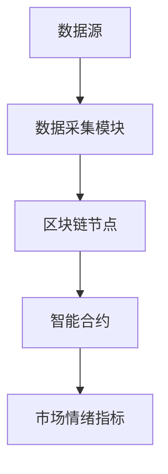

                 

# 巴菲特的市场情绪指标：区块链技术在金融市场的应用

> **关键词**：区块链技术、金融市场、市场情绪指标、巴菲特投资策略、分布式账本、共识机制  
> **摘要**：本文探讨了区块链技术在金融市场中的应用，特别是其如何帮助投资者分析市场情绪，类似于巴菲特的投资策略。通过详细分析区块链的核心概念、算法原理和系统架构，本文展示了如何利用区块链技术构建实时、可靠的市场情绪指标系统。

---

## 第一部分：背景介绍

### 第1章：区块链技术概述

#### 1.1 区块链的基本概念

区块链是一种去中心化的分布式账本技术，通过加密算法和分布式共识机制确保数据的安全性和不可篡改性。区块链的核心要素包括：

1. **分布式账本**：数据以区块形式分布式存储在网络中，每个节点都有一份完整的账本副本。
2. **共识机制**：通过算法（如PoW、PoS）达成全网对账本状态的一致性。
3. **智能合约**：基于区块链的自动执行程序，用于自动执行预定义的条件。

区块链在金融市场的应用潜力巨大，特别是在提升透明度、降低交易成本和增强信任方面。

#### 1.2 市场情绪指标的重要性

市场情绪是投资者心理的反映，直接影响市场行为。巴菲特的长期投资策略强调情绪管理，避免短期市场波动的干扰。在区块链技术的支持下，市场情绪指标可以实时采集和分析，帮助投资者做出更明智的决策。

---

### 第2章：区块链技术在金融市场的应用背景

#### 2.1 传统金融市场中的痛点

传统金融市场存在信息不对称、信任缺失和交易效率低等问题。例如：

- **信息不对称**：投资者难以获取真实可靠的市场数据。
- **信任缺失**：缺乏透明的中间机构导致信任成本高昂。
- **交易效率低**：复杂的流程和中间机构导致交易成本增加。

#### 2.2 区块链技术的解决方案

区块链技术通过去中心化和分布式账本解决了传统金融市场的痛点：

- **提高交易透明度**：所有交易记录在区块链上，可实时查看。
- **降低交易成本**：减少中间机构，降低交易费用。
- **增强信任机制**：通过共识机制确保数据的真实性和不可篡改性。

---

## 第二部分：市场情绪指标与区块链的结合

### 第3章：市场情绪指标的构建

#### 3.1 情绪指标的定义与分类

市场情绪指标是衡量市场参与者心理状态的指标，常见的包括：

1. **投资者情绪指数（II）**：反映投资者对市场的乐观或悲观程度。
2. **市场恐慌指数（VIX）**：衡量市场波动性和恐慌程度。
3. **市场情绪指数（MEI）**：综合分析市场情绪的多维度指标。

#### 3.2 区块链在情绪指标中的作用

区块链技术为市场情绪指标的构建提供了以下优势：

- **实时数据采集与处理**：通过区块链节点实时收集市场数据。
- **数据可信度**：区块链的不可篡改性确保数据的真实性。
- **分布式存储**：数据在区块链上分布存储，避免单点故障。

---

### 第4章：区块链技术的核心概念与联系

#### 4.1 区块链的核心原理

1. **分布式账本的结构**：每个区块包含交易数据和时间戳，通过哈希指针链接形成链式结构。
2. **共识机制的原理**：通过PoW或PoS算法达成全网一致的账本状态。
3. **智能合约的执行流程**：智能合约在区块链上自动执行预定义的条件。

#### 4.2 情绪指标与区块链的关系

1. **数据采集与存储的关联**：区块链作为数据存储和传输的基础设施。
2. **情绪分析的实时性**：区块链支持实时数据处理，确保情绪指标的及时更新。
3. **情绪指标的可视化与区块链技术的结合**：通过区块链技术实现情绪指标的可视化展示。

---

## 第三部分：算法原理与数学模型

### 第5章：算法原理

#### 5.1 情绪分析算法

自然语言处理（NLP）技术用于分析新闻、社交媒体等文本数据，提取市场情绪。常用的情绪分类算法包括：

1. **情感分析模型**：使用机器学习算法（如SVM、LSTM）对文本进行情感分类。
2. **文本挖掘技术**：提取关键词和主题，分析市场情绪。

#### 5.2 区块链共识机制

以工作量证明（PoW）为例，区块链节点通过解密哈希函数达成共识，确保数据的真实性和一致性。

---

### 第6章：数学模型

#### 6.1 情绪指标计算公式

$$
\text{市场情绪指数} = \frac{\sum (\text{情感值} \times \text{权重})}{\text{总权重}}
$$

其中，情感值是文本的情感分类结果，权重是关键词的重要性。

#### 6.2 区块链共识机制公式

以PoW为例，解密哈希函数的难度调整公式：

$$
\text{难度调整} = \frac{\text{目标难度}}{\text{当前哈希值}}
$$

---

## 第四部分：系统分析与架构设计

### 第7章：系统架构

#### 7.1 系统功能设计

1. **数据采集模块**：实时采集市场数据。
2. **情绪分析模块**：分析数据并生成情绪指标。
3. **区块链存储模块**：将情绪指标存储在区块链上。

#### 7.2 系统架构图

---

## 第五部分：项目实战

### 第8章：项目实战

#### 8.1 环境配置

- **操作系统**：Ubuntu 20.04
- **开发工具**：Python、Solidity、Node.js

#### 8.2 核心代码实现

1. **数据采集模块**：使用Python爬虫采集市场数据。
2. **情绪分析模块**：基于NLP库（如NLTK）进行情感分析。
3. **区块链存储模块**：使用以太坊智能合约存储情绪指标。

#### 8.3 案例分析

通过实际案例分析，验证系统在实时市场情绪分析中的有效性。

---

## 第六部分：总结与展望

### 第9章：总结

区块链技术为金融市场的情绪指标分析提供了新的可能性。通过实时数据处理和分布式存储，区块链技术能够提升市场情绪分析的准确性和可靠性。

### 第10章：未来展望

未来，区块链技术将与人工智能、大数据等技术结合，进一步提升市场情绪分析的深度和广度。

---

## 作者

作者：AI天才研究院 & 禅与计算机程序设计艺术

---

通过以上结构，本文详细探讨了区块链技术在金融市场中的应用，特别是其在市场情绪分析中的潜力和优势。希望读者能够通过本文深入了解区块链技术的核心原理和实际应用，为金融市场的情绪指标分析提供新的视角和方法。

