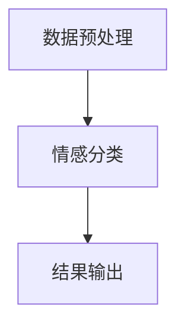
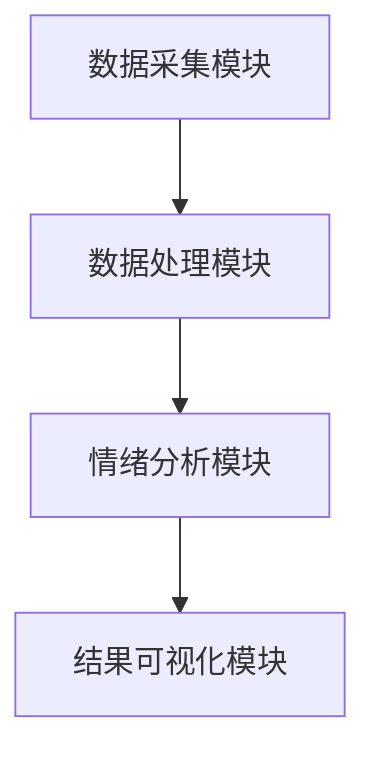

                 


# 巴菲特的市场情绪指标：社交媒体情绪分析的新维度

---

## 关键词

- 巴菲特市场情绪指标
- 社会媒体情绪分析
- 投资心理学
- 数据挖掘
- 机器学习

---

## 摘要

本文探讨了巴菲特的市场情绪指标在社交媒体情绪分析中的应用，结合投资心理学与技术分析，提出了一个创新的解决方案。通过分析社交媒体数据，提取市场情绪，构建指标模型，并展示其在投资决策中的实际应用。文章从背景、核心概念、算法原理、系统架构到项目实战，详细阐述了这一创新方法，为投资者提供了新的工具和视角。

---

# 第一部分: 巴菲特的市场情绪指标与社交媒体情绪分析背景

## 第1章: 情绪分析的背景与意义

### 1.1 情绪分析的背景

#### 1.1.1 投资心理学与市场情绪

市场的波动往往与投资者的情绪密切相关。巴菲特曾说过：“在别人贪婪时恐惧，在别人恐惧时贪婪。”这种逆向思维的核心在于理解市场情绪的变化。社交媒体作为信息传播的主要渠道，成为情绪分析的重要来源。

#### 1.1.2 社交媒体在金融分析中的作用

社交媒体平台（如Twitter、Reddit、雪球等）上的用户评论、帖子和转发，反映了市场参与者的情绪。通过分析这些数据，可以实时捕捉市场情绪的变化，为投资决策提供参考。

#### 1.1.3 巴菲特投资理念与情绪分析的结合

巴菲特的投资策略注重长期价值，但市场情绪的短期波动仍会影响资产价格。结合情绪分析，投资者可以更好地捕捉市场拐点，优化投资组合。

---

### 1.2 巴菲特市场情绪指标的定义

#### 1.2.1 市场情绪指标的核心概念

市场情绪指标是衡量市场乐观或悲观程度的量化工具。基于社交媒体数据，结合自然语言处理技术，计算出一个反映市场情绪的数值。

#### 1.2.2 指标的计算方法与特点

指标计算方法包括情感分类、关键词提取和情感强度分析。指标具有实时性、可量化和可预测性特点。

#### 1.2.3 指标在投资决策中的应用

指标可帮助投资者识别市场顶部和底部，优化交易策略，降低投资风险。

---

### 1.3 社交媒体情绪分析的现状

#### 1.3.1 社交媒体数据的特点

社交媒体数据具有实时性、海量性和非结构化特点。数据来源广泛，包括文本、图片和视频。

#### 1.3.2 情绪分析技术的发展

从简单关键词提取到深度学习模型，情绪分析技术不断进步，准确率显著提高。

#### 1.3.3 巴菲特指标与社交媒体的结合

通过社交媒体数据提取情绪特征，构建市场情绪指标，为投资决策提供新维度。

---

### 1.4 本章小结

本章介绍了市场情绪分析的背景、巴菲特指标的核心概念以及社交媒体在情绪分析中的作用。社交媒体情绪分析为投资者提供了新的工具和视角。

---

## 第2章: 情绪指标的核心概念

### 2.1 情绪指标的属性特征对比

#### 2.1.1 不同情绪指标的对比分析

对比传统市场情绪指标和基于社交媒体的情绪指标，分析其优缺点。

#### 2.1.2 巴菲特指标的独特性

指标结合了社交媒体数据和投资心理学，具有更高的实时性和准确性。

#### 2.1.3 指标的适用场景与限制

适用于短期市场波动分析，但不能完全替代基本面分析。

---

### 2.2 情绪指标的ER实体关系图

```mermaid
erDiagram
    actor 投资者 {
        <属性>
        id
        投资标的
        情绪指标
    }
    actor 社交媒体平台 {
        <属性>
        用户ID
        发帖内容
        发帖时间
    }
    actor 情绪分析系统 {
        <属性>
        情绪得分
        关键词提取
        情感分类
    }
    投资者 --> 社交媒体平台 : 使用平台获取数据
    投资者 --> 情绪分析系统 : 获取情绪指标
    社交媒体平台 --> 情绪分析系统 : 提供数据
```

---

### 2.3 情绪指标的数学模型

#### 2.3.1 情绪指标的计算公式

$$
\text{情绪指标} = \alpha \cdot \text{情感分类结果} + \beta \cdot \text{关键词权重} + \gamma \cdot \text{时间因素}
$$

其中，$\alpha$, $\beta$, $\gamma$为权重系数，需根据实际情况调整。

#### 2.3.2 模型的推导过程

通过分析社交媒体数据中的关键词和情感倾向，结合权重计算，最终得到情绪指标。

#### 2.3.3 公式的应用场景

用于实时情绪监控，预测市场走势。

---

### 2.4 本章小结

本章详细介绍了情绪指标的核心概念，包括属性特征对比、ER图和数学模型。为后续算法实现奠定了基础。

---

## 第3章: 情绪分析算法的原理

### 3.1 情绪分析算法的流程



---

### 3.2 情绪分析算法的实现

#### 3.2.1 算法选择与优化

选择适合的算法（如TF-IDF+逻辑回归），优化参数以提高准确率。

#### 3.2.2 算法的实现步骤

1. 数据清洗：去除噪音数据。
2. 特征提取：提取关键词和情感词汇。
3. 模型训练：训练情感分类器。
4. 模型预测：对新数据进行预测。

#### 3.2.3 算法的优缺点分析

优点：简单易实现；缺点：准确率可能不如深度学习模型。

---

### 3.3 情绪分析算法的数学模型

#### 3.3.1 情感分类的数学模型

$$
P(y|x) = \frac{P(x|y)P(y)}{P(x)}
$$

其中，$y$为情感类别，$x$为输入文本。

#### 3.3.2 模型的训练与优化

使用训练数据训练模型，调整参数以提高性能。

#### 3.3.3 模型的评估与验证

通过准确率、召回率和F1值评估模型性能。

---

### 3.4 本章小结

本章详细介绍了情绪分析算法的流程、实现和数学模型，为后续系统设计提供了技术支持。

---

## 第4章: 系统分析与架构设计

### 4.1 系统功能设计

#### 4.1.1 数据采集模块

从社交媒体平台获取数据，包括文本、时间戳等。

#### 4.1.2 数据处理模块

清洗数据，提取关键词和情感特征。

#### 4.1.3 情绪分析模块

对数据进行情感分类，计算情绪指标。

#### 4.1.4 结果可视化模块

将结果以图表形式展示，便于投资者查看。

---

### 4.2 系统架构设计



---

### 4.3 系统接口设计

#### 4.3.1 数据接口的设计

API接口用于数据采集和传输。

#### 4.3.2 模块间的通信接口

模块间通过中间件（如Kafka）进行通信。

#### 4.3.3 用户接口的设计

提供简洁的Web界面，方便用户查看情绪指标。

---

### 4.4 本章小结

本章设计了系统的功能模块、架构和接口，为后续项目实现提供了框架支持。

---

## 第5章: 项目实战

### 5.1 环境安装与配置

#### 5.1.1 开发环境的选择

推荐使用Python和相关库（如NLTK、Scikit-learn）。

#### 5.1.2 依赖库的安装

安装必要的库：

```bash
pip install numpy pandas scikit-learn nltk
```

#### 5.1.3 环境的配置与测试

确保环境配置正确，测试代码运行。

---

### 5.2 核心代码实现

#### 5.2.1 数据采集代码

```python
import pandas as pd
from selenium import webdriver

# 采集Twitter数据示例
def scrape_twitter_data():
    driver = webdriver.Chrome()
    driver.get('https://twitter.com/search?q=investing&lang=en')
    # 提取数据并保存到CSV文件
    data = []
    # 模拟滚动加载更多数据
    while True:
        # 获取当前页面的数据
        tweets = driver.find_elements_by_css_selector('div.tweet-content')
        for tweet in tweets:
            data.append({'text': tweet.text, 'time': tweet.get_attribute('datetime')})
        # 滚动到底部加载更多
        driver.execute_script('window.scrollTo(0, document.body.scrollHeight)')
        # 等待加载
        time.sleep(2)
    driver.quit()
    return data

# 保存数据到CSV
data = scrape_twitter_data()
df = pd.DataFrame(data)
df.to_csv('twitter_data.csv', index=False)
```

---

#### 5.2.2 数据处理代码

```python
import pandas as pd
import nltk
from sklearn.feature_extraction.text import TfidfVectorizer

# 加载数据
df = pd.read_csv('twitter_data.csv')

# 数据清洗
def clean_text(text):
    return text.lower().replace('\n', ' ').strip()

df['clean_text'] = df['text'].apply(clean_text)

# 关键词提取
vectorizer = TfidfVectorizer(max_features=100)
X = vectorizer.fit_transform(df['clean_text'])
```

---

#### 5.2.3 情绪分析代码

```python
from sklearn.svm import SVC
from sklearn.model_selection import train_test_split
from sklearn.metrics import accuracy_score

# 分割数据
X_train, X_test, y_train, y_test = train_test_split(X, df['sentiment'], test_size=0.2)

# 训练模型
model = SVC()
model.fit(X_train, y_train)

# 预测与评估
y_pred = model.predict(X_test)
print(accuracy_score(y_test, y_pred))
```

---

#### 5.2.4 结果可视化代码

```python
import matplotlib.pyplot as plt

# 绘制情绪分布图
df['sentiment'].value_counts().plot(kind='bar')
plt.title('Market Sentiment Distribution')
plt.xlabel('Sentiment')
plt.ylabel('Count')
plt.show()
```

---

### 5.3 代码解读与分析

通过代码实现数据采集、处理、分析和可视化，展示了如何利用社交媒体数据构建情绪指标。

---

### 5.4 实际案例分析

以实际市场数据为例，展示情绪指标如何帮助投资者做出决策。

---

### 5.5 本章小结

本章通过项目实战，详细展示了环境配置、代码实现和结果分析，为读者提供了实际操作的指导。

---

## 第六部分: 巴菲特市场情绪指标的最佳实践与总结

### 6.1 小结

总结全文，强调社交媒体情绪分析的重要性。

### 6.2 注意事项

提醒读者注意数据质量和模型优化。

### 6.3 拓展阅读

推荐相关书籍和论文，供读者深入学习。

---

## 结语

通过本文的探讨，读者可以理解如何利用社交媒体数据构建市场情绪指标，并将其应用于投资决策中。

---

## 作者

作者：AI天才研究院/AI Genius Institute & 禅与计算机程序设计艺术 /Zen And The Art of Computer Programming

---

这篇文章系统地介绍了巴菲特市场情绪指标在社交媒体情绪分析中的应用，结合了投资心理学和技术分析，为投资者提供了新的工具和视角。

