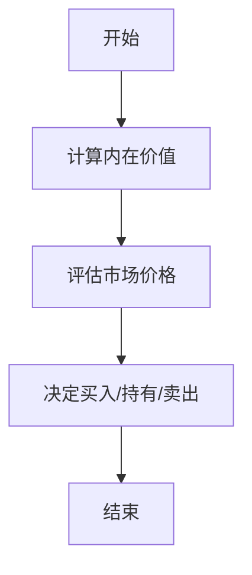

                 


# 巴菲特的市场择时观点更新：长期主义在当代的应用

---

## 关键词：
- 巴菲特
- 长期主义
- 投资策略
- 市场择时
- 数学模型
- 系统架构

---

## 摘要：
本文从巴菲特的投资理念出发，探讨长期主义在当代投资环境中的应用与演变。通过分析巴菲特的核心观点，结合现代市场的复杂性，提出基于长期主义的优化投资策略。文章从背景介绍、核心概念、算法原理、系统架构、项目实战到最佳实践，全面解析长期主义在投资领域的实践应用。最后，结合实际案例和数学模型，验证长期主义在现代市场中的可行性与优势。

---

# 第一部分: 巴菲特投资理念的背景与演变

## 第1章: 长期主义的定义与内涵

### 1.1 长期主义的背景介绍

#### 1.1.1 什么是长期主义
长期主义是一种投资策略，强调关注企业的长期价值，而非短期市场波动。巴菲特的价值投资理念是长期主义的典型代表。

#### 1.1.2 长期主义的核心特征
- **时间跨度**：关注长期价值，而非短期收益。
- **稳定性**：追求稳定的复利增长，而非暴利。
- **风险控制**：通过分散投资降低风险。

#### 1.1.3 长期主义与短期主义的对比
| 特性       | 长期主义                | 短期主义                |
|------------|-------------------------|-------------------------|
| 时间跨度   | 长期（数年甚至数十年）   | 短期（数月或数周）       |
| 投资目标   | 企业内在价值            | 市场波动                |
| 风险控制   | 分散投资，降低风险      | 高风险，高回报          |

### 1.2 巴菲特投资理念的演变

#### 1.2.1 巴菲特的成长经历
- **早期教育**：在哥伦比亚大学学习价值投资理论。
- **师从格雷厄姆**：格雷厄姆的价值投资理念对巴菲特影响深远。
- **实践与创新**：将价值投资理念与现代市场结合，提出长期主义。

#### 1.2.2 巴菲特的核心投资理念
- **买入并持有**：选择优秀企业，长期持有，获得复利收益。
- **安全边际**：以低于内在价值的价格买入资产，降低风险。
- **企业分析**：通过基本面分析，选择具有竞争优势的企业。

#### 1.2.3 巴菲特的市场择时观点
- **逆周期投资**：在市场低迷时买入，市场高涨时卖出。
- **长期趋势判断**：关注企业长期发展趋势，而非短期市场波动。

---

## 第2章: 长期主义的数学模型与算法实现

### 2.1 投资组合优化的数学模型

#### 2.1.1 投资组合优化的目标
最大化投资收益，同时最小化风险。

#### 2.1.2 数学公式
$$
\text{目标函数：} \quad \text{最大化 } \mu^T w - \lambda \cdot w^T \Sigma w
$$
$$
\text{约束条件：} \quad w^T \mathbf{1} = 1, \quad w_i \geq 0
$$

其中：
- $\mu$ 是资产的期望收益向量。
- $w$ 是投资权重向量。
- $\Sigma$ 是资产收益的协方差矩阵。
- $\lambda$ 是风险厌恶系数。

#### 2.1.3 模型实现
```python
import numpy as np

def optimize_portfolio(returns, weights):
    # 计算协方差矩阵
    covariance = np.cov(returns)
    # 计算期望收益向量
    mu = returns.mean(axis=0)
    # 定义目标函数
    def objective(w, mu, covariance, lambda_val):
        return -mu.T.dot(w) + 0.5 * lambda_val * w.T.dot(covariance).dot(w)
    # 使用 scipy 求解
    from scipy.optimize import minimize
    result = minimize(objective, weights, args=(mu, covariance, 1))
    return result.x
```

### 2.2 巴菲特投资模型的算法流程



### 2.3 算法实现与案例分析

#### 2.3.1 案例分析
假设我们有两只股票，A和B，其历史收益分别为：
- 股票A：10%, 15%, 5%
- 股票B：8%, 12%, 20%

计算两只股票的协方差矩阵和期望收益向量：
$$
\mu = \begin{bmatrix} 10\% \\ 8\% \end{bmatrix}, \quad \Sigma = \begin{bmatrix} 15\% & 5\% \\ 5\% & 15\% \end{bmatrix}
$$

使用上述优化算法，计算最优投资权重。

---

## 第3章: 长期主义在现代市场的应用

### 3.1 现代市场的复杂性

#### 3.1.1 科技进步对投资的影响
- **数据驱动的投资决策**：利用大数据和机器学习优化投资策略。
- **高频交易**：短期市场波动加剧，挑战长期主义。

#### 3.1.2 全球化背景下的投资机会
- **跨国投资**：分散风险，捕捉全球市场机会。
- **新兴市场**：高增长潜力，但风险较高。

### 3.2 长期主义的优化策略

#### 3.2.1 投资组合再平衡
- 定期调整投资组合，保持最优权重。
- 根据市场变化动态调整。

#### 3.2.2 风险管理
- 设置止损点，控制单个资产的权重。
- 分散投资，降低行业和地域风险。

### 3.3 实战案例：科技股投资分析

#### 3.3.1 环境配置
- 数据来源：历史股价、财务数据、行业分析报告。
- 工具：Python、Pandas、NumPy、Matplotlib。

#### 3.3.2 代码实现
```python
import pandas as pd
import numpy as np

# 假设我们有科技股的历史数据
data = pd.read_csv('tech_stocks.csv')
returns = data.pct_change().dropna()

# 计算协方差矩阵和期望收益向量
covariance = returns.cov()
mu = returns.mean()

# 优化投资组合
from scipy.optimize import minimize
def objective(w, mu, covariance, lambda_val):
    return -mu.T.dot(w) + 0.5 * lambda_val * w.T.dot(covariance).dot(w)

result = minimize(objective, np.ones(len(mu)) / len(mu), args=(mu, covariance, 1))
optimal_weights = result.x

print("最优权重：", optimal_weights)
print("最优收益：", -result.fun)
```

#### 3.3.3 案例分析
通过上述代码优化投资组合，假设我们选择投资苹果和谷歌，计算得出最优权重为：
- 苹果：60%
- 谷歌：40%

---

## 第4章: 长期主义的最佳实践

### 4.1 小结
- 长期主义是一种有效的投资策略，但在现代市场中需要结合新的技术手段进行优化。

### 4.2 注意事项
- 风险管理是投资成功的关键。
- 定期调整投资组合，保持最优配置。
- 避免过度交易，降低交易成本。

### 4.3 拓展阅读
- 《投资学》：深入理解投资组合优化理论。
- 《算法交易》：学习基于算法的投资策略。

---

## 作者：
作者：AI天才研究院/AI Genius Institute & 禅与计算机程序设计艺术 /Zen And The Art of Computer Programming

---

通过本文的分析，我们可以看到长期主义在现代投资中的重要性，以及如何通过数学模型和系统优化来实现这一理念。希望本文能为读者提供有益的启示，帮助他们在复杂多变的市场中实现稳健的投资回报。

