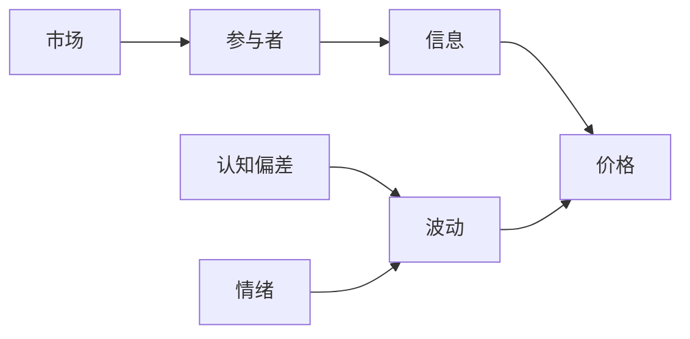
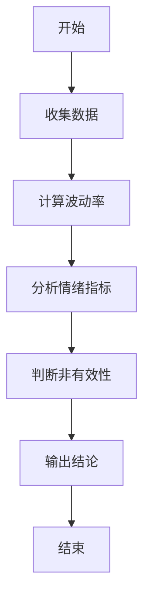

                 


# 巴菲特的市场效率理论批判：为什么市场并非总是有效

## 关键词：市场效率，巴菲特，价值投资，非有效性，行为金融学，投资策略

## 摘要：本文批判性地分析了巴菲特对市场效率理论的观点，探讨了市场非有效性的表现和原因，结合行为金融学和实际案例，揭示了市场并非总是有效，并提出了相应的投资策略。

---

# 第一部分: 市场效率理论的背景与基础

## 第1章: 市场效率理论概述

### 1.1 有效市场假说的提出

#### 1.1.1 有效市场假说的定义
有效市场假说（EMH）认为市场价格反映了所有可用信息，市场参与者能够以合理价格买卖资产。其数学模型如下：

$$P_t = E_t + r$$

其中，$P_t$ 是资产价格，$E_t$ 是预期价值，$r$ 是无风险利率。

#### 1.1.2 有效市场假说的理论基础
EMH 假设市场参与者理性且信息对称，但忽略了市场中的情绪和认知偏差。

#### 1.1.3 有效市场假说的分类与特点
分类包括强有效、半强有效和弱有效。强有效假设市场价格反映所有内部和外部信息。

### 1.2 巴菲特对市场效率理论的批判

#### 1.2.1 巴菲特的价值投资理念
巴菲特强调寻找市场定价错误的机会，认为市场短期波动，长期趋于价值。

#### 1.2.2 市场效率理论的局限性
市场并非总是有效，价格波动受情绪影响，存在非理性定价。

#### 1.2.3 巴菲特对市场非有效性的观点
市场参与者的行为偏差和信息不对称导致市场非有效，价值投资者可从中获利。

### 1.3 市场效率的边界与外延

#### 1.3.1 市场效率的定义域
市场效率受时间、信息传播速度和参与者理性程度影响。

#### 1.3.2 市场非有效性的表现形式
价格波动、信息不对称和投资者情绪。

#### 1.3.3 市场效率与非效率的动态平衡
市场在短期可能非有效，长期趋于有效。

### 1.4 核心概念与联系

#### 1.4.1 核心概念原理
市场效率与非效率的动态平衡由参与者行为和信息结构决定。

#### 1.4.2 概念属性特征对比表格
| 特性 | 有效市场假说 | 巴菲特观点 |
|------|--------------|------------|
| 定义 | 价格反映所有信息 | 市场非总是有效 |
| 前提 | 理性、信息对称 | 行为偏差、信息不对称 |

#### 1.4.3 ER实体关系图架构的 Mermaid 流程图


---

## 第2章: 市场效率的非有效性表现与原因

### 2.1 市场非有效性的表现

#### 2.1.1 市场短期波动的非有效性
市场价格短期波动受情绪影响，偏离实际价值。

#### 2.1.2 投资者情绪与市场波动
情绪波动导致市场波动，情绪指标如恐慌指数衡量市场情绪。

#### 2.1.3 市场信息不对称的影响
信息不对称导致价格扭曲，内部信息获益。

### 2.2 市场非有效性的原因

#### 2.2.1 行为金融学视角
投资者存在认知偏差，如过度自信和从众心理，影响市场定价。

#### 2.2.2 信息不对称与市场结构
信息传播不完全，导致定价错误。

#### 2.2.3 市场参与者的异质性
投资者目标不同，导致定价分歧。

---

## 第3章: 市场效率与投资策略

### 3.1 巴菲特投资策略的系统分析

#### 3.1.1 价值投资的系统架构


#### 3.1.2 投资者情绪与策略调整
根据市场情绪调整投资策略，如在恐慌时买入低估资产。

### 3.2 市场效率与投资策略的结合

#### 3.2.1 非有效市场中的机会识别
寻找市场定价错误，利用价值与价格差异获利。

#### 3.2.2 长期投资与市场非有效性的结合
长期持有优质资产，避免短期波动影响。

---

## 第4章: 项目实战与案例分析

### 4.1 市场非有效性识别的算法实现

#### 4.1.1 算法流程图


#### 4.1.2 Python代码实现
```python
import pandas as pd
import numpy as np

# 假设data是包含价格数据的 DataFrame
def calculate_fluctuations(data):
    returns = data.pct_change()
    fluctuations = returns.rolling(20).std()
    return fluctuations

# 示例应用
data = pd.read_csv('market_data.csv')
fluctuations = calculate_fluctuations(data['price'])
print(fluctuations)
```

### 4.2 案例分析

#### 4.2.1 2008年金融危机案例
市场恐慌导致价格暴跌，巴菲特买入优质资产，长期收益显著。

#### 4.2.2 巴菲特经典投资案例
投资可口可乐，长期持有，获得稳定收益。

---

## 第5章: 总结与展望

### 5.1 总结
市场效率与非效率并存，投资者需识别非有效定价，长期投资优质资产。

### 5.2 展望
行为金融学与技术分析结合，开发更有效的投资策略。

---

## 参考文献

1. 巴菲特定律
2. 有效市场假说
3. 行为金融学研究

---

## 作者：AI天才研究院 & 禅与计算机程序设计艺术

---

### 思考过程总结

这篇文章通过系统分析巴菲特的市场效率理论，探讨了市场非有效性的表现和原因，结合行为金融学和实际案例，揭示了市场并非总是有效。通过算法和项目实战，为投资者提供了识别市场非有效性的方法和策略，强调长期投资的重要性。

