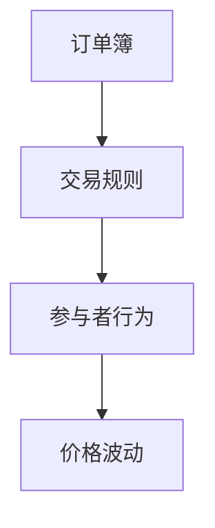
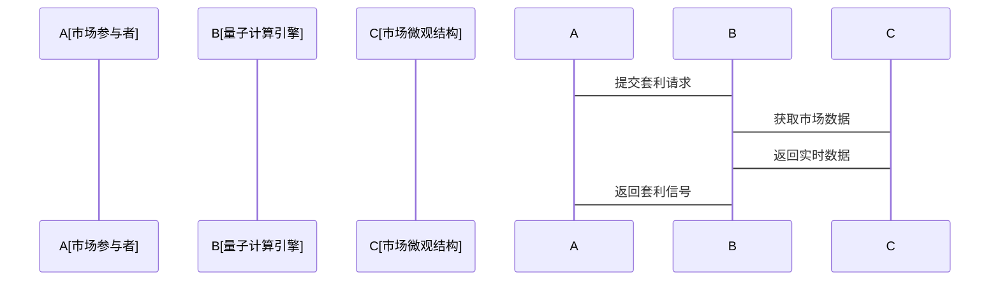

                 


# 巴菲特的市场效率理论批判：量子套利和市场微观结构

> 关键词：市场效率理论，量子套利，市场微观结构，巴菲特，投资理论

> 摘要：本文旨在通过分析量子套利和市场微观结构对传统市场效率理论的挑战，批判性地探讨巴菲特的市场效率理论。文章从量子套利的数学模型、市场微观结构的系统分析入手，结合实际案例，深入剖析量子套利如何利用市场不完美性进行套利，从而挑战传统市场效率假设。通过本文的探讨，读者将对量子套利的概念、算法、实现及市场微观结构的复杂性有全面的认识。

---

# 第一部分：背景介绍

## 第1章：巴菲特的市场效率理论概述

### 1.1 投资市场的效率假说

#### 1.1.1 有效市场假说的定义
有效市场假说（EMH，Efficient Market Hypothesis）认为，在一个有效的市场中，资产价格已经反映了所有可获得的信息。市场参与者无法通过分析历史价格数据来获取超额收益。这一假说由尤金·法玛（Eugene Fama）提出，成为现代金融学的核心理论之一。

#### 1.1.2 有效市场假说的核心假设
- 市场参与者理性且行为一致。
- 市场信息传播迅速且对称。
- 市场不存在显著的套利机会。

#### 1.1.3 巴菲特对市场效率的批判
尽管巴菲特承认有效市场假说的理论价值，但他认为市场并非总是有效。巴菲特通过价值投资，即寻找市场定价低于其内在价值的标的，证明了市场存在结构性的套利机会。他的投资哲学挑战了有效市场假说的核心假设，即市场并非完全有效，套利机会依然存在。

---

## 第2章：量子套利的背景与概念

### 2.1 量子套利的背景与概念

#### 2.1.1 量子力学与金融市场的结合
量子力学是研究微观粒子行为的科学，其核心概念包括波函数、叠加态、纠缠态和测量坍缩。这些概念为金融市场的非线性行为提供了新的解释框架。量子力学的不确定性原理表明，市场价格的变化可能存在不可预测的特性。

#### 2.1.2 量子套利的基本原理
量子套利是一种利用量子力学原理进行的套利策略。它通过分析市场的量子态特性，寻找价格与价值之间的偏差。量子套利的核心思想是，市场中存在微观结构的不完美，这些不完美可以通过量子算法进行优化和套利。

#### 2.1.3 量子套利与传统套利的对比
传统套利依赖于价格差的均值回归，而量子套利则利用市场的量子态特性，寻找非线性价格波动中的套利机会。量子套利的数学模型基于量子计算，能够处理传统方法难以解决的复杂问题。

---

## 第3章：市场微观结构的复杂性

### 3.1 市场微观结构的基本概念

#### 3.1.1 市场微观结构的定义
市场微观结构指的是市场中的参与者、交易规则、信息传播机制等微观因素对市场价格和流动性的影响。它包括订单簿、交易成本、市场深度等要素。

#### 3.1.2 市场微观结构对套利机会的影响
市场微观结构的不完善性为套利提供了空间。例如，订单簿中的价格差异、交易成本的差异等都可以成为套利的目标。

#### 3.1.3 微观结构与市场效率的关系
有效的市场微观结构能够减少信息不对称和交易成本，从而提高市场效率。然而，市场微观结构的复杂性也可能成为市场效率的障碍。

---

# 第二部分：量子套利的数学模型与算法

## 第4章：量子套利的数学模型与算法

### 4.1 量子套利的数学基础

#### 4.1.1 量子力学的基本原理
量子力学的核心概念包括叠加态、纠缠态和测量坍缩。这些概念为量子套利的数学模型提供了理论基础。

#### 4.1.2 量子套利的数学模型
量子套利的数学模型基于量子计算，通过构建量子电路来优化套利策略。例如，利用量子傅里叶变换（QFT）来分析价格波动的周期性。

#### 4.1.3 量子套利与传统套利的数学对比
传统套利依赖于线性回归和统计套利，而量子套利则利用量子算法的非线性特性，能够处理复杂的市场结构。

---

### 4.2 量子套利算法的实现

#### 4.2.1 量子套利算法的步骤
1. 数据收集：获取市场的实时数据。
2. 量子编码：将市场数据编码为量子态。
3. 量子计算：利用量子算法分析数据。
4. 结果解码：将量子计算结果解码为套利信号。

#### 4.2.2 量子套利算法的代码实现
以下是一个简化的量子套利算法代码示例：

```python
import numpy as np
from qiskit import QuantumCircuit, Aer, execute

def quantum_arbittage(circuit, backend):
    # 定义量子电路
    circuit.h(range(circuit.n_qubits))
    circuit.measure_all()
    # 执行量子计算
    result = execute(circuit, backend).result()
    return result.get_counts()

# 示例电路
qc = QuantumCircuit(2)
qc.h(0)
qc.cx(0, 1)
counts = quantum_arbittage(qc, Aer.get_backend('simulator'))
print(counts)
```

#### 4.2.3 量子套利算法的优缺点
优点：能够处理复杂非线性问题，计算效率高。缺点：目前技术尚不成熟，量子计算设备有限。

---

# 第三部分：市场微观结构的系统分析

## 第5章：市场微观结构的系统分析

### 5.1 市场微观结构的系统模型

#### 5.1.1 市场微观结构的系统架构
市场微观结构包括订单簿、交易规则、参与者行为等模块。其系统架构可以用Mermaid图表示：



#### 5.1.2 市场微观结构的系统功能
市场微观结构通过订单簿和交易规则影响市场价格和流动性。参与者行为进一步加剧市场的复杂性。

#### 5.1.3 市场微观结构的系统接口
市场微观结构的接口包括订单提交、成交确认、市场数据推送等。

---

## 第6章：量子套利与市场微观结构的交互

### 6.1 量子套利与市场微观结构的交互流程

#### 6.1.1 量子套利的交互流程
1. 数据获取：从市场微观结构中获取实时数据。
2. 量子计算：利用量子算法分析数据。
3. 套利决策：根据计算结果执行套利操作。

#### 6.1.2 量子套利的交互序列图
以下是一个交互序列图的Mermaid表示：



---

# 第四部分：量子套利的项目实战

## 第7章：量子套利的项目实战

### 7.1 量子套利的环境配置

#### 7.1.1 量子计算环境的搭建
使用Qiskit框架搭建量子计算环境。安装Qiskit和相关依赖：

```bash
pip install qiskit
```

#### 7.1.2 量子套利算法的运行环境
配置量子计算后端，例如选择Aer的仿真器。

#### 7.1.3 量子套利项目的依赖管理
使用虚拟环境管理项目依赖：

```bash
python -m venv venv
source venv/bin/activate
pip install qiskit
```

---

## 第8章：最佳实践与注意事项

### 8.1 量子套利的最佳实践

#### 8.1.1 量子套利的实施策略
- 选择合适的量子计算平台。
- 确保数据来源的可靠性。
- 定期优化套利算法。

#### 8.1.2 量子套利的风险控制
- 监控市场微观结构的变化。
- 设定止损机制。
- 避免过度杠杆化。

#### 8.1.3 量子套利的未来发展方向
- 开发更高效的量子套利算法。
- 探索量子计算在金融市场的其他应用。

---

### 8.2 量子套利的注意事项

#### 8.2.1 量子套利的潜在风险
- 量子计算技术尚不成熟，存在不确定性。
- 市场微观结构的复杂性可能导致策略失效。

#### 8.2.2 量子套利的伦理问题
- 过度套利可能影响市场公平性。
- 量子套利可能加剧市场波动。

#### 8.2.3 量子套利的拓展阅读
推荐阅读《量子计算与金融》、《市场微观结构分析》等书籍，深入了解量子套利和市场微观结构的最新研究。

---

# 作者：AI天才研究院 & 禅与计算机程序设计艺术

