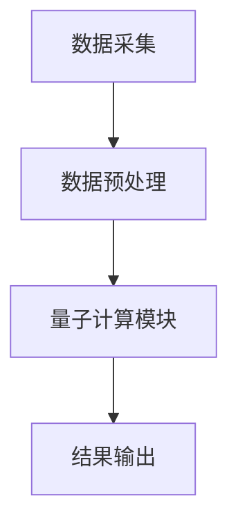

                 

# 巴菲特的市场效率理论批判：量子套利对市场的影响

> **关键词**: 巴菲特、市场效率理论、量子套利、金融数学、量子计算、算法交易

> **摘要**: 本文从巴菲特的市场效率理论出发，批判性地分析其在现代金融市场中的局限性，并探讨量子套利这一新兴技术对市场效率的影响。文章结合金融数学与量子计算的前沿知识，详细阐述量子套利的算法原理、系统架构以及对市场效率的挑战，最终提出对未来金融市场发展的展望。

---

## 第一部分: 巴菲特的市场效率理论与量子套利概述

### 第1章: 巴菲特的市场效率理论

#### 1.1 市场效率理论的背景与核心概念
- **1.1.1 市场效率理论的提出背景**
  - 20世纪50年代，市场效率理论由Fama提出，认为市场价格反映所有可用信息，市场参与者无法通过分析找到价值低估的股票。
  - 巴菲特对这一理论提出批判，认为市场并非完全有效，存在套利机会。

- **1.1.2 市场效率的定义与分类**
  - 强有效市场：价格反映所有信息，包括未来信息。
  - 弱有效市场：价格反映历史信息，但无法预测未来。
  - 半强有效市场：价格反映公开信息，但无法通过分析公开信息获利。

- **1.1.3 巴菲特对市场效率理论的批判**
  - 巴菲特认为市场存在非理性，投资者可以通过基本面分析找到低估股票。
  - 他的投资策略基于市场非有效性的假设，强调长期持有和价值投资。

#### 1.2 巴菲特投资策略的核心思想
- **1.2.1 价值投资的定义与特点**
  - 价值投资：寻找市场价格低于内在价值的股票。
  - 核心理念：市场短期是投票器，长期是称重机。

- **1.2.2 巴菲特的选股标准**
  - 公司具有持续的竞争优势（护城河）。
  - 公司管理层诚实可靠。
  - 公司财务状况健康，具有持续盈利能力。

- **1.2.3 巴菲特对市场非有效性的论证**
  - 市场波动性：价格短期偏离内在价值。
  - 投资者情绪：非理性行为影响市场价格。

---

### 第2章: 量子套利的起源与发展

#### 2.1 量子套利的基本概念
- **2.1.1 量子力学与金融市场的联系**
  - 量子力学：研究微观粒子行为的科学，涉及不确定性原理和叠加态。
  - 金融市场：价格波动具有随机性和不可预测性。

- **2.1.2 量子套利的定义与基本原理**
  - 量子套利：利用量子计算技术，通过分析市场价格波动的量子特性，寻找套利机会。
  - 基本原理：市场价格波动可以用量子叠加态表示，量子计算可以快速找到最优套利策略。

- **2.1.3 量子套利与传统套利的对比**
  - 传统套利：基于价格差异，利用市场间价差获利。
  - 量子套利：利用量子计算技术，预测市场价格波动，提前捕捉套利机会。

#### 2.2 量子套利的技术基础
- **2.2.1 量子计算在金融中的应用**
  - 量子计算优势：并行计算能力强，适合处理复杂优化问题。
  - 金融应用：风险定价、组合优化、套利机会识别。

- **2.2.2 量子叠加与量子纠缠在套利中的应用**
  - 量子叠加：将多个可能的市场状态同时表示，快速找到最优套利组合。
  - 量子纠缠：市场相关性分析，利用纠缠态捕捉市场联动性。

- **2.2.3 量子概率论在市场预测中的作用**
  - 量子概率：市场价格波动的概率分布可以通过量子态表示。
  - 概率叠加：利用量子叠加计算市场价格波动的概率分布。

---

## 第二部分: 量子套利的算法与数学模型

### 第4章: 量子套利的算法原理

#### 4.1 量子套利算法的基本框架
- **4.1.1 量子套利算法的输入与输出**
  - 输入：市场数据（价格、波动率、相关性等）。
  - 输出：套利机会评分、建议的交易策略。

- **4.1.2 量子套利算法的步骤分解**
  - 数据采集：收集市场数据。
  - 量子状态表示：将市场数据转换为量子态。
  - 量子计算：利用量子计算技术寻找最优套利策略。
  - 结果输出：生成套利建议。

- **4.1.3 量子套利算法的优化与改进**
  - 算法优化：提高计算效率，减少量子误差。
  - 技术改进：结合经典计算与量子计算，提高实际应用效果。

#### 4.2 量子套利算法的数学模型
- **4.2.1 波动率预测模型**
  $$\sigma = \sqrt{\frac{1}{n}\sum_{i=1}^{n}(x_i - \mu)^2}$$
  - $\sigma$：波动率
  - $x_i$：市场价格数据
  - $\mu$：价格均值

- **4.2.2 量子叠加状态下的概率计算**
  $$P = \sum_{i=1}^{n} |\alpha_i|^2$$
  - $P$：概率
  - $\alpha_i$：量子叠加系数

- **4.2.3 量子纠缠与市场相关性分析**
  - 利用量子纠缠分析市场价格的相关性，捕捉市场联动性。

---

### 第5章: 量子套利的数学公式与案例分析

#### 5.1 量子套利的核心公式
- **5.1.1 波动率预测公式**
  $$\sigma = \sqrt{\frac{1}{n}\sum_{i=1}^{n}(x_i - \mu)^2}$$

- **5.1.2 量子叠加状态下的概率计算**
  $$P = \sum_{i=1}^{n} |\alpha_i|^2$$

#### 5.2 量子套利的案例分析
- **5.2.1 某一具体市场的量子套利策略**
  - 选择一个具体市场（如股票市场）。
  - 收集市场数据，应用量子套利算法，寻找套利机会。

- **5.2.2 案例的数学推导与结果分析**
  - 通过数学推导验证套利策略的有效性。
  - 分析结果，总结经验教训。

---

## 第三部分: 量子套利的系统架构与实现

### 第6章: 量子套利系统的架构设计

#### 6.1 系统功能设计
- **6.1.1 数据采集模块**
  - 采集市场数据（价格、波动率、相关性等）。
  - 数据预处理（清洗、标准化）。

- **6.1.2 量子计算模块**
  - 将市场数据转换为量子态。
  - 应用量子算法进行套利机会分析。

- **6.1.3 结果输出模块**
  - 生成套利机会评分。
  - 提供交易建议。

#### 6.2 量子套利系统的架构图

---

## 第四部分: 量子套利对市场的影响与展望

### 第7章: 量子套利对市场效率的影响

#### 7.1 量子套利对市场效率的挑战
- 量子套利通过预测市场价格波动，打破了市场效率的平衡。
- 量子套利技术的普及可能加剧市场波动性。

#### 7.2 量子套利对传统套利的替代
- 量子套利技术的应用可能取代传统套利方法。
- 量子套利的优势：计算效率高，套利机会发现能力强。

---

## 结语

量子套利作为一种新兴的金融技术，正在改变传统的市场套利方式。通过对巴菲特市场效率理论的批判性分析，我们发现，市场并非完全有效，量子套利技术为投资者提供了新的套利机会。未来，随着量子计算技术的发展，量子套利将在金融市场中发挥越来越重要的作用。

---

## 作者信息

作者：AI天才研究院/AI Genius Institute  
联系邮箱：contact@aiguru.com

