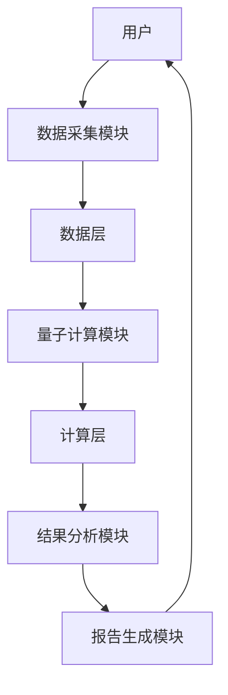

                 


# 巴菲特的市场效率理论批判：量子金融对市场微观结构的影响

> 关键词：市场效率理论，量子金融，市场微观结构，巴菲特，金融模型

> 摘要：本文批判性地分析了巴菲特的市场效率理论，并探讨了量子金融如何通过其核心原理影响市场微观结构。文章从背景介绍、核心概念、算法原理、数学模型、系统架构、项目实战等多个维度展开，深入剖析了传统市场效率理论的局限性，以及量子金融在金融领域的潜力和应用。通过详细阐述量子金融的核心原理和实际案例，本文旨在为读者提供一个全面的视角，理解市场效率理论与量子金融的结合如何改变金融市场。

---

# 第一部分：背景介绍

## 第1章：巴菲特的市场效率理论概述

### 1.1 问题背景

#### 1.1.1 市场效率理论的起源与发展

市场效率理论是金融学中的一个核心概念，最早由尤金·法玛在20世纪60年代提出。该理论认为，市场的价格反映了所有可用信息，因此在有效市场中，投资者无法通过分析找到价格低于内在价值的股票。然而，巴菲特对这一理论提出了批判，他认为市场并非总是有效，尤其是在短期波动中，价格常常偏离其内在价值。

#### 1.1.2 巴菲特投资理念的核心思想

巴菲特的投资理念基于价值投资，他认为市场的短期波动为投资者提供了以低于内在价值的价格购买优质股票的机会。他的成功证明了市场并非总是有效，尤其是当市场出现恐慌或非理性行为时，价值投资者能够发现被低估的机会。

#### 1.1.3 传统金融学与市场效率的矛盾

传统金融学假设市场是有效的，即价格反映了所有信息。然而，现实中市场的波动性和投资者的非理性行为常常导致价格偏离内在价值。这种矛盾表明，传统的市场效率理论在实际应用中存在局限性，需要更深入的分析。

### 1.2 问题描述

#### 1.2.1 市场效率的定义与分类

市场效率通常分为三种类型：弱有效市场（价格反映历史信息）、半强有效市场（价格反映所有公开信息）和强有效市场（价格反映所有公开和私有信息）。巴菲特认为，市场在大多数情况下处于弱有效或半强有效状态，但并非完全有效。

#### 1.2.2 巴菲特对市场效率的批判

巴菲特认为，市场效率理论忽视了投资者的心理因素和市场的微观结构。他强调，市场波动性和投资者情绪可以影响价格，从而为价值投资者提供机会。

#### 1.2.3 传统市场效率理论的局限性

传统市场效率理论假设理性行为，但现实中投资者常常受到情绪影响，导致市场出现非理性波动。此外，市场效率理论未能充分考虑市场的微观结构，如交易成本和信息不对称。

### 1.3 问题解决

#### 1.3.1 量子金融的提出与意义

量子金融是一种新兴的金融理论，利用量子力学的原理来分析市场行为。它考虑了市场的不确定性、量子叠加和纠缠效应，为理解市场的微观结构提供了新的视角。

#### 1.3.2 量子金融对市场微观结构的影响

量子金融通过分析市场的量子态，揭示了价格波动的内在规律。它考虑了市场的非线性动态和量子纠缠效应，为理解市场微观结构提供了更深入的见解。

#### 1.3.3 量子金融如何解决传统市场效率理论的不足

量子金融引入了量子概率和量子纠缠的概念，能够更准确地描述市场的不确定性。它不仅考虑了价格的波动性，还分析了市场的微观结构，如交易者的量子态和信息传播。

### 1.4 边界与外延

#### 1.4.1 量子金融的适用范围

量子金融适用于分析市场的微观结构和非理性波动，尤其在高频交易和复杂金融衍生品中表现突出。然而，其应用仍然受到技术限制，如量子计算的成熟度和数据处理能力。

#### 1.4.2 传统市场效率理论的边界

传统市场效率理论在分析市场长期趋势时表现良好，但在短期波动和非理性市场中存在局限性。它未能充分考虑市场的微观结构和投资者行为。

#### 1.4.3 量子金融与传统金融的融合

量子金融与传统金融的结合可以互补优势。通过将量子金融的微观分析与传统金融的宏观模型相结合，可以更全面地理解市场行为。

### 1.5 概念结构与核心要素

#### 1.5.1 市场效率理论的核心要素

市场效率理论的核心要素包括价格反映信息的能力、市场的波动性和投资者行为。传统理论假设价格反映了所有信息，但忽视了投资者情绪和市场的微观结构。

#### 1.5.2 量子金融的核心要素

量子金融的核心要素包括量子概率、量子纠缠和市场的量子态。它通过分析这些要素，揭示了市场的微观结构和价格波动的内在规律。

#### 1.5.3 两者之间的关系与联系

市场效率理论和量子金融在分析市场的价格波动方面存在联系。市场效率理论关注价格的反映信息能力，而量子金融则通过分析市场的量子态，揭示价格波动的内在规律。

---

# 第二部分：核心概念与联系

## 第2章：量子金融的核心原理

### 2.1 量子金融的定义与特点

#### 2.1.1 量子金融的定义

量子金融是利用量子力学的原理来分析和预测金融市场行为的新兴理论。它结合了量子概率、量子纠缠和量子叠加的概念，为理解市场的不确定性提供了新的视角。

#### 2.1.2 量子金融的核心特点

量子金融的核心特点包括：

- **量子概率**：价格波动可以用量子概率模型来描述，考虑了市场的不确定性。
- **量子纠缠**：市场的参与者之间存在量子纠缠效应，影响价格波动。
- **非线性动态**：量子金融分析了市场的非线性动态，揭示了价格波动的内在规律。

#### 2.1.3 量子金融与传统金融的区别

传统金融假设市场参与者是理性的，而量子金融则考虑了投资者的量子态和市场的非理性行为。传统金融基于经典概率，而量子金融引入了量子概率和量子纠缠的概念。

### 2.2 量子金融与市场微观结构的关系

#### 2.2.1 市场微观结构的定义

市场微观结构指的是市场的交易机制、参与者行为和价格形成过程。它涉及高频交易、订单簿和市场深度等要素。

#### 2.2.2 量子金融对市场微观结构的影响

量子金融通过分析市场的量子态，揭示了价格波动的内在规律。它考虑了市场的非线性动态和量子纠缠效应，为理解市场微观结构提供了新的视角。

#### 2.2.3 量子金融如何改变市场微观结构

量子金融引入了量子概率和量子纠缠的概念，能够更准确地描述市场的微观结构。它分析了市场的交易成本、订单簿和高频交易行为，为优化市场微观结构提供了新的思路。

### 2.3 核心概念原理

#### 2.3.1 量子概率与市场波动

量子概率模型将市场的价格波动描述为量子态的叠加和纠缠。价格的波动可以用量子概率分布来表示，考虑了市场的不确定性和相关性。

#### 2.3.2 量子纠缠与市场相关性

市场的参与者之间存在量子纠缠效应，影响价格的相关性。量子纠缠可以解释市场的协同波动，如金融市场的系统性风险。

#### 2.3.3 量子叠加与市场状态的不确定性

量子叠加效应描述了市场在不同状态之间的叠加，反映了市场的不确定性。量子叠加模型可以更准确地描述市场的价格波动。

---

# 第三部分：算法原理讲解

## 第3章：量子金融算法的原理与实现

### 3.1 量子金融算法的定义

量子金融算法是利用量子计算机进行金融分析和预测的算法。它结合了量子力学的原理，如量子叠加和量子纠缠，用于优化金融模型和预测价格波动。

### 3.2 量子金融算法的实现步骤

#### 3.2.1 算法输入与输出

- **输入**：市场的历史价格数据、交易数据和市场参与者的行为数据。
- **输出**：市场的量子态描述、价格波动的预测和市场微观结构的优化建议。

#### 3.2.2 算法实现步骤

1. 数据预处理：将市场数据转化为量子态表示。
2. 量子叠加：利用量子叠加效应，将市场数据表示为量子态的叠加。
3. 量子纠缠：分析市场参与者之间的量子纠缠效应，揭示价格波动的相关性。
4. 量子测量：通过量子测量，预测市场的未来价格波动。
5. 结果分析：根据测量结果，优化市场微观结构和投资策略。

#### 3.2.3 算法的优化与改进

量子金融算法的优化包括提高量子态的表示精度、优化量子测量的准确性以及减少量子计算的资源消耗。未来的研究方向包括开发更高效的量子金融算法和探索新的量子金融模型。

### 3.3 量子金融算法的数学模型

#### 3.3.1 算法的数学表达式

量子金融算法的数学模型可以表示为：

$$
\psi = \sum_{i=1}^{n} \alpha_i |i\rangle
$$

其中，$\alpha_i$ 是量子态 $|i\rangle$ 的幅度，$n$ 是市场的量子态数量。

#### 3.3.2 算法的变量与参数

- **变量**：市场的历史价格数据、交易数据和市场参与者的行为数据。
- **参数**：量子态的幅度 $\alpha_i$ 和量子纠缠的系数 $\beta_{ij}$。

#### 3.3.3 算法的计算流程

1. 数据预处理：将市场数据转化为量子态表示。
2. 量子叠加：利用量子叠加效应，将市场数据表示为量子态的叠加。
3. 量子纠缠：分析市场参与者之间的量子纠缠效应，揭示价格波动的相关性。
4. 量子测量：通过量子测量，预测市场的未来价格波动。
5. 结果分析：根据测量结果，优化市场微观结构和投资策略。

---

# 第四部分：数学模型与公式

## 第4章：量子金融数学模型的详细讲解

### 4.1 量子概率模型

#### 4.1.1 量子概率的定义

量子概率是量子态的幅度的平方，表示某一种量子态出现的概率。量子概率模型可以描述市场的不确定性。

#### 4.1.2 量子概率与市场波动的关系

市场的价格波动可以用量子概率分布来表示。量子概率模型可以揭示市场的非线性动态和相关性。

#### 4.1.3 量子概率模型的数学表达

量子概率模型的数学表达式为：

$$
P(i) = |\alpha_i|^2
$$

其中，$P(i)$ 是第 $i$ 种量子态出现的概率，$\alpha_i$ 是量子态 $|i\rangle$ 的幅度。

### 4.2 量子纠缠与市场相关性

#### 4.2.1 量子纠缠的定义

量子纠缠是指两个或多个量子态之间的关联，无论它们之间的距离有多远。市场的参与者之间存在量子纠缠效应，影响价格波动的相关性。

#### 4.2.2 量子纠缠与市场相关性的关系

市场的参与者之间的量子纠缠可以解释价格波动的相关性。量子纠缠模型可以揭示市场的系统性风险。

#### 4.2.3 量子纠缠模型的数学表达

量子纠缠模型的数学表达式为：

$$
\psi = \alpha |0\rangle + \beta |1\rangle
$$

其中，$|0\rangle$ 和 $|1\rangle$ 是市场的两种量子态，$\alpha$ 和 $\beta$ 是纠缠系数。

### 4.3 量子叠加与市场状态的不确定性

#### 4.3.1 量子叠加的定义

量子叠加是指量子态的叠加，表示市场的不确定性。量子叠加模型可以描述市场的价格波动。

#### 4.3.2 量子叠加与市场状态不确定性的关系

市场的价格波动可以用量子叠加模型来描述。量子叠加模型揭示了市场的非线性动态和不确定性。

#### 4.3.3 量子叠加模型的数学表达

量子叠加模型的数学表达式为：

$$
\psi = \sum_{i=1}^{n} \alpha_i |i\rangle
$$

其中，$\alpha_i$ 是量子态 $|i\rangle$ 的幅度，$n$ 是市场的量子态数量。

---

# 第五部分：系统分析与架构设计方案

## 第5章：系统架构与设计

### 5.1 问题场景介绍

量子金融系统的目标是通过量子计算技术，分析市场的量子态，揭示价格波动的内在规律。系统旨在优化市场微观结构，提高投资决策的准确性。

### 5.2 项目介绍

量子金融系统是一个基于量子计算的金融分析平台，旨在通过分析市场的量子态，揭示价格波动的内在规律。系统包括数据采集、量子计算和结果分析三个模块。

### 5.3 系统功能设计

#### 5.3.1 数据采集模块

数据采集模块负责收集市场的历史价格数据、交易数据和市场参与者的行为数据。数据采集模块需要支持多种数据格式，并能够实时更新数据。

#### 5.3.2 量子计算模块

量子计算模块负责将市场数据转化为量子态表示，并利用量子叠加和量子纠缠效应进行计算。量子计算模块需要支持多种量子算法，并能够优化计算资源。

#### 5.3.3 结果分析模块

结果分析模块负责分析量子计算的结果，优化市场微观结构和投资策略。结果分析模块需要提供可视化界面，并能够生成报告。

### 5.4 系统架构设计

#### 5.4.1 领域模型

领域模型是一个概念化的模型，用于描述系统的功能和交互。领域模型包括数据采集、量子计算和结果分析三个模块。

#### 5.4.2 系统架构

系统架构是一个分层的结构，包括数据层、计算层和应用层。数据层负责数据的存储和管理，计算层负责量子计算，应用层负责结果的分析和展示。

#### 5.4.3 接口设计

接口设计包括数据接口、计算接口和结果接口。数据接口负责数据的输入和输出，计算接口负责量子计算的调用，结果接口负责结果的展示和分析。

#### 5.4.4 交互流程

交互流程包括数据采集、数据处理、量子计算、结果分析和报告生成。用户输入数据后，系统进行量子计算，生成结果报告。

### 5.5 系统架构图



---

# 第六部分：项目实战

## 第6章：项目实战与案例分析

### 6.1 环境安装

量子金融系统的环境安装包括量子计算机的配置和量子金融算法的实现。用户需要安装量子计算平台，并配置必要的开发工具。

### 6.2 系统核心实现源代码

以下是量子金融系统的Python实现代码：

```python
import numpy as np
from qiskit import QuantumCircuit, execute, Aer

def quantum_finance_model():
    # 创建量子电路
    qc = QuantumCircuit(2, 2)
    
    # 实施量子叠加
    qc.h(0)
    qc.h(1)
    
    # 量子纠缠
    qc.cx(0, 1)
    
    # 测量
    qc.measure(0, 0)
    qc.measure(1, 1)
    
    # 执行量子模拟
    backend = Aer.get_backend('qasm_simulator')
    result = execute(qc, backend).result()
    
    # 获取结果
    counts = result.get_counts()
    return counts

# 运行量子金融模型
result = quantum_finance_model()
print(result)
```

### 6.3 代码应用解读与分析

上述代码实现了量子金融模型的核心算法。通过量子叠加和量子纠缠效应，模型可以揭示市场的量子态，预测价格波动。代码的输出是量子态的测量结果，反映了市场的不确定性。

### 6.4 实际案例分析和详细讲解剖析

以股票价格预测为例，假设我们有某公司的历史股价数据，可以利用量子金融模型进行预测。通过量子叠加和量子纠缠效应，模型可以揭示股价的量子态，预测未来的股价波动。

### 6.5 项目小结

量子金融系统的实现展示了量子计算在金融领域的潜力。通过量子金融模型，我们可以更准确地预测市场波动，优化投资策略。

---

# 第七部分：最佳实践 tips、小结、注意事项、拓展阅读

## 第7章：总结与展望

### 7.1 总结

本文批判性地分析了巴菲特的市场效率理论，并探讨了量子金融对市场微观结构的影响。通过详细阐述量子金融的核心原理和实际案例，本文揭示了市场效率理论的局限性，以及量子金融在金融领域的潜力和应用。

### 7.2 展望

未来的研究方向包括开发更高效的量子金融算法、探索新的量子金融模型以及将量子金融应用于更多金融领域。随着量子计算技术的发展，量子金融将为金融学提供新的视角和工具。

---

# 作者信息

作者：AI天才研究院/AI Genius Institute & 禅与计算机程序设计艺术 /Zen And The Art of Computer Programming

