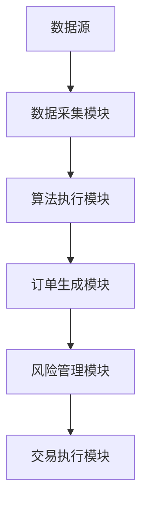

                 


# 巴菲特的市场效率理论批判：高频交易和量化策略的影响

## 关键词：市场效率理论，高频交易，量化策略，市场失灵，价格发现

## 摘要：本文批判性地分析了巴菲特的市场效率理论，并探讨了高频交易和量化策略对市场效率的影响。文章从高频交易的技术基础、算法原理、系统架构等多方面展开，结合实际案例和数学模型，揭示了高频交易对市场效率的双重影响，既有提升市场流动性的积极作用，也有加剧市场波动和失灵的消极影响。通过对高频交易系统的深入分析，本文提出了优化市场效率的建议和未来研究方向。

---

# 第1章 巴菲特的市场效率理论与高频交易的背景

## 1.1 巴菲特的市场效率理论

### 1.1.1 市场有效性的基本概念

市场的有效性是指市场价格能够充分反映所有相关信息的程度。市场有效性分为弱有效、强有效和半强有效三种类型。弱有效市场仅反映历史价格信息，而强有效市场反映所有信息，包括内部消息。

$$
\text{弱有效市场假设（WEMH）} \leq \text{半强有效市场假设（SMEH）} \leq \text{强有效市场假设（SEMH）}
$$

### 1.1.2 巴菲特对市场效率的观点

巴菲特认为市场通常是有效的，但存在某些情况下市场定价错误，例如在恐慌或非理性时期。他倾向于长期投资，认为短期市场波动可以通过分散投资来降低风险。

### 1.1.3 巴菲特投资理念的核心要素

- 长期投资：避免频繁交易，关注企业内在价值。
- 价值投资：寻找市场价格低于内在价值的股票。
- 风险控制：分散投资以降低非系统性风险。

## 1.2 高频交易与量化策略的兴起

### 1.2.1 高频交易的定义与特点

高频交易（High-Frequency Trading，HFT）是一种利用计算机算法在极短时间内进行大量交易的策略。其特点是速度极快、交易频率高、依赖算法和高性能硬件。

$$
\text{HFT速度} \approx 1 \text{毫秒} \times 10^{-6} \text{秒}
$$

### 1.2.2 量化策略的基本原理

量化策略是通过数学模型和算法进行交易决策，包括统计套利、算法交易和机器学习等方法。统计套利利用资产价格的统计规律，而机器学习则通过数据挖掘寻找交易机会。

### 1.2.3 高频交易与传统交易的对比

| 特性               | 高频交易         | 传统交易         |
|--------------------|------------------|------------------|
| 交易速度           | 极高             | 较低             |
| 交易频率           | 高              | 低              |
| 决策方式           | 算法驱动         | 人工决策         |
| 交易成本           | 极低             | 较高             |
| 适用市场           | 涉及广泛市场     | 侧重单个市场     |

---

# 第2章 高频交易与量化策略的技术基础

## 2.1 高频交易的技术架构

### 2.1.1 高频交易的硬件要求

- 高性能计算：使用GPU加速和低延迟网络。
- 高速数据传输：通过光纤和低延迟交换机实现毫秒级响应。

### 2.1.2 高频交易的网络架构

- 数据中心：位于交易所附近，减少网络延迟。
- 分布式系统：通过多地部署实现容灾和高可用性。

### 2.1.3 高频交易的算法优化

- 低延迟编程：使用异步I/O和并行计算优化性能。
- 硬件加速：利用FPGA和ASIC加速交易执行。

## 2.2 量化策略的核心算法

### 2.2.1 统计套利算法

统计套利算法通过寻找资产价格的统计套利机会，利用均值回归等统计特性进行交易。

$$
\text{收益} = \text{资产价格差} \times \text{交易量}
$$

### 2.2.2 机器学习算法

机器学习算法通过训练模型预测市场走势，常用算法包括支持向量机（SVM）和长短期记忆网络（LSTM）。

### 2.2.3 时间序列分析算法

时间序列分析用于预测未来价格走势，常用ARIMA和GARCH模型。

---

# 第3章 高频交易对市场效率的影响

## 3.1 市场效率的衡量标准

### 3.1.1 市场有效性的定义

市场效率衡量市场价格反映信息的速度和程度，影响市场流动性和价格发现。

### 3.1.2 市场效率的衡量指标

- 市场深度：衡量市场可交易的数量。
- 市场流动性：衡量交易的便利性。
- 市场波动性：衡量价格稳定性。

### 3.1.3 市场效率与价格发现的关系

价格发现是市场效率的核心，高频交易加速了价格发现过程。

---

## 3.2 高频交易对市场效率的正面影响

### 3.2.1 提高市场流动性

高频交易增加了市场参与者数量，提高了市场深度。

### 3.2.2 增强价格发现功能

高频交易通过快速反应市场信息，提高了价格发现的效率。

### 3.2.3 降低交易成本

高频交易通过自动化和算法优化降低了交易成本。

---

## 3.3 高频交易对市场效率的负面影响

### 3.3.1 加剧市场波动性

高频交易可能导致价格大幅波动，尤其是在市场恐慌时。

### 3.3.2 导致市场失灵

高频交易可能引发市场操纵和闪崩事件，破坏市场效率。

### 3.3.3 剥夺中小投资者利益

高频交易通过技术优势剥夺了中小投资者的公平交易机会。

---

# 第4章 高频交易与市场失灵的理论分析

## 4.1 市场失灵的定义与表现

市场失灵是指市场无法有效配置资源的情况，通常由垄断、外部性、公共品和信息不对称引起。

### 4.1.1 高频交易导致的市场操纵

高频交易可能通过算法操纵市场，制造虚假价格信号。

### 4.1.2 高频交易引发的闪崩事件

高频交易可能导致市场突然崩盘，如2010年“闪电崩盘”事件。

### 4.1.3 高频交易加剧的市场不稳定性

高频交易通过放大市场波动性，增加了市场的不稳定性。

---

# 第5章 高频交易对市场结构的影响

## 5.1 市场结构的演变

### 5.1.1 传统交易模式

传统交易模式以人工交易为主，交易速度较慢。

### 5.1.2 现代交易模式

现代交易模式以高频交易为主，交易速度极快，市场结构复杂。

## 5.2 市场结构优化的建议

### 5.2.1 引入监管机制

通过监管机构限制高频交易的滥用，如设置交易延迟和限制算法交易。

### 5.2.2 提高市场透明度

通过公开交易数据和算法源代码，提高市场透明度和公平性。

### 5.2.3 优化市场架构

通过改进交易所架构和网络基础设施，降低交易延迟和成本。

---

# 第6章 高频交易与量化策略的系统分析

## 6.1 系统架构设计

### 6.1.1 高频交易系统架构

高频交易系统通常包括数据采集、算法执行、订单生成和风险管理模块。

### 6.1.2 系统功能设计

- 数据采集：实时获取市场数据。
- 算法执行：根据算法生成交易信号。
- 订单生成：通过API发送订单。
- 风险管理：监控和控制交易风险。

### 6.1.3 系统架构图



---

# 第7章 项目实战：量化交易系统实现

## 7.1 环境安装

- 安装Python和相关库（如Pandas、NumPy、Matplotlib）。
- 配置交易API（如Interactive Brokers）。

## 7.2 核心代码实现

### 7.2.1 数据获取

```python
import pandas as pd
import numpy as np

data = pd.read_csv('market_data.csv')
```

### 7.2.2 算法实现

```python
def trading_algorithm(data):
    # 简单的均值回归策略
    short_window = 10
    long_window = 30
    data['short_ma'] = data['price'].rolling(short_window).mean()
    data['long_ma'] = data['price'].rolling(long_window).mean()
    data['signal'] = np.where(data['short_ma'] > data['long_ma'], 1, -1)
    return data['signal']
```

### 7.2.3 交易执行

```python
import pytz
from ibapi import client, contract, execution

def execute_trade(signal):
    # 示例代码，实际交易需结合具体API
    if signal == 1:
        # 买入信号
        contract = contract.Contract(symbol='BTC', currency='USD', exchange='BITMEX')
        order = client.order.Order(action='BUY', quantity=1)
        execution.order_send(order)
    elif signal == -1:
        # 卖出信号
        contract = contract.Contract(symbol='BTC', currency='USD', exchange='BITMEX')
        order = client.order.Order(action='SELL', quantity=1)
        execution.order_send(order)
```

## 7.3 实际案例分析

### 7.3.1 案例背景

2010年的“闪电崩盘”事件中，高频交易导致道琼斯指数在短时间内下跌约1000点，随后迅速反弹。

### 7.3.2 案例分析

通过分析高频交易系统的日志和数据，发现高频交易算法在极端市场条件下可能引发系统性风险。

---

# 第8章 总结与展望

## 8.1 总结

高频交易和量化策略对市场效率的影响是双刃剑。尽管高频交易提高了市场流动性，但也可能引发市场失灵和不稳定性。

## 8.2 展望

未来的研究方向包括优化高频交易算法、加强市场监管和提高市场透明度。同时，需要进一步探讨如何平衡技术创新与市场稳定性的关系。

---

# 作者：AI天才研究院/AI Genius Institute & 禅与计算机程序设计艺术 /Zen And The Art of Computer Programming

---

这篇文章通过系统性地分析高频交易和量化策略的技术基础、市场影响和实际案例，深入探讨了巴菲特市场效率理论的局限性，并提出了优化市场效率的建议。希望本文能为读者提供全面的视角，理解高频交易对现代金融市场的影响。

