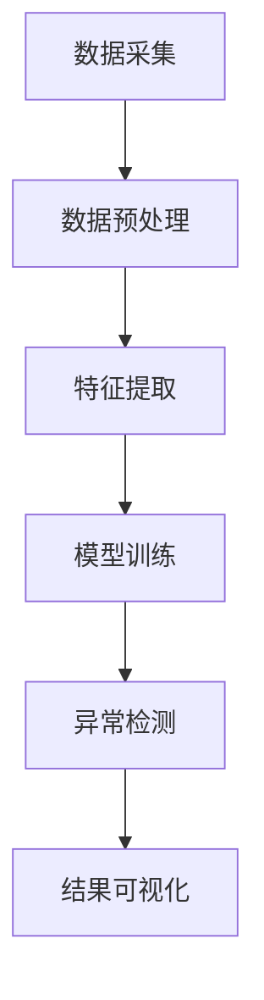
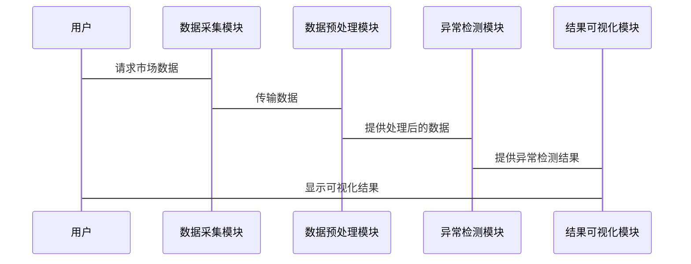

                 


# 巴菲特的市场泡沫识别：区块链驱动的市场异常检测

## 关键词：
- 巴菲特，市场泡沫，区块链，市场异常检测，异常检测算法，金融数据分析，金融监管

## 摘要：
本文结合巴菲特的市场分析方法和区块链技术，探讨如何利用区块链技术实现市场异常检测。通过分析巴菲特识别市场泡沫的核心原则，结合区块链技术的特点，提出了一种基于区块链的市场异常检测算法，详细讲解了算法的实现过程，包括数据流分析、异常检测模型构建和结果可视化。通过实际案例分析，验证了该方法的有效性，并总结了在金融数据分析和监管中的应用价值。

---

## 第一部分: 巴菲特的市场泡沫识别与区块链技术概述

### 第1章: 巴菲特的市场泡沫识别方法

#### 1.1 巴菲特投资理念概述

##### 1.1.1 巴菲特的价值投资理论
巴菲特的价值投资理论强调购买具有内在价值的公司股票，而非关注市场短期波动。他主张以低于内在价值的价格买入优质资产，并长期持有。这种方法的核心在于识别市场的非理性波动，并从中获利。

##### 1.1.2 巴菲特的市场泡沫识别方法
巴菲特识别市场泡沫的方法主要基于以下几个方面：
1. **价值与价格的差异**：当市场价格远高于内在价值时，市场可能存在泡沫。
2. **市场情绪分析**：市场情绪过于乐观时，容易产生泡沫。
3. **长期投资视角**：巴菲特关注企业的长期价值，而非短期价格波动。

##### 1.1.3 巴菲特投资策略的核心要素
- **优质企业**：选择具有强大护城河和长期竞争优势的企业。
- **安全边际**：买入价格低于内在价值，以避免市场波动的影响。
- **长期持有**：避免频繁交易，减少交易成本。

##### 1.1.4 巴菲特的市场泡沫识别案例
- **2008年金融危机**：巴菲特在危机前警告市场的过度杠杆和风险。
- **科技股泡沫**：巴菲特对高估值科技股持谨慎态度，避免泡沫破裂带来的损失。

#### 1.2 巴菲特市场泡沫识别的核心原则

##### 1.2.1 价值与价格的差异
- **内在价值**：企业未来现金流的现值。
- **市场价格**：市场参与者情绪和资金流动决定的短期价格。

##### 1.2.2 市场情绪与泡沫的关系
- **市场情绪的波动**：过度乐观导致价格虚高，泡沫形成。
- **市场情绪的反转**：情绪转向悲观，泡沫破裂，价格回归理性。

##### 1.2.3 巴菲特的长期投资视角
- **长期视角**：关注企业的长期价值，而非短期价格波动。
- **安全边际**：买入价格低于内在价值，以应对市场波动。

#### 1.3 巴菲特市场泡沫识别的案例分析

##### 1.3.1 2008年金融危机中的泡沫识别
- 巴菲特在2007年警告市场的过度杠杆和风险。
- 通过价值投资策略，巴菲特在危机后投资于被低估的资产。

##### 1.3.2 巴菲特对科技股泡沫的判断
- 巴菲特对高估值科技股持谨慎态度，认为其价格可能高于内在价值。
- 通过长期持有优质科技股，如苹果公司，实现稳健收益。

##### 1.3.3 巴菲特对加密货币的看法
- 巴菲特对加密货币持谨慎态度，认为其缺乏内在价值。
- 警惕加密货币市场的波动性和投机性。

### 第2章: 区块链技术与市场异常检测

#### 2.1 区块链技术的基本原理

##### 2.1.1 区块链的定义与核心特征
- **区块链**：一种去中心化的分布式账本技术，通过密码学确保数据安全。
- **核心特征**：
  - 去中心化：数据分布在多个节点，无单点故障。
  - 不可篡改：每个区块包含前一区块的哈希值，确保数据完整性。
  - 可追溯性：通过区块链记录数据的全生命周期。

##### 2.1.2 区块链的共识机制
- **共识机制**：区块链节点通过某种机制达成一致，确保账本的统一性。
  - **工作量证明（PoW）**：比特币采用的机制，通过计算哈希值的难度来达成共识。
  - **权益证明（PoS）**：以太坊采用的机制，通过持有代币的数量来决定记账权。
  - **实用拜占庭容错（PBFT）**：适用于高价值交易的机制。

##### 2.1.3 区块链的安全性与去中心化
- **安全性**：通过密码学算法确保数据的安全性和不可篡改性。
- **去中心化**：通过分布式节点确保数据的可靠性和抗攻击性。

#### 2.2 区块链在金融市场的应用

##### 2.2.1 区块链在交易中的应用
- **智能合约**：通过区块链上的智能合约自动执行交易，减少中间环节。
- **去中心化交易所**：基于区块链的去中心化交易所，提供安全的交易环境。

##### 2.2.2 区块链在金融监管中的作用
- **透明性**：区块链提供实时数据追踪，便于监管机构监控市场动态。
- **合规性**：通过区块链确保交易符合监管要求，减少欺诈行为。

##### 2.2.3 区块链在市场数据中的应用
- **实时数据更新**：通过区块链技术实现市场数据的实时更新和同步。
- **数据完整性**：确保市场数据的完整性和准确性，减少数据错误。

#### 2.3 区块链驱动的市场异常检测

##### 2.3.1 区块链在市场异常检测中的优势
- **实时性**：区块链能够实时记录市场数据，便于及时发现异常。
- **透明性**：区块链数据不可篡改，确保检测结果的准确性。
- **去中心化**：通过去中心化节点实现数据的分布式存储和处理，提高系统的抗攻击能力。

##### 2.3.2 区块链如何帮助识别市场操纵
- **交易行为分析**：通过区块链记录每笔交易的详细信息，识别异常交易行为。
- **市场操纵的特征**：通过区块链数据，分析是否存在集中大量买入或卖出的行为，判断是否存在操纵市场的情况。

##### 2.3.3 区块链在市场波动中的应用
- **价格波动监控**：通过区块链技术实时监控市场价格波动，识别异常波动。
- **市场情绪分析**：通过区块链数据，分析市场情绪的变化，预测市场趋势。

---

## 第二部分: 市场异常检测的算法与模型

### 第3章: 数据流与异常检测

#### 3.1 数据流的基本特征

##### 3.1.1 数据流的定义
- **数据流**：数据在系统中流动的过程，包括数据的产生、传输和处理。
- **数据流的分类**：
  - **实时数据流**：数据实时产生并传输，需要实时处理。
  - **批量数据流**：数据批量产生，定期处理。

##### 3.1.2 数据流的特征
- **时间戳**：记录数据产生的具体时间。
- **数据量**：数据流的大小和速度。
- **数据类型**：数据的格式和结构。

#### 3.2 异常检测的基本原理

##### 3.2.1 异常检测的定义
- **异常检测**：识别数据流中与正常模式不符的异常数据点。
- **异常检测的目的**：发现潜在的异常行为，如市场操纵、数据篡改等。

##### 3.2.2 异常检测的分类
- **基于统计的方法**：通过统计分析发现异常点。
- **基于机器学习的方法**：通过训练模型识别异常模式。
- **基于深度学习的方法**：通过神经网络学习数据的特征，识别异常。

#### 3.3 区块链驱动的异常检测流程

##### 3.3.1 数据采集与预处理
- **数据采集**：通过区块链节点实时采集市场数据。
- **数据预处理**：对数据进行清洗和标准化处理，确保数据的准确性。

##### 3.3.2 异常检测模型的构建
- **特征提取**：从数据流中提取关键特征，如价格波动、交易量变化等。
- **模型训练**：使用机器学习算法训练异常检测模型。

##### 3.3.3 异常检测结果的可视化
- **可视化工具**：通过图表展示异常检测结果，便于分析和理解。

### 第4章: 基于区块链的市场异常检测算法

#### 4.1 数据流的特征提取

##### 4.1.1 时间序列分析
- **时间序列分析**：通过对时间序列数据的分析，识别数据中的趋势和周期性。
- **常用方法**：移动平均法、指数平滑法、ARIMA模型等。

##### 4.1.2 统计特征提取
- **均值**：数据的平均值。
- **标准差**：数据的离散程度。
- **最大值和最小值**：数据的范围。

##### 4.1.3 深度学习特征提取
- **神经网络**：通过神经网络提取数据的特征，识别复杂的模式。
- **卷积神经网络（CNN）**：适用于图像数据的特征提取。
- **循环神经网络（RNN）**：适用于序列数据的特征提取。

#### 4.2 异常检测算法的选择

##### 4.2.1 基于统计的方法
- **Z-score方法**：通过计算数据点的Z-score值，判断数据是否异常。
- **Tukey方法**：通过箱须图判断数据是否异常。

##### 4.2.2 基于机器学习的方法
- **Isolation Forest算法**：一种基于树结构的异常检测算法。
- **One-Class SVM**：通过支持向量机识别异常点。

##### 4.2.3 基于深度学习的方法
- **Autoencoder**：通过自编码器学习数据的特征，识别异常点。
- **GANs**：通过生成对抗网络生成正常数据，识别异常点。

#### 4.3 区块链驱动的异常检测算法实现

##### 4.3.1 算法流程图（Mermaid）



##### 4.3.2 算法实现代码示例

```python
import numpy as np
from sklearn.ensemble import IsolationForest

# 示例数据
data = np.random.normal(0, 1, 1000)

# 模型训练
model = IsolationForest(n_estimators=100, random_state=42)
model.fit(data.reshape(-1, 1))

# 预测异常点
outliers = model.predict(data.reshape(-1, 1))
outliers[outliers == -1] = 1
outliers[outliers == 1] = 0

# 可视化
import matplotlib.pyplot as plt

plt.scatter(range(len(data)), data, c=outliers, cmap='RdYlGn', s=10)
plt.title('Isolation Forest Anomaly Detection')
plt.xlabel('Index')
plt.ylabel('Value')
plt.show()
```

##### 4.3.3 异常检测模型的数学模型

- **异常检测模型的数学模型**：
  - **线性回归模型**：$y = \beta_0 + \beta_1x + \epsilon$
  - **随机森林模型**：通过随机选择特征和样本，构建多棵决策树，识别异常点。
  - **神经网络模型**：通过神经网络学习数据的特征，识别异常点。

---

## 第三部分: 系统分析与架构设计方案

### 第5章: 市场异常检测系统架构设计

#### 5.1 问题场景介绍
- **市场异常检测的需求**：实时监控市场数据，识别异常交易行为，防范市场风险。
- **区块链技术的应用**：通过区块链技术确保数据的安全性和不可篡改性。

#### 5.2 系统功能设计

##### 5.2.1 数据采集模块
- **功能**：实时采集市场数据，包括价格、交易量等。
- **实现**：通过区块链节点实时采集数据，存储在区块链上。

##### 5.2.2 数据预处理模块
- **功能**：对采集的数据进行清洗和标准化处理。
- **实现**：使用Python的Pandas库进行数据预处理。

##### 5.2.3 异常检测模块
- **功能**：基于训练好的异常检测模型，识别异常数据点。
- **实现**：使用机器学习算法，如Isolation Forest，进行异常检测。

##### 5.2.4 结果可视化模块
- **功能**：将异常检测结果可视化，便于分析和理解。
- **实现**：使用Matplotlib或Seaborn库进行数据可视化。

#### 5.3 系统架构设计（Mermaid）


#### 5.4 系统交互设计（Mermaid）



---

## 第四部分: 项目实战

### 第6章: 项目实战：基于区块链的市场异常检测系统

#### 6.1 环境安装

##### 6.1.1 安装Python和必要的库
- **Python**：3.8以上版本
- **Pandas**：用于数据处理
- **NumPy**：用于数值计算
- **Scikit-learn**：用于机器学习算法
- **Matplotlib**：用于数据可视化
- **区块链框架**：如Hyperledger Fabric或Ethereum

##### 6.1.2 安装区块链框架
- **Hyperledger Fabric**：用于企业级区块链应用
- **Ethereum**：用于去中心化应用开发

#### 6.2 系统核心实现源代码

##### 6.2.1 数据采集模块

```python
import requests
import json

def fetch_market_data(api_url):
    try:
        response = requests.get(api_url)
        data = json.loads(response.text)
        return data
    except Exception as e:
        print(f"Error fetching data: {e}")
        return None
```

##### 6.2.2 数据预处理模块

```python
import pandas as pd

def preprocess_data(data):
    df = pd.DataFrame(data)
    df['timestamp'] = pd.to_datetime(df['timestamp'])
    df.set_index('timestamp', inplace=True)
    return df
```

##### 6.2.3 异常检测模块

```python
from sklearn.ensemble import IsolationForest

def detect_anomalies(data):
    model = IsolationForest(n_estimators=100, random_state=42)
    model.fit(data)
    outliers = model.predict(data)
    outliers[outliers == -1] = 1
    outliers[outliers == 1] = 0
    return outliers
```

##### 6.2.4 结果可视化模块

```python
import matplotlib.pyplot as plt

def visualize_results(data, outliers):
    plt.scatter(range(len(data)), data, c=outliers, cmap='RdYlGn', s=10)
    plt.title('Market Data Anomaly Detection')
    plt.xlabel('Index')
    plt.ylabel('Value')
    plt.show()
```

#### 6.3 代码应用解读与分析

##### 6.3.1 数据采集模块
- **功能**：从区块链节点获取市场数据，包括价格、交易量等。
- **实现**：使用requests库调用区块链节点的API接口，获取实时数据。

##### 6.3.2 数据预处理模块
- **功能**：对采集的数据进行清洗和标准化处理，确保数据的准确性和一致性。
- **实现**：使用Pandas库进行数据处理，包括数据类型转换、缺失值处理等。

##### 6.3.3 异常检测模块
- **功能**：基于训练好的异常检测模型，识别数据流中的异常点。
- **实现**：使用Isolation Forest算法进行异常检测，返回异常点的标签。

##### 6.3.4 结果可视化模块
- **功能**：将异常检测结果可视化，便于分析和理解。
- **实现**：使用Matplotlib库绘制数据点和异常点的分布图，直观展示异常检测结果。

#### 6.4 实际案例分析与详细讲解

##### 6.4.1 案例背景
- **数据来源**：模拟的市场数据，包括价格、交易量等。
- **数据特征**：时间序列数据，具有一定的波动性和周期性。

##### 6.4.2 案例分析
- **数据采集**：从区块链节点获取市场数据。
- **数据预处理**：清洗和标准化处理。
- **异常检测**：使用Isolation Forest算法识别异常点。
- **结果可视化**：绘制数据点和异常点的分布图，分析异常点的位置和数量。

##### 6.4.3 案例小结
- **异常点识别**：通过Isolation Forest算法成功识别出异常点。
- **异常点分析**：结合市场背景，分析异常点的原因和影响。

#### 6.5 项目小结

##### 6.5.1 项目总结
- **项目目标**：实现基于区块链的市场异常检测系统。
- **项目成果**：开发了一个实时监测市场数据的系统，能够识别异常交易行为，防范市场风险。

##### 6.5.2 项目价值
- **实时性**：通过区块链技术实现数据的实时采集和处理，确保检测结果的及时性。
- **安全性**：通过区块链技术确保数据的安全性和不可篡改性，提高系统的可信度。

---

## 第五部分: 最佳实践

### 第7章: 最佳实践、小结、注意事项与拓展阅读

#### 7.1 最佳实践

##### 7.1.1 数据处理
- **数据清洗**：确保数据的准确性和完整性。
- **数据标准化**：统一数据格式，便于模型处理。

##### 7.1.2 模型选择
- **算法选择**：根据数据特征选择合适的异常检测算法。
- **模型调优**：通过参数调整和优化，提高模型的检测效果。

##### 7.1.3 结果分析
- **可视化分析**：通过图表展示异常检测结果，便于理解和分析。
- **业务分析**：结合业务背景，分析异常点的原因和影响。

#### 7.2 小结

##### 7.2.1 项目总结
- 通过结合巴菲特的市场分析方法和区块链技术，提出了一种基于区块链的市场异常检测系统。
- 该系统能够实时监控市场数据，识别异常交易行为，防范市场风险。

##### 7.2.2 技术总结
- 区块链技术的应用，提高了数据的安全性和不可篡改性。
- 异常检测算法的选择，确保了检测结果的准确性和及时性。

#### 7.3 注意事项

##### 7.3.1 数据隐私
- **数据隐私保护**：在处理市场数据时，需要注意数据的隐私性和安全性，防止数据泄露。
- **数据加密**：通过区块链技术实现数据的加密存储和传输，确保数据的安全性。

##### 7.3.2 系统性能
- **系统性能优化**：通过优化算法和架构设计，提高系统的处理能力和响应速度。
- **资源分配**：合理分配计算资源，确保系统的稳定运行。

#### 7.4 拓展阅读

##### 7.4.1 相关书籍
- **《巴菲特传》**：了解巴菲特的投资理念和市场分析方法。
- **《区块链技术与应用》**：深入学习区块链技术及其在金融领域的应用。

##### 7.4.2 相关论文
- **《基于区块链的市场异常检测研究》**：探讨区块链技术在市场异常检测中的应用。
- **《异常检测算法的研究与应用》**：分析不同异常检测算法的优缺点及应用场景。

---

## 结语

通过结合巴菲特的市场分析方法和区块链技术，我们提出了一种基于区块链的市场异常检测系统。该系统能够实时监控市场数据，识别异常交易行为，防范市场风险。未来，随着区块链技术和异常检测算法的不断发展，市场异常检测系统将更加智能化和高效化，为金融市场的稳定和健康发展提供有力支持。

---

## 作者：AI天才研究院/AI Genius Institute & 禅与计算机程序设计艺术 /Zen And The Art of Computer Programming

