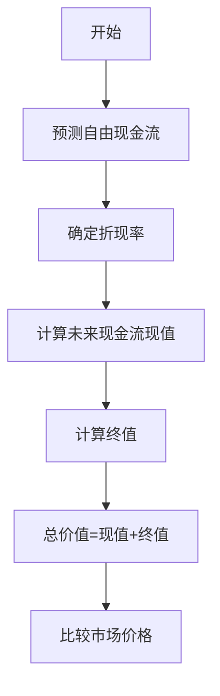
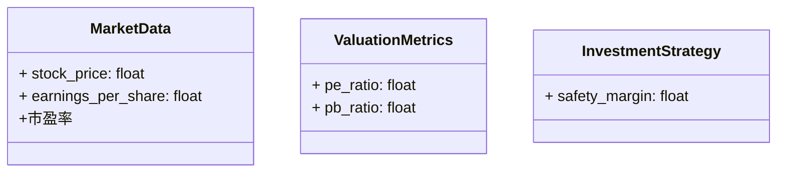
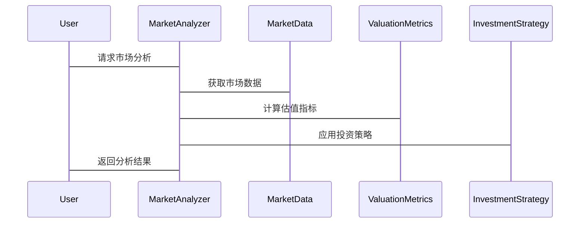

                 


# 巴菲特的市场泡沫识别：如何避免高估值陷阱

> 关键词：巴菲特，市场泡沫，估值陷阱，价值投资，投资策略，风险管理

> 摘要：本文深入分析了巴菲特的市场泡沫识别方法，探讨如何通过价值投资理念和数学模型避免高估值陷阱。结合实际案例，详细讲解了巴菲特的投资哲学、估值指标、数学模型、系统架构设计以及实战应用，帮助投资者在复杂市场中做出明智决策。

---

## 第一章 巴菲特的投资理念与市场泡沫概述

### 1.1 巴菲特的价值投资理论

#### 1.1.1 价值投资的核心理念
价值投资的核心在于寻找市场低估的公司，关注企业的内在价值，而非市场的短期波动。巴菲特强调，股票的真正价值是其未来现金流的现值。

#### 1.1.2 巴菲特的投资哲学
- **长期投资**：巴菲特认为市场短期波动难以预测，但长期趋势可以通过基本面分析确定。
- **安全边际**：买入价格低于内在价值，确保有足够的安全空间。
- **企业基本面**：关注企业的盈利能力、财务健康和竞争优势。

#### 1.1.3 市场波动与价值回归的规律
市场波动是短期的，但价值总会回归。巴菲特通过长期持有优质资产，避免短期波动带来的损失。

### 1.2 市场与估值的基本概念

#### 1.2.1 市场估值的定义与特征
市场估值是将企业价值与市场指标（如市盈率、市净率）进行对比，判断其是否被高估或低估。

#### 1.2.2 高估值陷阱的形成机制
高估值陷阱通常发生在市场情绪高涨时，投资者忽视基本面，导致价格远高于实际价值。

#### 1.2.3 泡沫的定义与识别标准
泡沫是市场参与者疯狂追求收益，导致资产价格远高于其实际价值的现象。

### 1.3 巴菲特与市场泡沫的案例分析

#### 1.3.1 巴菲特对科技股泡沫的判断
2000年互联网泡沫破裂前，巴菲特避免投资高增长科技股，强调基本面分析的重要性。

#### 1.3.2 巴菲特对房地产泡沫的预警
2008年金融危机前，巴菲特警告房地产泡沫风险，强调安全边际的重要性。

#### 1.3.3 巴菲特对2008年金融危机的看法
巴菲特认为金融危机是市场过度杠杆和高风险投资的结果，强调长期基本面分析的重要性。

---

## 第二章 巴菲特的市场泡沫识别方法

### 2.1 巴菲特的估值指标

#### 2.1.1 市盈率（P/E）的计算与应用
市盈率=股价/每股收益，用于判断股票是否被高估。

$$
P/E = \frac{\text{股价}}{\text{每股收益}}
$$

#### 2.1.2 市净率（P/B）的计算与应用
市净率=股价/每股净资产，用于判断股票是否被高估。

$$
P/B = \frac{\text{股价}}{\text{每股净资产}}
$$

#### 2.1.3 股息率与股息支付率的分析
股息率=每股股息/股价，股息支付率=股息/净利润。

#### 2.1.4 净利润增长率
净利润增长率=（本年净利润-上年净利润）/上年净利润。

### 2.2 巴菲特与其他估值方法的对比

#### 2.2.1 市场估值方法对比表

| 方法       | 描述                                                                 |
|------------|----------------------------------------------------------------------|
| 市盈率法   | 基于未来盈利预测，适合成长型企业。                                      |
| 市净率法   | 基于资产价值，适合重资产企业。                                          |
| 股息率法   | 基于股息回报，适合成熟企业。                                            |
| DCF模型    | 基于未来现金流折现，适合长期价值评估。                                  |

### 2.3 市场情绪与泡沫识别

#### 2.3.1 市场情绪对估值的影响
市场情绪高涨时，投资者可能忽视基本面，导致价格虚高。

#### 2.3.2 如何结合市场情绪进行估值调整
通过分析市场情绪，调整估值指标，避免高估。

---

## 第三章 巴菲特定价模型与数学方法

### 3.1 巴菲特DCF模型

#### 3.1.1 DCF模型的定义
DCF模型通过预测未来现金流，计算其现值，确定企业价值。

#### 3.1.2 DCF模型流程图（mermaid）



#### 3.1.3 DCF模型的Python实现

```python
def dcf_model(fcf, discount_rate, years):
    pv = 0
    for i in range(years):
        pv += fcf / (1 + discount_rate) ** i
    return pv
```

### 3.2 其他数学方法

#### 3.2.1 股息折现模型（DDM）
$$
V = \frac{D}{r - g}
$$

其中，D是股息，r是折现率，g是股息增长率。

#### 3.2.2 重置成本法
重置成本法通过估算重建类似资产的成本，确定其价值。

---

## 第四章 系统分析与架构设计

### 4.1 问题场景介绍
投资者需要一个系统来实时监控市场数据，识别泡沫，评估风险。

### 4.2 系统功能设计

#### 4.2.1 领域模型（mermaid类图）



### 4.3 系统架构设计

#### 4.3.1 系统架构图（mermaid架构图）

```mermaid
docker
    service MarketAnalyzer {
        check MarketData
        calculate ValuationMetrics
        apply InvestmentStrategy
    }
```

### 4.4 系统接口设计

#### 4.4.1 接口描述
- `get_market_data()`：获取市场数据。
- `calculate_valuations()`：计算估值指标。
- `check_for_bubbles()`：识别市场泡沫。

### 4.5 系统交互设计

#### 4.5.1 交互流程图（mermaid序列图）



---

## 第五章 项目实战

### 5.1 环境安装
安装Python和必要的库（如Pandas、NumPy）。

### 5.2 核心实现

#### 5.2.1 股票估值代码

```python
import pandas as pd

def calculate_valuations(df):
    df['PE'] = df['Price'] / df['EPS']
    df['PB'] = df['Price'] / df['Book Value']
    return df
```

#### 5.2.2 泡沫检测代码

```python
def detect_bubble(pe_ratio, historical_pe_mean):
    if pe_ratio > 1.5 * historical_pe_mean:
        return True
    return False
```

### 5.3 案例分析

#### 5.3.1 苹果公司分析
分析苹果公司的PE和PB比率，判断是否被高估。

#### 5.3.2 亚马逊分析
分析亚马逊的PE和PB比率，判断是否被高估。

### 5.4 实际应用

#### 5.4.1 市场数据获取
从Yahoo Finance获取股票数据。

#### 5.4.2 估值指标计算
计算PE、PB等指标，并与行业平均值对比。

#### 5.4.3 泡沫识别
判断当前市场是否出现泡沫。

---

## 第六章 总结与展望

### 6.1 内容总结
本文详细介绍了巴菲特的市场泡沫识别方法，包括估值指标、数学模型和系统设计。

### 6.2 投资者注意事项
- 避免情绪化投资。
- 结合市场情绪和基本面分析。
- 定期重新评估投资组合。

### 6.3 未来展望
未来可以通过机器学习优化市场泡沫识别模型，结合大数据分析提升预测准确性。

---

## 作者信息

作者：AI天才研究院 & 禅与计算机程序设计艺术

---

**全文结束**

