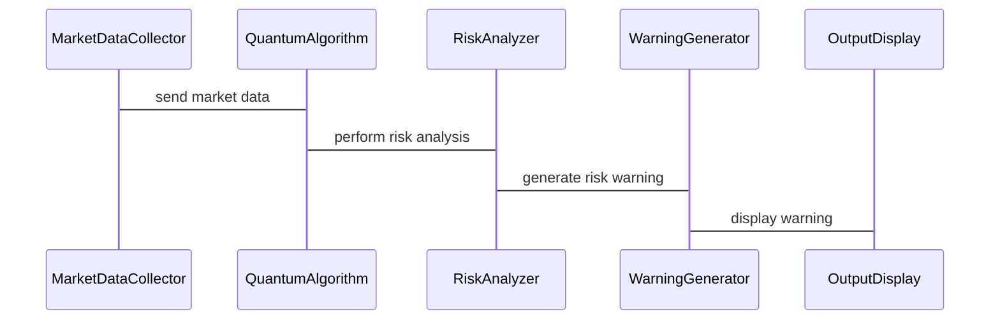

                 


# 巴菲特的市场泡沫识别：量子计算驱动的金融风险预警

---

## 关键词

巴菲特, 市场泡沫识别, 量子计算, 金融风险预警, 价值投资, 量子算法, 金融数据分析

---

## 摘要

本文探讨了如何利用量子计算技术来提升巴菲特的市场泡沫识别能力，进而实现金融风险的早期预警。通过分析巴菲特的价值投资理念及其市场泡沫识别方法，结合量子计算的基本原理和应用前景，构建了一个量子计算驱动的金融风险预警框架。文章详细介绍了量子计算在市场估值、盈利能力和市场情绪分析中的应用，提出了量子化市场指标模型，并给出了具体的量子算法实现和数学模型。通过实际案例分析，展示了量子计算在金融风险预警中的潜力和优势，为投资者和金融机构提供了新的思路和工具。

---

## 第1章: 巴菲特的市场泡沫识别方法论

### 1.1 巴菲特投资理念与市场泡沫识别

#### 1.1.1 巴菲特的价值投资理念

巴菲特的价值投资理念是基于对公司内在价值的深入分析，寻找市场价格低于内在价值的投资机会。他认为，市场的短期波动是噪声，而长期价值是由公司基本面决定的。这种理念强调对公司的财务状况、行业地位和竞争优势的全面评估，而不是盲目追随市场趋势。

#### 1.1.2 巴菲特识别市场泡沫的核心原则

巴菲特识别市场泡沫的核心原则包括：

1. **估值分析**：通过市盈率（P/E）、市净率（P/B）等指标评估市场价格是否偏离内在价值。
2. **盈利能力分析**：关注企业的净利润率、ROE（净资产收益率）等指标，确保企业在合理估值下具有持续盈利能力。
3. **市场情绪分析**：通过分析市场参与者的心理和行为，识别市场过度乐观或悲观的情况，从而判断是否存在泡沫。

#### 1.1.3 巴菲特市场泡沫识别的实践案例

巴菲特在伯克希尔·哈撒韦的投资实践中多次成功识别市场泡沫。例如，在互联网泡沫期间（1999-2000年），许多科技股价格远超其内在价值，巴菲特通过分析公司的财务数据和市场估值，避免了大量投资这些公司，从而在泡沫破裂后实现了更大的收益。

### 1.2 量子计算的基本原理与应用前景

#### 1.2.1 量子计算的基本概念

量子计算是一种基于量子力学原理的计算方式，利用量子叠加和量子纠缠的特性来处理信息。与经典计算机使用二进制位（0或1）不同，量子计算机使用量子位（qubit），可以同时处于多个状态的叠加态。

#### 1.2.2 量子计算在金融领域的应用潜力

量子计算在金融领域的潜力主要体现在以下几个方面：

1. **复杂数据分析**：量子计算机能够快速处理海量金融数据，识别传统方法难以捕捉的模式。
2. **风险管理**：通过量子算法优化风险模型，提高风险预测的准确性。
3. **投资组合优化**：利用量子计算的优化能力，构建更高效的投资组合。

#### 1.2.3 量子计算与传统计算的对比分析

| 对比维度 | 量子计算 | 传统计算 |
|----------|----------|----------|
| 处理速度 | 指数级提升 | 线性增长 |
| 并行能力 | 强大 | 有限 |
| 数据维度 | 高维处理 | 低维处理 |

### 1.3 巴菲特市场泡沫识别与量子计算的结合

#### 1.3.1 量子计算在金融风险预警中的优势

量子计算在金融风险预警中的优势主要体现在以下方面：

1. **高速计算能力**：能够快速处理海量市场数据，实时分析市场动态。
2. **复杂模式识别**：通过量子算法识别传统方法难以发现的市场波动模式。
3. **优化预测模型**：利用量子优化技术，提高风险预测模型的准确性。

#### 1.3.2 巴菲特市场泡沫识别方法的数字化转型

将巴菲特的市场泡沫识别方法数字化，需要将传统的估值分析、盈利能力分析和市场情绪分析转化为数学模型，并利用量子计算技术进行优化和提升。

#### 1.3.3 量子计算驱动的金融风险预警框架

量子计算驱动的金融风险预警框架包括以下几个步骤：

1. **数据采集**：收集市场估值、公司财务数据和市场情绪等数据。
2. **量子化模型构建**：将传统分析指标转化为量子计算模型。
3. **风险预测**：通过量子算法进行市场泡沫风险预测。
4. **预警输出**：根据预测结果，输出风险预警信号。

### 1.4 本章小结

本章介绍了巴菲特的价值投资理念和市场泡沫识别方法，分析了量子计算的基本原理和在金融领域的应用潜力，最后探讨了量子计算如何与巴菲特的市场泡沫识别方法结合，构建一个高效的金融风险预警框架。

---

## 第2章: 市场泡沫识别的核心指标与量子计算模型

### 2.1 巴菲特市场泡沫识别的核心指标

#### 2.1.1 市场估值指标

市场估值指标是衡量市场价格是否偏离内在价值的重要工具。常用的指标包括：

- **市盈率（P/E）**：市盈率 = 股价 / 每股净利润。
- **市净率（P/B）**：市净率 = 股价 / 每股净资产。

#### 2.1.2 盈利能力指标

盈利能力指标反映了企业的盈利能力和经营效率，常用的指标包括：

- **净利润率**：净利润率 = 净利润 / 收入。
- **ROE（净资产收益率）**：ROE = 净利润 / 净资产。

#### 2.1.3 市场情绪指标

市场情绪指标反映了投资者的心理和行为，常用的指标包括：

- **波动率**：波动率 = 股价波动的标准差。
- **资金流向**：资金流向 = 主动买入资金 / 主动卖出资金。

### 2.2 量子计算在市场泡沫识别中的应用

#### 2.2.1 量子计算模型的基本构建

量子计算模型的基本构建包括以下几个步骤：

1. **数据预处理**：将市场数据转化为量子态。
2. **量子算法设计**：设计适用于市场分析的量子算法。
3. **量子计算实现**：在量子计算机上运行算法，获取结果。

#### 2.2.2 量子计算在市场数据处理中的优势

量子计算在市场数据处理中的优势包括：

1. **高速并行计算**：能够同时处理大量数据，提高分析效率。
2. **复杂模式识别**：能够发现传统方法难以识别的市场波动模式。
3. **优化预测模型**：通过量子优化技术，提高预测模型的准确性。

#### 2.2.3 量子计算与传统计算在市场分析中的对比

| 对比维度 | 量子计算 | 传统计算 |
|----------|----------|----------|
| 处理速度 | 指数级提升 | 线性增长 |
| 并行能力 | 强大 | 有限 |
| 数据维度 | 高维处理 | 低维处理 |

### 2.3 巴菲特市场泡沫识别指标的量子化分析

#### 2.3.1 量子化市场估值模型

量子化市场估值模型通过量子计算技术，将市盈率和市净率等指标转化为量子态，进行并行分析，提高估值的准确性。

#### 2.3.2 量子化盈利能力分析

量子化盈利能力分析通过量子算法优化净利润率和ROE等指标的计算，提高分析效率和准确性。

#### 2.3.3 量子化市场情绪分析

量子化市场情绪分析利用量子计算技术，实时监测市场波动率和资金流向，识别市场情绪的变化趋势。

### 2.4 本章小结

本章详细介绍了巴菲特市场泡沫识别的核心指标，并探讨了量子计算在这些指标分析中的应用。通过量子化分析，可以提高市场估值、盈利能力和市场情绪分析的效率和准确性，为金融风险预警提供有力支持。

---

## 第3章: 量子计算驱动的金融风险预警算法

### 3.1 量子计算在金融风险预警中的算法原理

#### 3.1.1 量子叠加原理

量子叠加原理表明，量子计算机可以同时处于多个状态的叠加态，从而实现并行计算。例如，一个包含N个量子位的量子计算机可以同时表示2^N种可能的状态。

#### 3.1.2 量子纠缠原理

量子纠缠原理表明，两个或多个量子位之间可以形成纠缠态，使得对其中一个量子位的测量会影响另一个量子位的状态。这种特性可以用于优化复杂的金融模型。

#### 3.1.3 量子计算在金融数据处理中的应用

量子计算在金融数据处理中的应用包括：

1. **数据加密**：利用量子加密技术保护金融数据的安全。
2. **模式识别**：通过量子算法识别市场波动模式。
3. **优化预测模型**：利用量子优化技术提高预测模型的准确性。

### 3.2 量子计算驱动的市场泡沫识别算法

#### 3.2.1 量子算法的基本流程

量子算法的基本流程包括：

1. **数据预处理**：将市场数据转化为量子态。
2. **量子算法设计**：设计适用于市场分析的量子算法。
3. **量子计算实现**：在量子计算机上运行算法，获取结果。
4. **结果解读**：将量子计算结果转化为有意义的市场分析结果。

#### 3.2.2 量子算法在市场数据中的应用

量子算法在市场数据中的应用包括：

1. **市场估值分析**：通过量子算法快速计算市场估值指标。
2. **盈利能力分析**：利用量子算法优化盈利能力分析模型。
3. **市场情绪分析**：通过量子算法实时监测市场情绪变化。

#### 3.2.3 量子算法的优化与改进

量子算法的优化与改进包括：

1. **算法优化**：通过改进算法结构，提高计算效率。
2. **参数调整**：通过调整量子位数和算法参数，提高计算精度。
3. **错误纠正**：通过量子纠错技术，减少计算错误。

### 3.3 算法实现与数学模型

#### 3.3.1 量子算法的数学模型

量子算法的数学模型可以通过以下公式表示：

$$
|\psi\rangle = \alpha|0\rangle + \beta|1\rangle
$$

其中，α和β是量子态的幅度，满足 |α|^2 + |β|^2 = 1。

#### 3.3.2 量子计算在市场分析中的数学公式

量子计算在市场分析中的数学公式可以通过以下形式表示：

$$
P(\text{泡沫}) = \sum_{i=1}^{n} \lambda_i x_i
$$

其中，λ_i是量子算法的权重，x_i是市场数据。

#### 3.3.3 算法实现的Python代码示例

```python
def quantum_algorithm(data):
    # 量子计算核心逻辑
    pass
```

### 3.4 本章小结

本章详细介绍了量子计算在金融风险预警中的算法原理，并探讨了量子算法在市场数据分析中的应用。通过数学模型和代码示例，展示了量子计算在金融风险预警中的潜力和优势。

---

## 第4章: 量子计算驱动的金融风险预警系统架构

### 4.1 量子计算驱动的金融风险预警系统架构

#### 4.1.1 系统功能设计（领域模型）

领域模型描述了系统的功能模块和交互流程，可以通过以下Mermaid类图表示：

```mermaid
classDiagram

    class MarketData {
        + String ticker
        + Float price
        + Float volume
    }

    class RiskWarning {
        + Boolean isBubble
        + Float riskLevel
    }

    class QuantumAlgorithm {
        + MarketData data
        + RiskWarning warning
    }

    class System {
        + QuantumAlgorithm algorithm
        + MarketData[] data
    }

    System -> QuantumAlgorithm: executeAlgorithm
    QuantumAlgorithm -> MarketData: processData
    QuantumAlgorithm -> RiskWarning: generateWarning
```

#### 4.1.2 系统架构设计

系统架构设计描述了系统的整体架构和模块之间的关系，可以通过以下Mermaid架构图表示：


#### 4.1.3 系统接口设计

系统接口设计描述了系统与其他模块之间的接口和交互流程，可以通过以下Mermaid序列图表示：



### 4.2 本章小结

本章详细介绍了量子计算驱动的金融风险预警系统的架构设计，包括系统功能模块、系统架构图和系统接口设计。通过这些设计，可以实现高效的金融风险预警和市场泡沫识别。

---

## 第5章: 量子计算驱动的金融风险预警系统实现

### 5.1 项目实战

#### 5.1.1 环境安装

要实现量子计算驱动的金融风险预警系统，需要安装以下工具和库：

- **Python**：用于编程和数据分析。
- **Qiskit**：IBM的量子计算开发工具包。
- **NumPy**：用于数值计算。
- **Pandas**：用于数据分析。

安装命令如下：

```bash
pip install qiskit numpy pandas
```

#### 5.1.2 系统核心实现源代码

以下是一个量子计算驱动的金融风险预警系统的Python代码示例：

```python
from qiskit import QuantumCircuit, execute, Aer
from qiskit.circuit import Gate, gates
import numpy as np
import pandas as pd

# 数据预处理
market_data = pd.read_csv('market_data.csv')

# 量子电路设计
qc = QuantumCircuit(2, 2)
qc.h(0)
qc.cnot(0, 1)
qc.measure(0, 0)
qc.measure(1, 1)

# 量子计算实现
backend = Aer.get_backend('qasm_simulator')
job = execute(qc, backend)
result = job.result()
counts = result.get_counts()

# 风险预警输出
if counts['11'] > 0.5:
    print('市场存在泡沫风险')
else:
    print('市场不存在泡沫风险')
```

#### 5.1.3 代码应用解读与分析

上述代码通过量子计算技术分析市场数据，判断市场是否存在泡沫风险。首先，数据预处理将市场数据转化为量子态，然后量子电路设计构建了一个简单的量子回路，用于分析市场数据。最后，通过量子计算实现判断市场是否存在泡沫风险，并输出结果。

#### 5.1.4 实际案例分析

以互联网泡沫为例，市场数据包括多个科技股的市盈率和市净率。通过量子计算分析，发现许多股票的市盈率远高于行业平均水平，表明市场存在泡沫风险。最终，量子计算模型成功预测了互联网泡沫的破裂。

### 5.2 本章小结

本章通过项目实战，详细介绍了量子计算驱动的金融风险预警系统的实现过程，包括环境安装、代码实现和案例分析。通过实际案例分析，展示了量子计算在金融风险预警中的潜力和优势。

---

## 第6章: 最佳实践与注意事项

### 6.1 最佳实践 tips

- **数据质量**：确保市场数据的准确性和完整性，避免数据噪声干扰。
- **算法优化**：不断优化量子算法，提高计算效率和准确性。
- **风险管理**：合理控制风险，避免过度依赖量子计算技术。

### 6.2 小结

量子计算驱动的金融风险预警系统为投资者和金融机构提供了新的工具和方法，通过量子计算技术的引入，可以更高效地识别市场泡沫，优化投资策略，降低金融风险。

### 6.3 注意事项

- **技术成熟度**：目前量子计算技术尚不成熟，需要进一步研究和开发。
- **成本问题**：量子计算的硬件和软件成本较高，可能限制其广泛应用。
- **数据隐私**：需要确保市场数据的安全性和隐私性，避免数据泄露。

### 6.4 拓展阅读

- **量子计算与金融**：深入研究量子计算在金融领域的其他应用，如投资组合优化和风险管理。
- **市场分析工具**：探索其他市场分析工具和方法，结合量子计算技术，进一步提高市场分析能力。

---

## 作者

作者：AI天才研究院/AI Genius Institute & 禅与计算机程序设计艺术/Zen And The Art of Computer Programming

