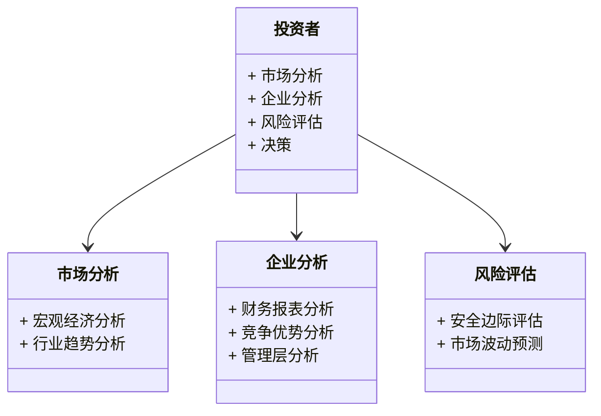

                 


# 巴菲特的师承：从格雷厄姆到芒格的思想融合

---

## 关键词：巴菲特，格雷厄姆，芒格，价值投资，多元思维模型，投资理念，投资策略

---

## 摘要：本文探讨了巴菲特的投资理念是如何从格雷厄姆的价值投资理论和芒格的多元思维模型中融合而成的。文章通过分析两位导师的思想，详细阐述了巴菲特如何将这些理念应用到实际投资中，最终形成独特的投资哲学。

---

## 正文

---

## 第一部分：引言

### 第1章：巴菲特的投资理念概述

#### 1.1 巴菲特的投资哲学

沃伦·巴菲特是世界上最著名的投资者之一，他的投资理念深受两位导师的影响：本杰明·格雷厄姆和查理·芒格。巴菲特的投资哲学以价值投资为核心，强调安全边际、长期投资和内在价值的计算。他的成功不仅在于对市场的理解，更在于他对人性的深刻洞察。

#### 1.2 格雷厄姆与芒格对巴菲特的影响

格雷厄姆是价值投资的鼻祖，他的安全边际理论和对市场的逆向思维深刻影响了巴菲特。而芒格的多元思维模型则帮助巴菲特跳出单一学科的限制，从多个角度分析问题，避免了决策的盲目性。这两位导师的思想在巴菲特那里实现了完美的融合，形成了他独特的投资策略。

---

## 第二部分：格雷厄姆的价值投资理论

### 第2章：格雷厄姆的生平与主要贡献

#### 2.1 格雷厄姆的生平简介

本杰明·格雷厄姆（1897-1976）是20世纪最著名的投资思想家之一。他出生于纽约，早年经历了经济大萧条的冲击，这使他形成了稳健的投资理念。他在哥伦比亚大学教授证券分析，培养了包括巴菲特在内的众多投资人才。

#### 2.2 格雷厄姆的投资理念

格雷厄姆的价值投资理论强调安全边际和内在价值的计算。他认为，股票的内在价值是其未来现金流的现值，而市场价格经常偏离这一价值。投资者应买入被市场低估的股票，并在市场恐慌时加仓。

#### 2.3 格雷厄姆的核心观点

- **安全边际**：买入价格低于内在价值的股票，以降低风险。
- **逆市场思维**：在市场下跌时寻找机会，而不是随市场波动。
- **价值评估**：强调对公司基本面的深入分析，尤其是资产负债表。

---

### 第3章：格雷厄姆的核心观点与对巴菲特的影响

#### 3.1 格雷厄姆的安全边际理论

格雷厄姆的安全边际理论要求投资者在买入股票时留有余地，确保即使价格波动，也能保证本金安全。这一理论在巴菲特的投资中得到充分体现，尤其是在他投资可口可乐和苹果公司时，他始终坚持安全边际的原则。

#### 3.2 格雷厄姆的价值评估方法

格雷厄姆的内在价值计算方法是巴菲特的基础。他强调通过分析财务报表，尤其是现金流和资产净值，来评估公司的真正价值。这种方法帮助巴菲特识别出那些被市场低估的优秀企业。

---

## 第三部分：芒格的多元思维模型

### 第4章：芒格的生平与主要贡献

#### 4.1 芒格的生平简介

查理·芒格（1924年生）是巴菲特的黄金搭档，伯克希尔·哈撒韦公司的副主席。芒格的职业生涯始于法律，但他对投资的热爱使他转向了这一领域。他的多元思维模型理论对巴菲特的投资决策产生了深远影响。

#### 4.2 多元思维模型的提出

芒格的多元思维模型强调从多个学科的角度看待问题，避免单一视角的局限性。他认为，投资者应该具备物理学、心理学、经济学等多个领域的知识，才能做出明智的决策。

#### 4.3 芒格的决策框架

芒格的决策框架强调理性思考和避免情绪化决策。他提倡在决策前列出所有可能的后果，并通过逆向思维寻找问题的解决方案。

---

### 第5章：芒格的核心观点与对巴菲特的影响

#### 5.1 多元思维模型的应用

芒格的多元思维模型帮助巴菲特超越了传统的投资分析，从多个角度审视公司的价值。例如，在投资喜诗糖果时，芒格的思维模型帮助巴菲特分析了公司的竞争优势、管理层素质等多个方面。

#### 5.2 芒格的决策框架

芒格的决策框架强调系统性和理性，这使巴菲特在投资过程中更加注重长期价值，而不是短期波动。他学会了如何避免情绪化决策，尤其是在市场恐慌时保持冷静。

---

## 第四部分：巴菲特的思想融合

### 第6章：巴菲特的投资哲学

#### 6.1 价值投资与多元思维的结合

巴菲特将格雷厄姆的价值投资理念与芒格的多元思维模型相结合，形成了自己的投资哲学。他不仅关注企业的内在价值，还注重企业的竞争优势和管理层素质。

#### 6.2 巴菲特的决策框架

巴菲特的决策框架强调安全边际和长期投资。他通过深入分析企业的财务报表和市场环境，寻找那些具有持续竞争优势的企业，并在市场低估时买入。

#### 6.3 实际案例分析

巴菲特对可口可乐的投资就是一个典型的案例。他通过分析公司的财务状况、竞争优势和管理层素质，认为可口可乐具有长期投资价值。在市场低迷时，他大量买入，最终获得了丰厚的回报。

---

### 第7章：系统分析与架构设计方案

#### 7.1 问题场景介绍

投资决策是一个复杂的过程，涉及多个因素的综合分析。为了帮助投资者更好地进行决策，我们可以建立一个系统分析框架，将格雷厄姆和芒格的思想融入其中。

#### 7.2 领域模型类图



#### 7.3 系统架构图

```mermaid
architecturalDiagram
    股票选择 --> 价值评估
    价值评估 --> 财务分析
    财务分析 --> 资产负债表
    财务分析 --> 现金流分析
    股票选择 --> 竞争优势分析
    优势分析 --> 行业地位
    优势分析 --> 市场份额
    股票选择 --> 风险评估
    风险评估 --> 市场波动
    风险评估 --> 安全边际
```

---

### 第8章：项目实战

#### 8.1 环境安装

为了进行系统分析，我们需要安装以下工具：

- 数据分析工具：Python、Pandas、NumPy
- 图表绘制工具：Matplotlib、Seaborn
- 投资分析工具：Excel、Morningstar

#### 8.2 核心实现源代码

以下是计算股票内在价值的Python代码示例：

```python
import pandas as pd
import numpy as np

def calculate_intrinsic_value(stock_data):
    # 假设stock_data是一个包含财务数据的DataFrame
    # 计算自由现金流
    free_cash_flow = stock_data['自由现金流']
    # 计算加权平均资本成本
    wacc = stock_data['WACC']
    # 计算永续增长率
    perpetual_growth_rate = stock_data['永续增长率']
    
    # 计算内在价值
    intrinsic_value = (free_cash_flow * (1 + perpetual_growth_rate)) / (wacc - perpetual_growth_rate)
    return intrinsic_value

# 示例数据
data = {
    '自由现金流': [100, 150, 200],
    'WACC': [8%, 8%, 8%],
    '永续增长率': [3%, 3%, 3%]
}
stock_data = pd.DataFrame(data)

# 计算内在价值
intrinsic_value = calculate_intrinsic_value(stock_data)
print(intrinsic_value)
```

#### 8.3 案例分析

以巴菲特投资可口可乐为例，我们可以通过上述代码计算其内在价值。假设可口可乐的自由现金流为100亿美元，WACC为8%，永续增长率为3%，则其内在价值为：

$$
\text{内在价值} = \frac{100 \times (1 + 0.03)}{0.08 - 0.03} = \frac{103}{0.05} = 2060 \text{亿美元}
$$

如果市场价格低于2060亿美元，巴菲特可能会考虑买入。

---

## 第五部分：结论

### 第9章：总结与启示

巴菲特的成功离不开他对格雷厄姆和芒格思想的融合。他不仅掌握了价值投资的核心理念，还通过多元思维模型增强了决策的深度和广度。投资者可以借鉴他的方法，结合系统分析和实际案例，形成自己的投资策略。

---

## 附录：进一步阅读的资料

- 《格雷厄姆证券分析》
- 《芒格论投资》
- 《巴菲特致股东的信》

---

## 作者：AI天才研究院/AI Genius Institute & 禅与计算机程序设计艺术/Zen And The Art of Computer Programming

