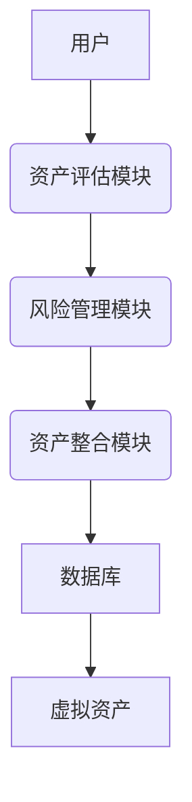
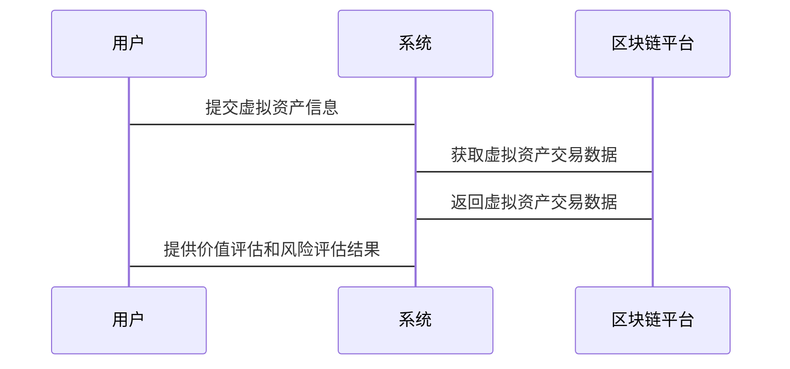

                 


# 巴菲特的并购策略在元宇宙虚拟资产整合中的创新

## 关键词：巴菲特，并购策略，元宇宙，虚拟资产，NFT，虚拟土地，价值评估

## 摘要：  
本文探讨了巴菲特的并购策略在元宇宙虚拟资产整合中的创新应用。通过分析元宇宙虚拟资产的特点，结合巴菲特并购策略的核心思想，提出了适用于元宇宙虚拟资产整合的价值评估模型和风险控制策略。本文还详细介绍了如何将巴菲特并购策略的核心要素（如价值评估、安全边际、管理层质量）应用于元宇宙虚拟资产的整合过程，并通过具体案例分析了NFT和虚拟土地的价值评估方法。最后，本文提出了在元宇宙虚拟资产整合中的最佳实践和注意事项。

---

# 第1章 元宇宙与虚拟资产整合概述

## 1.1 元宇宙的基本概念与特点

### 1.1.1 元宇宙的定义与核心特征  
元宇宙（Metaverse）是一个虚拟的、持续运行的、高度沉浸式的数字世界，结合了虚拟现实（VR）、增强现实（AR）、区块链、人工智能等多种技术。元宇宙的核心特征包括：  
1. **沉浸性**：用户可以通过VR设备完全沉浸在一个虚拟世界中。  
2. **开放性**：元宇宙是一个去中心化的数字空间，允许用户自由创建和交互。  
3. **经济性**：元宇宙中有虚拟货币、NFT（非同质化代币）、虚拟土地等虚拟资产，形成了复杂的经济系统。  
4. **社交性**：用户可以在元宇宙中进行社交、互动，甚至建立虚拟社区。  

### 1.1.2 元宇宙的虚拟资产类型  
元宇宙中的虚拟资产可以分为以下几类：  
1. **虚拟货币**：如比特币、以太坊等加密货币，用于元宇宙中的交易和支付。  
2. **NFT（非同质化代币）**：用于表示虚拟艺术品、虚拟收藏品、虚拟土地等的独特数字资产。  
3. **虚拟土地**：用户可以在元宇宙中购买虚拟土地，用于建设虚拟建筑、举办虚拟活动等。  
4. **虚拟物品**：如虚拟服装、虚拟设备等，可以通过NFT进行交易。  

### 1.1.3 元宇宙与现实世界的关系  
元宇宙与现实世界的联系主要体现在以下几个方面：  
1. **经济互通**：元宇宙中的虚拟货币可以通过特定的桥梁与现实世界中的货币进行兑换。  
2. **技术互通**：元宇宙依赖于现实世界中的技术支撑，如区块链、人工智能等。  
3. **用户互通**：元宇宙中的用户通常基于现实世界中的身份（如社交媒体账号）进行注册和登录。  

## 1.2 巴菲特并购策略的基本原理

### 1.2.1 巴菲特并购策略的核心思想  
巴菲特（Warren Buffett）的并购策略以价值投资为核心，强调以下几点：  
1. **安全边际**：并购价格应远低于资产的内在价值，以确保投资的安全性。  
2. **管理层质量**：管理层的诚信、能力和决策能力是企业成功的关键。  
3. **财务健康状况**：企业应具备稳健的财务状况，避免高负债和不良资产。  
4. **竞争优势**：目标企业应具备可持续的竞争优势（如独特的商业模式、品牌影响力等）。  

### 1.2.2 巴菲特并购策略的成功案例分析  
巴菲特并购策略的成功案例包括：  
1. **可口可乐（Coca-Cola）**：巴菲特看中了可口可乐的品牌价值和市场领导地位，认为其具备长期的竞争优势。  
2. **吉列（Gillette）**：巴菲特通过收购吉列，获得了其在剃须刀市场的垄断地位和稳定的现金流。  
3. **美国运通（American Express）**：巴菲特在1999年出售了美国运通的股份，但他在持有期间通过其强大的支付网络和客户基础获得了高额回报。  

### 1.2.3 巴菲特并购策略的适用性分析  
巴菲特并购策略的核心思想可以应用于元宇宙虚拟资产的整合，但需要结合元宇宙的特殊性进行调整。例如：  
1. **虚拟资产的流动性**：虚拟资产的流动性可能比传统资产更低，因此需要更加谨慎地评估其价值。  
2. **虚拟资产的稀缺性**：某些虚拟资产（如限量版NFT）可能具有独特的稀缺性，这与巴菲特看重的“竞争优势”有相似之处。  
3. **虚拟资产的法律风险**：元宇宙中的虚拟资产可能面临法律不确定性，这需要在并购策略中加以考虑。  

## 1.3 元宇宙虚拟资产整合的背景与趋势

### 1.3.1 元宇宙虚拟资产整合的背景  
随着区块链技术的快速发展，元宇宙中的虚拟资产逐渐成为一种重要的经济形式。虚拟货币和NFT的兴起，使得元宇宙中的虚拟资产具备了类似传统资产的经济属性。然而，虚拟资产的估值和整合仍面临许多挑战，如价格波动、法律不确定性等。  

### 1.3.2 元宇宙虚拟资产整合的趋势  
1. **虚拟资产的金融化**：虚拟资产将逐渐被纳入金融体系，成为传统金融资产的补充。  
2. **虚拟资产的规范化**：随着技术的进步和政策的完善，虚拟资产的交易和管理将更加规范化。  
3. **虚拟资产的多元化**：元宇宙中的虚拟资产将更加多样化，包括虚拟土地、虚拟物品、虚拟服务等。  

### 1.3.3 元宇宙虚拟资产整合的挑战与机遇  
1. **挑战**：  
   - 虚拟资产的价格波动较大，导致并购风险较高。  
   - 元宇宙中的虚拟资产缺乏统一的估值标准。  
   - 虚拟资产的法律地位尚不明确，可能面临政策风险。  

2. **机遇**：  
   - 元宇宙中的虚拟资产具有较高的增长潜力，尤其是在NFT和虚拟土地领域。  
   - 虚拟资产的整合可以为企业提供新的增长点，如虚拟房地产开发、虚拟商品销售等。  

---

# 第2章 巴菲特并购策略在元宇宙中的创新应用

## 2.1 巴菲特并购策略的核心要素

### 2.1.1 价值评估  
巴菲特的价值评估方法主要包括以下步骤：  
1. **确定企业的内在价值**：通过分析企业的财务报表和市场地位，估算企业的内在价值。  
2. **比较市场价格与内在价值**：如果市场价格低于内在价值，企业具备并购价值。  

### 2.1.2 安全边际  
安全边际是指并购价格与企业内在价值之间的差额。巴菲特认为，安全边际的存在可以降低并购风险，确保投资的稳健性。  

### 2.1.3 管理层质量  
巴菲特认为，优秀的管理层是企业成功的关键。因此，在并购过程中，需要对目标企业的管理层进行深入评估，包括其诚信、能力和决策能力。  

### 2.1.4 财务健康状况  
巴菲特强调，企业的财务健康状况是并购的重要考量因素。他倾向于选择财务稳健、负债较低的企业进行并购。  

---

## 2.2 巴菲特并购策略在元宇宙中的适用性分析

### 2.2.1 元宇宙虚拟资产的特殊性  
元宇宙中的虚拟资产具有以下特殊性：  
1. **虚拟性**：虚拟资产的交易和使用完全依赖于数字技术。  
2. **去中心化**：许多虚拟资产基于区块链技术，具有去中心化的特点。  
3. **高波动性**：虚拟资产的价格波动较大，尤其是NFT和虚拟货币。  

### 2.2.2 巴菲特并购策略的创新点  
为了适应元宇宙虚拟资产的特殊性，巴菲特并购策略需要进行以下创新：  
1. **虚拟资产的流动性评估**：由于虚拟资产的流动性较低，需要更加谨慎地评估其价值。  
2. **虚拟资产的稀缺性评估**：某些虚拟资产（如限量版NFT）具有独特的稀缺性，可以作为并购的重要考量因素。  
3. **虚拟资产的法律风险评估**：由于虚拟资产的法律地位尚不明确，需要在并购过程中充分考虑法律风险。  

### 2.2.3 巴菲特并购策略在元宇宙中的潜在风险  
1. **价格波动风险**：虚拟资产的价格波动较大，可能导致并购成本增加。  
2. **技术风险**：元宇宙中的虚拟资产依赖于区块链等技术，技术故障可能影响资产的价值。  
3. **政策风险**：虚拟资产的法律和政策环境尚不完善，可能面临政策风险。  

---

## 2.3 本章小结  
本章分析了巴菲特并购策略的核心要素，并探讨了其在元宇宙中的创新应用。通过结合元宇宙虚拟资产的特殊性，提出了适用于元宇宙虚拟资产整合的价值评估模型和风险控制策略。同时，本文还指出了巴菲特并购策略在元宇宙中的潜在风险，并提出了相应的应对措施。

---

# 第3章 元宇宙虚拟资产的价值评估模型

## 3.1 元宇宙虚拟资产价值评估的核心要素

### 3.1.1 资产流动性  
资产流动性是指资产转换为现金的能力。在元宇宙中，虚拟资产的流动性较低，尤其是在某些情况下，虚拟资产可能无法快速变现。  

### 3.1.2 资产稀缺性  
资产稀缺性是影响虚拟资产价值的重要因素。例如，限量版NFT的稀缺性使其具有较高的市场价值。  

### 3.1.3 资产使用场景  
资产使用场景是指虚拟资产的应用场景。例如，虚拟土地可以用于建设虚拟建筑，虚拟物品可以用于装饰虚拟空间。  

### 3.1.4 资产未来收益潜力  
资产未来收益潜力是指虚拟资产在未来可能带来的收益。例如，虚拟土地的价值可能随着元宇宙的不断发展而增加。  

---

## 3.2 巴菲特并购策略在虚拟资产价值评估中的应用

### 3.2.1 价值评估模型的设计  
本文提出了以下价值评估模型：  
$$ V = \text{流动性权重} \times \text{流动性评分} + \text{稀缺性权重} \times \text{稀缺性评分} + \text{使用场景权重} \times \text{使用场景评分} + \text{未来收益潜力权重} \times \text{未来收益潜力评分} $$  

### 3.2.2 案例分析：NFT的价值评估  
以NFT为例，假设某NFT的流动性评分为0.8，稀缺性评分为0.9，使用场景评分为0.7，未来收益潜力评分为0.8。假设各因素的权重分别为0.3、0.3、0.2、0.2。  
$$ V = 0.3 \times 0.8 + 0.3 \times 0.9 + 0.2 \times 0.7 + 0.2 \times 0.8 = 0.24 + 0.27 + 0.14 + 0.16 = 0.81 $$  
因此，该NFT的价值评分为0.81，属于较高价值资产。  

### 3.2.3 案例分析：虚拟土地的价值评估  
以虚拟土地为例，假设某虚拟土地的流动性评分为0.6，稀缺性评分为0.8，使用场景评分为0.9，未来收益潜力评分为0.7。假设各因素的权重分别为0.2、0.3、0.3、0.2。  
$$ V = 0.2 \times 0.6 + 0.3 \times 0.8 + 0.3 \times 0.9 + 0.2 \times 0.7 = 0.12 + 0.24 + 0.27 + 0.14 = 0.77 $$  
因此，该虚拟土地的价值评分为0.77，属于中高价值资产。  

---

## 3.3 本章小结  
本章提出了适用于元宇宙虚拟资产的价值评估模型，并通过具体案例分析了NFT和虚拟土地的价值评估方法。通过巴菲特并购策略的核心思想，本文强调了资产流动性、稀缺性、使用场景和未来收益潜力的重要性，并提出了相应的评估方法。

---

# 第4章 元宇宙虚拟资产整合的风险控制策略

## 4.1 元宇宙虚拟资产整合的主要风险

### 4.1.1 资产价格波动风险  
虚拟资产的价格波动较大，尤其是NFT和虚拟货币。价格波动可能影响并购成本和收益。  

### 4.1.2 资产法律风险  
元宇宙中的虚拟资产法律地位尚不明确，可能面临政策风险。  

### 4.1.3 资产技术风险  
元宇宙中的虚拟资产依赖于区块链等技术，技术故障可能影响资产的价值。  

---

## 4.2 元宇宙虚拟资产整合的风险控制策略

### 4.2.1 建立风险管理机制  
1. **价格波动风险管理**：通过分散投资、长期持有等方式降低价格波动风险。  
2. **法律风险管理**：密切关注政策变化，避免法律风险。  
3. **技术风险管理**：选择技术稳定、去中心化程度高的平台进行投资。  

### 4.2.2 建立风险评估模型  
本文提出了以下风险评估模型：  
$$ R = \text{价格波动风险权重} \times \text{价格波动评分} + \text{法律风险权重} \times \text{法律风险评分} + \text{技术风险权重} \times \text{技术风险评分} $$  
假设价格波动风险评分为0.7，法律风险评分为0.6，技术风险评分为0.8，各因素的权重分别为0.4、0.3、0.3。  
$$ R = 0.4 \times 0.7 + 0.3 \times 0.6 + 0.3 \times 0.8 = 0.28 + 0.18 + 0.24 = 0.70 $$  
因此，整体风险评分为0.70，属于中等风险。  

### 4.2.3 建立风险应对策略  
1. **价格波动风险应对**：通过长期持有和分散投资降低价格波动风险。  
2. **法律风险应对**：密切关注政策变化，避免投资于可能被禁止的虚拟资产。  
3. **技术风险应对**：选择技术稳定、去中心化程度高的平台进行投资。  

---

## 4.3 本章小结  
本章分析了元宇宙虚拟资产整合的主要风险，并提出了相应的风险控制策略。通过建立风险管理机制和风险评估模型，本文为元宇宙虚拟资产的整合提供了科学的指导。

---

# 第5章 项目实战：元宇宙虚拟资产整合的实现

## 5.1 项目背景  
本项目旨在通过巴菲特并购策略的创新应用，实现元宇宙虚拟资产的整合。项目目标包括：  
1. **建立虚拟资产的价值评估模型**。  
2. **设计虚拟资产的风险控制策略**。  
3. **实现虚拟资产的整合系统**。  

## 5.2 系统功能设计

### 5.2.1 功能模块  
1. **资产评估模块**：基于价值评估模型对虚拟资产进行评估。  
2. **风险管理模块**：基于风险评估模型对虚拟资产进行风险评估。  
3. **资产整合模块**：实现虚拟资产的并购和整合。  

### 5.2.2 系统架构设计  
以下是系统架构设计的Mermaid图：  


### 5.2.3 系统接口设计  
系统接口设计包括：  
1. 用户接口：用户可以通过网页或移动应用提交虚拟资产信息。  
2. 数据接口：系统通过API与区块链平台进行交互，获取虚拟资产的交易数据。  

### 5.2.4 系统交互流程  
以下是系统交互流程的Mermaid图：  


---

## 5.3 项目核心代码实现

### 5.3.1 环境搭建  
项目需要以下环境：  
1. Python 3.8及以上版本  
2. Mermaid图生成工具  
3. 区块链开发框架（如Solidity）  

### 5.3.2 核心代码实现  
以下是价值评估模型的Python代码：  
```python
def value_assessment(liquidity_score, scarcity_score, use_case_score, future_potential_score):
    value = liquidity_score * 0.3 + scarcity_score * 0.3 + use_case_score * 0.2 + future_potential_score * 0.2
    return value

# 示例数据
liquidity_score = 0.8
scarcity_score = 0.9
use_case_score = 0.7
future_potential_score = 0.8

# 调用函数
value = value_assessment(liquidity_score, scarcity_score, use_case_score, future_potential_score)
print(f"虚拟资产价值评分为：{value}")
```

---

## 5.4 项目小结  
本章通过项目实战，详细介绍了元宇宙虚拟资产整合的实现过程。通过系统功能设计和核心代码实现，本文展示了如何将巴菲特并购策略的核心思想应用于元宇宙虚拟资产的整合。

---

# 第6章 总结与展望

## 6.1 本文总结  
本文探讨了巴菲特并购策略在元宇宙虚拟资产整合中的创新应用。通过分析元宇宙虚拟资产的特点，结合巴菲特并购策略的核心思想，提出了适用于元宇宙虚拟资产整合的价值评估模型和风险控制策略。本文还通过具体案例分析了NFT和虚拟土地的价值评估方法，并提出了相应的风险应对措施。

## 6.2 未来展望  
未来的研究可以进一步探索以下方向：  
1. **虚拟资产的流动性提升**：如何通过技术创新提高虚拟资产的流动性。  
2. **虚拟资产的法律规范化**：如何推动虚拟资产的法律规范化，降低政策风险。  
3. **虚拟资产的多元化发展**：如何开发更多种类的虚拟资产，丰富元宇宙的经济体系。  

---

# 作者：AI天才研究院/AI Genius Institute & 禅与计算机程序设计艺术 /Zen And The Art of Computer Programming

