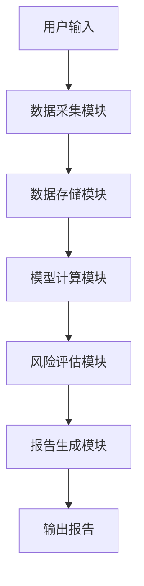

                 


# 巴菲特的并购艺术：科技巨头垄断环境下的策略

> 关键词：巴菲特并购艺术，科技巨头垄断，投资策略，企业并购，价值评估

> 摘要：本文深入探讨巴菲特的并购艺术及其在科技巨头垄断环境下的应用策略。通过分析巴菲特的核心投资理念，结合科技行业的垄断现状，提出在垄断环境下如何优化并购策略，评估企业价值，降低投资风险，并通过实际案例分析提供可操作的并购框架。

---

## 第一部分：背景介绍

### 第1章：并购的基本概念与巴菲特的投资哲学

#### 1.1 并购的基本概念与定义

- **并购（Mergers and Acquisitions, M&A）**：企业之间的合并或收购行为，旨在整合资源、扩大市场份额或增强竞争力。
- **横向并购**：同一行业内的企业合并，减少竞争，提高市场占有率。
- **纵向并购**：产业链上下游的企业合并，增强垂直整合能力。
- **混合并购**：无直接关联的企业合并，拓展业务范围。

#### 1.2 巴菲特并购投资的核心理念

- **长期投资**：巴菲特注重企业的长期价值，而非短期市场波动。
- **安全边际**：通过低估价格投资，确保投资的安全性。
- **企业护城河**：选择具有竞争优势的企业，确保长期盈利能力。
- **管理层质量**：管理层的诚信与能力直接影响企业价值。

#### 1.3 科技巨头垄断环境下的并购挑战

- **垄断趋势**：科技行业高度集中，巨头通过并购巩固市场地位。
- **反垄断监管**：并购可能导致垄断，面临法律风险。
- **估值难题**：科技企业的高增长性和不确定性，使估值更具挑战性。

---

### 第2章：科技行业的垄断现状与影响

#### 2.1 科技行业的垄断现状

- **主要科技巨头**：苹果、谷歌、亚马逊、微软、Meta等。
- **垄断特征**：市场占有率高、技术壁垒强、用户依赖度高。
- **行业趋势**：科技行业并购活动频繁，巨头通过并购巩固领先地位。

#### 2.2 科技垄断对并购的影响

- **竞争优势**：垄断企业通过并购整合资源，进一步扩大优势。
- **投资风险**：垄断可能导致市场进入壁垒高，新兴企业难有立足之地。
- **监管压力**：垄断企业的并购可能面临反垄断审查，增加交易难度。

---

## 第二部分：核心概念与联系

### 第3章：巴菲特并购标准与科技行业的结合

#### 3.1 巴菲特并购的核心标准

- **企业护城河**：企业是否具有独特的竞争优势，如专利、品牌、技术或成本优势。
- **管理层质量**：管理层是否诚信、有能力，能否带领企业持续发展。
- **财务健康状况**：企业是否具有稳健的财务状况，能否抵御经济波动。

#### 3.2 科技行业的并购特点

- **高增长性**：科技企业通常具有高增长潜力，但波动性也大。
- **技术驱动**：科技并购的核心在于技术优势和创新能力。
- **生态系统整合**：科技巨头倾向于通过并购整合产业链，构建生态系统。

---

## 第三部分：算法原理

### 第4章：并购评估的数学模型与实现

#### 4.1 DCF模型的应用

- **定义**：Discounted Cash Flow Model（DCF模型）用于评估企业未来现金流的现值。
- **公式**：
  $$
  \text{企业价值} = \sum_{t=1}^{n} \frac{\text{现金流}}{(1 + r)^t}
  $$
  其中，r为折现率，n为预测年数。

#### 4.2 科技企业并购的DCF模型实现

- **步骤**：
  1. 预测未来现金流。
  2. 确定合理的折现率。
  3. 计算未来现金流的现值。
  4. 减去净债务，得出企业股权价值。

#### 4.3 Python代码实现

```python
import numpy as np

def dcf_model(cash_flows, discount_rate, years):
    present_value = 0
    for i in range(years):
        cf = cash_flows[i]
        pv = cf / (1 + discount_rate) ** (i + 1)
        present_value += pv
    return present_value

# 示例数据
cash_flows = [100, 150, 200, 250, 300]  # 每年的现金流
discount_rate = 0.10  # 折现率
years = 5  # 年数

value = dcf_model(cash_flows, discount_rate, years)
print(f"DCF模型计算的企业价值为：{value:.2f}")
```

---

## 第四部分：系统分析与架构设计

### 第5章：系统功能设计与架构图

#### 5.1 系统功能设计

- **功能模块**：
  1. 数据采集模块：收集目标企业的财务数据和市场信息。
  2. 模型计算模块：应用DCF模型评估企业价值。
  3. 风险评估模块：分析并购的潜在风险，如反垄断风险。
  4. 报告生成模块：输出并购建议和详细分析报告。

#### 5.2 系统架构图



---

## 第五部分：项目实战

### 第6章：实战项目与案例分析

#### 6.1 环境安装

- **工具安装**：
  1. 安装Python和相关库（如numpy、pandas）。
  2. 安装Mermaid图生成工具。

#### 6.2 核心实现

- **代码实现**：
  ```python
  import pandas as pd
  import numpy as np

  def calculate_dcf(cash_flows, discount_rate, periods):
      return sum(cf / (1 + discount_rate) ** i for i, cf in enumerate(cash_flows[:periods]))

  # 示例数据
  cash_flows = [100, 150, 200, 250, 300]
  discount_rate = 0.10
  periods = 5

  dcf_value = calculate_dcf(cash_flows, discount_rate, periods)
  print(f"DCF Value: {dcf_value:.2f}")
  ```

#### 6.3 实际案例分析

- **案例：亚马逊的并购策略**
  - **背景**：亚马逊通过并购扩展云服务（AWS）、智能音箱（Alexa）等业务。
  - **分析**：应用DCF模型评估被并购企业的价值，分析其与亚马逊生态系统的协同效应。

---

## 第六部分：总结与展望

### 第7章：总结与未来展望

#### 7.1 总结

- **核心观点**：巴菲特的并购艺术在科技垄断环境下仍具有重要价值，但需结合科技行业的特点进行调整。
- **关键点**：选择具有强大护城河的企业，注重管理层质量，合理评估企业价值，规避垄断风险。

#### 7.2 未来展望

- **动态调整并购标准**：随着科技发展，需动态调整并购标准，适应行业变化。
- **应对反垄断挑战**：在垄断环境下，需关注反垄断法规，确保并购合法合规。
- **技术创新驱动并购**：未来并购将更多依赖技术创新，需关注新兴技术领域。

---

## 作者信息

作者：AI天才研究院/AI Genius Institute & 禅与计算机程序设计艺术/Zen And The Art of Computer Programming

---

以上就是《巴菲特的并购艺术：科技巨头垄断环境下的策略》的完整目录结构和内容概要。

