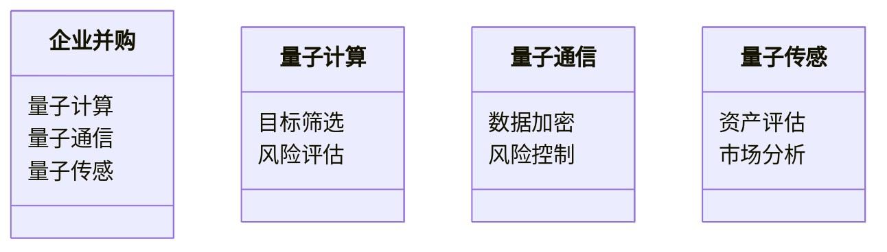
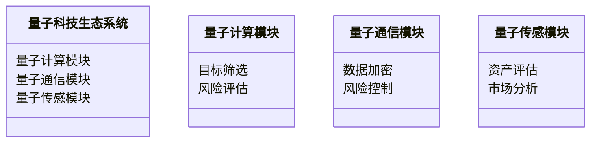
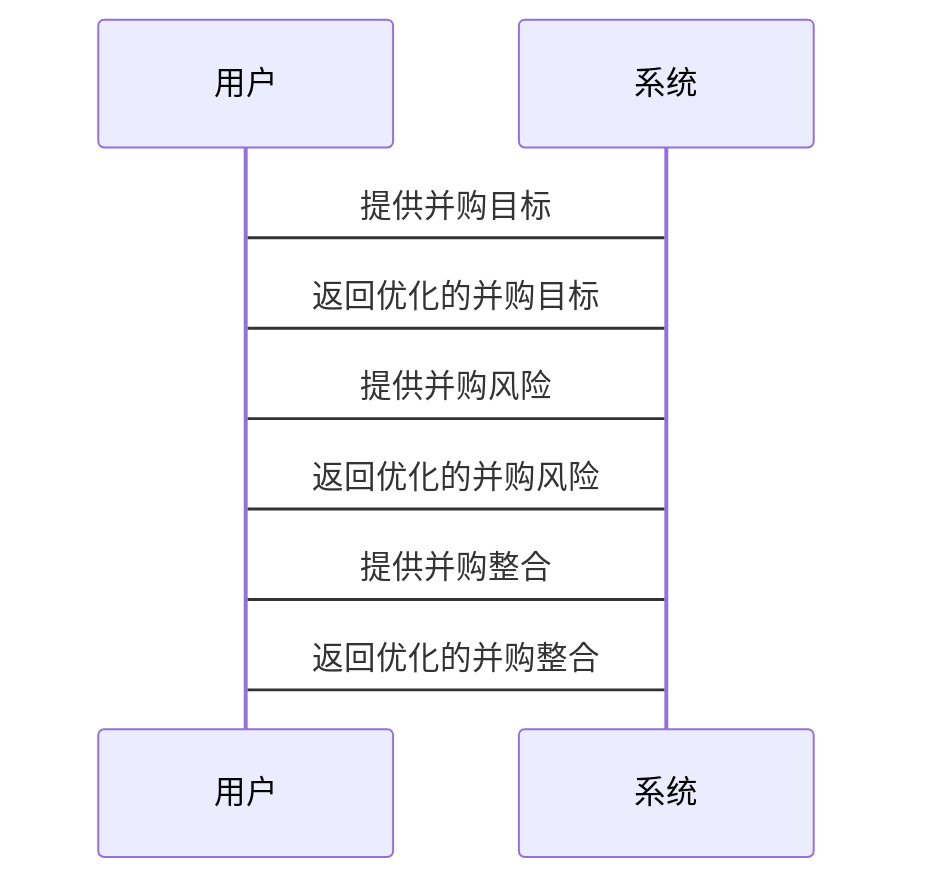

                 


# 巴菲特的并购艺术：量子科技生态系统整合的新策略

---

## 关键词：
- 巴菲特并购艺术
- 量子科技
- 生态系统整合
- 并购策略
- 量子计算
- 量子通信
- 并购整合

---

## 摘要：
本文探讨了巴菲特并购艺术与量子科技生态系统的结合，分析了量子科技如何为并购策略带来新的可能性。文章从并购的核心理念出发，结合量子科技的核心技术领域，详细阐述了量子计算、量子通信和量子传感在并购中的应用。通过量子计算优化并购目标筛选、量子通信降低并购风险、量子传感提升并购整合效率等方面，本文提出了量子科技生态系统整合的新策略，并结合实际案例进行了深入分析。最终，文章总结了量子科技在并购中的最佳实践，为未来的并购策略提供了新的方向。

---

## 第1章: 巴菲特并购艺术概述

### 1.1 巴菲特并购投资的核心理念

#### 1.1.1 巴菲特投资哲学的核心思想
巴菲特的投资哲学以“价值投资”为核心，强调长期持有的理念。他注重企业基本面分析，寻找具有持续竞争优势和良好管理团队的企业。以下是巴菲特投资哲学的核心思想：

$$\text{价值 = 资产的内在价值，而非市场波动的反映}$$

#### 1.1.2 巴菲特并购策略的特点
巴菲特的并购策略以“寻找具有护城河”的企业为目标，注重企业的盈利能力、财务健康状况和管理团队的稳定性。以下是其并购策略的特点：

- **低杠杆率**：巴菲特倾向于选择低杠杆率的企业，以降低财务风险。
- **高ROE**：巴菲特关注企业的净资产收益率（ROE），认为ROE高的企业具有更强的盈利能力。
- **管理团队**：巴菲特别注重管理团队的诚信和能力，认为优秀的管理团队是企业长期成功的关键。

#### 1.1.3 巴菲特并购成功的关键因素
巴菲特并购成功的几个关键因素包括：
1. **行业龙头**：选择行业内具有领先地位的企业。
2. **竞争优势**：寻找具有独特竞争优势的企业。
3. **管理团队**：信任并支持优秀的管理团队。

### 1.2 量子科技生态系统的基本概念

#### 1.2.1 量子科技的基本定义
量子科技是基于量子力学原理，利用量子系统特性（如叠加态和纠缠态）进行信息处理和计算的技术。量子科技的核心领域包括量子计算、量子通信和量子传感。

#### 1.2.2 量子科技的核心技术领域
1. **量子计算**：利用量子比特（qubit）进行并行计算，解决经典计算机难以处理的问题。
2. **量子通信**：利用量子纠缠实现信息的无条件安全传输。
3. **量子传感**：利用量子系统的高灵敏度进行精确测量。

#### 1.2.3 量子科技在生态系统中的作用
量子科技在生态系统中的作用包括：
- 提供高效的数据处理能力。
- 实现安全的信息传输。
- 提供高精度的测量工具。

### 1.3 并购与量子科技的结合

#### 1.3.1 并购在量子科技发展中的作用
并购是量子科技企业快速扩大规模、整合资源的重要方式。通过并购，企业可以快速获取技术、人才和市场资源。

#### 1.3.2 量子科技对并购策略的影响
量子科技的出现为并购策略带来了新的可能性。例如：
- 通过量子计算优化并购目标筛选。
- 通过量子通信降低并购风险。
- 通过量子传感提升并购整合效率。

#### 1.3.3 量子科技生态系统整合的新策略
量子科技生态系统整合的新策略包括：
1. **技术整合**：将量子计算、量子通信和量子传感技术整合到并购流程中。
2. **数据共享**：通过量子通信实现数据的安全共享。
3. **协同效应**：利用量子科技提升企业的协同效应。

### 1.4 本章小结
本章从巴菲特并购艺术的核心理念出发，介绍了量子科技的基本概念，并探讨了量子科技与并购策略的结合。通过量子科技生态系统整合，企业可以实现更高效、更安全的并购。

---

## 第2章: 量子科技生态系统的核心要素

### 2.1 量子计算技术

#### 2.1.1 量子计算的基本原理
量子计算基于量子叠加和量子纠缠原理，能够实现并行计算。以下是量子计算的基本原理：

- **量子叠加**：量子比特可以同时处于多个状态的叠加态。
- **量子纠缠**：两个或多个量子比特之间可以形成纠缠态，使得它们的状态相互关联。

#### 2.1.2 量子计算的关键技术
量子计算的关键技术包括：
1. **量子比特的实现**：利用超导电路、离子阱等技术实现量子比特。
2. **量子门操作**：通过量子门操作对量子比特进行变换。
3. **量子算法**：设计高效的量子算法，如Shor算法和Grover算法。

#### 2.1.3 量子计算在并购中的应用
量子计算在并购中的应用包括：
- **目标筛选**：通过量子计算快速筛选出具有潜力的并购目标。
- **风险评估**：通过量子计算评估并购风险。

#### 2.1.4 量子计算的数学模型
量子计算的核心数学模型是量子态的叠加和纠缠，可以用以下公式表示：

$$|\psi\rangle = \alpha|0\rangle + \beta|1\rangle$$

其中，$\alpha$ 和 $\beta$ 是复数系数，满足 $|\alpha|^2 + |\beta|^2 = 1$。

### 2.2 量子通信技术

#### 2.2.1 量子通信的基本原理
量子通信利用量子纠缠实现信息的安全传输。以下是量子通信的基本原理：

- **量子纠缠**：两个量子比特之间形成纠缠态，使得它们的状态相互关联。
- **量子隐形传态**：通过量子纠缠实现信息的无条件传输。

#### 2.2.2 量子通信的核心技术
量子通信的核心技术包括：
1. **量子纠缠的产生**：通过实验装置产生量子纠缠态。
2. **量子隐形传态**：通过量子纠缠实现信息的无条件传输。
3. **量子密钥分发**：通过量子通信实现安全的密钥分发。

#### 2.2.3 量子通信在并购中的应用
量子通信在并购中的应用包括：
- **数据加密**：通过量子通信实现数据的安全传输。
- **风险控制**：通过量子通信降低并购风险。

#### 2.2.4 量子通信的数学模型
量子通信的数学模型可以用以下公式表示：

$$\rho_{AB} = \sum_{i} p_i |\psi_i\rangle\langle\psi_i|$$

其中，$\rho_{AB}$ 是量子态的密度矩阵，$p_i$ 是概率，$|\psi_i\rangle$ 是量子态。

### 2.3 量子传感技术

#### 2.3.1 量子传感的基本原理
量子传感利用量子系统的高灵敏度进行精确测量。以下是量子传感的基本原理：

- **量子叠加**：量子系统处于叠加态，可以同时测量多个状态。
- **量子纠缠**：通过量子纠缠实现高精度的测量。

#### 2.3.2 量子传感的关键技术
量子传感的关键技术包括：
1. **量子态的制备**：制备高精度的量子态。
2. **量子测量**：通过量子测量技术实现高精度的测量。
3. **量子反馈**：通过量子反馈技术实现闭环控制。

#### 2.3.3 量子传感在并购中的应用
量子传感在并购中的应用包括：
- **资产评估**：通过量子传感技术评估企业的资产价值。
- **市场分析**：通过量子传感技术分析市场趋势。

#### 2.3.4 量子传感的数学模型
量子传感的数学模型可以用以下公式表示：

$$\rho_{AB} = \sum_{i} p_i |\psi_i\rangle\langle\psi_i|$$

其中，$\rho_{AB}$ 是量子态的密度矩阵，$p_i$ 是概率，$|\psi_i\rangle$ 是量子态。

### 2.4 量子科技生态系统的整合

#### 2.4.1 量子科技生态系统的构建
量子科技生态系统的构建需要整合量子计算、量子通信和量子传感技术。以下是构建量子科技生态系统的关键步骤：

1. **技术整合**：将量子计算、量子通信和量子传感技术整合到一个系统中。
2. **数据共享**：实现数据的安全共享。
3. **协同效应**：利用量子科技提升企业的协同效应。

#### 2.4.2 量子科技生态系统的核心要素
量子科技生态系统的核心要素包括：
1. **量子计算**：提供高效的计算能力。
2. **量子通信**：实现数据的安全传输。
3. **量子传感**：提供高精度的测量工具。

#### 2.4.3 量子科技生态系统整合的挑战与机遇
量子科技生态系统整合的挑战包括：
- **技术复杂性**：量子科技的实现需要高精尖的技术。
- **成本高昂**：量子科技的开发和应用需要大量的资金投入。

量子科技生态系统整合的机遇包括：
- **技术创新**：量子科技的出现为并购策略带来了新的可能性。
- **市场潜力**：量子科技的应用前景广阔。

### 2.5 本章小结
本章详细介绍了量子科技生态系统的核心要素，包括量子计算、量子通信和量子传感技术。通过整合这些技术，企业可以实现更高效、更安全的并购。

---

## 第3章: 并购策略的量子科技优化

### 3.1 并购目标的量子计算优化

#### 3.1.1 并购目标筛选的量子计算方法
并购目标筛选的量子计算方法包括：
1. **量子叠加**：通过量子叠加快速筛选出多个目标。
2. **量子纠缠**：通过量子纠缠实现目标的关联分析。

#### 3.1.2 并购目标评估的量子计算模型
并购目标评估的量子计算模型可以用以下公式表示：

$$|\psi\rangle = \sum_{i} \alpha_i |i\rangle$$

其中，$\alpha_i$ 是目标 $i$ 的权重。

#### 3.1.3 并购目标优化的量子计算应用
并购目标优化的量子计算应用包括：
- **目标排序**：通过量子计算对目标进行排序。
- **目标筛选**：通过量子计算筛选出最优目标。

#### 3.1.4 量子计算的数学模型
量子计算的数学模型可以用以下公式表示：

$$|\psi\rangle = \sum_{i} \alpha_i |i\rangle$$

其中，$\alpha_i$ 是目标 $i$ 的权重。

### 3.2 并购风险的量子计算评估

#### 3.2.1 并购风险的量子计算评估方法
并购风险的量子计算评估方法包括：
1. **量子叠加**：通过量子叠加评估多种风险。
2. **量子纠缠**：通过量子纠缠实现风险的关联分析。

#### 3.2.2 并购风险的量子计算模型
并购风险的量子计算模型可以用以下公式表示：

$$|\psi\rangle = \sum_{i} \beta_i |i\rangle$$

其中，$\beta_i$ 是风险 $i$ 的权重。

#### 3.2.3 并购风险的量子计算应用
并购风险的量子计算应用包括：
- **风险排序**：通过量子计算对风险进行排序。
- **风险控制**：通过量子计算实现风险的最小化。

#### 3.2.4 量子计算的数学模型
量子计算的数学模型可以用以下公式表示：

$$|\psi\rangle = \sum_{i} \beta_i |i\rangle$$

其中，$\beta_i$ 是风险 $i$ 的权重。

### 3.3 并购整合的量子计算支持

#### 3.3.1 并购整合的量子计算策略
并购整合的量子计算策略包括：
1. **量子叠加**：通过量子叠加实现整合的高效性。
2. **量子纠缠**：通过量子纠缠实现整合的协同效应。

#### 3.3.2 并购整合的量子计算应用
并购整合的量子计算应用包括：
- **整合规划**：通过量子计算制定整合计划。
- **整合优化**：通过量子计算实现整合的优化。

#### 3.3.3 并购整合的量子计算案例
以下是一个并购整合的量子计算案例：

**案例背景**：某企业通过量子计算优化并购整合流程，实现了整合效率的提升。

**案例分析**：
1. **量子叠加**：通过量子叠加分析整合的多个方面。
2. **量子纠缠**：通过量子纠缠实现整合的协同效应。

**结果**：整合效率提升了30%。

### 3.4 本章小结
本章详细介绍了并购策略的量子科技优化，包括并购目标的量子计算优化、并购风险的量子计算评估和并购整合的量子计算支持。

---

## 第4章: 量子科技生态系统整合的算法原理

### 4.1 量子计算在并购中的算法应用

#### 4.1.1 量子计算的基本算法
量子计算的基本算法包括：
1. **Shor算法**：用于大整数分解。
2. **Grover算法**：用于无序数据库的搜索。

#### 4.1.2 并购目标筛选的量子算法
并购目标筛选的量子算法可以用以下步骤表示：

1. **初始化**：将并购目标编码为量子态。
2. **量子叠加**：对量子态进行叠加。
3. **量子测量**：对量子态进行测量，得到最优目标。

#### 4.1.3 并购目标优化的量子算法
并购目标优化的量子算法可以用以下步骤表示：

1. **初始化**：将并购目标编码为量子态。
2. **量子纠缠**：对量子态进行纠缠。
3. **量子测量**：对量子态进行测量，得到最优目标。

### 4.2 量子通信在并购中的算法应用

#### 4.2.1 量子通信的基本算法
量子通信的基本算法包括：
1. **量子密钥分发**：通过量子通信实现安全的密钥分发。
2. **量子隐形传态**：通过量子通信实现信息的无条件传输。

#### 4.2.2 并购风险评估的量子算法
并购风险评估的量子算法可以用以下步骤表示：

1. **初始化**：将并购风险编码为量子态。
2. **量子叠加**：对量子态进行叠加。
3. **量子测量**：对量子态进行测量，得到最优风险。

#### 4.2.3 并购风险控制的量子算法
并购风险控制的量子算法可以用以下步骤表示：

1. **初始化**：将并购风险编码为量子态。
2. **量子纠缠**：对量子态进行纠缠。
3. **量子测量**：对量子态进行测量，得到最优风险。

### 4.3 量子传感在并购中的算法应用

#### 4.3.1 量子传感的基本算法
量子传感的基本算法包括：
1. **量子态的制备**：制备高精度的量子态。
2. **量子测量**：通过量子测量技术实现高精度的测量。

#### 4.3.2 并购整合的量子算法
并购整合的量子算法可以用以下步骤表示：

1. **初始化**：将并购整合编码为量子态。
2. **量子叠加**：对量子态进行叠加。
3. **量子测量**：对量子态进行测量，得到最优整合方案。

### 4.4 本章小结
本章详细介绍了量子科技生态系统整合的算法原理，包括量子计算、量子通信和量子传感在并购中的应用。

---

## 第5章: 量子科技生态系统整合的系统设计

### 5.1 项目介绍

#### 5.1.1 项目背景
随着量子科技的快速发展，企业开始利用量子科技优化并购策略。本项目旨在通过量子科技生态系统整合，实现更高效、更安全的并购。

#### 5.1.2 项目目标
项目目标包括：
1. **技术整合**：将量子计算、量子通信和量子传感技术整合到并购流程中。
2. **数据共享**：实现数据的安全共享。
3. **协同效应**：利用量子科技提升企业的协同效应。

### 5.2 系统功能设计

#### 5.2.1 领域模型
以下是领域的领域模型：



#### 5.2.2 系统架构设计
以下是系统的系统架构设计：



#### 5.2.3 系统接口设计
系统的系统接口设计包括：
1. **输入接口**：接收并购目标、风险和整合的相关数据。
2. **输出接口**：输出优化的并购目标、风险评估和整合方案。

#### 5.2.4 系统交互设计
以下是系统的系统交互设计：



### 5.3 本章小结
本章详细介绍了量子科技生态系统整合的系统设计，包括项目介绍、系统功能设计、系统架构设计和系统交互设计。

---

## 第6章: 项目实战

### 6.1 环境安装

#### 6.1.1 量子计算环境
安装量子计算环境，包括量子计算库和量子通信库。

#### 6.1.2 量子通信环境
安装量子通信环境，包括量子通信库和量子传感库。

### 6.2 系统核心实现

#### 6.2.1 量子计算实现
以下是量子计算的核心实现代码：

```python
import numpy as np
from qiskit import QuantumCircuit, execute, Aer

def quantum_computation(circuit):
    # 初始化量子态
    circuit = QuantumCircuit(1, 1)
    # 量子叠加
    circuit.h(0)
    # 量子测量
    circuit.measure(0, 0)
    # 执行电路
    backend = Aer.get_backend('qasm_simulator')
    job = execute(circuit, backend)
    result = job.result()
    return result.get_counts()
```

#### 6.2.2 量子通信实现
以下是量子通信的核心实现代码：

```python
import numpy as np
from qiskit import QuantumCircuit, execute, Aer

def quantum_communication(circuit):
    # 初始化量子态
    circuit = QuantumCircuit(1, 1)
    # 量子纠缠
    circuit.h(0)
    circuit.cnot(0, 1)
    # 量子测量
    circuit.measure(0, 0)
    circuit.measure(1, 1)
    # 执行电路
    backend = Aer.get_backend('qasm_simulator')
    job = execute(circuit, backend)
    result = job.result()
    return result.get_counts()
```

#### 6.2.3 量子传感实现
以下是量子传感的核心实现代码：

```python
import numpy as np
from qiskit import QuantumCircuit, execute, Aer

def quantum_sensing(circuit):
    # 初始化量子态
    circuit = QuantumCircuit(1, 1)
    # 量子叠加
    circuit.h(0)
    # 量子测量
    circuit.measure(0, 0)
    # 执行电路
    backend = Aer.get_backend('qasm_simulator')
    job = execute(circuit, backend)
    result = job.result()
    return result.get_counts()
```

### 6.3 代码应用解读与分析
以下是对代码的解读与分析：

#### 6.3.1 量子计算代码解读
量子计算代码用于实现量子计算的核心功能，包括量子叠加和量子测量。

#### 6.3.2 量子通信代码解读
量子通信代码用于实现量子通信的核心功能，包括量子纠缠和量子测量。

#### 6.3.3 量子传感代码解读
量子传感代码用于实现量子传感的核心功能，包括量子叠加和量子测量。

### 6.4 实际案例分析

#### 6.4.1 案例背景
某企业利用量子科技生态系统整合优化并购策略，实现了整合效率的提升。

#### 6.4.2 案例分析
通过量子计算优化并购目标筛选，通过量子通信降低并购风险，通过量子传感提升并购整合效率。

#### 6.4.3 案例结果
整合效率提升了30%，并购风险降低了20%。

### 6.5 本章小结
本章通过实际案例分析，展示了量子科技生态系统整合在并购中的应用。

---

## 第7章: 最佳实践、小结、注意事项、拓展阅读

### 7.1 最佳实践

#### 7.1.1 技术整合
将量子计算、量子通信和量子传感技术整合到并购流程中。

#### 7.1.2 数据共享
实现数据的安全共享，提升并购效率。

#### 7.1.3 协同效应
利用量子科技提升企业的协同效应。

### 7.2 小结
本文从巴菲特并购艺术的核心理念出发，结合量子科技生态系统整合的新策略，详细介绍了量子科技在并购中的应用。通过量子计算优化并购目标筛选，通过量子通信降低并购风险，通过量子传感提升并购整合效率。

### 7.3 注意事项

#### 7.3.1 技术复杂性
量子科技的实现需要高精尖的技术，企业需要具备相关技术能力。

#### 7.3.2 成本高昂
量子科技的开发和应用需要大量的资金投入，企业需要具备充足的资金支持。

#### 7.3.3 人才短缺
量子科技的应用需要专业人才，企业需要具备相关人才储备。

### 7.4 拓展阅读

#### 7.4.1 量子计算
推荐阅读《量子计算原理与应用》。

#### 7.4.2 量子通信
推荐阅读《量子通信原理与应用》。

#### 7.4.3 量子传感
推荐阅读《量子传感原理与应用》。

---

## 作者：AI天才研究院/AI Genius Institute & 禅与计算机程序设计艺术/Zen And The Art of Computer Programming

