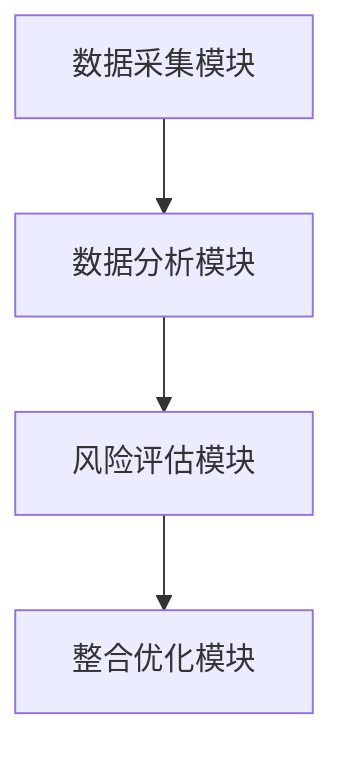
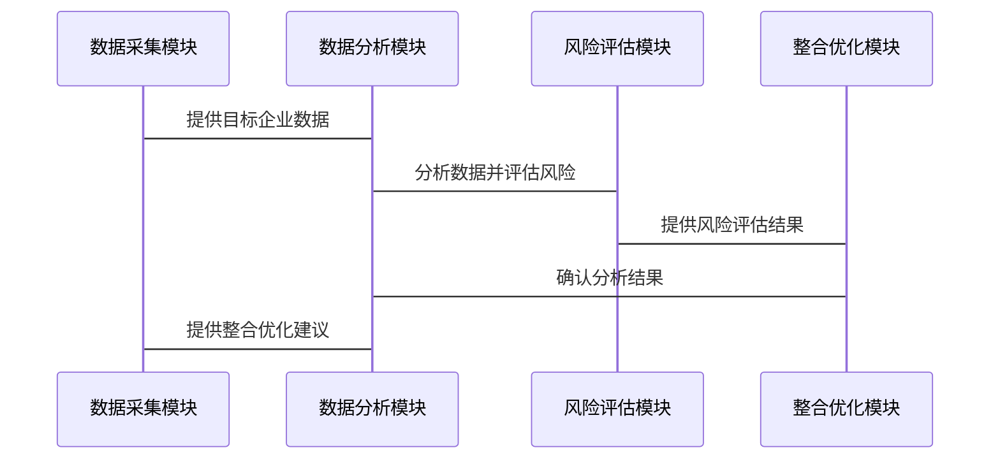

                 


# 巴菲特的并购艺术：量子科技生态系统的整合策略

## 关键词：巴菲特，并购艺术，量子科技，生态系统，整合策略

## 摘要：本文深入分析了巴菲特的并购理念，结合量子科技生态系统的特点，探讨了如何将量子科技应用于企业并购，构建高效的整合策略。通过具体案例和系统设计，展示了量子科技如何提升并购效率和成功率。

---

# 第1章: 巴菲特并购理念概述

## 1.1 巴菲特的投资哲学

### 1.1.1 巴菲特的价值投资理念

巴菲特的价值投资理念以“寻找具有持续竞争优势的企业”为核心，强调长期稳健的投资策略。他注重企业的基本面分析，包括财务状况、盈利能力、管理团队等。这种理念在并购中表现为寻找具有强大竞争优势的企业进行投资，确保长期稳定的回报。

### 1.1.2 巴菲特并购的核心原则

- **安全边际原则**：确保并购价格低于企业的内在价值，降低投资风险。
- **集中投资原则**：专注于少数具有竞争优势的行业和企业，提高投资效率。
- **长期持有原则**：避免短期波动，长期持有优质企业，实现资本增值。

### 1.1.3 巴菲特并购的成功案例分析

以可口可乐和富国银行为例，巴菲特通过长期持有和价值投资策略，实现了资本的持续增值。这些案例展示了巴菲特并购策略的有效性和可持续性。

## 1.2 量子科技生态系统的概念

### 1.2.1 量子科技的基本概念

量子科技包括量子计算、量子通信和量子测量，利用量子力学原理实现信息处理和传输。这些技术具有并行计算能力强、安全性高等特点，为企业的信息处理和数据分析提供了新的可能性。

### 1.2.2 量子科技生态系统的特点

量子科技生态系统由量子计算、量子通信、量子测量等多个部分组成，具有高度整合性和协同效应。这种生态系统能够通过各部分的协同工作，提升企业的信息处理和决策能力。

### 1.2.3 量子科技与企业并购的结合

量子科技的应用可以提升并购中的信息处理效率，优化企业整合流程。例如，利用量子计算进行大数据分析，帮助企业更准确地评估目标企业价值，降低并购风险。

## 1.3 本书的核心主题

### 1.3.1 巴菲特并购艺术与量子科技的结合

通过将巴菲特的并购理念与量子科技相结合，提升并购的准确性和效率，实现资本的最优配置。

### 1.3.2 量子科技生态系统整合的策略

探讨如何在量子科技生态系统中，构建高效的整合策略，实现资源的优化配置和协同效应。

### 1.3.3 本书的结构与目标

本书旨在通过理论分析和案例研究，展示巴菲特并购艺术与量子科技的结合，为企业并购提供新的思路和方法。

---

# 第2章: 并购的基本理论与方法

## 2.1 并购的基本概念

### 2.1.1 并购的定义与分类

并购是指企业之间通过合并、收购等方式进行资源整合的行为。根据方式的不同，可分为杠杆并购、股权并购等。

### 2.1.2 并购的动机与目标

企业进行并购的动机包括扩大规模、获取技术优势、进入新市场等。目标是通过整合资源，提升企业的竞争力和盈利能力。

### 2.1.3 并购的类型与流程

并购类型包括横向并购、纵向并购和混合并购。流程通常包括目标筛选、尽职调查、估值定价等步骤。

## 2.2 并购的估值方法

### 2.2.1 市场价值法

基于市场可比交易数据，评估目标企业的价值。这种方法适用于市场数据充足的情况。

### 2.2.2 财务价值法

通过分析企业的财务报表，评估其内在价值。常用的方法包括DCF模型和市盈率法。

### 2.2.3 股权价值法

通过评估企业的股权价值，确定合理的并购价格。这种方法适用于企业财务状况较为稳定的情况。

## 2.3 并购的风险分析

### 2.3.1 并购的主要风险

包括市场风险、整合风险、财务风险等。市场风险指并购后市场环境变化带来的影响；整合风险指资源整合不顺利导致的损失；财务风险指并购过程中财务杠杆过高带来的偿债压力。

### 2.3.2 风险评估方法

通过定量分析和定性分析相结合的方式，评估并购中的各种风险。常用的方法包括VaR模型和情景分析法。

### 2.3.3 风险控制策略

包括制定合理的并购计划、建立风险预警机制、加强整合管理等措施，有效控制并购中的各种风险。

---

# 第3章: 量子科技生态系统的整合策略

## 3.1 量子科技与企业并购的结合

### 3.1.1 量子计算在并购中的应用

量子计算具有并行计算能力强的特点，可以快速处理大量数据，帮助企业在并购中更准确地评估目标企业的价值。

### 3.1.2 量子通信在并购中的应用

量子通信具有安全性高的特点，可以确保并购过程中敏感信息的安全传输，降低信息泄露风险。

### 3.1.3 量子测量在并购中的应用

量子测量技术可以提高数据采集的精度，帮助企业在并购中更准确地评估目标企业的实际情况。

## 3.2 量子科技生态系统的特点

### 3.2.1 量子科技生态系统的构成

包括量子计算、量子通信、量子测量等核心部分，以及相关技术和服务提供商。

### 3.2.2 量子科技生态系统的整合

通过整合各部分的技术优势，构建一个高效协同的生态系统，提升企业的整体竞争力。

### 3.2.3 量子科技生态系统的优势

包括技术先进、安全性高、整合能力强等，能够为企业并购提供强有力的技术支持。

## 3.3 量子科技生态系统整合的策略

### 3.3.1 量子科技生态系统的战略规划

制定清晰的战略规划，明确整合的目标和路径，确保整合的顺利进行。

### 3.3.2 量子科技生态系统的资源整合

通过资源整合，优化资源配置，提升整合效率和效果。

### 3.3.3 量子科技生态系统的优势发挥

充分发挥各部分的技术优势，提升企业的整体竞争力。

---

# 第4章: 巴菲特并购艺术的量子科技应用

## 4.1 巴菲特并购艺术的核心要素

### 4.1.1 巴菲特并购的艺术

巴菲特定向于具有持续竞争优势的企业，注重长期稳健的投资策略，通过合理估值和风险控制，实现资本的最优配置。

### 4.1.2 巴菲特并购的艺术在量子科技中的应用

通过量子科技的应用，巴菲特可以更准确地评估目标企业的价值，优化并购决策，降低风险。

### 4.1.3 巴菲特并购的艺术的未来趋势

随着量子科技的不断发展，其在并购中的应用将更加广泛和深入，为企业并购提供更多的可能性。

## 4.2 量子科技在并购中的具体应用

### 4.2.1 量子计算在并购中的应用

利用量子计算的大数据分析能力，帮助企业在并购中更准确地评估目标企业的价值。

### 4.2.2 量子通信在并购中的应用

通过量子通信技术，确保并购过程中信息的安全传输，降低信息泄露风险。

### 4.2.3 量子测量在并购中的应用

利用量子测量技术，提高数据采集的精度，帮助企业在并购中更准确地评估目标企业的实际情况。

## 4.3 量子科技在并购中的优势

### 4.3.1 量子计算的优势

并行计算能力强，能够快速处理大量数据，提高并购决策的效率和准确性。

### 4.3.2 量子通信的优势

安全性高，能够确保并购过程中敏感信息的安全传输，降低信息泄露风险。

### 4.3.3 量子测量的优势

数据采集精度高，能够帮助企业更准确地评估目标企业的实际情况。

---

# 第5章: 并购的系统分析与架构设计

## 5.1 系统分析

### 5.1.1 问题场景介绍

在企业并购过程中，常常面临数据量大、信息复杂、风险高等问题，传统的并购方法难以应对这些挑战。

### 5.1.2 项目介绍

通过引入量子科技，构建一个高效协同的生态系统，优化企业并购的过程和效果。

## 5.2 系统架构设计

### 5.2.1 系统功能设计

- 数据采集模块：负责采集目标企业的各项数据。
- 数据分析模块：利用量子计算技术对数据进行分析，评估目标企业的价值。
- 风险评估模块：通过量子通信技术确保信息的安全传输，评估并购中的各种风险。
- 整合优化模块：根据分析结果，制定整合策略，优化资源配置。

### 5.2.2 系统架构图

使用Mermaid绘制系统架构图，展示各模块之间的关系和功能。



### 5.2.3 系统接口设计

- 数据采集模块接口：定义数据采集的标准格式和接口协议。
- 数据分析模块接口：定义数据分析的算法和接口。
- 风险评估模块接口：定义风险评估的指标和接口。
- 整合优化模块接口：定义整合策略的输出格式和接口。

### 5.2.4 系统交互序列图

使用Mermaid绘制系统交互序列图，展示系统各模块之间的交互过程。



---

# 项目实战

## 5.3.1 环境安装

安装量子计算平台、量子通信设备和量子测量装置，搭建一个完整的量子科技生态系统。

## 5.3.2 核心实现

实现量子计算的数据分析功能、量子通信的信息传输功能和量子测量的数据采集功能，确保系统的高效运行。

## 5.3.3 代码实现

以下是量子计算模块的核心代码示例：

```python
import quantum_computation

def quantum_analysis(data):
    # 使用量子计算技术对数据进行分析
    result = quantum_computation.analyze(data)
    return result

# 示例数据
data = [1, 2, 3, 4, 5]
print(quantum_analysis(data))
```

## 5.3.4 应用解读

通过量子计算模块，可以快速分析目标企业的数据，评估其价值和风险，为并购决策提供有力支持。

## 5.3.5 实际案例分析

以某科技公司为例，展示如何利用量子科技生态系统进行并购分析和决策。

---

# 最佳实践 tips

- 在并购过程中，充分利用量子科技的优势，提升数据分析和风险评估的效率。
- 注重系统的整体架构设计，确保各模块协同工作，发挥最大效能。
- 定期进行系统优化和更新，保持系统的先进性和适应性。

---

# 小结

通过将巴菲特的并购艺术与量子科技生态系统相结合，企业可以实现更高效、更准确的并购决策，提升整体竞争力。量子科技的应用不仅优化了并购过程，还为企业带来了更多的机遇和可能性。

---

# 注意事项

- 量子科技的应用需要高度专业的技术支持，企业应选择可靠的合作伙伴。
- 并购过程中需要注意法律法规的合规性，确保并购的合法性。
- 系统的安全性和稳定性是确保并购成功的关键，应加强系统维护和管理。

---

# 拓展阅读

- 《巴菲特传》：了解巴菲特的投资哲学和成功经验。
- 《量子科技入门》：掌握量子科技的基本概念和技术。
- 《企业并购实务》：学习企业并购的实务操作和案例分析。

---

作者：AI天才研究院/AI Genius Institute & 禅与计算机程序设计艺术 /Zen And The Art of Computer Programming

