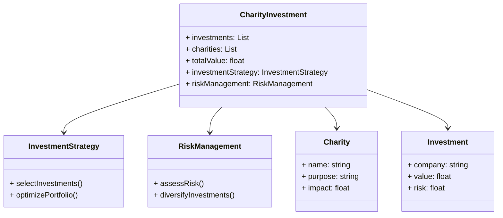
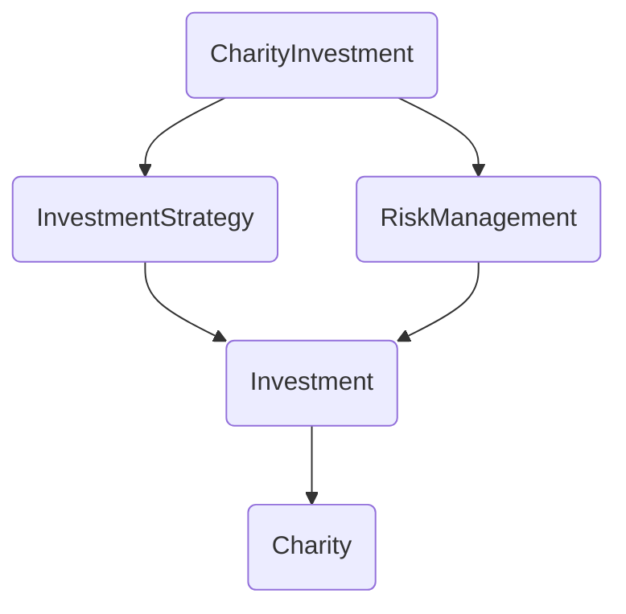
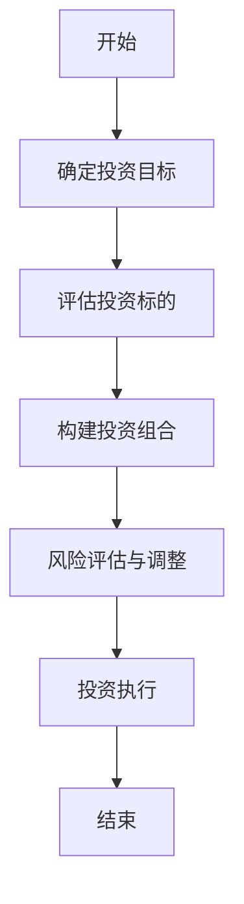

                 


# 巴菲特的慈善投资理念：财富的社会责任

## 关键词：
巴菲特、慈善投资、财富管理、社会责任、价值投资、长期投资

## 摘要：
本文深入探讨了巴菲特的慈善投资理念，分析了其如何将价值投资原则应用于慈善领域，强调财富的社会责任。文章从背景介绍、核心概念、策略分析到实际案例，全面解析了巴菲特的慈善投资模式，并总结了其对个人和社会的深远影响。

---

# 第一部分: 巴菲特的慈善投资理念概述

## 第1章: 巴菲特的慈善投资理念背景

### 1.1 巴菲特的生平与投资哲学
#### 1.1.1 巴菲特的早年经历与投资起步
沃伦·巴菲特（Warren Buffett）1934年出生于美国堪萨斯州，早年展现出对投资的浓厚兴趣。他在青少年时期开始研究股票市场，通过阅读《格雷厄姆证券分析》一书，确立了价值投资的基本理念。巴菲特的投资哲学强调长期、价值导向，而非短期市场波动。

#### 1.1.2 巴菲特的价值投资理念
巴菲特的核心投资理念来源于本杰明·格雷厄姆的价值投资理论，即寻找那些具有安全边际、低估的股票进行长期投资。他认为市场短期可能波动，但长期会反映其内在价值。这种理念不仅适用于个人投资，也延伸到了他的慈善事业中。

#### 1.1.3 巴菲特的慈善理念形成
巴菲特的慈善理念根植于他的价值观：财富不仅是个人成就的象征，更是一种社会责任。他认为，通过有效的投资和慈善，可以将财富转化为社会价值，帮助更多人改善生活。

---

## 第2章: 巴菲特慈善投资理念的核心问题

### 2.1 问题背景与问题描述
#### 2.1.1 财富分配的不均性
美国社会财富分配的不平等现象日益严重，如何通过财富管理实现公平分配，成为巴菲特关注的核心问题之一。

#### 2.1.2 慈善投资的效率问题
传统慈善往往关注短期救助，缺乏长期规划和投资回报。巴菲特希望通过长期投资的方式，实现慈善资源的高效利用。

### 2.2 问题解决的思路与方法
#### 2.2.1 投资与慈善的结合
通过将慈善资金投资于具有长期增长潜力的企业，确保慈善资金的可持续性，同时创造社会价值。

#### 2.2.2 长期投资与价值创造
将慈善投资视为长期事业，选择具有稳定增长潜力的企业，确保资金的保值增值。

---

## 第3章: 巴菲特慈善投资理念的核心要素

### 3.1 核心概念的原理与特征
#### 3.1.1 价值投资的原理
价值投资的核心在于寻找市场价格低于内在价值的股票。巴菲特通过深入分析企业的财务状况、管理层能力和行业地位，选择具有长期增长潜力的企业。

#### 3.1.2 慈善投资的特征
慈善投资强调社会价值的创造，注重资金的长期可持续性，而非单纯的短期救助。

### 3.2 核心概念的对比分析
#### 3.2.1 财富积累与社会责任的对比
财富积累关注个人利益，而社会责任强调社会整体的福祉。巴菲特认为，真正的财富在于如何运用这些财富创造社会价值。

#### 3.2.2 慈善投资与传统投资的对比
慈善投资注重社会影响力，而传统投资更关注财务回报。两者并非对立，而是可以结合，实现双赢。

---

## 第4章: 巴菲特慈善投资理念的系统分析与架构设计

### 4.1 系统分析
#### 4.1.1 问题场景介绍
巴菲特的慈善投资系统需要解决如何高效分配和管理慈善资金，同时确保投资的可持续性和社会影响力。

### 4.2 项目介绍
#### 4.2.1 项目目标
实现慈善资金的长期增值，支持社会公益事业，推动社会公平与进步。

### 4.3 系统功能设计
#### 4.3.1 领域模型类图


### 4.4 系统架构设计
#### 4.4.1 系统架构图


### 4.5 系统接口设计
#### 4.5.1 主要接口
- `selectInvestments()`: 选择具有长期增长潜力的投资标的。
- `assessRisk()`: 评估投资风险，确保资金安全。
- `optimizePortfolio()`: 优化投资组合，平衡风险与收益。

---

## 第5章: 巴菲特慈善投资理念的算法原理

### 5.1 算法流程图


### 5.2 投资组合优化的数学模型
#### 5.2.1 最优化目标
最大化投资组合的预期回报：
$$ \max \sum_{i=1}^{n} w_i r_i $$

#### 5.2.2 约束条件
$$ \sum_{i=1}^{n} w_i = 1, w_i \geq 0 $$

### 5.3 风险管理的数学模型
#### 5.3.1 风险度量
$$ \text{风险度量: } \sigma = \sqrt{\sum_{i=1}^{n} w_i^2 \sigma_i^2} $$

---

## 第6章: 巴菲特慈善投资理念的项目实战

### 6.1 环境安装
#### 6.1.1 系统环境
需要安装Python、Pandas、Matplotlib等工具。

### 6.2 核心实现源代码
```python
def calculate_portfolio_return(weights, returns):
    return np.sum(weights * returns)

def calculate_portfolio_risk(weights, returns, cov_matrix):
    portfolio_variance = np.dot(weights.T, np.dot(cov_matrix, weights))
    return np.sqrt(portfolio_variance)

def optimize_portfolio(weights, returns, cov_matrix):
    return calculate_portfolio_return(weights, returns), calculate_portfolio_risk(weights, returns, cov_matrix)
```

### 6.3 案例分析
#### 6.3.1 投资组合优化
选择5只股票，计算最优权重，实现最大回报和最小风险。

### 6.4 结果分析
通过优化算法，找到最优投资组合，确保慈善资金的长期增长。

---

## 第7章: 巴菲特慈善投资理念的最佳实践与总结

### 7.1 最佳实践
#### 7.1.1 长期投资
坚持长期价值投资，避免短期波动。

#### 7.1.2 风险管理
通过分散投资和风险评估，确保资金安全。

### 7.2 总结
巴菲特的慈善投资理念将价值投资与社会责任相结合，为财富管理提供了新的思路。通过长期投资和价值创造，实现财富的可持续增长，推动社会进步。

### 7.3 注意事项
投资者需根据自身情况调整策略，确保投资与慈善目标一致。

### 7.4 拓展阅读
推荐阅读《巴菲特的智慧》和《价值投资入门》等书籍，深入了解巴菲特的投资理念。

---

## 作者：AI天才研究院 & 禅与计算机程序设计艺术

通过本文的分析，我们可以看到，巴菲特的慈善投资理念不仅是对财富的合理运用，更是对社会责任的深刻践行。这种理念不仅适用于个人财富管理，也为社会的可持续发展提供了重要启示。

