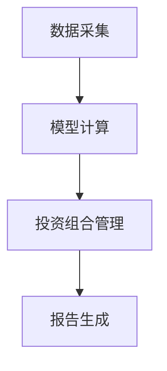
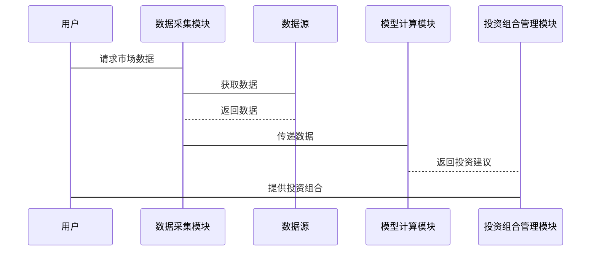

                 


# 巴菲特的慈善投资策略

> 关键词：巴菲特，慈善投资，价值投资，安全边际，投资策略

> 摘要：本文详细分析了巴菲特的慈善投资策略，从其投资理念、数学模型、系统架构到实际项目案例，全面解读如何将价值投资应用于慈善事业，为读者提供深度的分析和实践指导。

---

## 第一章 巴菲特的生平与投资理念

### 1.1 巴菲特的生平简介

#### 1.1.1 早年经历
沃伦·巴菲特（Warren Buffett）1934年出生于美国堪萨斯州，早年展现出非凡的商业头脑，12岁时开始投资股票。

#### 1.1.2 投资哲学
巴菲特的价值投资理念强调安全边际和长期持有。他相信市场短期波动不可预测，但长期趋势可通过基本面分析确定。

#### 1.1.3 慈善理念
巴菲特致力于通过慈善事业回馈社会，强调慈善应基于理性投资，确保资金保值增值，用于解决社会问题。

### 1.2 投资理念的核心要素

#### 1.2.1 价值投资的定义
价值投资寻找市场价格低于内在价值的股票，长期持有优质资产，等待市场重新评估其价值。

#### 1.2.2 股票投资原则
- **安全边际**：买入价格低于内在价值，确保投资的安全性。
- **长期持有**：避免频繁交易，减少成本，利用复利效应。
- **分散投资**：集中投资于少数优质企业，避免过度分散。

#### 1.2.3 慈善投资原则
- **理性选择**：慈善投资应基于稳健的投资策略，确保资金可持续。
- **长期视角**：通过长期投资实现资金增长，支持慈善事业。
- **专注优质**：选择具有持续竞争优势的企业进行投资。

---

## 第二章 慈善投资策略的理论基础

### 2.1 价值投资的理论基础

#### 2.1.1 股票估值的核心理论
股票的内在价值由其未来现金流的现值决定。巴菲特定义了“安全边际”，即市场价格与内在价值的差距，确保投资的安全性。

$$内在价值 = \sum_{t=1}^{\infty} \frac{CF_t}{(1 + r)^t}$$

其中，CF_t为第t年的现金流，r为折现率。

#### 2.1.2 安全边际的重要性
通过安全边际，巴菲特确保在市场价格下跌时，内在价值仍能维持投资的本金安全。

$$安全边际 = 内在价值 - 市场价格$$

#### 2.1.3 股票选择标准
巴菲特注重企业的财务健康、竞争优势和管理团队。他偏好具有强大护城河、稳定收益和良好管理的企业。

### 2.2 巴菲特慈善投资模型

#### 2.2.1 模型框架
巴菲特的慈善投资模型将价值投资与慈善目标结合，确保资金的保值与增值。

$$模型框架：慈善投资 = 价值投资策略 \times 社会目标$$

#### 2.2.2 模型实现步骤
1. 确定慈善目标：明确慈善资金的用途和目标。
2. 选择投资标的：筛选符合价值投资标准的企业。
3. 构建投资组合：分散投资，降低风险。
4. 定期评估：根据市场变化调整投资组合。

#### 2.2.3 模型优化建议
- 定期审视投资组合，确保符合慈善目标。
- 选择具有社会责任感的企业，兼顾经济和道德因素。

---

## 第三章 慈善投资策略的数学模型与算法

### 3.1 股票估值的数学模型

#### 3.1.1 基本公式
股票的内在价值通过未来现金流的现值计算得出。

$$内在价值 = \frac{CF_1}{r - g}$$

其中，CF_1为第一年的现金流，r为折现率，g为增长率。

#### 3.1.2 安全边际计算
$$安全边际 = 内在价值 - 市场价格$$

#### 3.1.3 市场波动预测
利用历史数据分析市场波动，预测未来波动范围，调整投资策略。

### 3.2 巴菲特慈善投资算法实现

#### 3.2.1 算法原理
基于价值投资，算法首先筛选具有安全边际的股票，构建投资组合，定期再平衡。

#### 3.2.2 算法伪代码
```python
def buffett_invest_strategy(target_portfolio, market_data):
    # 筛选具有安全边际的股票
    undervalued_stocks = []
    for stock in market_data:
        calculate_intrinsic_value(stock)
        if stock_price < intrinsic_value:
            undervalued_stocks.append(stock)
    # 分散投资，构建组合
    portfolio = allocate_assets(undervalued_stocks, target_portfolio)
    # 定期再平衡
    rebalance_portfolio(portfolio, market_data)
    return portfolio
```

#### 3.2.3 优化与改进
引入风险管理模块，考虑市场变化和企业基本面变化，动态调整投资组合。

---

## 第四章 慈善投资策略的系统分析与架构设计

### 4.1 系统分析

#### 4.1.1 问题场景
慈善资金需要稳健增长，同时支持社会项目。投资决策需基于实时数据和模型分析。

#### 4.1.2 系统功能需求
- 数据采集：获取实时市场数据。
- 模型计算：计算股票内在价值和安全边际。
- 投资组合管理：构建和调整投资组合。
- 报告生成：提供投资表现和财务报告。

#### 4.1.3 系统性能指标
- 响应时间：数据处理需快速。
- 稳定性：确保系统持续运行。
- 可扩展性：支持大量数据处理。

### 4.2 系统架构设计

#### 4.2.1 模块划分
- 数据采集模块：收集市场数据。
- 模型计算模块：计算股票估值。
- 投资组合管理模块：构建和调整组合。
- 报告生成模块：生成投资报告。

#### 4.2.2 系统架构图


#### 4.2.3 接口设计
- 数据接口：与数据源对接，获取市场数据。
- API接口：供其他系统调用投资组合数据。

### 4.3 系统交互设计

#### 4.3.1 交互流程图


#### 4.3.2 用户角色与权限
- 管理员：管理用户权限，监控系统运行。
- 投资者：查看投资组合，调整策略。
- 开发者：维护系统，更新算法。

---

## 第五章 慈善投资策略的项目实战

### 5.1 项目环境安装

#### 5.1.1 开发环境
- 操作系统：Linux/Windows/MacOS
- 开发工具：Python，Jupyter Notebook，Git

#### 5.1.2 依赖库安装
使用pip安装以下库：
```bash
pip install pandas numpy matplotlib
```

#### 5.1.3 项目初始化
创建项目文件夹，初始化Git仓库，设置开发环境。

### 5.2 系统核心实现

#### 5.2.1 核心算法实现
```python
import pandas as pd
import numpy as np

def calculate_intrinsic_value(financial_data):
    CF = financial_data['现金流']
    r = financial_data['折现率']
    g = financial_data['增长率']
    return CF / (r - g)
```

#### 5.2.2 系统功能模块开发
- 数据采集模块：从Yahoo Finance获取数据。
- 模型计算模块：计算内在价值和安全边际。
- 投资组合管理模块：构建投资组合，定期再平衡。

#### 5.2.3 系统测试与调试
进行单元测试，确保各模块功能正常，系统稳定运行。

### 5.3 项目案例分析

#### 5.3.1 案例介绍
假设某慈善机构有100万美元可用于投资，目标是支持教育项目。我们使用巴菲特的策略选择投资标的。

#### 5.3.2 案例分析
1. 数据采集：获取目标企业的财务数据。
2. 计算内在价值和安全边际。
3. 构建投资组合，分散投资于多个优质企业。
4. 定期评估，根据市场变化调整投资组合。

#### 5.3.3 案例总结
通过巴菲特的慈善投资策略，资金实现稳健增长，同时支持了教育项目，达到了慈善目标。

---

## 第六章 最佳实践与小结

### 6.1 最佳实践 tips

#### 6.1.1 投资策略优化
- 定期审视投资组合，确保符合慈善目标。
- 考虑经济周期，调整投资策略。

#### 6.1.2 风险管理
- 设置止损点，避免重大损失。
- 分散投资，降低风险敞口。

#### 6.1.3 道德考量
- 选择具有社会责任感的企业，投资兼顾经济和社会效益。

### 6.2 小结与展望

本文详细探讨了巴菲特的慈善投资策略，从理论到实践，为读者提供了系统的指导。未来，随着技术进步，慈善投资将更加智能化，结合AI和大数据，进一步优化投资决策。

---

作者：AI天才研究院 & 禅与计算机程序设计艺术

