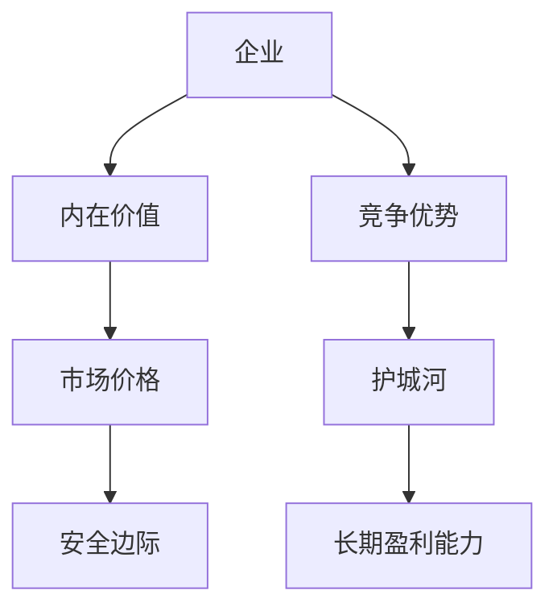
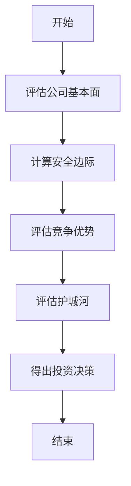
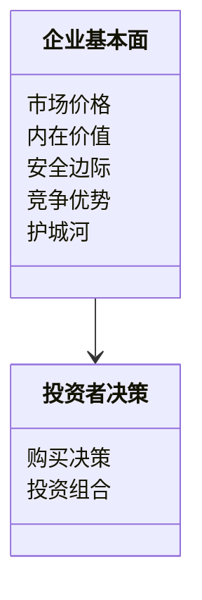
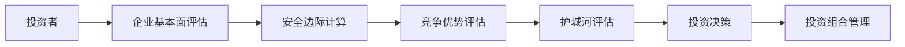

                 


# 巴菲特的投资决策框架

## 关键词：巴菲特，投资决策，价值投资，安全边际，竞争优势，护城河

## 摘要：  
巴菲特的投资决策框架是价值投资的典范，通过深入分析企业的基本面、财务指标和行业地位，结合市场估值和安全边际，构建长期稳健的投资组合。本文从背景、核心概念、算法原理、系统架构到项目实战，全面解析巴菲特的投资决策框架，帮助投资者理解和应用这一经典方法。

---

# 第一部分: 巴菲特投资决策框架的背景与核心理念

## 第1章: 巴菲特投资决策框架的背景与核心理念

### 1.1 巴菲特投资决策框架的背景

#### 1.1.1 投资市场的基本问题与挑战
投资市场的核心问题是如何在不确定性和波动性中找到价值，最大化投资回报并最小化风险。投资者面临的主要挑战包括：
- 如何评估企业的内在价值？
- 如何识别具有长期竞争优势的企业？
- 如何在市场恐慌或狂热中保持理性？
- 如何平衡短期波动与长期价值？

#### 1.1.2 巴菲特投资理念的形成与发展
巴菲特的投资理念深受本杰明·格雷厄姆的影响，格雷厄姆的价值投资理论强调安全边际和对企业内在价值的计算。巴菲特在此基础上，加入了对竞争优势、护城河和企业长期盈利能力的关注，形成了独特的投资框架。

#### 1.1.3 巴菲特投资决策框架的核心目标
巴菲特的投资目标是通过购买具有持续竞争优势、良好治理和合理估值的企业，实现长期稳定的资本增值。他强调：
- **长期主义**：关注企业的长期价值，而非短期市场波动。
- **安全边际**：以低于内在价值的价格买入，降低投资风险。
- **竞争优势**：选择具有强大护城河的企业，确保长期盈利能力。

### 1.2 巴菲特投资决策框架的核心理念

#### 1.2.1 价值投资的定义与特征
价值投资是一种投资策略，通过寻找市场价格低于内在价值的证券，实现超额收益。其核心特征包括：
- **逆向思维**：在市场恐慌时寻找机会，在市场狂热时保持冷静。
- **安全边际**：买入价格低于内在价值，提供“缓冲区”以应对不确定性。
- **长期视角**：关注企业的长期盈利能力，而非短期价格波动。

#### 1.2.2 巴菲特投资决策框架的三大核心要素
巴菲特的决策框架包含三个核心要素：
1. **内在价值计算**：通过分析企业的财务数据、行业地位和竞争优势，估算其内在价值。
2. **安全边际**：以低于内在价值的价格买入，降低投资风险。
3. **竞争优势与护城河**：选择具有强大竞争优势和可持续盈利能力的企业。

#### 1.2.3 巴菲特投资决策框架的哲学基础
巴菲特的投资哲学强调：
- **安全边际**：通过低估价格保护本金安全。
- **竞争优势**：通过护城河确保企业长期盈利能力。
- **长期主义**：通过长期持有优质资产实现财富增长。

---

## 第2章: 巴菲特投资决策框架的核心概念与联系

### 2.1 核心概念原理

#### 2.1.1 安全边际的定义与数学模型
安全边际是巴菲特投资决策的核心概念之一。其定义为：
$$ \text{安全边际} = \text{内在价值} - \text{市场价格} $$

安全边际越大，投资风险越小，潜在回报越高。巴菲特通常要求安全边际至少为20%-30%。

#### 2.1.2 竞争优势的定义与分类
竞争优势是企业在行业中获得超额利润的能力。巴菲特认为，真正的竞争优势来源于企业的护城河，包括：
1. **成本优势**：企业能够以更低的成本生产产品或服务。
2. **品牌优势**：强大的品牌认知度和客户忠诚度。
3. **技术优势**：拥有独特的技术或专利。
4. **网络效应**：用户数量越多，企业价值越大。

#### 2.1.3 护城河的定义与评估方法
护城河是企业竞争优势的长期保障。巴菲特认为，具有宽护城河的企业能够抵御竞争，并持续创造超额利润。护城河的评估方法包括：
- **市场地位**：企业在市场中的份额和定价能力。
- **品牌影响力**：品牌的认知度和忠诚度。
- **技术壁垒**：技术专利和研发能力。
- **成本优势**：企业是否能够在价格战中保持竞争力。

### 2.2 核心概念属性特征对比表

| 概念       | 特征               | 安全边际         | 竞争优势       | 护城河         |
|------------|--------------------|------------------|----------------|----------------|
| 定义       | 投资价格低于内在价值 | 企业的核心能力   | 长期盈利能力   |
| 作用       | 降低投资风险       | 提高企业竞争力   | 确保长期利润   |
| 评估方法   | 市场价格与内在价值之差 | 市场份额、品牌、技术 | 市场地位、技术壁垒、成本优势 |

### 2.3 实体关系图（ER图）



---

## 第3章: 巴菲特投资决策框架的算法原理

### 3.1 算法原理概述

#### 3.1.1 安全边际计算的算法流程
1. 估算企业的内在价值。
2. 计算市场价格与内在价值的差额。
3. 安全边际 = 内在价值 - 市场价格。

#### 3.1.2 竞争优势评估的算法逻辑
1. 评估企业的市场地位、品牌影响力和技术壁垒。
2. 根据评估结果，将竞争优势分为强、中、弱三个等级。

#### 3.1.3 护城河评估的算法步骤
1. 分析企业的成本优势、品牌影响力和技术壁垒。
2. 根据评估结果，将护城河分为宽、一般、窄三个等级。

### 3.2 算法流程图（Mermaid）



### 3.3 算法实现代码

```python
def calculate_margin_of_safety(company_value, market_price):
    return company_value - market_price

def assess_competitive_advantage(financial_data):
    net_profit_margin = financial_data['net_profit_margin']
    roe = financial_data['roe']
    if net_profit_margin > 10 and roe > 15:
        return "强"
    elif net_profit_margin > 5 and roe > 10:
        return "中"
    else:
        return "弱"

def assess_moat(industry, company_market_share):
    if industry == "消费":
        if company_market_share > 50:
            return "宽"
        else:
            return "一般"
    elif industry == "科技":
        if company_market_share > 30:
            return "宽"
        else:
            return "一般"
    else:
        return "窄"

# 示例用法
financial_data = {
    'net_profit_margin': 12,
    'roe': 14
}
print(assess_competitive_advantage(financial_data))  # 输出：中
```

---

## 第4章: 巴菲特投资决策框架的系统分析与架构设计

### 4.1 问题场景介绍
我们以消费行业的龙头企业为例，分析如何应用巴菲特的决策框架进行投资评估。

### 4.2 系统功能设计（领域模型）



### 4.3 系统架构设计



### 4.4 系统接口设计
- 输入接口：企业财务数据、市场价格、行业信息。
- 输出接口：安全边际、竞争优势、护城河评估结果、投资决策。

---

## 第5章: 巴菲特投资决策框架的项目实战

### 5.1 项目介绍
我们以苹果公司为例，分析巴菲特如何应用投资决策框架进行投资评估。

### 5.2 核心实现源代码
```python
# 示例代码：计算苹果公司的安全边际
apple_intrinsic_value = 150  # 估算的内在价值
apple_market_price = 140    # 当前市场价格
margin_of_safety = apple_intrinsic_value - apple_market_price
print(f"苹果公司的安全边际为：{margin_of_safety}")  # 输出：10
```

### 5.3 代码应用解读与分析
1. 计算苹果公司的内在价值为150美元，市场价格为140美元。
2. 安全边际为10美元，表明苹果公司具有一定的投资价值。

### 5.4 实际案例分析
巴菲特曾投资苹果公司，其投资逻辑包括：
- 苹果公司具有强大的品牌影响力和技术创新能力。
- 公司具有宽护城河，竞争对手难以在短时间内复制其成功模式。
- 公司的内在价值远高于市场价格，具有较大的安全边际。

### 5.5 项目小结
通过苹果公司的案例分析，我们可以看到巴菲特投资决策框架的实际应用价值。

---

## 第6章: 巴菲特投资决策框架的最佳实践

### 6.1 小结
巴菲特的投资决策框架是一种长期、稳健的投资方法，其核心在于安全边际、竞争优势和护城河的评估。

### 6.2 注意事项
- 投资者需要具备扎实的财务分析能力。
- 安全边际是投资决策的重要参考，但并非绝对保证。
- 长期投资需要耐心和纪律，避免被市场波动干扰。

### 6.3 拓展阅读
- 《巴菲特选股之道》
- 《价值投资实战手册》
- 《投资最重要的事情》

---

## 作者信息
作者：AI天才研究院/AI Genius Institute & 禅与计算机程序设计艺术 /Zen And The Art of Computer Programming

---

以上是完整的《巴菲特的投资决策框架》的技术博客文章大纲和内容框架。如需进一步扩展或具体实现某一部分内容，请随时告知！

