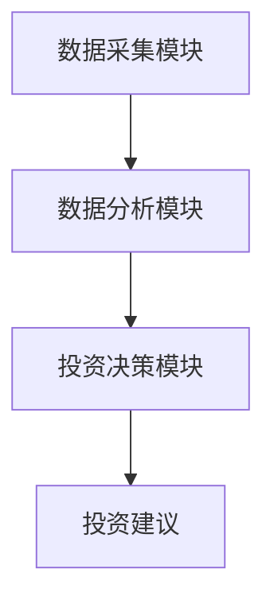

                 

# 巴菲特的投资哲学：在市场恐慌时贪婪

> 关键词：巴菲特，价值投资，市场情绪，恐慌与贪婪，投资策略，数学模型，系统架构

> 摘要：本文深入探讨了巴菲特的投资哲学，特别是他在市场恐慌时采取的贪婪策略。通过分析其核心理念、数学模型和系统架构，结合实际案例，展示了如何在市场波动中运用这些策略实现长期收益。

---

## 第一部分: 巴菲特的投资哲学概述

### 第1章: 巴菲特投资哲学的起源与核心理念

#### 1.1 巴菲特的生平与投资历程

##### 1.1.1 巴菲特的早年经历
沃伦·巴菲特，1934年出生于美国内布拉斯州奥马哈市。他从小就展现出了对数字和投资的浓厚兴趣。12岁时，他开始阅读本杰明·格雷厄姆的著作，并在父亲的影响下，开始在本地的股票交易所学习投资知识。

##### 1.1.2 巴菲特的合伙人制度
20世纪50年代，巴菲特建立了自己的合伙公司，开始实践价值投资。他通过购买低估的股票，并长期持有，取得了卓越的投资业绩。

##### 1.1.3 巴菲特的投资理念形成
巴菲特的理念深受格雷厄姆的影响，但后来发展出自己的独特风格。他强调寻找具有强大竞争优势的公司，关注其内在价值，并在市场恐慌时买入。

#### 1.2 巴菲特投资哲学的核心理念

##### 1.2.1 价值投资的定义
价值投资是指以低于内在价值的价格买入优质股票，并长期持有，等待其价值回归的过程。

##### 1.2.2 巴菲特的“护城河”理论
巴菲特认为，企业必须具备强大的竞争优势，即“护城河”，才能长期保持高盈利能力。护城河可以是专利、品牌、成本优势或网络效应等。

##### 1.2.3 巴菲特的长期投资策略
巴菲特主张长期投资，避免频繁交易。他认为市场短期波动难以预测，但长期趋势可以通过分析企业的基本面来把握。

#### 1.3 巴菲特投资哲学的现代意义

##### 1.3.1 价值投资与现代金融市场的结合
尽管金融市场日益复杂，但价值投资的基本原则仍然适用。巴菲特的成功证明了长期持有优质股票的有效性。

##### 1.3.2 巴菲特哲学对个人投资者的启示
个人投资者应专注于寻找具有强大基本面的公司，避免受市场情绪的影响，保持理性决策。

##### 1.3.3 巴菲特哲学对机构投资者的影响
机构投资者可以借鉴巴菲特的方法，通过分析企业的财务状况和行业地位，选择具有长期增长潜力的公司。

---

## 第2章: 市场恐慌与贪婪周期

### 2.1 市场情绪的波动性

#### 2.1.1 市场情绪的周期性
市场情绪具有周期性，通常从贪婪到恐慌，再从恐慌到贪婪，形成一个循环。巴菲特定义了市场周期的四个阶段：牛市、熊市、恐慌和复苏。

#### 2.1.2 市场恐慌与贪婪的定义
市场恐慌是指投资者因担心市场下跌而大量抛售资产的行为。市场贪婪则指投资者因预期市场上涨而大量买入资产的行为。

#### 2.1.3 市场情绪与资产价格的关系
市场情绪直接影响资产价格。当市场情绪从贪婪转向恐慌时，资产价格可能大幅波动，为投资者提供了低位买入的机会。

### 2.2 巴菲特对市场周期的理解

#### 2.2.1 巴菲特对市场周期的分析
巴菲特认为，市场周期是由投资者情绪驱动的，而非企业基本面。他强调在市场恐慌时买入优质资产，因为此时价格被低估。

#### 2.2.2 巴菲特的“别人恐慌我贪婪”策略
当市场恐慌时，巴菲特会积极寻找被低估的股票进行买入。他认为，恐慌时期的低价是长期收益的起点。

#### 2.2.3 巴菲特对市场周期的预测
巴菲特并不试图预测市场短期走势，而是关注企业的长期价值。他认为，市场周期无法被准确预测，但可以通过分散投资和长期持有来降低风险。

### 2.3 市场恐慌与贪婪的案例分析

#### 2.3.1 2008年金融危机案例
在2008年金融危机期间，市场恐慌情绪蔓延，巴菲特逆势买入高盛和美国银行的股票，取得了巨大收益。

#### 2.3.2 2020年新冠疫情市场波动案例
新冠疫情爆发后，市场出现剧烈波动，巴菲特再次利用恐慌情绪，买入航空和能源公司的股票。

#### 2.3.3 其他市场恐慌与贪婪的经典案例
例如，1987年黑色星期一和1997年亚洲金融危机，巴菲特都在市场恐慌时进行了战略性布局。

---

## 第3章: 巴菲特投资哲学的数学模型与算法分析

### 3.1 巴菲特投资哲学的数学模型

#### 3.1.1 价值评估模型
巴菲特的内在价值计算公式为：
$$
\text{内在价值} = \frac{\text{每股收益} \times (1 + g)}{r - g}
$$
其中，\(g\) 是企业的增长率，\(r\) 是期望的回报率。

#### 3.1.2 股票估值公式
股票的公允价值可以通过DCF模型计算，即：
$$
\text{公允价值} = \sum_{t=1}^{n} \frac{\text{现金流}}{(1 + r)^t} + \frac{\text{残值}}{(1 + r)^n}
$$

#### 3.1.3 股票内在价值的计算
通过分析企业的现金流和增长率，巴菲特计算出股票的内在价值，并与市场价格进行比较，决定是否买入。

### 3.2 巴菲特投资哲学的算法实现

#### 3.2.1 价值评估算法
1. 收集企业的财务数据，包括收入、利润和现金流。
2. 计算企业的增长率和期望回报率。
3. 使用DCF模型计算内在价值。
4. 比较市场价格与内在价值，决定投资策略。

#### 3.2.2 市场情绪分析算法
1. 收集市场指数和交易量数据。
2. 计算恐慌指数（如VIX指数）。
3. 根据恐慌指数判断市场情绪。
4. 优化投资策略，如在恐慌时增加投资。

#### 3.2.3 投资决策优化算法
1. 确定投资目标和风险偏好。
2. 分析市场情绪，选择合适的投资时机。
3. 优化投资组合，分散风险。

### 3.3 巴菲特投资哲学的数学公式

#### 3.3.1 股票内在价值公式
$$
\text{内在价值} = \frac{\text{每股收益} \times (1 + g)}{r - g}
$$

#### 3.3.2 股票安全边际计算公式
$$
\text{安全边际} = \text{内在价值} - \text{市场价格}
$$

#### 3.3.3 市场恐慌指数计算公式
$$
\text{恐慌指数} = \sqrt{\frac{1}{n} \sum_{i=1}^{n} (r_i - \bar{r})^2}
$$
其中，\(r_i\) 是市场收益率，\(\bar{r}\) 是平均收益率，\(n\) 是样本数量。

---

## 第4章: 巴菲特投资哲学的系统架构设计

### 4.1 投资决策系统的模块划分

#### 4.1.1 数据采集模块
功能：收集市场数据，包括股票价格、财务报表和宏观经济指标。
输入：API接口获取实时数据。
输出：数据存储到数据库。

#### 4.1.2 数据分析模块
功能：计算股票的内在价值和市场情绪指标。
输入：市场数据。
输出：分析结果，包括价值评估和情绪指数。

#### 4.1.3 投资决策模块
功能：根据分析结果，制定投资策略。
输入：分析结果。
输出：投资建议，包括买入、卖出或持有。

### 4.2 系统架构的流程图

### 4.3 系统接口设计

#### 4.3.1 数据接口
API接口用于数据采集模块与外部数据源的交互，格式为JSON。

#### 4.3.2 用户接口
Web界面供用户查看分析结果和投资建议，采用React框架开发。

#### 4.3.3 报告生成接口
生成投资报告，格式为PDF，包含详细的数据分析和策略建议。

---

## 第5章: 巴菲特投资哲学的实战案例分析

### 5.1 实战案例的选择与分析

#### 5.1.1 案例一：巴菲特对可口可乐的投资
在2006年，巴菲特收购了可口可乐的部分股权。通过分析可口可乐的强劲品牌和分销网络，巴菲特认为其具有强大的护城河，长期盈利能力强。

#### 5.1.2 案例二：巴菲特对苹果公司的投资
巴菲特在苹果股价被低估时进行了大量买入，认为苹果在科技领域的领先地位和强大的品牌影响力是其长期价值的保证。

#### 5.1.3 案例三：巴菲特对银行股的投资
在2008年金融危机后，巴菲特大量买入银行股，认为银行的资产质量在恐慌时被低估，具备长期投资价值。

### 5.2 投资策略的实施过程

#### 5.2.1 数据采集与分析
通过收集可口可乐的财务数据，计算其内在价值和安全边际。

#### 5.2.2 市场情绪判断
分析市场恐慌指数，确定最佳买入时机。

#### 5.2.3 投资组合优化
根据市场情况调整投资组合，分散风险，确保长期收益。

---

## 第6章: 总结与风险管理

### 6.1 总结
巴菲特的投资哲学强调长期价值和逆向思维。在市场恐慌时，通过买入低估的资产，实现长期收益。其数学模型和系统架构为投资者提供了科学的决策依据。

### 6.2 风险管理

#### 6.2.1 风险识别
识别市场波动、企业基本面变化等风险因素。

#### 6.2.2 风险控制
通过分散投资、定期 rebalancing 等方法降低风险。

#### 6.2.3 风险应对策略
制定应对市场波动的具体策略，如在恐慌时增加投资，在贪婪时减少投资。

---

## 作者：AI天才研究院 & 禅与计算机程序设计艺术

---

本文通过详细分析巴菲特的投资哲学，结合数学模型和系统架构，展示了如何在市场恐慌时采取贪婪策略实现长期收益。希望读者能够从中汲取灵感，优化自己的投资策略。

