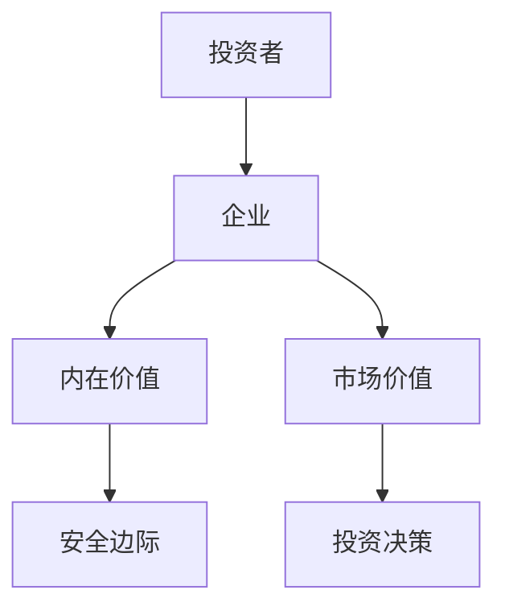
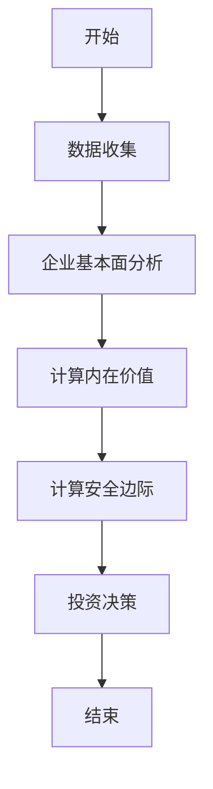
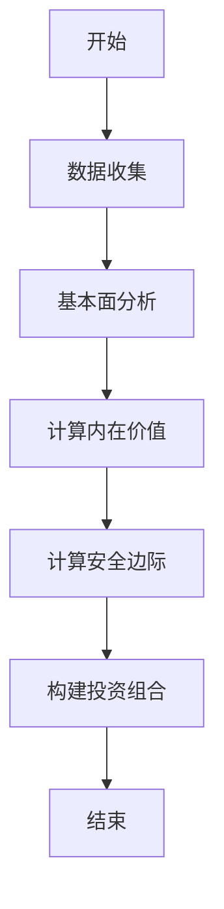
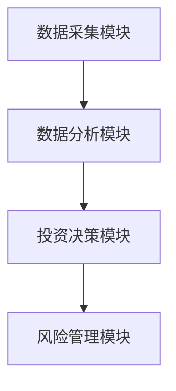
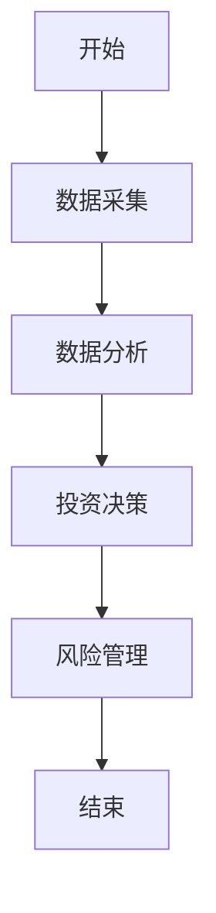

                 


# 巴菲特的投资哲学：简单但不容易

## 关键词：
巴菲特，投资哲学，价值投资，安全边际，复利效应，投资系统，风险管理

## 摘要：
本文系统地探讨了巴菲特的投资哲学，从其核心概念到实际应用，详细分析了价值投资的基本原理、安全边际的计算、投资组合的构建以及风险管理策略。通过数学模型、算法流程和实际案例的深入解析，展示了巴菲特投资哲学的科学性和实用性。文章不仅适合投资者理解长期投资的真谛，也为技术背景的读者提供了从系统架构到代码实现的全面解读。

---

## 目录

### 第一部分: 巴菲特投资哲学的背景与基础

#### 第1章: 巴菲特投资哲学概述

##### 1.1 投资哲学的背景与意义

###### 1.1.1 传统投资理论的局限性
- 短期交易的盲目性
- 市场波动对企业价值的影响
- 投资者情绪的非理性

###### 1.1.2 巴菲特投资哲学的提出背景
- 20世纪70年代的投资环境
- 价值投资的兴起
- 巴菲特的实践与总结

###### 1.1.3 投资哲学的核心价值与意义
- 长期投资的重要性
- 企业基本面分析的科学性
- 风险管理的必要性

##### 1.2 价值投资的定义与特点

###### 1.2.1 价值投资的定义
- 价值投资的定义
- 价值投资的核心目标

###### 1.2.2 价值投资的核心特点
- 买入低于内在价值的企业
- 长期持有的纪律性
- 重视企业竞争优势

##### 1.3 巴菲特投资策略的核心要素

###### 1.3.1 长期投资的重要性
- 长期投资的优势
- 短期波动的不可预测性

###### 1.3.2 企业基本面分析的关键性
- 收益能力
- 财务健康状况
- 竞争优势

###### 1.3.3 安全边际的概念与作用
- 安全边际的定义
- 安全边际的重要性
- 安全边际的计算方法

#### 第2章: 巴菲特投资哲学的核心概念与联系

##### 2.1 投资哲学的核心概念原理

###### 2.1.1 企业价值的评估方法
- 内在价值的计算
- 市场价值的评估
- 企业价值与市场价值的关系

###### 2.1.2 市场情绪对企业估值的影响
- 市场情绪的波动性
- 投资者心理与市场估值的关系
- 市场恐慌与低估机会

###### 2.1.3 投资组合的风险与收益平衡
- 风险与收益的权衡
- 投资组合的分散化
- 风险控制的重要性

##### 2.2 核心概念属性特征对比表格

###### 2.2.1 价值投资与成长投资的对比
| 对比维度       | 价值投资               | 成长投资               |
|----------------|------------------------|------------------------|
| 投资目标       | 买入低于价值的企业     | 买入具有高增长潜力的企业 |
| 风险承受能力   | 较低                   | 较高                   |
| 投资期限       | 长期                   | 中长期                |

##### 2.3 投资哲学的ER实体关系图


### 第二部分: 巴菲特投资哲学的算法原理

#### 第3章: 投资决策的算法流程

##### 3.1 投资决策的算法流程

###### 3.1.1 数据收集与处理
- 企业财务数据的收集
- 市场数据的获取
- 数据清洗与预处理

###### 3.1.2 企业基本面分析
- 收益能力分析
- 财务健康状况分析
- 竞争优势分析

###### 3.1.3 安全边际计算
- 内在价值计算
- 市场价格比较
- 安全边际确认

###### 3.1.4 投资决策输出
- 买入信号
- 卖出信号
- 持有信号

##### 3.2 投资哲学的数学模型与公式

###### 3.2.1 企业内在价值计算公式
$$ V = \frac{CF}{r - g} $$
其中，CF为自由现金流，r为折现率，g为增长率

###### 3.2.2 安全边际计算公式
$$ \text{安全边际} = \text{内在价值} - \text{市场价格} $$

###### 3.2.3 投资组合收益计算公式
$$ R = \sum (w_i \times r_i) $$
其中，w_i为资产权重，r_i为资产收益率

##### 3.3 投资决策算法流程图


#### 第4章: 投资组合管理的算法实现

##### 4.1 投资组合管理的算法流程

###### 4.1.1 数据收集与处理
- 市场数据获取
- 企业基本面数据收集
- 数据清洗与预处理

###### 4.1.2 企业基本面分析
- 收益能力分析
- 财务健康状况分析
- 竞争优势分析

###### 4.1.3 安全边际计算
- 内在价值计算
- 市场价格比较
- 安全边际确认

###### 4.1.4 投资组合构建
- 资产分配
- 风险控制
- 成本优化

##### 4.2 投资组合管理的数学模型与公式

###### 4.2.1 投资组合优化模型
$$ \text{Minimize} \sum w_i^2 \times \sigma_i^2 $$
其中，w_i为资产权重，σ_i为资产波动率

###### 4.2.2 风险调整后的收益计算公式
$$ R_{\text{调整后}} = R - \text{风险溢价} $$

##### 4.3 投资组合管理的算法流程图


### 第三部分: 巴菲特投资哲学的系统架构与项目实战

#### 第5章: 投资系统的架构设计

##### 5.1 投资系统架构概述

###### 5.1.1 系统功能模块划分
- 数据采集模块
- 数据分析模块
- 投资决策模块
- 风险管理模块

##### 5.1.2 系统架构设计


##### 5.1.3 系统交互设计
- 数据输入
- 数据处理
- 决策输出
- 风险监控

##### 5.2 系统接口设计

###### 5.2.1 数据接口
- 数据输入接口
- 数据输出接口

###### 5.2.2 决策接口
- 投资决策接口
- 风险管理接口

##### 5.3 系统交互流程图


#### 第6章: 投资系统的项目实战

##### 6.1 环境安装与配置

###### 6.1.1 系统环境要求
- 操作系统：Linux/Windows/MacOS
- Python版本：3.7+
- 开发工具：VS Code/Jupyter Notebook
- 依赖库安装：pandas, numpy, matplotlib, yfinance

##### 6.1.2 代码实现

###### 6.1.2.1 数据采集模块
```python
import yfinance as yf
import pandas as pd

def get_data(ticker, start_date, end_date):
    data = yf.download(ticker, start=start_date, end=end_date)
    return data
```

###### 6.1.2.2 数据分析模块
```python
def analyze_data(data):
    # 计算内在价值
    def calculate_intrinsic_value(eps, growth_rate, discount_rate):
        return eps / (discount_rate - growth_rate)
    
    # 计算安全边际
    def calculate_margin_of_safety(price, intrinsic_value):
        return intrinsic_value - price
    
    # 执行分析
    eps = data['EPS'].mean()
    growth_rate = 0.05
    discount_rate = 0.1
    intrinsic_value = calculate_intrinsic_value(eps, growth_rate, discount_rate)
    price = data['Close'].mean()
    margin_of_safety = calculate_margin_of_safety(price, intrinsic_value)
    return margin_of_safety
```

###### 6.1.2.3 投资决策模块
```python
def investment_decision(margin_of_safety):
    if margin_of_safety > 0:
        return "买入"
    elif margin_of_safety < 0:
        return "卖出"
    else:
        return "持有"
```

##### 6.1.3 代码应用解读与分析

###### 6.1.3.1 数据采集模块的应用
- 使用yfinance库获取股票数据
- 数据清洗与预处理

###### 6.1.3.2 数据分析模块的应用
- 计算企业内在价值
- 计算安全边际
- 生成投资决策信号

##### 6.1.4 投资决策模块的应用
- 根据安全边际生成买入、卖出或持有信号
- 输出投资建议

##### 6.1.5 风险管理模块的应用
- 监控投资组合风险
- 调整投资组合配置
- 控制投资风险

#### 第7章: 项目实战案例分析

##### 7.1 实际案例分析

###### 7.1.1 案例选择
- 选择具有代表性的企业
- 分析企业的基本面

###### 7.1.2 数据分析与计算
- 计算内在价值
- 计算安全边际
- 生成投资决策信号

##### 7.1.3 投资决策与结果分析
- 根据安全边际做出投资决策
- 监控投资结果
- 分析投资收益与风险

#### 第8章: 项目小结

##### 8.1 项目实现的关键点
- 数据采集与处理
- 企业基本面分析
- 投资决策算法
- 风险管理策略

##### 8.2 项目实现的注意事项
- 数据的准确性和及时性
- 模型的适用性和限制
- 投资决策的纪律性

##### 8.3 项目实现的最佳实践
- 定期复盘与优化
- 持续学习与改进
- 风险管理的持续关注

### 第四部分: 总结与展望

#### 第9章: 巴菲特投资哲学的总结与展望

##### 9.1 巴菲特投资哲学的核心思想回顾
- 价值投资的核心理念
- 长期投资的重要性
- 风险管理的关键作用

##### 9.2 巴菲特投资哲学的未来展望
- 数字化投资的趋势
- 人工智能在投资中的应用
- 可持续投资的发展

##### 9.3 对投资者的建议
- 理解并践行巴菲特的投资哲学
- 坚持长期投资，避免短期波动的影响
- 重视风险管理，确保投资安全

---

### 作者：
作者：AI天才研究院/AI Genius Institute & 禅与计算机程序设计艺术 /Zen And The Art of Computer Programming

