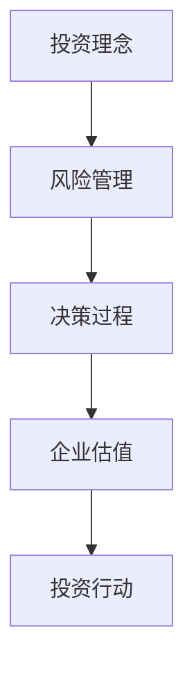
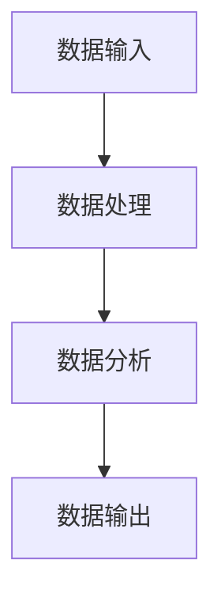

                 


---

# 巴菲特的投资失误：从错误中学习

> **关键词**：巴菲特、投资失误、价值投资、风险管理、长期投资

> **摘要**：本文通过分析巴菲特的主要投资失误，揭示这些错误背后的深层原因，并总结教训，为投资者提供宝贵的经验和智慧。通过系统分析和实际案例，帮助读者更好地理解投资决策中的关键因素。

---

## 引言

沃伦·巴菲特（Warren Buffett）是全球最著名的投资者之一，他的价值投资理念和长期投资策略为无数投资者所推崇。然而，巴菲特并非没有失误。本文将深入分析巴菲特的主要投资失误，探讨这些错误的原因，并总结教训，为投资者提供深刻的启示。

---

## 第一章：巴菲特的投资哲学与本书的目的

### 1.1 巴菲特的投资哲学概述

巴菲特的投资哲学基于价值投资，强调购买低于内在价值的股票，并长期持有。他注重企业的基本面分析，尤其是企业的财务状况、管理层素质和行业地位。

### 1.2 本书的目的

本书旨在通过分析巴菲特的投资失误，揭示这些错误背后的原因，并总结教训，帮助读者在投资决策中避免类似的错误。

---

## 第二章：早期合伙企业收购的教训

### 2.1 合伙企业的背景与收购决策

巴菲特在早期的合伙企业中收购了多家企业，但由于对管理层能力和行业风险的低估，这些收购最终导致亏损。

### 2.2 投资失误的原因分析

- **低估管理层能力**：管理层的能力直接影响企业的经营和盈利能力。
- **低估行业风险**：某些行业的周期性风险被低估，导致企业在经济下行时表现不佳。

### 2.3 从错误中学习的经验总结

- **重视管理层能力**：在投资前，必须对管理层的诚信和能力进行深入调查。
- **重新审视企业估值**：确保估值模型充分考虑行业风险和管理层因素。

---

## 第三章：纺织业收购的教训

### 3.1 纺织业收购的背景与决策过程

巴菲特收购纺织公司时，主要看中其低估值和行业地位，但忽视了行业的周期性风险和管理层的决策能力。

### 3.2 投资失误的原因分析

- **行业周期性风险**：纺织行业受经济波动影响较大，容易出现周期性亏损。
- **管理层决策失误**：管理层在经营决策中表现不佳，未能有效应对市场变化。

### 3.3 从错误中学习的经验总结

- **行业风险评估**：在投资前，必须对行业的周期性风险进行充分评估。
- **管理层沟通**：与管理层保持密切沟通，及时了解企业的经营状况。

---

## 第四章：可口可乐投资的教训

### 4.1 可口可乐投资的背景与决策过程

巴菲特投资可口可乐时，认为其强大的品牌和市场地位能带来稳定的收益，但后来发现竞争压力和定价能力的评估存在偏差。

### 4.2 投资失误的原因分析

- **低估竞争压力**：可口可乐面临激烈的价格战，影响了利润率。
- **高估定价能力**：低估了竞争对手的定价能力，导致利润率下降。

### 4.3 从错误中学习的经验总结

- **行业竞争分析**：必须对行业竞争环境进行深入分析，评估企业的竞争优势。
- **企业定价能力**：关注企业在价格战中的应对能力和定价策略。

---

## 第五章：航空业投资的教训

### 5.1 航空业投资的背景与决策过程

巴菲特在航空业的投资中，由于对行业周期性和成本结构的低估，导致投资表现不佳。

### 5.2 投资失误的原因分析

- **行业周期性风险**：航空业受经济波动和油价影响较大，周期性明显。
- **成本结构高估**：低估了航空业的高固定成本和高变动成本。

### 5.3 从错误中学习的经验总结

- **行业周期性评估**：在投资周期性行业时，必须充分考虑经济波动的影响。
- **成本结构分析**：深入分析企业的成本结构，评估其在不同经济环境下的盈利能力。

---

## 第六章：衍生品交易的教训

### 6.1 衍生品交易的背景与决策过程

巴菲特在衍生品交易中，由于对风险管理和复杂性评估不足，导致出现重大亏损。

### 6.2 投资失误的原因分析

- **风险管理不足**：衍生品交易的风险较高，需要严格的风险管理。
- **复杂性评估不足**：低估了衍生品交易的复杂性和潜在风险。

### 6.3 从错误中学习的经验总结

- **严格风险管理**：在进行复杂投资时，必须建立严格的风险管理体系。
- **复杂性评估**：对复杂投资工具进行深入分析，确保充分理解其风险和潜在回报。

---

## 第七章：系统分析与架构设计方案

### 7.1 投资决策系统介绍

使用Mermaid图展示巴菲特的投资决策过程，包括投资理念、风险管理、决策过程等模块。



### 7.2 企业估值模型

使用DCF模型对企业进行估值，Python代码如下：

```python
def discounted_cash_flow(cash_flows, discount_rate):
    return sum(cf / (1 + discount_rate)**i for i, cf in enumerate(cash_flows))

cf = [100, 150, 200, 250, 300]
rate = 0.10
value = discounted_cash_flow(cf, rate)
print(f"企业估值为：${value:.2f}")
```

### 7.3 系统架构设计

使用Mermaid图展示系统架构，包括数据输入、处理、分析和输出模块。



---

## 第八章：项目实战

### 8.1 环境安装

安装Python和相关库，如Pandas和NumPy。

### 8.2 核心实现源代码

编写DCF模型代码，进行企业估值分析。

### 8.3 案例分析

分析纺织业收购案例，评估企业价值和投资风险。

---

## 第九章：最佳实践与小结

### 9.1 总结

从巴菲特的投资失误中，我们可以学到以下几点：

- **风险管理**：严格的风险管理是投资成功的关键。
- **行业分析**：深入分析行业的周期性和竞争环境。
- **管理层评估**：重视管理层的诚信和能力。

### 9.2 小结

投资失误是成长的机会，通过分析这些错误，我们可以避免类似的错误，提升投资决策的准确性。

### 9.3 注意事项

- **分散投资**：避免过度集中投资，分散风险。
- **持续学习**：投资是一项终身学习的事业，不断更新知识和策略。

---

## 作者

**作者：AI天才研究院/AI Genius Institute & 禅与计算机程序设计艺术/Zen And The Art of Computer Programming**

---

通过以上详细分析和结构化的文章，读者可以深入了解巴菲特的投资失误，并从中汲取经验教训，提升自己的投资智慧。

