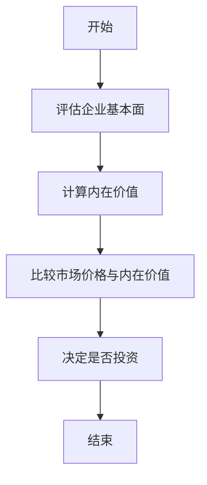
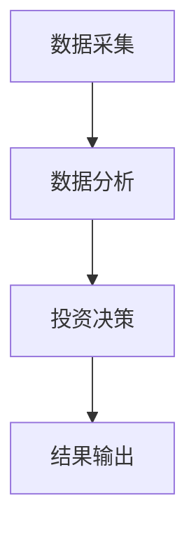
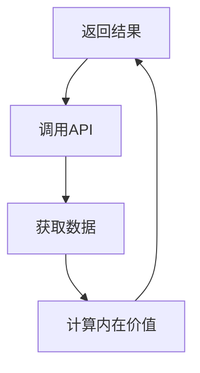

                 


# 巴菲特的投资时间框架：长期主义的优势

## 关键词：  
巴菲特，长期主义，投资策略，价值投资，时间复利，安全边际，企业护城河

## 摘要：  
本文将深入分析巴菲特的投资时间框架，探讨长期主义在投资中的独特优势。通过结合技术视角，我们将从核心概念、数学模型、系统设计等角度，详细阐述长期主义的投资策略，并通过实际案例和代码实现，帮助读者更好地理解和应用这一理念。

---

# 第1章 长期主义的定义与核心理念

## 1.1 长期主义的定义与内涵  
长期主义是一种以时间复利为核心的投资策略，强调通过长期持有优质资产，利用复利效应实现财富的指数级增长。与短期交易相比，长期主义更注重企业的基本面和内在价值，而非市场的短期波动。

## 1.2 长期主义在投资中的重要性  
长期主义的核心在于通过时间的积累，最大化复利效应。巴菲特曾说过：“时间是伟大企业的朋友”，这正是长期主义的核心思想。通过长期持有优质资产，投资者可以避免频繁交易中的摩擦成本和情绪干扰，从而实现更稳定的收益。

## 1.3 长期主义与其他投资策略的对比  
### 1.3.1 与短期交易的对比  
- 短期交易：频繁买卖，依赖市场情绪和短期波动。  
- 长期主义：长期持有，关注企业基本面。  

### 1.3.2 与趋势投资的对比  
- 趋势投资：依赖市场趋势和技术分析。  
- 长期主义：依赖企业内在价值和时间复利。  

---

# 第2章 长期主义的核心概念与联系

## 2.1 长期主义的核心概念  

### 2.1.1 安全边际  
安全边际是巴菲特投资理念中的核心概念之一，指股票的市场价格低于其内在价值时的差额。通过安全边际，投资者可以在市场波动中避免损失，并在低估时买入优质资产。  

### 2.1.2 企业护城河  
企业护城河是衡量企业竞争优势的重要指标，包括成本优势、品牌优势、技术壁垒等。具备强大护城河的企业能够在长期竞争中保持优势地位，从而为投资者提供稳定的收益。  

### 2.1.3 内在价值  
内在价值是企业未来现金流的现值，是衡量企业价值的核心指标。巴菲特强调，投资者应以内在价值为基准，而非市场价格为依据进行投资决策。  

## 2.2 核心概念之间的联系  
通过以下对比表格，可以更清晰地理解长期主义的核心概念：  

| **概念**       | **定义**                                                                 | **与长期主义的关系**                                                                 |
|----------------|--------------------------------------------------------------------------|--------------------------------------------------------------------------------------|
| 安全边际       | 股票价格低于其内在价值的差额。                                             | 通过安全边际，确保投资的本金安全，避免短期波动带来的损失。                     |
| 企业护城河     | 企业竞争优势的体现，包括成本优势、品牌优势等。                           | 具备强大护城河的企业能够长期保持竞争优势，为投资者创造持续价值。               |
| 内在价值       | 企业未来现金流的现值。                                                     | 投资者应以内在价值为基准，选择低估的资产进行长期持有。                         |

---

# 第3章 长期主义的数学模型与公式

## 3.1 时间复利的数学模型  
时间复利是长期主义的核心驱动力，其数学公式如下：  

$$ FV = PV \times (1 + r)^n $$  

其中，$FV$ 表示终值，$PV$ 表示现值，$r$ 表示年化收益率，$n$ 表示投资时间。  

### 3.1.1 内在价值的计算公式  
内在价值的计算公式为：  

$$ IV = \sum_{t=1}^{n} \frac{CF_t}{(1 + r)^t} $$  

其中，$CF_t$ 表示第 $t$ 年的现金流，$r$ 表示折现率，$n$ 表示预测年数。  

### 3.1.2 内在价值与市场价格的关系  
通过比较内在价值与市场价格，投资者可以判断资产是否低估。当市场价格低于内在价值时，投资机会出现。  

## 3.2 投资决策的算法原理  

### 3.2.1 投资决策流程图  
以下为长期主义投资的决策流程图：  



### 3.2.2 计算内在价值的Python代码  
以下代码展示了如何计算企业的内在价值：  

```python
def calculate_intrinsic_value(cash_flow, discount_rate, years):
    iv = 0
    for t in range(years):
        iv += cash_flow[t] / (1 + discount_rate) ** t
    return iv
```

---

# 第4章 投资决策支持系统的架构设计

## 4.1 系统功能设计  
本系统旨在帮助投资者实现长期主义投资策略，功能模块包括：  

### 4.1.1 数据采集模块  
- 从公开市场获取企业财务数据，包括收入、利润、现金流等。  

### 4.1.2 数据分析模块  
- 计算企业的内在价值、安全边际、企业护城河等指标。  

### 4.1.3 投资决策模块  
- 根据分析结果，生成投资建议。  

## 4.2 系统架构设计  
以下是系统的架构图：  



## 4.3 系统接口设计  
系统通过API接口与数据源对接，支持以下接口：  

### 4.3.1 获取企业财务数据  
```python
def get_financial_data(ticker):
    # 获取企业财务数据
    pass
```

### 4.3.2 计算内在价值  
```python
def calculate_intrinsic_value(ticker):
    # 计算企业内在价值
    pass
```

## 4.4 系统交互流程图  
以下是系统的交互流程图：  



---

# 第5章 项目实战：长期主义投资策略的实现

## 5.1 环境安装  
- 安装Python和相关库（如Pandas、NumPy）。  

## 5.2 核心实现代码  
以下是核心实现代码：  

```python
def main():
    import pandas as pd
    import numpy as np

    # 获取企业财务数据
    def get_financial_data(ticker):
        # 示例代码，实际中应从数据库或API获取
        return pd.DataFrame({'Revenue': [100, 110, 120], 'Profit': [20, 25, 30]})

    # 计算内在价值
    def calculate_intrinsic_value(financial_data, discount_rate):
        cash_flows = financial_data['Profit']
        n = len(cash_flows)
        iv = 0
        for t in range(n):
            iv += cash_flows[t] / (1 + discount_rate) ** t
        return iv

    # 主函数
    ticker = 'AAPL'
    financial_data = get_financial_data(ticker)
    discount_rate = 0.1
    iv = calculate_intrinsic_value(financial_data, discount_rate)
    print(f"企业{ticker}的内在价值为：{iv}")

if __name__ == "__main__":
    main()
```

## 5.3 实际案例分析  
以苹果公司为例，通过代码计算其内在价值，并与市场价格进行对比，判断是否低估。  

---

# 第6章 最佳实践与注意事项

## 6.1 小结  
长期主义是一种以时间复利为核心的投资策略，通过长期持有优质资产实现财富增长。投资者应关注企业的内在价值、安全边际和护城河，避免短期波动的干扰。  

## 6.2 注意事项  
- 长期主义需要耐心和纪律，避免频繁交易。  
- 投资者应具备对企业基本面的深入理解，而非仅依赖市场情绪。  

## 6.3 拓展阅读  
- 巴菲特的《致股东的信》  
- 投资经典书籍：《价值投资实战》  

---

# 作者：AI天才研究院 & 禅与计算机程序设计艺术

