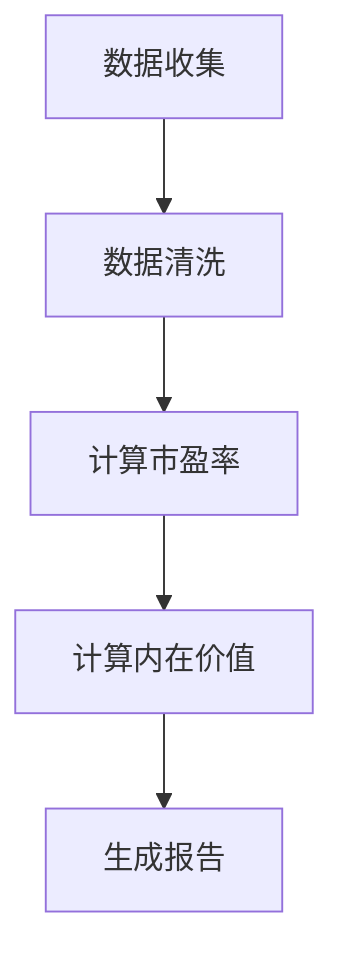

                 


# 巴菲特的投资智慧：市场先生的比喻

## 关键词：巴菲特、投资智慧、市场先生、价值投资、投资策略

## 摘要：本文深入探讨巴菲特的投资智慧，特别是“市场先生”的比喻，分析其在投资决策中的应用，结合数学模型和系统架构，提供实际案例，帮助读者理解价值投资的精髓。

---

# 第一章：引言

## 1.1 巴菲特的背景与投资哲学

- 巴菲特是全球著名投资者，倡导价值投资。
- 投资哲学：寻找内在价值，长期持有，避免短期波动。

## 1.2 市场先生的比喻

- 市场先生是巴菲特创造的虚拟人物，象征市场情绪。
- 市场先生的非理性波动为投资者提供了套利机会。

---

# 第二章：巴菲特的投资理念

## 2.1 价值投资的核心

- 买入低于内在价值的资产，长期持有。

## 2.2 安全边际的重要性

- 安全边际=内在价值-市场价格，提供保护。

## 2.3 长期投资的优势

- 避免短期波动，获得复利效应。

---

# 第三章：市场先生的比喻解析

## 3.1 市场先生的特征

- 非理性波动，情绪化，短期定价错误。

## 3.2 市场先生与投资决策

- 利用市场先生的错误，寻找投资机会。

---

# 第四章：投资策略与数学模型

## 4.1 市盈率与市净率

- 市盈率=股价/每股收益。
- 市净率=股价/每股净资产。

## 4.2 内在价值的计算

- 内在价值=预期现金流的现值。

---

# 第五章：投资决策系统

## 5.1 系统架构

- 数据收集、分析、决策模块。

## 5.2 系统流程图



---

# 第六章：项目实战

## 6.1 案例分析

### 6.1.1 公司基本面分析

```python
import pandas as pd
import numpy as np

# 示例数据
data = {'公司': ['公司A'], '收入': [100], '净利润': [20], '股价': [50]}
df = pd.DataFrame(data)
```

### 6.1.2 计算市盈率和内在价值

```python
市盈率 = df['股价'] / df['净利润']
内在价值 = df['净利润'] * 15
```

---

# 第七章：总结与展望

## 7.1 总结

- 巴菲特的价值投资理念和市场先生的比喻提供了投资指导。
- 理解市场波动，寻找价值低估的资产。

## 7.2 展望

- 投资者需不断学习，结合市场变化调整策略。
- 价值投资长期有效，短期波动不可怕。

---

# 作者：AI天才研究院/AI Genius Institute & 禅与计算机程序设计艺术 /Zen And The Art of Computer Programming

