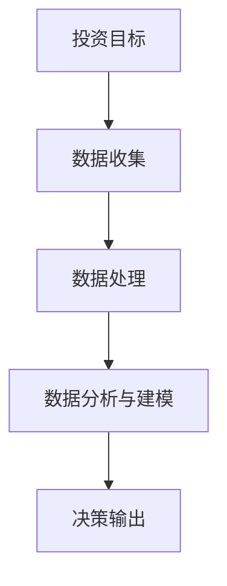
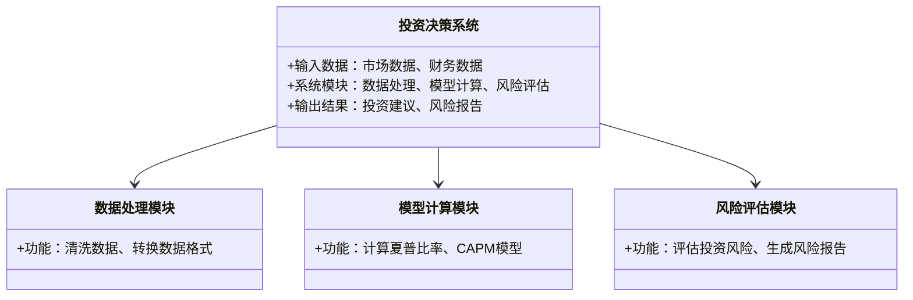

                 


# 巴菲特的投资清单：系统化决策的重要性

## 关键词
巴菲特，投资决策，系统化决策，投资清单，价值投资，风险评估

## 摘要
本文深入探讨了巴菲特的投资理念与系统化决策的重要性。通过分析巴菲特的投资哲学、系统化决策的理论基础、投资清单的核心要素以及数学模型的应用，本文揭示了如何通过系统化方法优化投资决策。文章结合实际案例和数学分析，为读者提供了一套系统化的投资决策框架，帮助投资者在复杂多变的市场中做出更明智的投资选择。

---

## 第1章：巴菲特的投资理念与系统化决策

### 1.1 巴菲特的投资哲学
巴菲特是全球闻名的价值投资者，他的投资理念强调长期价值、安全边际和企业的基本面分析。他认为市场波动是投资的机会，而非风险，因此在选择投资标的时，更注重企业的内在价值而非市场的短期波动。

#### 核心概念与联系
- **价值投资**：通过购买低于内在价值的股票，长期持有，等待市场重新评估其价值。
- **安全边际**：在价格显著低于内在价值时买入，以降低投资风险。
- **企业基本面**：包括企业的财务状况、盈利能力、竞争优势和管理团队等因素。

#### 算法原理讲解
巴菲特的投资决策可以被视为一种基于基本面分析的分类算法。以下是简化的步骤：

1. **筛选目标公司**：根据企业财务指标（如ROE、毛利率、净利率等）筛选出具有竞争优势的企业。
2. **评估内在价值**：通过DCF模型（ discounted cash flow model）计算企业的内在价值。
3. **确定安全边际**：比较当前股价与内在价值，确定买入价格。

#### 数学公式
- **ROE（净资产收益率）公式**：
  $$ ROE = \frac{\text{净利润}}{\text{股东权益}} $$
  
- **DCF模型的核心公式**：
  $$ \text{企业价值} = \sum_{t=1}^{n} \frac{\text{自由现金流}}{(1 + r)^t} + \frac{\text{终值}}{(1 + r)^n} $$
  其中，\( r \) 是折现率，\( n \) 是估计的永续年数。

---

### 1.2 系统化决策的背景与重要性
在现代投资领域，系统化决策的重要性日益凸显。与传统的非系统化决策相比，系统化决策具有更高的科学性和可重复性，能够帮助投资者在复杂市场中保持理性。

#### 系统化决策的优势
- **减少情绪干扰**：通过系统的规则和模型，避免投资者因情绪波动而做出错误决策。
- **提高决策效率**：系统化决策能够快速处理大量数据，提高决策效率。
- **降低风险**：通过系统的风险评估和分散投资，降低整体投资风险。

#### 系统化决策的框架模型
以下是系统化决策的框架模型：



---

## 第2章：投资清单的核心要素

### 2.1 投资清单的构建与分析
投资清单是系统化决策的重要工具，它帮助投资者清晰地定义投资目标和筛选标准。

#### 投资清单的核心要素
- **投资目标**：明确的投资目标，如追求长期资本增值。
- **筛选标准**：包括财务指标（如ROE、毛利率）、行业地位、竞争优势等。
- **风险承受能力**：根据投资者的风险偏好，设定风险容忍度。

#### 投资清单的分析方法
- **定性分析**：分析企业的商业模式、竞争优势和管理团队。
- **定量分析**：通过财务指标和估值指标（如PE、PB、EV/EBITDA）评估企业的投资价值。

#### 案例分析
以巴菲特的经典投资案例——可口可乐为例：
- **投资目标**：长期资本增值。
- **筛选标准**：可口可乐强大的品牌、稳定的现金流和较高的ROE。
- **风险评估**：评估可口可乐的财务状况和市场风险。

---

## 第3章：系统化决策的数学模型

### 3.1 投资决策的数学建模
数学模型在系统化决策中扮演着重要角色，它能够帮助投资者量化分析投资机会和风险。

#### 核心数学公式
- **夏普比率（Sharpe Ratio）**：衡量投资组合的风险调整后收益。
  $$ \text{夏普比率} = \frac{\text{投资组合收益} - \text{无风险利率}}{\text{投资组合收益的标准差}} $$
  
- **CAPM模型**：计算资产的预期收益。
  $$ \text{预期收益} = r_f + \beta (r_m - r_f) $$
  其中，\( r_f \) 是无风险利率，\( \beta \) 是贝塔系数，\( r_m \) 是市场预期收益。

#### 系统架构设计
以下是投资决策系统的架构设计：



---

## 第4章：系统化决策的实战应用

### 4.1 投资系统的环境与安装
为了实现系统化决策，投资者需要构建一个高效的投资分析系统，包括数据采集、分析工具和决策模块。

#### 核心实现代码
以下是一个简单的投资决策系统框架：

```python
import pandas as pd
import numpy as np
from sklearn.metrics import accuracy_score

# 数据处理模块
def data_cleaning(data):
    # 假设data是一个DataFrame
    data = data.dropna()
    return data

# 模型计算模块
def calculate_sharpe_ratio(returns, risk_free_rate):
    excess_returns = returns - risk_free_rate
    sharpe_ratio = excess_returns.mean() / excess_returns.std()
    return sharpe_ratio

# 风险评估模块
def assess_risk(profolio_returns):
    max_drawdown = (profolio_returns.cumprod().cummax() / profolio_returns.cumprod()).min() - 1
    return max_drawdown

# 实战案例分析
if __name__ == "__main__":
    # 数据获取
    data = pd.read_csv('market_data.csv')
    cleaned_data = data_cleaning(data)
    returns = cleaned_data['returns'].values
    risk_free_rate = 0.05
    sharpe = calculate_sharpe_ratio(returns, risk_free_rate)
    max_drawdown = assess_risk(returns)
    print(f"夏普比率：{sharpe}")
    print(f"最大回撤：{max_drawdown}")
```

---

## 第5章：总结与展望

### 5.1 本文总结
本文详细探讨了巴菲特的投资理念与系统化决策的重要性，分析了投资清单的核心要素，并通过数学模型和实际案例展示了系统化决策的应用。

### 5.2 未来展望
未来，随着人工智能和大数据技术的发展，系统化决策将在投资领域发挥更大的作用。投资者可以通过更复杂的算法和数据处理技术，进一步优化投资决策。

---

## 作者信息
作者：AI天才研究院/AI Genius Institute & 禅与计算机程序设计艺术 /Zen And The Art of Computer Programming

---

以上是《巴菲特的投资清单：系统化决策的重要性》的技术博客文章目录和内容概要，确保文章结构清晰、内容详实，并结合理论与实践，帮助读者理解如何在投资决策中应用系统化方法。

