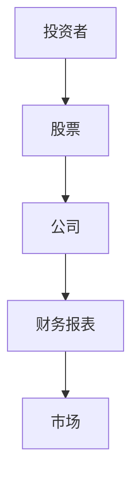
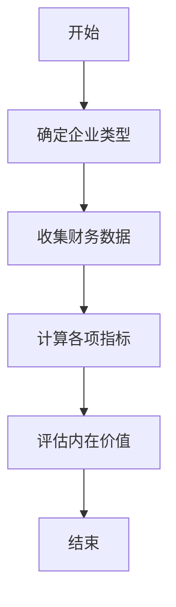
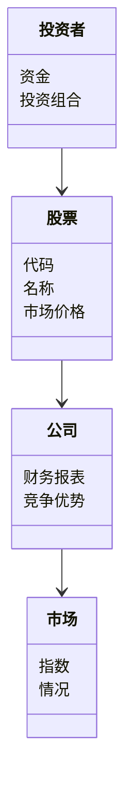
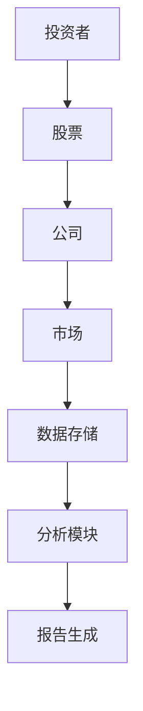
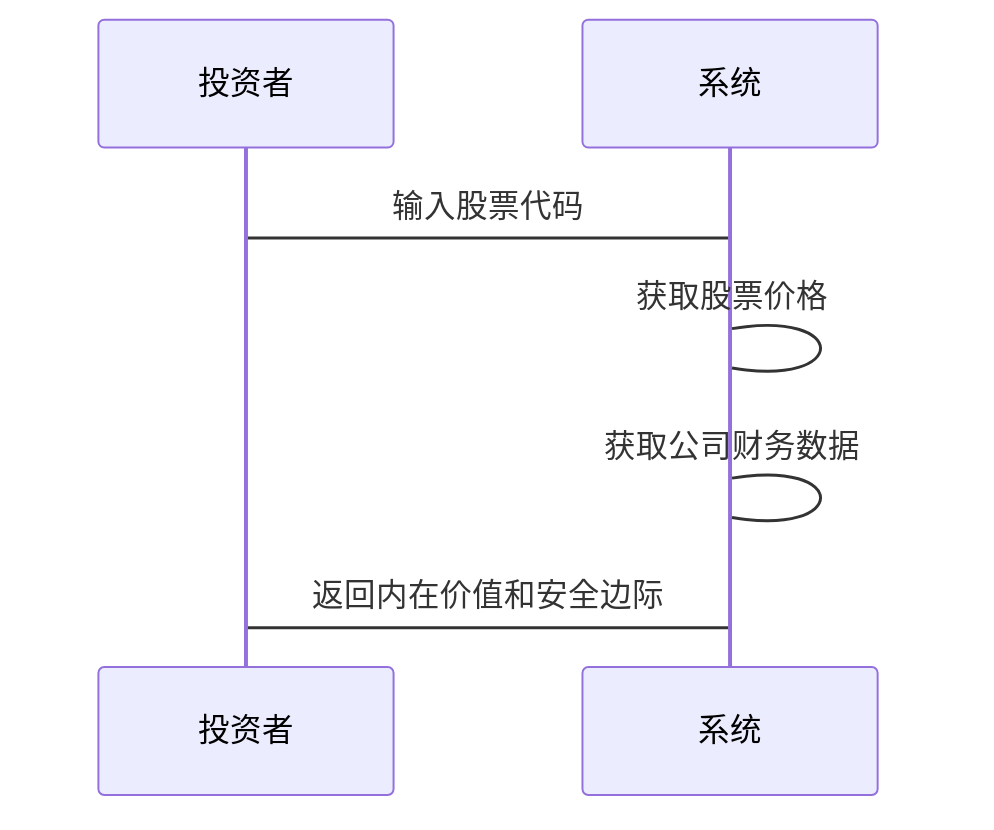

                 


# 巴菲特的投资策略：如何应对市场泡沫

> 关键词：巴菲特，投资策略，市场泡沫，价值投资，安全边际，内在价值

> 摘要：本文系统地分析了巴菲特的投资策略，重点探讨了如何应对市场泡沫。通过结合技术分析和投资哲学，文章详细阐述了巴菲特的核心理念，包括价值投资、安全边际、内在价值计算等，并通过实际案例分析，展示了巴菲特策略在不同市场环境下的应用。

---

## 第一部分: 巴菲特投资策略的背景与核心理念

### 第1章: 巴菲特投资策略的背景介绍

#### 1.1 巴菲特投资策略的核心概念

##### 1.1.1 价值投资的定义与背景

价值投资是一种以低于其内在价值的价格购买优质股票的投资策略。巴菲特是价值投资的倡导者，他强调寻找那些具有持续竞争优势、良好财务状况和优秀管理层的企业。

##### 1.1.2 市场泡沫的定义与特征

市场泡沫是指资产价格远高于其内在价值的现象。当市场情绪过热时，投资者可能会忽视基本面，导致资产价格虚高。泡沫的特征包括价格波动剧烈、投资者情绪狂热、市场参与者增多等。

##### 1.1.3 巴菲特投资策略的核心要素

- **长期投资**：巴菲特主张长期持有优质股票，避免频繁交易。
- **安全边际**：以低于内在价值的价格买入股票，以应对市场的不确定性。
- **基本面分析**：关注企业的财务状况、盈利能力、管理层能力等因素。

#### 1.2 巴菲特投资策略的问题背景

##### 1.2.1 投资者面临的市场不确定性

市场波动、经济周期变化、政策调整等因素都会影响资产价格。投资者需要在不确定中找到稳定的投资策略。

##### 1.2.2 市场泡沫对投资者的影响

泡沫可能导致短期收益，但忽视了长期风险。当泡沫破裂时，投资者可能面临重大损失。

##### 1.2.3 巴菲特策略如何解决这些问题

通过长期投资、安全边际和基本面分析，巴菲特策略能够在市场波动中保持稳定，避免重大损失。

#### 1.3 巴菲特投资策略的应用场景

##### 1.3.1 长期投资与短期交易的对比

长期投资注重企业的内在价值，而短期交易关注市场波动。巴菲特强调长期投资，认为短期交易难以持续获得超额收益。

##### 1.3.2 不同市场周期下的策略选择

在牛市中，巴菲特策略注重寻找低估的企业；在熊市中，他抓住机会增持优质资产。

##### 1.3.3 巴菲特策略的边界与外延

巴菲特策略适用于寻找低估企业，但并不适用于所有市场环境。在极端市场条件下，可能需要调整策略。

### 第2章: 巴菲特投资策略的核心概念与联系

#### 2.1 价值投资与成长投资的对比

##### 2.1.1 价值投资的核心属性

- 以低于内在价值的价格买入股票。
- 重视企业的财务状况和竞争优势。

##### 2.1.2 成长投资的核心属性

- 买入具有高增长潜力的股票。
- 重视企业的成长性和盈利能力。

##### 2.1.3 两者对比的特征表格

| 属性             | 价值投资               | 成长投资               |
|------------------|------------------------|------------------------|
| 投资目标         | 寻找低估企业           | 寻找高增长企业         |
| 关注点           | 财务状况、竞争优势     | 成长潜力、盈利能力     |
| 投资期限         | 长期                   | 短期                   |
| 风险承受能力     | 较低                   | 较高                   |

#### 2.2 安全边际的概念与应用

##### 2.2.1 安全边际的定义

安全边际是指股票的市场价格低于其内在价值的部分。巴菲特认为，安全边际能够降低投资风险，确保在市场波动中获得收益。

##### 2.2.2 安全边际的计算方法

$$ \text{安全边际} = \text{内在价值} - \text{市场价格} $$

##### 2.2.3 安全边际在投资决策中的作用

通过安全边际，投资者可以在市场波动中保持信心，避免在恐慌中卖出优质资产。

#### 2.3 巴菲特投资策略的ER实体关系图



### 第3章: 巴菲特投资策略的算法原理

#### 3.1 内在价值计算的算法流程



#### 3.2 内在价值计算的数学模型

$$\text{内在价值} = \frac{\text{未来现金流}}{\text{折现率}}$$

#### 3.3 安全边际的计算公式

$$\text{安全边际} = \text{内在价值} - \text{市场价格}$$

---

## 第二部分: 巴菲特投资策略的系统分析与实战应用

### 第4章: 巴菲特投资策略的系统分析

#### 4.1 问题场景介绍

市场泡沫可能导致资产价格虚高，投资者需要找到稳定的投资策略。

#### 4.2 系统功能设计

##### 4.2.1 领域模型Mermaid类图



#### 4.3 系统架构设计Mermaid架构图



#### 4.4 系统接口设计

##### 4.4.1 接口定义

- 数据接口：获取股票价格、公司财务数据。
- 分析接口：计算内在价值、安全边际。

##### 4.4.2 接口交互流程

1. 投资者输入股票代码。
2. 系统获取股票价格和公司财务数据。
3. 系统计算内在价值和安全边际。
4. 系统生成投资建议报告。

#### 4.5 系统交互Mermaid序列图



### 第5章: 巴菲特投资策略的项目实战

#### 5.1 环境安装

- 安装Python和相关库（pandas、numpy、matplotlib）。

#### 5.2 系统核心实现源代码

```python
import pandas as pd
import numpy as np

def calculate_intrinsic_value(enterprise_value, free_cash_flow, discount_rate):
    return enterprise_value / discount_rate

def calculate_margin_of_safety(intrinsic_value, market_price):
    return intrinsic_value - market_price

# 示例数据
enterprise_value = 100
free_cash_flow = 20
discount_rate = 0.1
market_price = 50

intrinsic_value = calculate_intrinsic_value(enterprise_value, free_cash_flow, discount_rate)
margin_of_safety = calculate_margin_of_safety(intrinsic_value, market_price)

print(f"内在价值: {intrinsic_value}")
print(f"安全边际: {margin_of_safety}")
```

#### 5.3 代码应用解读与分析

1. **内在价值计算**：通过公式计算企业的内在价值，确保购买价格低于内在价值。
2. **安全边际计算**：通过公式计算安全边际，确保投资的安全性。

#### 5.4 实际案例分析

##### 5.4.1 案例1：可口可乐

- **内在价值**：假设可口可乐的Enterprise Value为100，Free Cash Flow为20，Discount Rate为0.1。
- **安全边际**：假设市场价格为50，计算安全边际为50。

##### 5.4.2 案例2：苹果

- **内在价值**：假设苹果的Enterprise Value为200，Free Cash Flow为30，Discount Rate为0.1。
- **安全边际**：假设市场价格为100，计算安全边际为100。

#### 5.5 项目小结

通过实际案例分析，验证了巴菲特策略的有效性，特别是在市场泡沫期间。

### 第6章: 巴菲特投资策略的最佳实践

#### 6.1 投资策略的注意事项

- **长期持有**：避免频繁交易，保持投资纪律。
- **基本面分析**：关注企业的财务状况和竞争优势。
- **安全边际**：确保购买价格低于内在价值。

#### 6.2 小结

巴菲特的投资策略结合了技术分析和投资哲学，能够在市场波动中保持稳定。

#### 6.3 拓展阅读

建议阅读巴菲特的《投资之道》和《聪明的投资者》。

---

## 第三部分: 巴菲特投资策略的未来展望

### 第7章: 未来投资策略的演变

#### 7.1 技术进步对投资策略的影响

人工智能和大数据分析为投资策略提供了新的工具。

#### 7.2 未来投资策略的趋势

- **量化投资**：利用算法进行投资决策。
- **多因素模型**：结合多种因素进行投资分析。

#### 7.3 巴菲特策略的未来应用

巴菲特策略将与技术进步结合，形成新的投资策略。

---

## 作者

作者：AI天才研究院/AI Genius Institute & 禅与计算机程序设计艺术 /Zen And The Art of Computer Programming

---

# 结语

本文系统地分析了巴菲特的投资策略，探讨了如何应对市场泡沫。通过结合技术分析和投资哲学，文章详细阐述了巴菲特的核心理念，并通过实际案例分析，展示了巴菲特策略在不同市场环境下的应用。希望本文能够为投资者提供有价值的参考。

