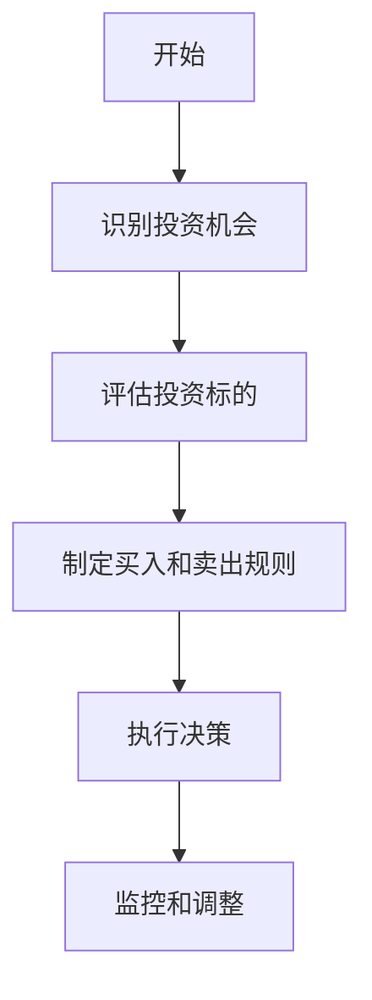
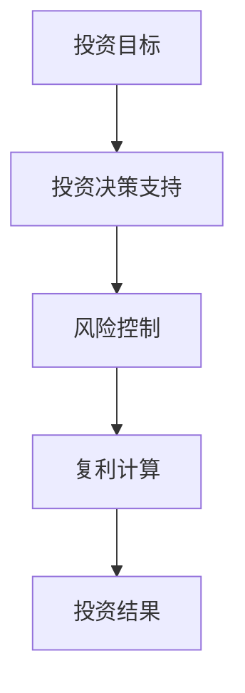

                 


# 巴菲特的投资纪律：耐心和自制的重要性

## 关键词：
- 投资纪律
- 巴菲特
- 耐心
- 自制
- 价值投资
- 长期投资

## 摘要：
巴菲特的投资纪律以其独特的价值投资理念和严格的自我约束著称。本文从耐心和自制两个核心要素入手，结合数学模型、系统架构和实际案例，深入分析巴菲特投资纪律的内在逻辑和实践方法。通过详细讲解耐心的数学模型、自制的决策框架，以及系统的架构设计，本文为读者提供了一个全面理解巴菲特投资纪律的视角。

---

## 第1章：巴菲特投资纪律的背景与意义

### 1.1 投资纪律的定义与重要性

#### 1.1.1 投资纪律的定义
投资纪律是指在投资过程中，投资者为了实现特定目标而制定的一系列规则和约束。它包括对投资标的的选择、买入时机、持有期限和卖出条件的严格遵守。

#### 1.1.2 投资纪律在投资中的作用
投资纪律能够帮助投资者避免情绪化决策，减少因市场波动或心理因素导致的错误投资行为。通过纪律性管理，投资者可以更好地实现长期收益目标。

#### 1.1.3 巴菲特投资纪律的独特性
巴菲特的投资纪律以价值投资为核心，强调长期持有优质资产，避免短期波动的干扰。他的纪律不仅体现在买入和卖出决策上，还包括对投资标的深度研究和持续跟踪。

---

### 1.2 巴菲特的投资哲学

#### 1.2.1 价值投资的核心理念
价值投资强调以低于内在价值的价格买入优质资产，长期持有，等待其价值回归。巴菲特的2008年股东信中曾提到：“价格是你支付的，价值是你得到的。”

#### 1.2.2 长期投资与复利效应
巴菲特认为，投资的复利效应是实现财富增长的关键。通过长期持有优质资产，投资者可以最大化复利的效果。

#### 1.2.3 巴菲特的投资目标与边界
巴菲特的目标是寻找具有持续竞争优势、良好管理和合理估值的公司。他设定了明确的投资边界，避免投资于看不懂的行业或公司。

---

### 1.3 投资纪律与人性的冲突

#### 1.3.1 投资中的贪婪与恐惧
贪婪和恐惧是人性的弱点，常常导致投资者偏离纪律性的投资策略。巴菲特通过严格的纪律约束，克服了这些情绪的干扰。

#### 1.3.2 短期波动与长期价值的矛盾
市场的短期波动常常诱惑投资者频繁交易，但巴菲特坚持长期价值投资，忽略短期波动的影响。

#### 1.3.3 投资纪律对心理的挑战
投资纪律要求投资者在市场恐慌时保持冷静，在市场狂热时保持克制。这种心理挑战需要长期的训练和自我约束。

---

## 第2章：耐心与自制的内在逻辑

### 2.1 耐心的数学模型与心理学分析

#### 2.1.1 耐心的数学模型
耐心可以用以下公式表示：
$$ \text{耐心} = \frac{\text{长期价值}}{\text{短期波动}} $$

长期价值是指公司在未来数年内的预期价值，短期波动则是指市场短期内的价格波动。

#### 2.1.2 耐心的心理学基础
耐心与延迟满足理论密切相关。投资者需要能够延迟满足，等待最佳的投资机会出现。

#### 2.1.3 耐心与复利的关系
复利效果可以通过以下公式计算：
$$ \text{最终价值} = \text{初始价值} \times (1 + \text{收益率})^{\text{时间}} $$

---

### 2.2 自制的决策框架

#### 2.2.1 自制的定义与特征
自制是指在决策过程中不受情绪影响，严格按照既定规则行事。巴菲特的自制体现在他对投资标的严格筛选和对卖出条件的严格遵守。

#### 2.2.2 自制的决策流程


#### 2.2.3 自制与情绪化决策的对比
| 对比维度 | 自制决策 | 情绪化决策 |
|----------|-----------|-------------|
| 基础     | 理性分析   | 情感驱动     |
| 决策时间 | 长期       | 短期         |
| 结果      | 稳定收益   | 高波动性     |

---

## 第3章：如何培养投资纪律

### 3.1 投资纪律的训练方法

#### 3.1.1 理论学习与案例分析
通过学习巴菲特的投资案例，理解他的决策逻辑和投资纪律的应用。

#### 3.1.2 实战模拟与反思
进行模拟投资，记录每一步的决策，并反思是否符合投资纪律。

#### 3.1.3 习惯养成与自我约束
通过日常练习，逐步养成遵守纪律的习惯，增强自我约束能力。

---

### 3.2 巴菲特投资纪律的系统架构

#### 3.2.1 系统目标
系统目标是实现长期价值最大化，通过严格的纪律约束，确保投资行为符合既定目标。

#### 3.2.2 系统功能
- **投资决策支持**：提供投资标的分析和筛选功能。
- **风险控制**：设定买入和卖出的纪律性规则，避免情绪化决策。
- **复利计算**：跟踪和计算投资的复利效果。

#### 3.2.3 系统架构图


---

## 第4章：巴菲特投资纪律的数学模型与算法

### 4.1 耐心的数学模型

#### 4.1.1 耐心计算公式
$$ \text{耐心} = \frac{\text{长期价值}}{\text{短期波动}} $$

长期价值可以通过DCF模型计算，短期波动可以通过市场情绪指数衡量。

### 4.2 自制的决策算法

#### 4.2.1 决策流程
1. **识别投资机会**：筛选具有长期价值的公司。
2. **评估标的**：计算内在价值和安全边际。
3. **制定规则**：设定买入和卖出的价格界限。
4. **执行决策**：严格按照规则买入和卖出。
5. **监控和调整**：定期检查标的，调整规则。

---

## 第5章：项目实战：模拟投资案例

### 5.1 环境安装

#### 5.1.1 投资工具安装
安装并配置投资分析工具，如Excel或Python的Pandas库。

### 5.2 核心代码实现

#### 5.2.1 计算内在价值
```python
def calculate_intrinsic_value(revenue, growth_rate, discount_rate):
    return revenue / (discount_rate - growth_rate)
```

#### 5.2.2 安全边际计算
```python
def calculate_margin_of_safety(price, intrinsic_value):
    return (intrinsic_value - price) / intrinsic_value * 100
```

### 5.3 案例分析
以苹果公司为例，计算其内在价值和安全边际，制定买入和卖出规则。

---

## 第6章：小结与注意事项

### 6.1 小结
巴菲特的投资纪律以耐心和自制为核心，通过严格的纪律约束，实现长期价值投资的目标。本文通过数学模型、系统架构和实际案例，深入分析了巴菲特投资纪律的内在逻辑和实践方法。

### 6.2 注意事项
- **长期视角**：避免短期波动的干扰，坚持长期投资。
- **纪律性管理**：严格执行买入和卖出规则，避免情绪化决策。
- **持续学习**：不断优化投资策略，适应市场变化。

---

## 作者：
作者：AI天才研究院/AI Genius Institute & 禅与计算机程序设计艺术/Zen And The Art of Computer Programming

---

希望这篇文章能为您提供关于巴菲特投资纪律的深刻见解，帮助您在投资领域实现长期稳定收益。

