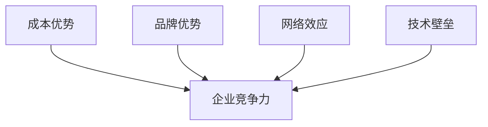
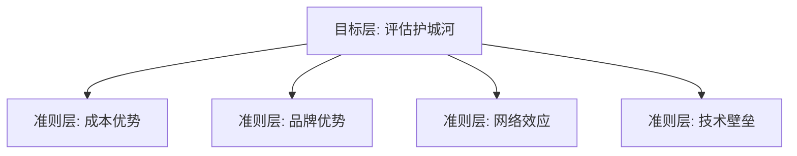
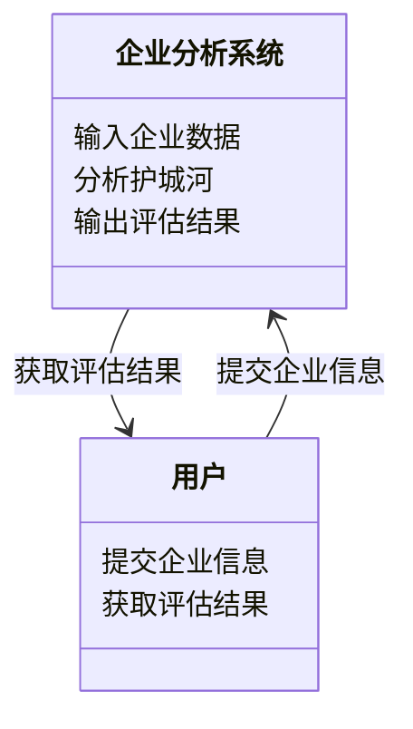
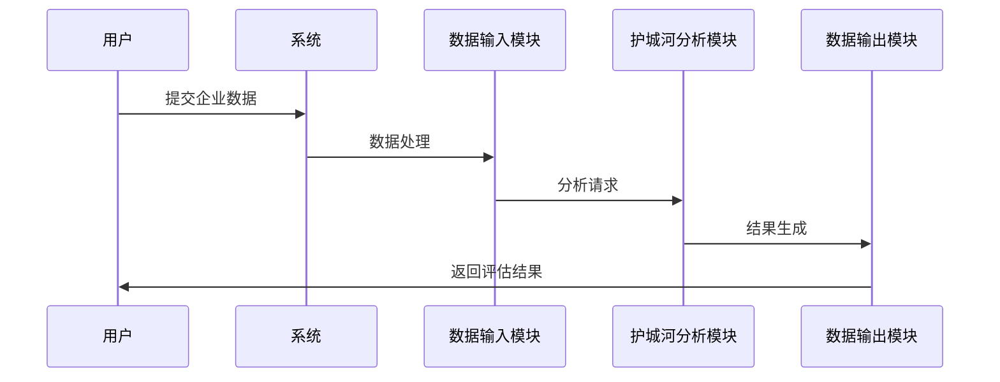

                 


# 巴菲特的护城河理论

> 关键词：巴菲特，护城河理论，投资策略，企业竞争优势，可持续盈利能力

> 摘要：巴菲特的护城河理论是投资领域的重要概念，它帮助投资者识别具有长期竞争优势的企业。本文从理论背景、核心概念、分析方法、系统设计、实际案例和最佳实践等多个方面，详细阐述护城河理论的原理和应用。通过结合技术方法和投资实践，本文旨在为投资者提供一个全面的视角，帮助他们更好地理解和应用这一理论。

---

## 目录

### 第一章: 护城河理论的背景与概述

1.1 投资领域的护城河概念  
1.2 巴菲特投资理念的起源  
1.3 护城河理论的核心要素  
1.4 护城河理论在投资中的应用  

### 第二章: 护城河理论的核心概念与联系

2.1 护城河的类型与特征  
2.2 护城河的属性对比  
2.3 护城河的实体关系图  

### 第三章: 护城河分析的算法框架

3.1 层次分析法（AHP）的原理  
3.2 护城河分析的决策树流程  
3.3 护城河评估的数学模型  

### 第四章: 护城河分析的系统设计

4.1 系统功能设计（领域模型）  
4.2 系统架构设计（架构图）  
4.3 系统接口设计和交互流程  

### 第五章: 项目实战与案例分析

5.1 项目环境配置与数据收集  
5.2 项目核心实现（源代码与解读）  
5.3 实际案例分析与结果解读  

### 第六章: 最佳实践与注意事项

6.1 投资策略的总结与优化  
6.2 投资注意事项与风险提示  
6.3 拓展阅读与资源推荐  

---

## 详细章节内容

### 第一章: 护城河理论的背景与概述

#### 1.1 投资领域的护城河概念

- **什么是护城河？**  
  护城河是指企业在市场中形成的竞争优势，使其能够长期抵御竞争对手的侵蚀。这种优势可以是成本优势、品牌影响力、网络效应或技术壁垒等。

- **护城河的核心作用**  
  护城河使企业能够在竞争中保持领先地位，确保其市场份额和盈利能力的可持续性。

- **护城河的分类**  
  护城河主要分为成本优势型、品牌优势型、网络效应型和技术壁垒型。

#### 1.2 巴菲特投资理念的起源

- **巴菲特的投资哲学**  
  巴菲特强调长期价值投资，寻找具有强大护城河的企业，以确保投资的长期收益。

- **护城河理论的提出背景**  
  在20世纪70年代，巴菲特开始系统性地提出护城河理论，用于识别具有持续竞争优势的企业。

- **护城河理论的演变**  
  随着市场的变化，护城河理论不断完善，从单一的经济护城河扩展到多个维度的竞争优势分析。

#### 1.3 护城河理论的核心要素

- **成本优势**  
  企业通过规模效应或生产效率降低成本，形成价格优势。

- **品牌优势**  
  强大的品牌影响力使企业能够吸引更多的消费者，提升市场地位。

- **网络效应**  
  用户数量的增加会增强产品的价值，形成正反馈机制。

- **技术壁垒**  
  通过技术创新形成专利或技术标准，防止竞争对手进入市场。

#### 1.4 护城河理论在投资中的应用

- **护城河的识别方法**  
  投资者需要分析企业的成本结构、品牌影响力、用户网络和技术创新能力，以识别其护城河。

- **护城河的量化评估**  
  通过财务指标、市场份额和增长率等数据，量化评估企业的护城河强度。

- **护城河的动态变化**  
  市场环境和技术进步会改变护城河的有效性，投资者需要持续监控。

### 第二章: 护城河理论的核心概念与联系

#### 2.1 护城河的类型与特征

- **成本优势型护城河**  
  企业通过规模化生产降低成本，形成价格优势。

- **品牌优势型护城河**  
  强大的品牌影响力使企业能够在竞争中占据优势。

- **网络效应型护城河**  
  用户数量的增加会增强产品的价值，形成正反馈机制。

- **技术壁垒型护城河**  
  通过技术创新形成专利或技术标准，防止竞争对手进入市场。

#### 2.2 护城河的属性对比

| 类型          | 成本优势 | 品牌优势 | 网络效应 | 技术壁垒 |
|---------------|----------|----------|----------|----------|
| 优势特点      | 低成本   | 强品牌   | 用户多    | 高技术   |
| 动态变化      | 较慢     | 较慢     | 较快      | 较快      |
| 抵御能力      | 中等     | 高       | 高        | 中等     |

#### 2.3 护城河的实体关系图



### 第三章: 护城河分析的算法框架

#### 3.1 层次分析法（AHP）的原理

- **层次分析法（AHP）**  
  将复杂决策问题分解为多个层次，通过专家评分确定各因素的权重，最终得出决策结果。

- **决策树流程**  
  从目标层开始，逐步分解到准则层，最后确定方案层的最优选择。

#### 3.2 护城河分析的决策树流程



#### 3.3 护城河评估的数学模型

- **加权平均数公式**  
  $$ \text{总得分} = \sum (\text{权重}_i \times \text{评分}_i) $$

- **案例分析**  
  假设某企业成本优势权重为0.3，评分80；品牌优势权重0.4，评分70；网络效应权重0.2，评分90；技术壁垒权重0.1，评分60。则总得分为：  
  $$ 0.3 \times 80 + 0.4 \times 70 + 0.2 \times 90 + 0.1 \times 60 = 24 + 28 + 18 + 6 = 76 $$  

### 第四章: 护城河分析的系统设计

#### 4.1 系统功能设计（领域模型）



#### 4.2 系统架构设计（架构图）


#### 4.3 系统接口设计和交互流程



### 第五章: 项目实战与案例分析

#### 5.1 项目环境配置与数据收集

- **环境配置**  
  安装Python和必要的库（如pandas、numpy）。

- **数据收集**  
  收集企业的财务数据、市场份额和技术创新数据。

#### 5.2 项目核心实现（源代码与解读）

```python
import pandas as pd
import numpy as np

def calculate_h Competitive Advantage Score(cost, brand, network, tech):
    weights = {'cost': 0.3, 'brand': 0.4, 'network': 0.2, 'tech': 0.1}
    score = weights['cost'] * cost + weights['brand'] * brand + weights['network'] * network + weights['tech'] * tech
    return score

data = {
    '企业': ['企业A', '企业B', '企业C'],
    '成本优势': [80, 70, 90],
    '品牌优势': [70, 80, 60],
    '网络效应': [90, 60, 80],
    '技术壁垒': [60, 70, 50]
}

df = pd.DataFrame(data)
df['总得分'] = df.apply(lambda x: calculate_h Competitive Advantage Score(x['成本优势'], x['品牌优势'], x['网络效应'], x['技术壁垒']), axis=1)

print(df)
```

#### 5.3 实际案例分析与结果解读

- **案例分析**  
  分析亚马逊的护城河，包括其成本优势、品牌影响力、网络效应和技术壁垒。

- **结果解读**  
  计算得出亚马逊的总得分为85，说明其具有强大的护城河。

### 第六章: 最佳实践与注意事项

#### 6.1 投资策略的总结与优化

- **动态评估**  
  护城河的强度会随市场变化而变化，需要定期评估。

- **长期视角**  
 抽投资护城河强的企业，关注其长期竞争优势。

#### 6.2 投资注意事项与风险提示

- **风险管理**  
  分散投资，避免过度依赖单一企业或行业。

- **市场变化**  
  关注政策变化和技术创新对企业护城河的影响。

#### 6.3 拓展阅读与资源推荐

- **推荐书籍**  
  《巴菲特的护城河》、《投资最重要的事情》。

- **在线资源**  
  投资论坛和分析网站，获取实时市场分析。

---

## 作者

作者：AI天才研究院/AI Genius Institute & 禅与计算机程序设计艺术 /Zen And The Art of Computer Programming

