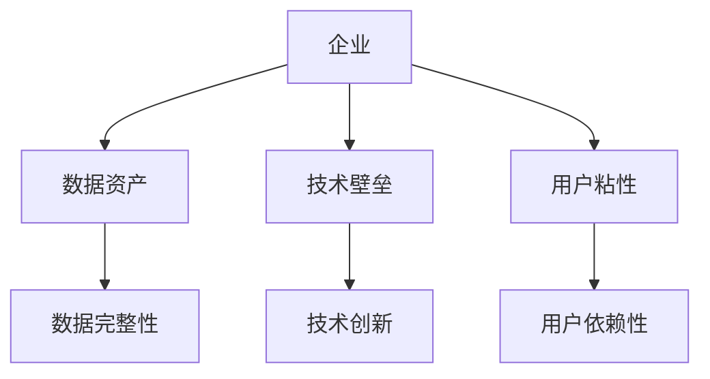
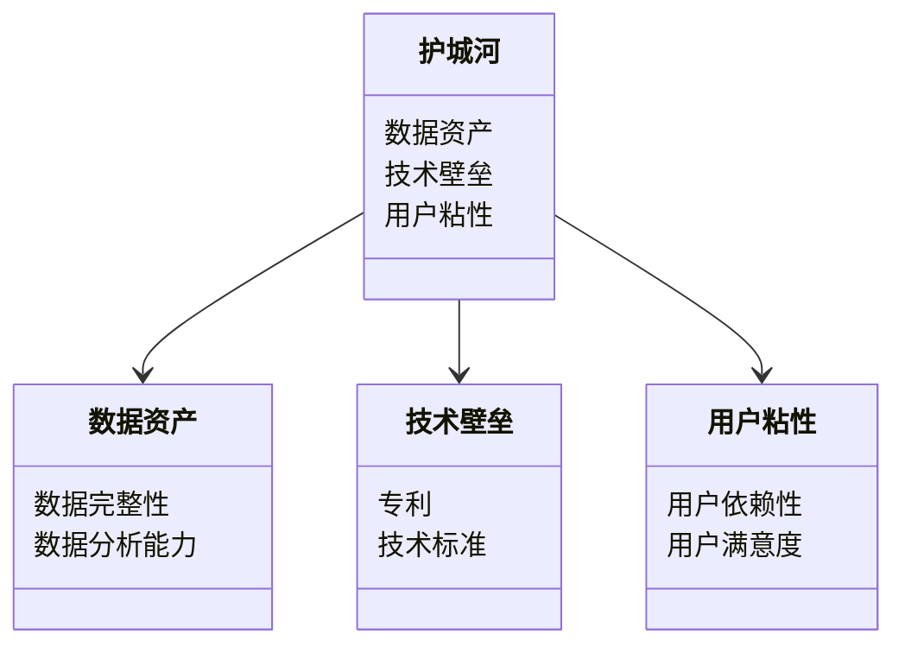
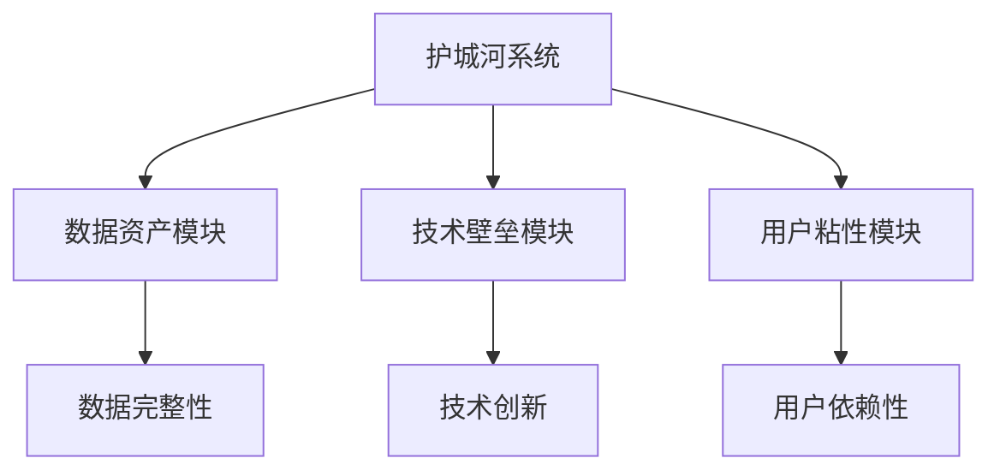

                 


# 巴菲特的护城河理论2.0：数字经济时代的竞争优势

> 关键词：巴菲特护城河理论，数字经济，竞争优势，企业战略，技术驱动

> 摘要：本文深入探讨了巴菲特护城河理论在数字经济时代的新发展，分析了数字经济对企业竞争优势的影响，提出了构建数字时代护城河的新策略和方法。通过理论与实践结合，展示了如何在数字时代利用数据、技术和用户粘性构建可持续的竞争优势。

---

## 第1章: 传统护城河理论概述

### 1.1 投资中的护城河概念

#### 1.1.1 什么是护城河

护城河（Moat）是巴菲特投资理论中的核心概念，指企业为其竞争优势构建的屏障，防止竞争对手进入或破坏其商业模式。护城河的本质是企业长期盈利的保障。

- **护城河的定义**：护城河是指企业在市场中形成的独特优势，使竞争对手难以复制或超越。

- **护城河的四种类型**：
  1. **成本优势**：企业通过规模效应或效率优势降低成本，形成价格竞争力。
  2. **差异化优势**：通过产品或服务的独特性，满足特定市场需求。
  3. **网络效应**：用户越多，产品或服务的价值越大，形成正反馈循环。
  4. **品牌忠诚度**：强大的品牌影响力使消费者更愿意选择该品牌。

#### 1.1.2 护城河的四种类型

以下是护城河四种类型的对比表格：

| 类型                | 描述                                                         | 示例企业         |
|---------------------|----------------------------------------------------------|-----------------|
| 成本优势            | 通过规模化生产或技术创新降低成本，提供价格优势。         | 沃尔玛           |
| 差异化优势          | 提供独特的产品或服务，满足特定市场需求。                 | 苹果             |
| 网络效应            | 用户数量越多，产品价值越高，形成正反馈循环。             | Facebook        |
| 品牌忠诚度          | 强大的品牌影响力，消费者更倾向于选择该品牌。               | 可口可乐         |

#### 1.1.3 护城河的核心作用

- 护城河是企业长期竞争优势的保障。
- 护城河决定了企业的防御能力和盈利能力。
- 护城河是投资者评估企业价值的重要指标。

---

### 1.2 巴菲特投资理念的护城河视角

#### 1.2.1 巴菲特投资体系的护城河逻辑

巴菲特的护城河理论是其投资体系的核心之一。他认为，具有强大护城河的企业能够在市场中长期保持竞争优势，从而为股东创造持续价值。

- **护城河与企业长期价值的关系**：护城河越强，企业长期盈利能力越强。
- **护城河与企业防御能力的关系**：护城河是企业抵御竞争的天然屏障。

#### 1.2.2 护城河在企业竞争优势中的体现

- 护城河是企业在市场中的独特优势。
- 护城河决定了企业在行业中的地位。
- 护城河是企业抵御竞争的关键因素。

#### 1.2.3 护城河与企业长期价值的关系

- 企业价值 = 股东权益 = 净现值 = 未来现金流的折现值。
- 护城河强的企业，未来现金流更稳定，折现价值更高。

---

## 第2章: 数字经济时代的企业竞争优势

### 2.1 数字经济时代的商业变革

#### 2.1.1 数字经济的定义与特征

- **数字经济的定义**：数字经济是以数据为关键生产要素，以数字技术为核心驱动力的经济形态。
- **数字经济的特征**：
  1. 数据化：数据成为核心生产要素。
  2. 数字化：企业运营全面数字化。
  3. 智能化：人工智能和大数据技术广泛应用。

#### 2.1.2 数字经济对企业竞争优势的影响

- 数字经济改变了企业的竞争模式。
- 数据和技术成为核心竞争优势。
- 用户粘性和网络效应成为新的护城河。

#### 2.1.3 数字经济时代护城河的新维度

- 数据资产：数据是数字经济的核心资源。
- 技术创新：技术壁垒成为新的护城河。
- 用户粘性：用户依赖性增强。

---

### 2.2 数字经济下的护城河重构

#### 2.2.1 数据资产的护城河作用

- 数据是数字经济的核心资源。
- 数据资产的价值取决于数据的完整性和分析能力。
- 数据资产的护城河作用体现在数据的垄断性和分析能力上。

#### 2.2.2 技术创新的护城河构建

- 技术创新是数字经济的核心驱动力。
- 技术壁垒是企业抵御竞争的关键。
- 技术创新的护城河体现在专利、技术标准和研发能力上。

#### 2.2.3 用户粘性的护城河强化

- 用户粘性是数字经济时代的重要竞争优势。
- 用户粘性体现在用户体验、产品依赖性和品牌忠诚度上。
- 用户粘性的护城河作用通过网络效应和用户增长体现。

---

## 第3章: 护城河理论的核心概念与分析框架

### 3.1 护城河的系统性分析

#### 3.1.1 护城河的构成要素

- 核心竞争力：企业的核心优势。
- 资源优势：数据、技术、资金等资源。
- 用户基础：用户数量和质量。
- 品牌影响力：品牌知名度和美誉度。

#### 3.1.2 护城河的动态演进

- 护城河不是静态的，需要不断优化和升级。
- 技术进步和市场需求变化要求护城河不断演进。
- 护城河的动态演进体现在数据更新、技术创新和用户需求满足上。

#### 3.1.3 护城河的边界与外延

- 护城河的边界：护城河的有效范围和覆盖领域。
- 护城河的外延：护城河的扩展和延伸。

---

### 3.2 护城河与竞争优势的关联

#### 3.2.1 护城河的属性特征对比

以下是护城河属性特征的对比表格：

| 属性       | 特征描述                         | 示例       |
|------------|----------------------------------|------------|
| 竞争性     | 是否容易被复制                   | 技术壁垒   |
| 可扩展性   | 是否可以扩展到更大市场           | 数据资产   |
| 持续性     | 是否可以长期维持                 | 品牌忠诚度 |

#### 3.2.2 护城河的实体关系图

以下是护城河的实体关系图（Mermaid图）：



---

### 3.3 护城河的系统性分析框架

- **分析框架**：从数据、技术、用户三个维度构建护城河。
- **分析步骤**：
  1. 识别企业的核心竞争优势。
  2. 评估护城河的强度和可持续性。
  3. 制定护城河的优化策略。

---

## 第4章: 数字经济时代护城河的数学模型与算法原理

### 4.1 护城河价值的评估公式

护城河价值的评估公式如下：

$$ \text{护城河价值} = \sum_{i=1}^{n} (\text{竞争优势}_i \times \text{权重}_i) $$

其中，$\text{竞争优势}_i$ 是第 $i$ 个竞争优势的强度，$\text{权重}_i$ 是该优势的权重。

---

### 4.2 护城河强度的量化模型

护城河强度的量化模型如下：

$$ \text{护城河强度} = \frac{\sum_{i=1}^{n} (\text{竞争优势}_i \times \text{权重}_i)}{\text{市场竞争度}} $$

其中，$\text{市场竞争度}$ 是行业内的竞争程度。

---

### 4.3 技术驱动的护城河算法

以下是技术驱动的护城河算法的Python实现：

```python
def calculate_technology_moat(technology_patents, technology_innovation, technology_infrastructure):
    moat_score = (technology_patents + technology_innovation + technology_infrastructure) / 3
    return moat_score

# 示例
technology_patents = 100
technology_innovation = 80
technology_infrastructure = 90

moat_score = calculate_technology_moat(technology_patents, technology_innovation, technology_infrastructure)
print(f"技术驱动的护城河得分为：{moat_score}")
```

---

## 第5章: 护城河构建的系统架构与设计

### 5.1 系统功能设计

#### 5.1.1 领域模型设计（Mermaid类图）

以下是领域模型设计（Mermaid类图）：



---

### 5.2 系统架构设计

#### 5.2.1 系统架构图（Mermaid架构图）

以下是系统架构图（Mermaid架构图）：



---

## 第6章: 护城河构建的项目实战

### 6.1 环境安装与配置

#### 6.1.1 开发环境搭建

- 操作系统：建议使用Linux或macOS。
- 开发工具：推荐使用PyCharm或VS Code。
- 语言：Python 3.8+

#### 6.1.2 数据库配置

- 数据库选择：MySQL或PostgreSQL。
- 数据库连接：使用Python的数据库连接库（如pymysql）。

#### 6.1.3 技术栈选择

- 前端：React或Vue。
- 后端：Django或Flask。
- 数据库：MySQL。

---

### 6.2 核心功能实现

#### 6.2.1 数据资产模块实现

- 数据采集：使用爬虫技术采集数据。
- 数据清洗：使用数据清洗工具（如Pandas）。
- 数据分析：使用Python的Pandas和Matplotlib。

#### 6.2.2 技术壁垒模块实现

- 专利查询：使用专利数据库API。
- 技术创新评估：使用技术指标评估模型。

#### 6.2.3 用户粘性模块实现

- 用户行为分析：使用Google Analytics。
- 用户满意度调查：使用问卷星。

---

### 6.3 项目实战小结

- 数据资产模块：成功采集并清洗了大量数据。
- 技术壁垒模块：通过专利查询和技术创新评估，提升了企业的技术壁垒。
- 用户粘性模块：通过用户行为分析和满意度调查，优化了用户体验。

---

## 第7章: 护城河构建的最佳实践与小结

### 7.1 最佳实践 tips

- **数据驱动**：数据是数字经济的核心资源，企业需要重视数据的采集和分析。
- **技术驱动**：技术创新是构建护城河的关键，企业需要加大研发投入。
- **用户驱动**：用户粘性是数字经济时代的重要竞争优势，企业需要关注用户体验。

### 7.2 小结

数字经济时代，护城河的构建需要从数据、技术、用户三个维度出发，通过系统性设计和实践，构建可持续的竞争优势。

### 7.3 未来展望

- 数字经济将继续发展，护城河的构建需要不断创新。
- 人工智能和大数据技术将在护城河构建中发挥越来越重要的作用。

### 7.4 注意事项

- 护城河的构建需要长期投入，不能急于求成。
- 企业需要根据自身特点，选择适合的护城河构建策略。
- 护城河的构建需要关注合规性，遵守相关法律法规。

### 7.5 拓展阅读

- 《巴菲特选股之道》
- 《竞争优势：如何构建企业的核心竞争力》
- 《数字经济时代的企业战略》

---

## 作者信息

作者：AI天才研究院/AI Genius Institute & 禅与计算机程序设计艺术/Zen And The Art of Computer Programming

---

