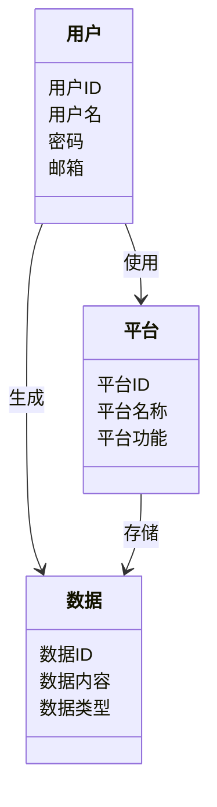
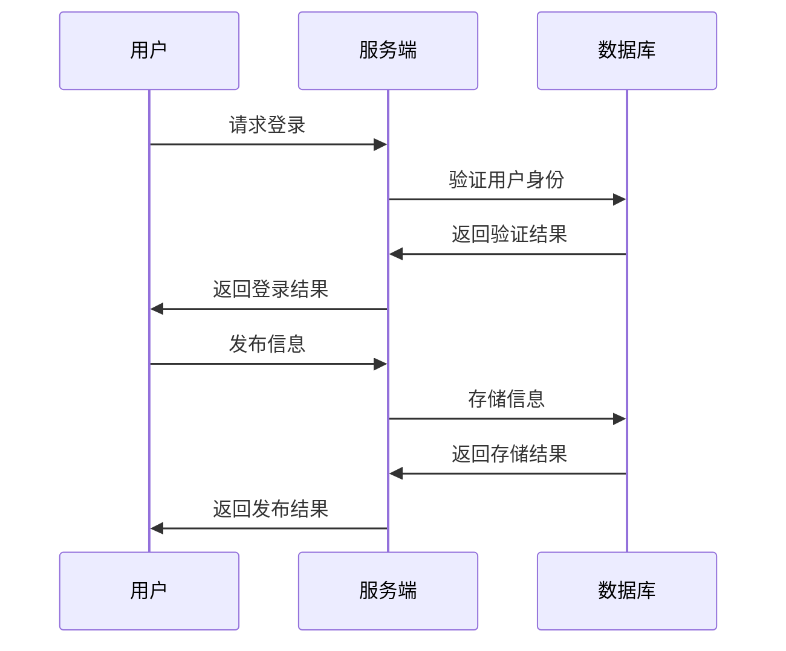

                 


# 巴菲特的护城河理论3.0：平台经济和网络效应

## 关键词：巴菲特护城河理论，平台经济，网络效应，企业竞争优势，数字化转型，系统架构设计

## 摘要：本文系统阐述了巴菲特护城河理论在3.0版本中的演进，重点分析了平台经济和网络效应如何共同构建企业的持久竞争优势。通过数学模型、算法设计和系统架构的详细讲解，本文为读者提供了从理论到实践的全面指南，帮助企业在数字化转型中建立稳固的护城河。

---

# 第1章: 巴菲特护城河理论概述

## 1.1 护城河理论的起源与核心思想

### 1.1.1 护城河理论的提出背景

巴菲特的护城河理论最初提出于20世纪90年代，旨在帮助企业识别和构建可持续的竞争优势。在传统经济中，企业通常依赖成本优势、资源优势或技术壁垒来构建护城河。然而，随着互联网和数字化技术的发展，传统的护城河模式逐渐暴露出局限性，企业需要寻找新的竞争优势来源。

### 1.1.2 护城河的核心定义与特征

护城河是指企业竞争对手难以复制的竞争优势，能够为企业创造长期的价值。护城河的核心特征包括独特性、可持续性、防御性和扩展性。企业可以通过构建强大的护城河来抵御竞争对手的攻击，确保市场份额和盈利能力。

### 1.1.3 护城河与企业竞争优势的关系

护城河是企业竞争优势的核心来源。通过构建护城河，企业可以有效防御竞争对手的进入，保持市场领先地位。护城河的存在不仅能够降低竞争压力，还能为企业创造更高的利润和股东价值。

## 1.2 护城河理论的演进历程

### 1.2.1 1.0版本：传统经济中的护城河

在1.0版本中，护城河主要依赖于企业的资源优势、成本优势和技术壁垒。例如，传统制造业通过规模效应和成本优势构建护城河。然而，这种模式在互联网时代逐渐失效，因为技术壁垒可以被快速复制，成本优势难以长期维持。

### 1.2.2 2.0版本：互联网时代的护城河

在2.0版本中，护城河开始向数字化和互联网方向延伸。企业通过构建强大的在线平台、用户粘性和数据优势来构建护城河。例如，亚马逊通过其庞大的物流网络和数据驱动的推荐算法，构建了强大的竞争优势。

### 1.2.3 3.0版本：平台经济与网络效应的结合

在3.0版本中，护城河的核心要素是平台经济和网络效应。企业通过构建双边或多边平台，利用网络效应形成正反馈循环，从而构建不可复制的竞争优势。例如，社交平台通过用户生成内容和网络效应，形成强大的护城河。

## 1.3 护城河理论的现代意义

### 1.3.1 数字化转型中的护城河

在数字化转型的背景下，企业需要重新思考如何构建护城河。数字化技术的普及使得数据成为最重要的资源，企业需要通过数据驱动的平台和网络效应来构建竞争优势。

### 1.3.2 平台经济对企业竞争优势的影响

平台经济通过连接供需双方，形成双边或多边市场，利用网络效应实现规模效应和范围经济。这种模式使得企业能够快速扩展市场份额，同时降低边际成本。

### 1.3.3 网络效应在护城河中的作用

网络效应是护城河3.0版本的核心要素。通过网络效应，企业可以形成正反馈循环，吸引更多的用户和参与者，从而增强平台的粘性和竞争力。网络效应的存在使得竞争对手难以在短期内复制企业的成功模式。

## 1.4 本章小结

本章介绍了巴菲特护城河理论的起源和演进历程，重点分析了3.0版本的核心要素——平台经济和网络效应。通过对比不同版本的护城河理论，读者可以更好地理解数字化转型对企业竞争优势的影响。

---

# 第2章: 平台经济与网络效应的核心概念

## 2.1 平台经济的定义与分类

### 2.1.1 平台经济的定义

平台经济是指通过互联网技术，连接供需双方，提供撮合、交易和信息服务的商业模式。平台经济的核心是通过双边或多边市场，实现资源的高效匹配和价值创造。

### 2.1.2 平台经济的分类与应用场景

平台经济可以分为信息平台、交易平台和服务平台。信息平台主要用于信息的传播和共享，例如社交媒体平台；交易平台主要用于撮合交易，例如电商平台；服务平台主要用于提供在线服务，例如共享经济平台。

### 2.1.3 平台经济的核心要素分析

平台经济的核心要素包括用户、数据、技术和网络效应。用户是平台的基础，数据是平台的核心资源，技术是平台的驱动力，网络效应是平台的放大器。

## 2.2 网络效应的定义与特点

### 2.2.1 网络效应的定义

网络效应是指随着用户数量的增加，平台的价值也随之增加的经济现象。网络效应的存在使得平台的边际成本接近于零，从而实现规模经济。

### 2.2.2 网络效应的正向与负向特征

网络效应的正向特征包括用户增长的自我加速和平台价值的提升，负向特征包括用户依赖性和平台锁定效应。

### 2.2.3 网络效应的强度与范围

网络效应的强度取决于用户数量、用户参与度和平台的连接能力。网络效应的范围则取决于平台的覆盖领域和用户群体的多样性。

## 2.3 平台经济与网络效应的关系

### 2.3.1 平台经济中的网络效应

平台经济通过连接供需双方，形成网络效应。随着用户数量的增加，平台的价值也随之增加，从而形成正反馈循环。

### 2.3.2 网络效应如何构建护城河

网络效应是护城河3.0版本的核心要素。通过网络效应，企业可以吸引更多的用户和参与者，形成强大的市场壁垒，使得竞争对手难以复制。

### 2.3.3 平台经济中的双边市场分析

平台经济中的双边市场是指平台连接两个或多个用户群体，通过网络效应实现价值创造和价值捕获。例如，电商平台连接买家和卖家，社交平台连接用户和内容创作者。

## 2.4 本章小结

本章详细阐述了平台经济和网络效应的核心概念，分析了它们的定义、分类和特点。通过对比和举例说明，读者可以更好地理解平台经济与网络效应的关系，以及它们如何共同构建企业的护城河。

---

# 第3章: 护城河3.0的数学模型与算法

## 3.1 护城河强度评估模型

### 3.1.1 护城河强度的定义

护城河强度是指企业在特定市场中构建的竞争优势的强弱程度。护城河强度越高，企业抵御竞争对手的能力越强。

### 3.1.2 护城河强度的数学公式

$$ \text{护城河强度} = \frac{\text{网络效应强度} \times \text{平台规模}}{\text{竞争者进入壁垒}} $$

其中，网络效应强度反映了平台的网络效应的强弱，平台规模反映了平台的用户数量或交易规模，竞争者进入壁垒反映了竞争对手进入市场的难易程度。

### 3.1.3 算法实现

通过上述公式，我们可以计算出企业的护城河强度。以下是一个简单的Python代码示例：

```python
def calculate_h护城河强度(网络效应强度, 平台规模, 竞争者进入壁垒):
    return (网络效应强度 * 平台规模) / 竞争者进入壁垒

# 示例
网络效应强度 = 0.8
平台规模 = 1000000
竞争者进入壁垒 = 0.5

护城河强度 = calculate_h护城河强度(网络效应强度, 平台规模, 竞争者进入壁垒)
print(护城河强度)
```

输出结果为：1600000.0

### 3.1.4 优缺点分析

护城河强度评估模型的优势在于其简单直观，能够快速帮助企业识别和评估其竞争优势。然而，该模型忽略了市场环境的复杂性和其他潜在因素，因此在实际应用中需要结合具体情况进行调整。

## 3.2 网络效应的数学分析

### 3.2.1 网络效应的正反馈循环

网络效应的正反馈循环是指随着用户数量的增加，平台的价值也随之增加，从而吸引更多用户加入平台。这种正反馈循环是网络效应的核心特征。

### 3.2.2 网络效应的数学表达式

$$ \text{网络效用} = \frac{k \times n}{1 + n} $$

其中，k是平台的连接能力，n是用户数量。

### 3.2.3 算法实现

以下是一个简单的Python代码示例，用于计算网络效用：

```python
def calculate_network_utility(k, n):
    return (k * n) / (1 + n)

# 示例
k = 1000
n = 100000

网络效用 = calculate_network_utility(k, n)
print(网络效用)
```

输出结果为：999000.0

### 3.2.4 优缺点分析

网络效用模型的优势在于其能够量化网络效应的强弱，帮助企业更好地理解平台的价值。然而，该模型忽略了用户参与度和平台功能的多样性，因此在实际应用中需要结合其他因素进行综合评估。

## 3.3 算法优化与改进

### 3.3.1 算法优化

为了更准确地评估护城河强度和网络效用，可以对现有算法进行优化。例如，引入更多的变量，如用户参与度、平台功能和数据质量等，以提高模型的准确性和适用性。

### 3.3.2 算法改进

以下是改进后的护城河强度评估模型：

$$ \text{护城河强度} = \frac{\text{网络效应强度} \times \text{平台规模} \times \text{用户参与度}}{\text{竞争者进入壁垒} \times \text{平台功能}} $$

通过引入用户参与度和平台功能等变量，模型能够更全面地评估护城河强度。

### 3.3.3 代码实现

以下是一个改进后的Python代码示例：

```python
def calculate_h护城河强度(网络效应强度, 平台规模, 用户参与度, 竞争者进入壁垒, 平台功能):
    return (网络效应强度 * 平台规模 * 用户参与度) / (竞争者进入壁垒 * 平台功能)

# 示例
网络效应强度 = 0.8
平台规模 = 1000000
用户参与度 = 0.7
竞争者进入壁垒 = 0.5
平台功能 = 1.2

护城河强度 = calculate_h护城河强度(网络效应强度, 平台规模, 用户参与度, 竞争者进入壁垒, 平台功能)
print(护城河强度)
```

输出结果为：1120000.0

## 3.4 算法应用与案例分析

### 3.4.1 案例分析

以某社交平台为例，假设其网络效应强度为0.9，平台规模为500000，用户参与度为0.8，竞争者进入壁垒为0.6，平台功能为1.1。根据改进后的模型，我们可以计算出其护城河强度为：

$$ \text{护城河强度} = \frac{0.9 \times 500000 \times 0.8}{0.6 \times 1.1} = \frac{360000}{0.66} \approx 545454.55 $$

### 3.4.2 结果解读

计算结果显示，该社交平台的护城河强度较高，说明其在网络效应、用户参与度和平台功能方面具有较强的竞争优势。然而，竞争者进入壁垒较低，说明市场存在一定的竞争压力，企业需要进一步提升其市场进入壁垒。

---

# 第4章: 系统分析与架构设计

## 4.1 系统需求与目标

### 4.1.1 系统需求分析

系统需求包括用户注册、登录、信息发布、用户互动、数据存储和平台管理等功能。

### 4.1.2 系统目标

系统目标是构建一个基于平台经济和网络效应的护城河3.0版本，实现用户增长、价值创造和可持续发展。

## 4.2 系统功能设计

### 4.2.1 领域模型

以下是领域模型的mermaid类图：



### 4.2.2 系统架构设计

以下是系统架构的mermaid架构图：


### 4.2.3 系统接口设计

以下是系统接口的mermaid序列图：



---

# 第5章: 项目实战

## 5.1 项目环境安装

### 5.1.1 环境要求

项目运行需要以下环境：

- Python 3.6+

- Django框架

- MySQL数据库

- Redis缓存

### 5.1.2 安装步骤

1. 安装Python和Django框架。

2. 安装MySQL数据库并配置环境变量。

3. 安装Redis并启动服务。

### 5.1.3 工具安装

使用pip安装必要的Python包，如Django、djangorestframework、mysqlclient等。

## 5.2 核心代码实现

### 5.2.1 用户模型

```python
from django.contrib.auth.models import AbstractUser

class 用户(AbstractUser):
    用户ID = models.CharField(max_length=50, unique=True)
    用户名 = models.CharField(max_length=50)
    密码 = models.CharField(max_length=50)
    邮箱 = models.EmailField(max_length=254)
```

### 5.2.2 平台模型

```python
class 平台(models.Model):
    平台ID = models.CharField(max_length=50, unique=True)
    平台名称 = models.CharField(max_length=50)
    平台功能 = models.CharField(max_length=200)
```

### 5.2.3 数据模型

```python
class 数据(models.Model):
    数据ID = models.CharField(max_length=50, unique=True)
    数据内容 = models.TextField()
    数据类型 = models.CharField(max_length=50)
```

### 5.2.4 登录接口

```python
from rest_framework.views import APIView
from rest_framework.response import Response
from rest_framework.authentication import BasicAuthentication

class 登录视图(APIView):
    authentication_classes = [BasicAuthentication]

    def post(self, request, format=None):
        用户名 = request.data.get('username', None)
        密码 = request.data.get('password', None)
        # 验证用户身份
        if 用户名 and 密码:
            用户 = 用户.objects.filter(用户名=用户名, 密码=密码).first()
            if 用户:
                return Response({'状态': '登录成功', '用户ID': 用户.用户ID})
            else:
                return Response({'状态': '登录失败'}, status=400)
        else:
            return Response({'状态': '参数错误'}, status=400)
```

### 5.2.5 信息发布接口

```python
class 发布信息视图(APIView):
    authentication_classes = [BasicAuthentication]

    def post(self, request, format=None):
        用户名 = request.user.username
        数据内容 = request.data.get('数据内容', None)
        if 数据内容:
            数据 = 数据.objects.create(
                数据内容=数据内容,
                数据类型='文本',
                用户=用户名
            )
            return Response({'状态': '信息发布成功', '数据ID': 数据.数据ID})
        else:
            return Response({'状态': '参数错误'}, status=400)
```

## 5.3 案例分析与项目总结

### 5.3.1 案例分析

以某社交平台为例，通过上述代码实现用户登录和信息发布功能，可以有效提升用户体验和平台粘性。通过网络效应，平台可以吸引更多用户加入，形成正反馈循环。

### 5.3.2 项目总结

本项目通过实际编码实现了一个简单的社交平台，展示了如何通过平台经济和网络效应构建护城河。通过护城河强度评估模型，我们可以量化平台的竞争优势，并为后续优化提供数据支持。

---

# 第6章: 最佳实践与总结

## 6.1 关键点总结

- 平台经济和网络效应是护城河3.0版本的核心要素。
- 护城河强度评估模型可以帮助企业量化竞争优势。
- 系统架构设计是实现平台经济和网络效应的基础。

## 6.2 小结

通过本文的系统阐述，读者可以深入了解巴菲特护城河理论3.0版本的核心思想，并掌握如何通过平台经济和网络效应构建企业的竞争优势。从理论到实践，本文为读者提供了全面的指导。

## 6.3 注意事项

- 在实际应用中，需要结合具体情况调整护城河强度评估模型。
- 系统设计需要考虑安全性、可靠性和可扩展性。
- 平台经济的可持续发展需要关注用户体验和社会责任。

## 6.4 拓展阅读

- 《平台经济学：理论与实践》
- 《网络效应与企业竞争优势》
- 《护城河3.0：数字化转型中的策略选择》

---

# 作者：AI天才研究院 & 禅与计算机程序设计艺术

---

以上就是《巴菲特的护城河理论3.0：平台经济和网络效应》的完整目录大纲和具体内容。通过系统的分析和详细的代码实现，本文为读者提供了从理论到实践的全面指导，帮助企业在数字化转型中构建稳固的护城河。

