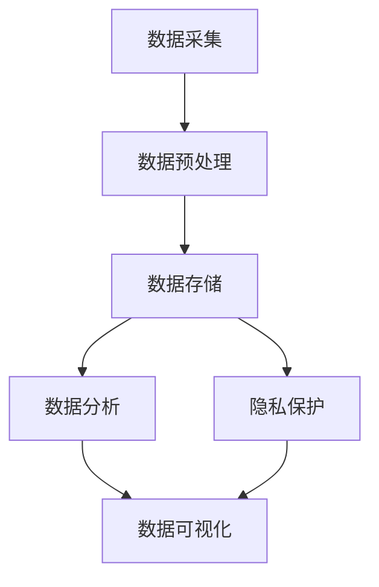
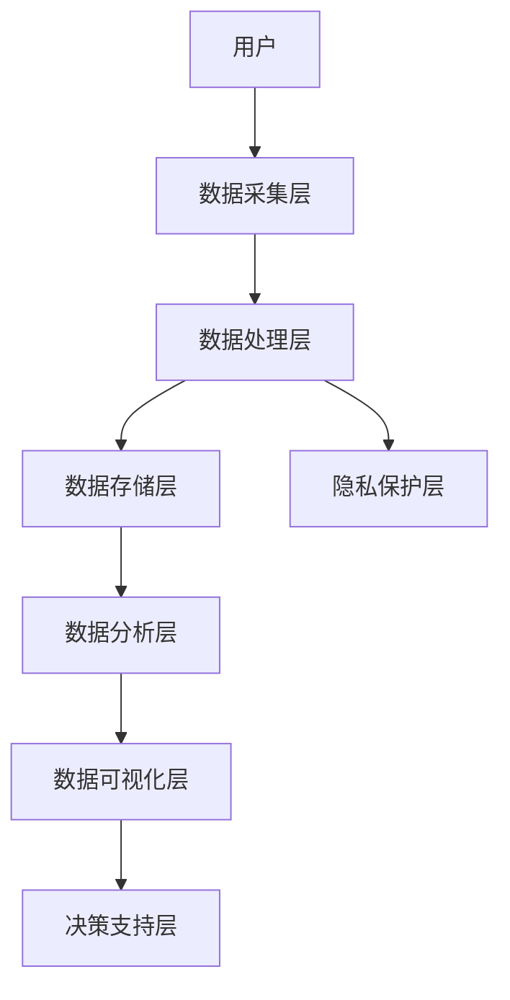
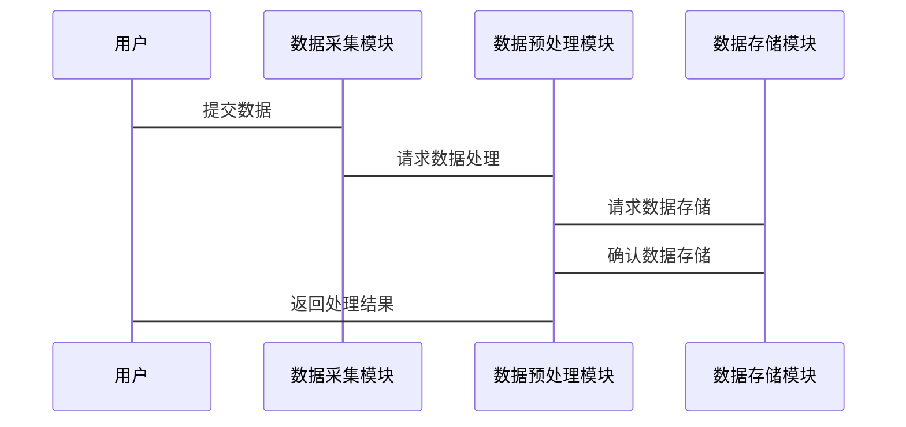

                 


# 巴菲特的护城河理论4.0：数据垄断与隐私保护的平衡

---

## 关键词：  
- 巴菲特护城河理论  
- 数据垄断  
- 隐私保护  
- 数据隐私平衡  
- 竞争优势  

---

## 摘要：  
本文深入探讨了巴菲特护城河理论在数据垄断与隐私保护领域的最新发展。在数字化时代，数据已成为企业的核心资产，而数据垄断为企业提供了强大的竞争优势。然而，随着隐私保护法规的日益严格，如何在数据垄断与隐私保护之间找到平衡成为企业面临的重要挑战。本文从理论分析、技术实现、系统设计和实际案例等多个维度，详细阐述了数据垄断与隐私保护的平衡之道，为企业构建可持续的竞争优势提供指导。

---

# 第1章: 巴菲特护城河理论的背景与演变

## 1.1 投资中的护城河概念

### 1.1.1 护城河的定义与核心要素  
巴菲特的护城河理论是投资学中的经典理论，核心在于识别那些能够长期保持竞争优势的企业。护城河的五大核心要素包括：  
1. **成本优势**：企业通过规模经济或技术优势降低成本。  
2. **品牌优势**：强大的品牌影响力吸引客户。  
3. **网络效应**：产品或服务的价值随用户数量增加而提升。  
4. **专利与知识产权**：通过专利和技术壁垒形成竞争优势。  
5. **文化与制度**：高效的组织文化和制度优势。  

### 1.1.2 护城河理论的历史演变  
- **1.0 版本**：巴菲特早期的护城河理论主要关注企业的成本优势和品牌影响力。  
- **2.0 版本**：互联网时代的护城河理论开始关注网络效应和数据积累。  
- **3.0 版本**：移动互联网时代，护城河理论进一步扩展到技术壁垒和用户粘性。  
- **4.0 版本**：数据垄断与隐私保护的平衡成为新的护城河核心。  

### 1.1.3 数据垄断与护城河的新维度  
在数字时代，数据已成为企业的核心资产。数据垄断通过控制数据的采集、存储和分析，为企业构建强大的竞争优势。然而，数据垄断的滥用可能引发隐私泄露、反垄断监管等风险。因此，如何在数据垄断与隐私保护之间找到平衡点，成为护城河理论4.0的核心命题。

---

## 1.2 数据垄断的概念与特征

### 1.2.1 数据垄断的定义  
数据垄断是指企业通过控制数据的采集、存储和分析，形成对市场、用户或技术的绝对或相对控制权。  

### 1.2.2 数据垄断的核心特征对比  
以下是数据垄断与传统护城河的对比分析：  

| **特征**       | **数据垄断**              | **传统护城河**            |  
|----------------|--------------------------|--------------------------|  
| 核心资源       | 数据                      | 成本、品牌、网络效应等    |  
| 竞争优势来源   | 数据分析与决策支持      | 低成本、品牌影响力等      |  
| 可扩展性       | 高（数据可以无限扩展）    | 低（传统资源有限）        |  
| 隐私风险       | 高（数据泄露风险）        | 低（传统资源泄露风险低）  |  

### 1.2.3 数据垄断与隐私保护的平衡点  
数据垄断的核心是数据控制，而隐私保护的核心是用户数据的安全与合规性。两者的平衡点在于：如何在合法合规的前提下，最大化数据的价值，同时保护用户隐私。  

---

## 1.3 数据垄断与隐私保护的冲突与平衡

### 1.3.1 数据垄断对竞争优势的影响  
数据垄断通过以下方式为企业创造竞争优势：  
1. **精准营销**：通过数据分析实现个性化推荐，提高转化率。  
2. **成本优化**：通过数据驱动的决策降低运营成本。  
3. **技术创新**：数据垄断为企业提供充足的数据支持，加速技术创新。  

### 1.3.2 隐私保护的法律与伦理挑战  
随着《通用数据保护条例》（GDPR）等法律法规的出台，数据垄断企业面临越来越严格的隐私保护要求。企业必须在数据的收集、存储和使用过程中，确保用户的知情权和选择权，避免隐私泄露风险。  

### 1.3.3 数据垄断与隐私保护的平衡点  
1. **数据最小化原则**：仅收集实现业务目标所需的最少数据。  
2. **数据匿名化处理**：通过技术手段将数据去标识化，降低隐私泄露风险。  
3. **数据加密与安全存储**：采用加密技术保护数据，确保数据存储安全。  
4. **用户隐私透明化**：向用户明示数据收集和使用的目的、方式，并获得用户授权。  

---

# 第2章: 数据垄断与隐私保护的核心概念

## 2.1 数据垄断的原理与机制

### 2.1.1 数据垄断的形成机制  
数据垄断的形成机制包括数据采集、数据存储和数据分析三个阶段：  
1. **数据采集**：通过产品或服务收集用户数据。  
2. **数据存储**：将数据存储在数据库中，形成数据资产。  
3. **数据分析**：通过对数据的挖掘和分析，提取有价值的信息，形成竞争优势。  

### 2.1.2 数据垄断的经济学分析  
从经济学角度看，数据垄断的形成是市场力量和网络效应的结果。当企业通过数据积累形成网络效应时，用户的粘性和数据的价值会呈指数级增长。  

### 2.1.3 数据垄断的数学模型  
以下是数据垄断的经济学模型：  
$$ \text{竞争优势} = f(\text{数据量}, \text{数据分析能力}, \text{网络效应}) $$  

---

## 2.2 隐私保护的法律框架与技术手段

### 2.2.1 隐私保护的法律体系  
隐私保护的法律体系包括以下三个层次：  
1. **国际层面**：如OECD的隐私保护框架。  
2. **国家层面**：如欧盟的GDPR、美国的CCPA。  
3. **行业层面**：如金融行业的《支付卡行业数据安全标准》。  

### 2.2.2 数据加密与匿名化技术  
1. **数据加密**：使用AES、RSA等加密算法保护数据。  
2. **数据匿名化**：通过数据脱敏技术（如哈希函数）去除用户标识。  

### 2.2.3 隐私计算的实现原理  
隐私计算的核心是通过加密计算和多方计算技术，在不泄露原始数据的前提下，实现数据的联合分析。  

---

## 2.3 数据垄断与隐私保护的关系分析

### 2.3.1 数据垄断对隐私的影响  
数据垄断可能引发以下隐私风险：  
1. **数据滥用**：企业可能将数据用于未经授权的用途。  
2. **数据泄露**：数据存储不当可能导致用户隐私泄露。  

### 2.3.2 隐私保护对数据垄断的制约  
隐私保护的法律法规可能对数据垄断形成以下制约：  
1. **数据收集限制**：企业可能无法收集某些敏感数据。  
2. **数据使用限制**：企业在使用数据时需要遵守严格的隐私保护要求。  

### 2.3.3 两者平衡的必要性与可行性  
数据垄断与隐私保护的平衡是可能实现的。企业可以通过以下方式实现平衡：  
1. **数据最小化原则**：只收集必要的数据。  
2. **数据匿名化处理**：保护用户隐私的同时利用数据。  
3. **用户隐私透明化**：向用户明示数据使用目的并获得授权。  

---

# 第3章: 数据垄断与隐私保护的数学模型与算法原理

## 3.1 数据垄断的数学模型

### 3.1.1 数据垄断的度量公式  
数据垄断的度量可以通过以下公式实现：  
$$ \text{数据垄断度} = \frac{\text{数据控制力}}{\text{市场竞争度}} $$  

### 3.1.2 数据垄断对市场竞争力的影响模型  
数据垄断对市场竞争力的影响模型可以表示为：  
$$ \text{市场竞争力} = f(\text{数据垄断度}, \text{数据分析能力}, \text{网络效应}) $$  

### 3.1.3 数据垄断的经济学优化模型  
数据垄断的经济学优化模型可以通过以下公式表示：  
$$ \max \text{利润} = \text{收入} - \text{成本} $$  
$$ \text{收入} = f(\text{数据垄断度}, \text{用户需求}) $$  
$$ \text{成本} = f(\text{数据存储成本}, \text{数据分析成本}) $$  

---

## 3.2 隐私保护的算法实现

### 3.2.1 数据加密算法  
以下是AES加密算法的Python实现示例：  

```python
import hashlib

def encrypt_data(data):
    # 使用哈希函数对数据进行加密
    hashed_data = hashlib.sha256(data.encode()).hexdigest()
    return hashed_data

# 示例数据
data = "用户隐私数据"
print(encrypt_data(data))  # 输出加密后的数据
```

### 3.2.2 数据匿名化处理算法  
以下是数据匿名化处理的Python实现示例：  

```python
import pandas as pd

def anonymize_data(df):
    # 去除用户标识
    df.drop(columns=['用户ID'], inplace=True)
    # 数据脱敏处理
    df['年龄'] = df['年龄'].apply(lambda x: '>=25' if x >= 25 else '<25')
    return df

# 示例数据框
data = {
    '用户ID': [1, 2, 3],
    '年龄': [30, 20, 45]
}
df = pd.DataFrame(data)
print(anonymize_data(df))
```

---

## 3.3 数据隐私平衡的算法实现

### 3.3.1 数据隐私平衡的数学模型  
数据隐私平衡的数学模型可以通过以下公式表示：  
$$ \text{隐私保护度} = \frac{\text{数据匿名化程度}}{\text{数据可用性}} $$  

### 3.3.2 数据隐私平衡的实现步骤  
以下是数据隐私平衡的实现步骤：  
1. **数据匿名化处理**：对用户数据进行去标识化处理。  
2. **数据加密**：对敏感数据进行加密存储。  
3. **数据使用授权**：在使用数据时，获得用户的授权。  
4. **数据隐私透明化**：向用户明示数据使用目的和方式。  

---

# 第4章: 数据垄断与隐私保护的系统分析与架构设计

## 4.1 问题场景介绍  
企业在构建数据垄断时，需要解决以下问题：  
1. **数据隐私风险**：如何保护用户隐私。  
2. **数据使用合规性**：如何在合法合规的前提下利用数据。  
3. **数据安全风险**：如何防止数据泄露和滥用。  

## 4.2 系统功能设计  

### 4.2.1 系统功能模块  
系统功能模块包括：  
1. **数据采集模块**：负责数据的收集和预处理。  
2. **数据存储模块**：负责数据的存储和管理。  
3. **数据分析模块**：负责数据的挖掘和分析。  
4. **隐私保护模块**：负责数据的匿名化处理和加密存储。  

### 4.2.2 系统功能流程  
以下是系统功能流程的Mermaid图：  



## 4.3 系统架构设计  

### 4.3.1 系统架构图  
以下是系统架构图的Mermaid图：  



## 4.4 系统接口设计  

### 4.4.1 数据采集接口  
数据采集接口的定义如下：  
```json
{
    "接口名称": "采集用户数据",
    "请求方法": "POST",
    "请求URL": "/api/data/collect",
    "请求参数": {
        "用户ID": "string",
        "年龄": "integer",
        "性别": "string"
    }
}
```

---

## 4.5 系统交互流程  

### 4.5.1 数据采集与处理流程  
以下是数据采集与处理流程的Mermaid图：  



---

# 第5章: 数据垄断与隐私保护的项目实战

## 5.1 环境安装

### 5.1.1 项目环境要求  
项目环境要求如下：  
1. **操作系统**：Windows 10或更高版本，或Linux Ubuntu 18.04或更高版本。  
2. **编程语言**：Python 3.8或更高版本。  
3. **开发工具**：PyCharm或VS Code。  
4. **依赖库**：pandas、numpy、hashlib。  

### 5.1.2 安装依赖库  
安装依赖库的命令如下：  
```bash
pip install pandas numpy hashlib
```

---

## 5.2 核心代码实现

### 5.2.1 数据采集与预处理  
以下是数据采集与预处理的Python代码：  

```python
import pandas as pd
import numpy as np
import hashlib

def collect_data():
    # 数据采集模块
    data = {
        '用户ID': [1, 2, 3],
        '年龄': [30, 20, 45],
        '性别': ['男', '女', '男']
    }
    df = pd.DataFrame(data)
    return df

def preprocess_data(df):
    # 数据预处理模块
    df['年龄'] = df['年龄'].apply(lambda x: x if x >= 18 else 0)
    df['性别'] = df['性别'].apply(lambda x: 0 if x == '男' else 1)
    return df

# 数据采集与预处理
data = collect_data()
processed_data = preprocess_data(data)
print(processed_data)
```

### 5.2.2 数据存储与加密  
以下是数据存储与加密的Python代码：  

```python
def store_data(df):
    # 数据存储模块
    df.to_csv('processed_data.csv', index=False)

def encrypt_data(data):
    # 数据加密模块
    hashed_data = hashlib.sha256(data.encode()).hexdigest()
    return hashed_data

# 示例数据
data = "用户隐私数据"
print(encrypt_data(data))
```

---

## 5.3 代码应用解读与分析

### 5.3.1 数据采集与预处理  
数据采集模块通过字典形式收集用户数据，并将其转换为DataFrame格式。数据预处理模块对年龄和性别进行处理，确保数据符合后续分析的需求。  

### 5.3.2 数据存储与加密  
数据存储模块将处理后的数据保存为CSV文件。数据加密模块使用哈希函数对敏感数据进行加密，确保数据存储的安全性。  

### 5.3.3 项目小结  
通过本项目，我们实现了数据的采集、预处理、存储和加密，确保了数据的安全性和隐私性。同时，我们通过数据的最小化处理，实现了数据垄断与隐私保护的平衡。  

---

# 第6章: 数据垄断与隐私保护的最佳实践

## 6.1 小结  
在数字时代，数据垄断与隐私保护的平衡是企业构建护城河的重要挑战。通过数据的最小化处理、匿名化技术、加密存储和用户隐私透明化，企业可以在合法合规的前提下，最大化数据的价值。  

---

## 6.2 注意事项  
1. **合规性**：企业必须遵守相关法律法规，确保数据的合法收集和使用。  
2. **安全性**：企业必须采取严格的加密技术和安全措施，防止数据泄露。  
3. **透明化**：企业必须向用户明示数据使用目的和方式，并获得用户授权。  

---

## 6.3 拓展阅读  
1. **书籍推荐**：  
   - 《Data Analytics Made Accessible: A Tutorial》  
   - 《Big Data: A Revolution That Will Transform How We Live, Work, and Think》  
2. **技术博客**：  
   - Medium：数据科学与隐私保护的技术博客。  
   - Towards Data Science：数据科学领域的前沿技术博客。  

---

# 作者：AI天才研究院/AI Genius Institute & 禅与计算机程序设计艺术 /Zen And The Art of Computer Programming

