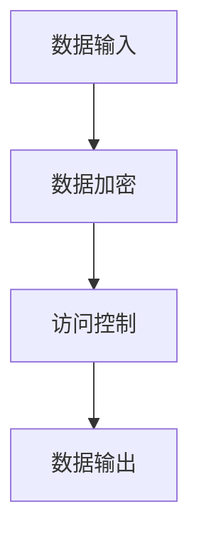
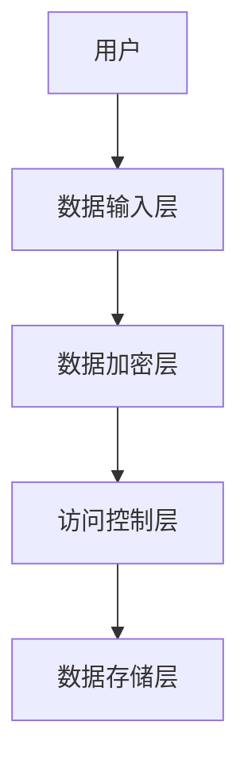

                 


# 巴菲特的护城河理论5.0：数据主权时代的竞争优势

> 关键词：巴菲特护城河理论，数据主权，竞争优势，企业战略，数据隐私，护城河5.0

> 摘要：本文深入探讨了巴菲特护城河理论在数据主权时代的演变与应用，分析了数据主权如何成为企业竞争优势的核心要素，详细阐述了数据主权对企业战略、竞争优势的影响，以及如何在算法和系统架构层面实现数据主权优势。通过实际案例分析和系统设计，本文为读者提供了从理论到实践的全面指导。

---

# 第一部分: 护城河理论的背景与核心概念

## 第1章: 护城河理论的定义与演变

### 1.1 护城河理论的定义

#### 1.1.1 什么是护城河
护城河（Moat）是巴菲特投资理论中的核心概念，指企业为了防止竞争对手侵入而构建的长期竞争优势。护城河的目的是通过某种独特的资源、能力或模式，使企业在市场中形成难以被模仿或超越的屏障。

#### 1.1.2 护城河的核心要素
护城河的核心要素包括：
1. **经济型护城河**：通过成本优势、规模效应等经济因素构建竞争优势。
2. **竞争优势型护城河**：通过品牌、客户忠诚度、专利等形成竞争优势。
3. **不可替代性**：企业的产品或服务具有不可替代性，客户难以转向其他竞争对手。

#### 1.1.3 护城河的分类与特点
护城河可以分为以下几类：
1. **宽护城河**：竞争优势明显，难以被竞争对手复制。
2. **窄护城河**：竞争优势较弱，容易被竞争对手模仿或超越。
3. **动态护城河**：竞争优势会随时间和市场变化而变化。

### 1.2 护城河理论的演变

#### 1.2.1 从巴菲特的护城河理论1.0到5.0
巴菲特的护城河理论经历了多个版本的演变：
1. **1.0版本**：基于传统经济因素（如成本优势、规模效应）构建竞争优势。
2. **2.0版本**：引入品牌和客户忠诚度作为核心竞争优势。
3. **3.0版本**：开始关注技术创新和知识产权的保护。
4. **4.0版本**：将网络效应和数据驱动的模式纳入护城河的构建。
5. **5.0版本**：在数据主权时代，护城河的核心转向数据隐私、合规性和技术主权。

#### 1.2.2 数据主权时代的护城河理论5.0
在数据主权时代，护城河的核心要素发生了显著变化。企业不再仅仅依赖传统的经济或品牌优势，而是通过数据的控制权、隐私保护和合规性构建竞争优势。

#### 1.2.3 护城河理论的边界与外延
护城河理论的边界在于如何平衡短期利益与长期竞争优势。外延则体现在数据主权、技术中台、生态系统等方面。

---

## 第2章: 数据主权的概念与重要性

### 2.1 数据主权的定义

#### 2.1.1 数据主权的内涵
数据主权（Data Sovereignty）是指数据的所有者对数据的控制权，包括数据的存储、处理、传输和使用等方面。数据主权的核心是企业对数据的自主权和隐私保护。

#### 2.1.2 数据主权的法律框架
数据主权的法律框架包括：
1. **数据存储地**：数据存储的物理位置和法律管辖范围。
2. **数据隐私法规**：如GDPR、CCPA等。
3. **数据跨境流动**：数据在不同国家或地区的流动是否需要审批或合规。

#### 2.1.3 数据主权与企业竞争优势的关系
数据主权是企业在数字时代的核心竞争优势。通过数据主权，企业可以更好地保护客户隐私、降低合规风险，并在数据驱动的业务中占据领先地位。

### 2.2 数据主权的核心要素

#### 2.2.1 数据的控制权
数据控制权是数据主权的核心，包括数据的所有权、使用权和管理权。

#### 2.2.2 数据的隐私与安全
数据隐私与安全是数据主权的重要组成部分，确保数据在存储和传输过程中不会被未经授权的第三方访问。

#### 2.2.3 数据的合规性与透明性
数据合规性要求企业遵守相关法律法规，透明性则是企业对数据处理过程的公开和透明。

---

## 第3章: 护城河理论与数据主权的结合

### 3.1 护城河理论在数据主权时代的应用

#### 3.1.1 数据主权如何成为护城河的核心
在数据主权时代，护城河的核心是数据的控制权和隐私保护。企业通过数据主权构建长期的竞争优势。

#### 3.1.2 数据主权如何影响企业竞争优势
数据主权直接影响企业的市场地位、客户信任和业务扩展能力。

#### 3.1.3 数据主权时代的护城河新特征
数据主权时代的护城河具有以下新特征：
1. 数据隐私与合规性为核心。
2. 技术中台化和平台化。
3. 生态系统的构建与合作。

### 3.2 数据主权对护城河理论的影响

#### 3.2.1 数据主权如何改变护城河的构建方式
数据主权要求企业在构建护城河时，更加注重数据的自主权和隐私保护。

#### 3.2.2 数据主权对企业战略的影响
数据主权影响企业的战略选择，包括技术投资、合作伙伴选择和市场扩展策略。

#### 3.2.3 数据主权对护城河可持续性的挑战
数据主权的动态性和复杂性对企业护城河的可持续性提出了更高的要求。

---

# 第二部分: 数据主权时代的竞争优势分析

## 第4章: 数据主权与企业竞争优势

### 4.1 数据主权对企业竞争优势的影响

#### 4.1.1 数据主权如何提升企业的市场地位
通过数据主权，企业可以在市场中占据领先地位，吸引更多的客户和合作伙伴。

#### 4.1.2 数据主权如何增强企业的盈利能力
数据主权通过降低合规成本、提升客户信任和数据利用率，增强企业的盈利能力。

#### 4.1.3 数据主权如何降低企业的竞争风险
数据主权通过保护数据隐私和合规性，降低企业的法律和 reputational风险。

### 4.2 数据主权时代的竞争策略

#### 4.2.1 数据主权与企业差异化竞争
企业通过数据主权构建差异化竞争优势，提升客户忠诚度和市场影响力。

#### 4.2.2 数据主权与企业生态合作
数据主权时代，企业需要通过生态合作构建更大的竞争优势。

#### 4.2.3 数据主权与企业技术创新
数据主权要求企业在技术上不断创新，特别是在数据隐私保护和合规性方面。

---

## 第5章: 数据主权时代的护城河构建

### 5.1 数据主权与护城河的动态平衡

#### 5.1.1 数据主权的动态性与护城河的调整
数据主权的动态性要求企业在构建护城河时，不断调整和优化。

#### 5.1.2 数据主权与护城河的平衡点
企业需要在数据主权和业务灵活性之间找到平衡点。

### 5.2 数据主权与护城河的协同效应

#### 5.2.1 数据主权如何增强护城河的稳定性
数据主权通过保护数据的控制权和隐私，增强护城河的稳定性。

#### 5.2.2 数据主权如何提升护城河的扩展性
数据主权通过合规性和技术中台化，提升护城河的扩展性。

---

# 第三部分: 数据主权时代的护城河构建

## 第6章: 数据主权与护城河的算法与系统架构

### 6.1 数据主权的算法实现

#### 6.1.1 数据隐私保护的数学模型
数据隐私保护的数学模型可以通过以下公式表示：
$$
\text{隐私保护} = \text{数据加密} + \text{访问控制}
$$

#### 6.1.2 数据主权的算法流程图


#### 6.1.3 数据主权的代码实现
以下是数据主权的Python代码实现：
```python
def data Sovereignty(data, key):
    encrypted_data = encrypt(data, key)
    authorized_access = access_Control(encrypted_data, key)
    return authorized_access
```

### 6.2 数据主权的系统架构

#### 6.2.1 数据主权的系统架构图


#### 6.2.2 数据主权的接口设计
以下是数据主权系统的接口设计：
```python
class DataSovereignty:
    def __init__(self, key):
        self.key = key
        self.data = {}

    def encrypt(self, data):
        # 数据加密算法
        pass

    def access_Control(self):
        # 访问控制逻辑
        pass
```

---

## 第7章: 数据主权时代的护城河实战

### 7.1 项目环境安装

#### 7.1.1 系统环境要求
- Python 3.8及以上版本
- 数据库：MySQL 8.0及以上版本
- 依赖库：pandas, numpy, cryptography

### 7.2 核心代码实现

#### 7.2.1 数据隐私保护的代码实现
```python
from cryptography.hazmat.primitives.asymmetric import padding
from cryptography.hazmat.primitives.asymmetric.rsa import RSAPublicNumbers
from cryptography.hazmat.primitives.asymmetric.rsa import RSAPrivateKey
from cryptography.hazmat.primitives.asymmetric.rsa import generate_private_key

def generate_rsa_key():
    key = generate_private_key(
        public_exponent=65537,
        key_size=2048
    )
    return key

def encrypt_data(data, public_key: RSAPublicNumbers):
    cipher_text = public_key.encrypt(data)
    return cipher_text

def decrypt_data(cipher_text, private_key: RSAPrivateKey):
    plain_text = private_key.decrypt(cipher_text)
    return plain_text
```

#### 7.2.2 数据访问控制的代码实现
```python
from cryptography.hazmat.primitives.asymmetric import padding
from cryptography.hazmat.primitives.asymmetric.rsa import RSAPublicNumbers
from cryptography.hazmat.primitives.asymmetric.rsa import RSAPrivateKey
from cryptography.hazmat.primitives.asymmetric.rsa import generate_private_key

class DataAccessControl:
    def __init__(self, public_key):
        self.public_key = public_key

    def authorize(self, user, data):
        if user not in self.authorized_users:
            raise Exception("Unauthorized access")
        return self.encrypt(data)

    def encrypt(self, data):
        cipher_text = self.public_key.encrypt(data)
        return cipher_text
```

### 7.3 案例分析与总结

#### 7.3.1 案例分析
通过一个实际案例，分析如何通过数据主权构建护城河竞争优势。

#### 7.3.2 项目总结
总结项目中的关键点和经验教训，为后续的护城河构建提供参考。

---

## 第8章: 数据主权时代的护城河最佳实践

### 8.1 最佳实践 tips

#### 8.1.1 数据主权的实践建议
- 加强数据隐私保护
- 提高数据合规性
- 建立数据主权的技术中台

#### 8.1.2 数据主权的注意事项
- 数据主权的动态性
- 数据主权的法律风险
- 数据主权的技术挑战

### 8.2 小结

#### 8.2.1 数据主权与护城河的总结
数据主权是企业在数据主权时代的核心竞争优势，通过数据隐私保护、合规性和技术中台化，企业可以构建强大的护城河。

### 8.3 拓展阅读

#### 8.3.1 数据主权与护城河的深度研究
推荐相关书籍和论文，供读者深入研究。

---

# 第四部分: 数据主权时代的护城河总结

## 第9章: 数据主权时代的护城河总结

### 9.1 数据主权时代的护城河核心要点

#### 9.1.1 数据主权的核心地位
数据主权是企业在数据主权时代的核心竞争优势。

#### 9.1.2 数据主权的动态平衡
企业需要在数据主权和业务灵活性之间找到动态平衡。

### 9.2 数据主权时代的护城河未来展望

#### 9.2.1 数据主权的未来趋势
数据主权将更加注重技术中台化和生态合作。

#### 9.2.2 数据主权的未来发展
数据主权将推动企业技术创新和商业模式的变革。

---

作者：AI天才研究院/AI Genius Institute & 禅与计算机程序设计艺术 /Zen And The Art of Computer Programming

