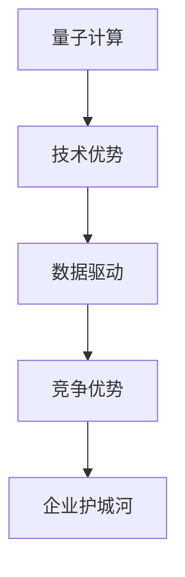

                 


# 巴菲特的护城河理论6.0：量子计算时代的竞争优势

## 关键词：
- 巴菲特护城河理论
- 量子计算
- 竞争优势
- 投资策略
- 科技创新

## 摘要：
本文深入探讨了巴菲特护城河理论在量子计算时代的演变与应用，分析了量子计算如何重塑企业竞争优势，并提出了6.0版本的护城河构建策略。通过结合技术原理和商业案例，本文为投资者和企业管理者提供了在科技快速变革时代保持竞争优势的深刻见解。

---

# 第1章：巴菲特护城河理论的起源与发展

## 1.1 护城河理论的起源与演变

### 1.1.1 巴菲特投资理念的核心
巴菲特的投资理念以“价值投资”为核心，强调寻找具有持续竞争优势的企业。护城河理论是其理论体系中的重要组成部分，旨在识别那些能够长期保持竞争优势的企业。

### 1.1.2 护城河概念的提出与早期应用
护城河的概念最初源于军事术语，指城市的城墙和护城河，用于防御敌人。巴菲特将这一概念引入商业领域，认为企业的竞争优势就像护城河一样，能够抵御竞争对手的侵蚀。

### 1.1.3 护城河理论的演变历程
从最初的版本到6.0版本，护城河理论经历了多个阶段的演变：
1. **1.0版本**：基于传统行业（如品牌、成本优势）的护城河。
2. **2.0版本**：引入了技术优势和市场地位的考量。
3. **3.0版本**：开始关注数据和技术驱动的护城河。
4. **4.0版本**：将互联网和数字化技术纳入护城河的考量。
5. **5.0版本**：加入人工智能和大数据分析的因素。
6. **6.0版本**：结合量子计算和新兴技术，重新定义竞争优势。

---

## 1.2 量子计算时代的竞争优势

### 1.2.1 量子计算的基本原理
量子计算利用量子叠加和量子纠缠的特性，能够在短时间内处理大量复杂问题。与经典计算机相比，量子计算机在某些领域的计算能力有了质的飞跃。

### 1.2.2 量子计算对企业竞争优势的影响
量子计算的出现，使得企业竞争优势的构建方式发生了根本性变化。传统护城河（如品牌、成本优势）虽然仍然重要，但量子计算带来的技术优势正在成为新的核心竞争力。

### 1.2.3 护城河理论的未来趋势
在量子计算时代，护城河的构建将更加依赖于技术创新和数据优势。企业需要重新评估自身的竞争优势，并通过量子计算等新兴技术来巩固和扩大护城河。

---

# 第2章：护城河理论的核心概念与联系

## 2.1 护城河核心概念的原理

### 2.1.1 护城河的定义与分类
护城河是指企业竞争优势的核心要素，这些要素能够为公司提供长期的市场地位和盈利能力。护城河可以分为以下几类：
- **品牌优势**：强大的品牌认知度和客户忠诚度。
- **成本优势**：通过规模效应或技术创新实现的低成本优势。
- **资源优势**：拥有独特的资源或技术，竞争对手难以复制。
- **市场地位**：通过先发优势或网络效应占据的市场主导地位。

### 2.1.2 护城河的动态性与可持续性
护城河并非一成不变，它需要不断更新和维护。特别是在技术快速变革的时代，企业需要通过持续创新来巩固和扩大护城河。

### 2.1.3 护城河的构建与维护
构建护城河需要从企业的核心竞争力出发，结合市场需求和技术趋势，制定长期的战略规划。

---

## 2.2 核心概念属性对比表格

| **护城河类型** | **核心要素**               | **优势特征**                | **持续性** | **适用场景**                     |
|----------------|----------------------------|-----------------------------|------------|---------------------------------|
| 品牌优势       | 品牌知名度                 | 高客户忠诚度                 | 较长       | 消费品行业                       |
| 成本优势       | 生产效率                   | 低成本优势                   | 较长       | 制造业                           |
| 资源优势       | 独特资源                   | 竞争对手难以复制               | 中等       | 资源型行业                       |
| 市场地位       | 市场占有率                 | 高品牌认知度                 | 较长       | 多行业                           |

---

## 2.3 ER实体关系图架构

```mermaid
er
  entity 护城河 {
    key: 护城河ID
    attribute: 护城河类型
    attribute: 核心要素
    attribute: 优势特征
    attribute: 持续性
    attribute: 适用场景
  }
```

---

# 第3章：量子计算时代的护城河新维度

## 3.1 量子计算对企业竞争优势的影响

### 3.1.1 量子计算在密码学中的应用
量子计算机能够快速破解传统加密算法，这将对信息安全产业产生深远影响。拥有量子计算能力的企业将在加密技术和数据安全领域占据优势。

### 3.1.2 量子计算在优化问题中的应用
量子计算在优化问题（如物流路径优化、金融投资组合优化）中的应用，将为企业提供更高效的解决方案。

### 3.1.3 量子计算对企业护城河的重塑
通过量子计算技术，企业可以构建新的竞争优势，例如在数据处理速度、算法优化和技术创新方面占据领先地位。

---

## 3.2 量子计算时代的护城河新维度

### 3.2.1 技术驱动的护城河
企业需要通过量子计算等新兴技术来构建技术壁垒，确保竞争优势的可持续性。

### 3.2.2 数据驱动的护城河
在量子计算时代，数据成为最重要的资源。企业需要通过数据的高效处理和分析，构建数据驱动的护城河。

### 3.2.3 创新驱动的护城河
技术创新是量子计算时代护城河的核心要素。企业需要通过持续创新来巩固和扩大竞争优势。

---

## 3.3 量子计算时代的护城河构建策略

### 3.3.1抽丝剥茧式分析：
通过量子计算技术，企业可以更深入地分析市场趋势和竞争对手的动向，从而制定更具前瞻性的战略。

### 3.3.2 竞争优势的重构：
量子计算技术的应用，使得企业能够重构竞争优势，例如在技术研发、数据分析和市场拓展方面占据领先地位。

### 3.3.3 技术与数据的结合：
通过量子计算技术与大数据分析的结合，企业可以构建更加高效和智能的护城河。

---

## 3.4 量子计算时代的护城河新维度示意图



---

# 结语

在量子计算时代，巴菲特护城河理论6.0版本为企业竞争优势的构建提供了新的思路。通过结合量子计算技术，企业可以构建更加高效和可持续的护城河，从而在激烈的市场竞争中占据领先地位。

---

## 作者：
**AI天才研究院/AI Genius Institute**  
**禅与计算机程序设计艺术/Zen And The Art of Computer Programming**

