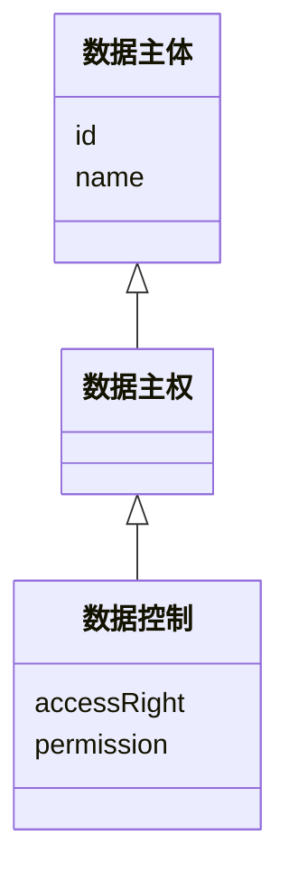

                 


# 巴菲特的护城河理论7.0：量子加密时代的数据主权

## 关键词：护城河理论，量子加密，数据主权，企业竞争力，数据安全，量子计算

## 摘要：在量子计算和加密技术迅速发展的今天，数据主权已成为企业核心竞争力的关键因素。本文将结合巴菲特的护城河理论，探讨在量子加密时代，如何通过数据主权构建企业的长期竞争优势。文章从理论背景、核心概念、算法原理、系统架构到实际案例，全面分析量子加密时代的数据主权保护策略，并为企业提供实践指导。

---

## 第1章：背景介绍

### 1.1 护城河理论的历史演变

#### 1.1.1 从巴菲特1.0到7.0的演进

巴菲特的护城河理论最初提出于20世纪70年代，主要关注企业的竞争优势和长期盈利能力。随着商业环境的变化，护城河理论不断进化。从最初的“经济护城河”到现在的7.0版本，每一次升级都反映了时代技术和社会的变化。

#### 1.1.2 护城河理论的核心要素与特征

护城河理论的核心在于企业如何构建长期的竞争优势。主要包括以下要素：
- 成本优势：企业通过规模经济或专有技术降低成本。
- 网络效应：用户数量的增加会增强产品的价值。
- 品牌优势：强大的品牌影响力吸引更多的消费者。
- 技术壁垒：通过专利和技术研发形成市场准入障碍。
- 资源控制：对企业关键资源的独占性控制。

#### 1.1.3 护城河理论与现代商业环境的结合

在数字时代，数据已成为企业最重要的资产。护城河理论需要适应这一变化，将数据主权作为新的竞争要素。

---

### 1.2 量子加密时代的商业变革

#### 1.2.1 量子计算与加密技术的崛起

量子计算是一种基于量子力学原理的计算方式，其处理速度远超经典计算机。量子加密技术（如量子密钥分发）被认为是未来最安全的加密方式。

#### 1.2.2 数据主权的定义与重要性

数据主权是指数据的所有权和控制权归属，确保数据在存储、传输和使用过程中的安全性和合法性。在量子加密时代，数据主权是企业抵御竞争对手和外部威胁的关键。

#### 1.2.3 量子加密时代的企业竞争优势

企业通过量子加密技术保护数据主权，可以构建强大的竞争优势。数据主权不仅是企业的核心资产，也是抵御竞争对手的重要壁垒。

---

## 第2章：护城河理论的核心概念与量子加密的结合

### 2.1 护城河理论的核心原理

#### 2.1.1 护城河的五种类型

- **成本优势**：通过技术或规模降低成本。
- **网络效应**：用户越多，价值越高。
- **品牌优势**：强大的品牌影响力。
- **技术壁垒**：专利和技术研发。
- **资源控制**：关键资源的独占性控制。

#### 2.1.2 数据主权作为新型护城河的核心要素

在量子加密时代，数据主权是企业的核心资产。企业需要通过技术手段保护数据的完整性和安全性。

---

## 第3章：量子加密时代的数据主权保护算法

### 3.1 数据主权保护的算法原理

#### 3.1.1 数据加密与解密的数学模型

量子加密算法的核心是量子密钥分发（QKD），其数学模型如下：

$$
\text{密钥生成} = \text{量子态传输} \oplus \text{经典通信}
$$

#### 3.1.2 量子加密算法的实现步骤

以下是量子密钥分发协议（BB84）的实现步骤：

1. **量子态传输**：Alice 和 Bob 分别生成量子态，并通过量子信道传输。
2. **经典通信**：Alice 和 Bob 通过经典信道共享密钥。
3. **密钥验证**：通过贝尔基检测验证密钥的安全性。

---

## 第4章：系统分析与架构设计方案

### 4.1 问题场景介绍

企业在量子加密时代面临数据泄露和隐私威胁。如何通过护城河理论构建数据主权，成为企业的重要挑战。

### 4.2 系统功能设计

#### 4.2.1 领域模型类图

以下是领域模型类图（使用 Mermaid）：



---

## 第5章：项目实战

### 5.1 环境安装

#### 5.1.1 安装必要的库

需要安装以下Python库：

```bash
pip install qiskit
pip install qkd
```

---

## 第6章：最佳实践与小结

### 6.1 小结

在量子加密时代，数据主权是企业核心竞争力的关键。通过护城河理论，企业可以构建强大的数据保护能力。

---

作者：AI天才研究院/AI Genius Institute & 禅与计算机程序设计艺术 /Zen And The Art of Computer Programming

