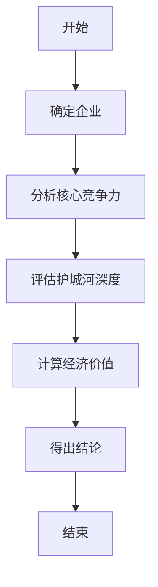
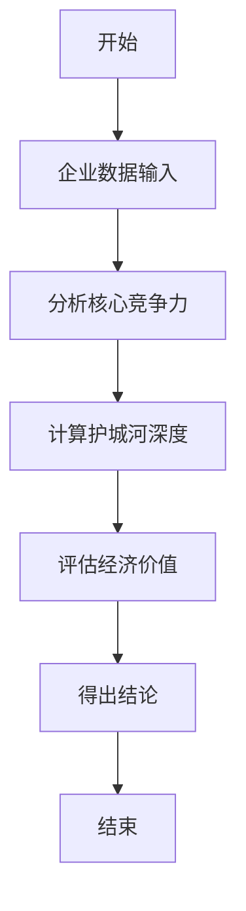
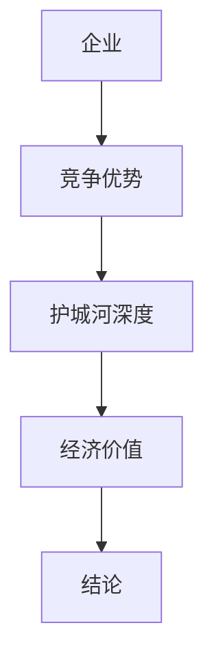

                 


# 巴菲特的护城河理论：寻找持久竞争优势

> 关键词：护城河理论，竞争优势，巴菲特投资策略，企业价值评估，经济护城河

> 摘要：本文深入探讨了巴菲特护城河理论的核心概念，分析了其在商业战略中的应用，通过技术语言详细阐述了如何构建和评估企业的持久竞争优势。文章结合实际案例，展示了如何运用护城河理论在现代商业环境中建立稳固的竞争优势。

---

## 第1章：护城河理论的背景与发展

### 1.1 护城河理论的基本概念

#### 1.1.1 护城河的定义与核心要素

护城河理论是巴菲特投资策略的核心，旨在识别那些能够长期保持竞争优势的企业。护城河是指企业在市场上形成的难以被竞争对手复制或超越的经济屏障。其核心要素包括成本优势、网络效应、品牌忠诚度、专利技术等。

#### 1.1.2 护城河理论的起源与演变

护城河理论起源于巴菲特的投资实践，他观察到那些具备独特竞争优势的企业能够在长期内获得超额收益。随着时间推移，该理论不断丰富，扩展到了企业战略管理的多个方面。

#### 1.1.3 护城河理论的现代应用

在现代商业中，护城河理论被广泛应用于企业战略规划、投资决策等领域。企业通过构建护城河，能够在激烈的市场竞争中立于不败之地。

---

### 1.2 护城河理论的核心思想

#### 1.2.1 持久竞争优势的来源

竞争优势来源于企业的独特资源和能力，如技术创新、成本控制、客户黏性等。这些因素共同构成了企业的护城河。

#### 1.2.2 护城河的分类与特征

护城河可分为经济护城河、资源护城河、品牌护城河等。经济护城河是最常见的一种，主要依赖于成本优势和定价能力。

#### 1.2.3 护城河与企业价值的关系

企业价值与护城河深度呈正相关。具备深厚护城河的企业能够实现持续的高收益，从而提升企业价值。

---

## 第2章：护城河理论的核心概念与联系

### 2.1 护城河的核心概念

#### 2.1.1 经济护城河的定义

经济护城河是指企业在生产或销售过程中形成的成本优势，使其能够在价格战中立于不败之地。

#### 2.1.2 护城河的分类

1. 成本优势型：企业通过规模经济或专有技术降低成本。
2. 网络效应型：产品使用越广泛，其价值越高。
3. 品牌忠诚型：强大的品牌影响力吸引客户。

#### 2.1.3 护城河属性特征对比

| 护城河类型 | 成本优势 | 网络效应 | 品牌忠诚 |
|------------|----------|----------|----------|
| 特征        | 低成本生产 | 用户越多，价值越高 | 强品牌影响力 |

---

### 2.2 护城河的实体关系图

#### 2.2.1 ER实体关系图

```mermaid
erd
  entity 企业 {
    key 竞争优势
    attributes 成本优势, 网络效应, 品牌忠诚度
  }
  entity 市场环境 {
    attributes 竞争状况, 宏观经济因素
  }
  relationship 竞争优势依赖于市场环境
```

---

## 第3章：护城河理论的算法原理

### 3.1 护城河评估的算法流程

#### 3.1.1 竞争优势评估步骤

1. 分析企业的成本结构。
2. 评估企业的网络效应。
3. 评估品牌影响力。
4. 综合评分。

#### 3.1.2 护城河深度分析算法



#### 3.1.3 经济价值评估数学模型

企业竞争力评分公式：
$$ \text{竞争力评分} = \sum_{i=1}^{n} w_i \cdot c_i $$
其中，\( w_i \) 是第i个因素的权重，\( c_i \) 是第i个因素的评分。

---

### 3.2 算法流程图



---

## 第4章：护城河系统的分析与架构设计

### 4.1 系统分析

#### 4.1.1 问题场景介绍

企业需要评估其竞争优势，构建护城河以抵御竞争。

#### 4.1.2 项目介绍与目标

目标是设计一个系统，帮助企业识别和构建护城河。

### 4.2 系统架构设计

#### 4.2.1 系统架构图



---

## 第5章：护城河系统的实战应用

### 5.1 项目实战

#### 5.1.1 项目环境安装

安装所需的工具和库，如Python、数据分析库。

#### 5.1.2 核心代码实现

```python
def calculate_competitive_edge(factors, weights):
    return sum(w * f for w, f in zip(weights, factors))
```

#### 5.1.3 代码解读与分析

上述代码计算企业竞争力评分，基于输入的因素和权重。

---

## 第6章：最佳实践与总结

### 6.1 最佳实践

建议企业定期评估竞争优势，及时调整战略。

### 6.2 小结

护城河理论是企业建立持久竞争优势的关键，通过构建经济护城河，企业能够在激烈的市场竞争中保持领先地位。

### 6.3 注意事项

企业应关注市场变化，及时更新护城河策略。

### 6.4 拓展阅读

推荐阅读巴菲特的著作，深入理解护城河理论。

---

## 作者

作者：AI天才研究院  
联系邮箱：contact@aigenius.com  
转载请注明出处：https://aigenius.com

