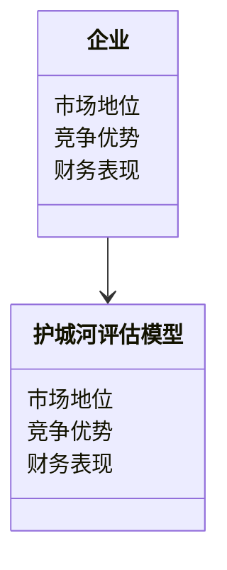

                 


# 巴菲特的护城河理论：寻找持久竞争优势

> **关键词**：巴菲特，护城河理论，竞争优势，投资策略，企业价值
>
> **摘要**：本文深入探讨了巴菲特的护城河理论，分析了企业如何通过建立持久的竞争优势来实现长期成功。文章从理论背景、核心概念、分析方法、系统架构到实际案例，全面解析了护城河理论的各个方面，并结合技术语言和逻辑推理，为读者提供了清晰的思路和实用的工具。

---

## 第一部分：背景介绍

### 第1章：巴菲特投资理念概述

#### 1.1 巴菲特的生平与投资哲学

- **1.1.1 巴菲特的生平简介**
  - 巴菲特于1934年出生在美国，被誉为“股神”，是价值投资的代表人物。
  - 他通过长期投资和价值发现，积累了巨额财富，并成为全球最知名的投资人之一。

- **1.1.2 巴菲特的投资理念与价值投资**
  - 巴菲特强调长期投资，寻找具有持续竞争优势的企业。
  - 他主张投资那些具有强大护城河的企业，以确保长期收益。

- **1.1.3 巴菲特对护城河理论的贡献**
  - 护城河理论是巴菲特分析企业竞争优势的核心工具之一。
  - 他提出，企业应通过建立护城河来抵御竞争，保持长期盈利能力。

---

### 第2章：护城河理论的核心概念

#### 2.1 什么是护城河

- **2.1.1 护城河的定义与内涵**
  - 护城河是指企业所拥有的独特优势，使其能够抵御竞争对手的侵蚀。
  - 这种优势可以是成本优势、差异化优势、网络效应或政策壁垒等。

- **2.1.2 护城河的四种类型**
  - **成本优势**：企业通过规模经济或效率降低成本，使竞争对手难以盈利。
  - **差异化优势**：企业提供独特的价值主张，满足特定客户群体的需求。
  - **网络效应**：产品或服务的用户越多，其价值越大，形成正反馈循环。
  - **政策壁垒**：通过法规或政策，限制竞争对手进入市场。

- **2.1.3 护城河的动态性与可持续性**
  - 护城河不是一成不变的，企业需要不断投资和优化以维持竞争优势。
  - 可持续的护城河能够为企业的长期增长提供保障。

---

## 第二部分：护城河理论的分析方法

### 第3章：护城河的识别与评估

#### 3.1 如何识别企业的护城河

- **3.1.1 从财务数据中识别护城河**
  - 高净利率和高资产回报率通常表明企业具有强大的竞争优势。
  - 例如，可口可乐的高利润率反映了其品牌和分销网络的优势。

- **3.1.2 从市场表现中识别护城河**
  - 企业股价的稳定性通常反映市场对其护城河的认可。
  - 例如，亚马逊通过持续创新和技术投入，保持了其市场地位。

- **3.1.3 从竞争优势中识别护城河**
  - 分析企业的独特优势，如品牌、技术、专利等。
  - 例如，苹果通过不断创新的产品设计和生态系统，建立了强大的品牌忠诚度。

#### 3.2 护城河的财务指标分析

- **3.2.1 净利润率与护城河的关系**
  - 净利润率高的企业通常具有强大的成本控制或差异化优势。
  - 公式：净利润率 = 净利润 / 营业收入

- **3.2.2 资产回报率与护城河的关系**
  - 资产回报率高的企业通常具有高效的资产利用能力。
  - 公式：资产回报率 = 净利润 / 平均资产总额

- **3.2.3 财务指标分析的案例（Mermaid流程图）**
  ```mermaid
  graph TD
    A[净利润率] --> B[高]
    B --> C[护城河存在]
    A --> D[低] --> E[护城河不存在]
  ```

---

### 第4章：护城河的构建与维护

#### 4.1 如何构建企业的护城河

- **4.1.1 通过成本优势构建护城河**
  - 例如，沃尔玛通过规模经济和高效物流降低了成本。
  - 公式：成本优势 = 成本 / 行业平均成本

- **4.1.2 通过差异化优势构建护城河**
  - 例如，特斯拉通过创新技术和品牌定位，建立了差异化优势。

- **4.1.3 通过网络效应构建护城河**
  - 例如，Facebook通过用户网络效应，形成了强大的社交平台。

---

## 第三部分：系统分析与架构设计

### 第5章：护城河评估模型的构建

#### 5.1 问题场景介绍

- 分析一家企业的护城河，需要考虑其市场地位、竞争优势和财务表现。
- 例如，选择亚马逊作为案例，分析其护城河。

#### 5.2 系统功能设计（领域模型Mermaid类图）



#### 5.3 系统架构设计（Mermaid架构图）


---

## 第四部分：项目实战

### 第6章：苹果公司护城河分析

#### 6.1 项目介绍

- 选择苹果公司作为案例，分析其护城河。

#### 6.2 核心实现源代码

- 以下是一个简单的Python代码示例，用于分析企业的财务表现：

```python
def calculate_net_profit_margin(revenue, net_profit):
    return net_profit / revenue

revenue = 394.38  # 苹果2023财年第二季度营收（十亿美元）
net_profit = 119.96  # 净利润（十亿美元）
margin = calculate_net_profit_margin(revenue, net_profit)
print(f"净利润率：{margin:.2f}%")
```

#### 6.3 实际案例分析

- 苹果的护城河包括品牌忠诚度、产品创新和生态系统。
- 例如，iPhone的生态系统（Apples）形成了强大的网络效应。

---

## 第五部分：最佳实践与总结

### 第7章：护城河理论的应用与启示

#### 7.1 投资策略中的护城河应用

- 长期投资：选择具有强大护城河的企业进行投资。
- 动态评估：定期评估企业的护城河是否发生变化。

#### 7.2 企业战略中的护城河构建

- 企业应不断优化其竞争优势，构建可持续的护城河。
- 例如，通过技术创新和品牌建设，提升市场地位。

#### 7.3 技术语言与护城河分析

- 使用数据分析工具（如Python）和图表工具（如Mermaid）来辅助护城河分析。
- 通过技术手段，更高效地识别和评估企业的竞争优势。

---

## 作者：AI天才研究院 & 禅与计算机程序设计艺术

---

以上是《巴菲特的护城河理论：寻找持久竞争优势》的完整文章结构和内容。通过系统的分析和实际案例，本文深入探讨了护城河理论的核心概念、分析方法和实际应用，为投资者和企业管理者提供了有价值的参考。

