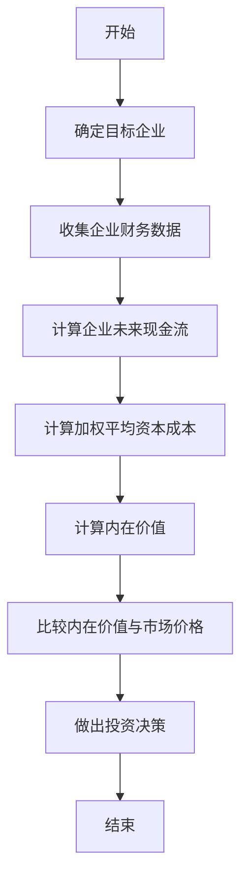
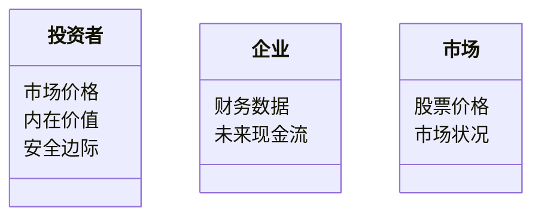
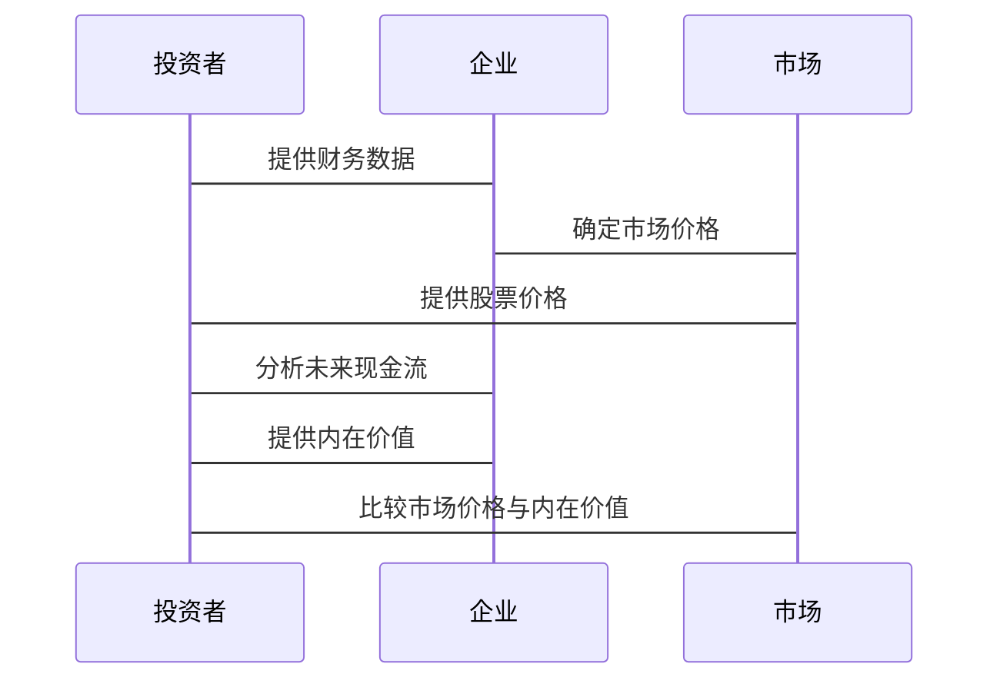

                 


# 巴菲特的收购策略分析

> 关键词：巴菲特, 投资策略, 价值投资, 内在价值, 安全边际, 股票分析, 投资哲学

> 摘要：本文深入分析了巴菲特的收购策略，从价值投资的核心理念到内在价值的计算方法，从安全边际的概念到实际案例的分析，全面解读了巴菲特的收购策略及其成功的关键因素。

---

## 第一部分：巴菲特收购策略的背景与核心概念

### 第1章：巴菲特收购策略的背景介绍

#### 1.1 投资背景与问题背景
##### 1.1.1 传统投资与收购的局限性
传统的投资方式往往依赖于市场波动和短期收益，而巴菲特提出的价值投资则强调长期持有和内在价值的分析。传统的收购策略可能忽视了企业的基本面，而巴菲特的策略则通过深入分析企业的财务状况和竞争优势来确定其内在价值。

##### 1.1.2 巴菲特收购策略的提出背景
巴菲特的投资理念起源于价值投资理论，他强调以低于内在价值的价格买入优质企业，从而实现长期稳定的收益。他的策略在20世纪末和21世纪初得到了广泛应用，并取得了显著的成功。

##### 1.1.3 巴菲特收购策略的核心问题与目标
巴菲特收购策略的核心问题是如何通过分析企业的内在价值和市场价值，找到具有安全边际的投资机会。其目标是通过长期持有优质企业股票，实现财富的稳定增长。

#### 1.2 巴菲特收购策略的核心概念
##### 1.2.1 价值投资与收购的定义
价值投资是一种投资策略，强调以低于内在价值的价格买入股票。巴菲特的价值投资理念强调对企业基本面的深入分析，寻找具有持续竞争优势和良好管理的企业。

##### 1.2.2 安全边际与内在价值的关系
安全边际是指股票的市场价格低于其内在价值的部分。巴菲特认为，通过购买具有安全边际的股票，可以降低投资风险并实现超额收益。

##### 1.2.3 巴菲特收购策略的边界与外延
巴菲特的收购策略主要适用于那些具有稳定现金流、良好管理和强大竞争优势的企业。其边界包括企业的财务状况、行业竞争环境和宏观经济因素。

##### 1.2.4 核心要素组成与概念结构
巴菲特收购策略的核心要素包括：内在价值、市场价值、安全边际、竞争优势和长期投资。

### 第2章：巴菲特收购策略的核心概念与联系

#### 2.1 核心概念原理
##### 2.1.1 价值投资的核心原理
价值投资的核心原理是通过分析企业的内在价值，找到那些市场价格低于内在价值的企业进行投资。巴菲特强调，内在价值是决定投资价值的关键因素。

##### 2.1.2 内在价值与市场价值的关系
内在价值是企业未来现金流的现值，而市场价值是股票在市场上的交易价格。当市场价格低于内在价值时，股票具有投资价值。

##### 2.1.3 安全边际的数学模型与公式
安全边际 = 内在价值 - 市场价格

#### 2.2 概念属性特征对比表
##### 2.2.1 价值投资与成长投资的对比
| 对比维度 | 价值投资 | 成长投资 |
|----------|----------|----------|
| 投资目标 | 寻找被低估的企业 | 寻找高成长的企业 |
| 估值方法 | 基于内在价值 | 基于未来增长潜力 |
| 风险控制 | 强调安全边际 | 风险较高 |

##### 2.2.2 内在价值与账面价值的对比
| 对比维度 | 内在价值 | 账面价值 |
|----------|----------|----------|
| 计算基础 | 未来现金流 | 当前资产价值 |
| 反映因素 | 包括未来盈利能力 | 反映当前资产状况 |
| 使用场景 | 用于价值评估 | 用于资产估值 |

##### 2.2.3 安全边际与风险控制的对比
| 对比维度 | 安全边际 | 风险控制 |
|----------|----------|----------|
| 作用 | 降低投资风险 | 管控投资风险 |
| 实施方法 | 通过价格折扣实现 | 通过多样化和分散投资实现 |
| 适用场景 | 价值投资 | 各种投资策略 |

#### 2.3 ER实体关系图
##### 2.3.1 投资者-企业-市场的关系
- 投资者通过市场购买企业的股票。
- 企业的内在价值由其未来现金流决定。
- 市场价格受供需关系影响，可能高于或低于内在价值。

##### 2.3.2 内在价值-市场价值-安全边际的关系
- 内在价值是企业的实际价值。
- 市场价值是股票的交易价格。
- 安全边际是内在价值与市场价值之间的差额，反映了投资的安全性。

### 第3章：巴菲特收购策略的算法原理

#### 3.1 内在价值计算的算法流程


#### 3.2 安全边际计算的数学公式
##### 内在价值公式
$$ V = \sum_{t=1}^{n} \frac{CF_t}{(1 + r)^t} $$
其中：
- \( V \) 是内在价值
- \( CF_t \) 是第 \( t \) 年的现金流
- \( r \) 是折现率
- \( n \) 是预测年数

##### 安全边际公式
$$ \text{安全边际} = \text{内在价值} - \text{市场价格} $$

#### 3.3 简单案例分析
假设某企业未来5年的现金流分别为100万、120万、140万、160万、180万，折现率为10%。计算其内在价值：
$$ V = \frac{100}{1.1} + \frac{120}{1.1^2} + \frac{140}{1.1^3} + \frac{160}{1.1^4} + \frac{180}{1.1^5} \approx 400.46 \text{万} $$

### 第4章：巴菲特收购策略的系统分析与架构设计

#### 4.1 投资者决策场景
##### 4.1.1 投资者如何选择收购目标
- 收集企业的财务数据和行业信息
- 分析企业的未来现金流和竞争优势
- 计算企业的内在价值和安全边际

##### 4.1.2 如何评估目标企业的内在价值
- 使用内在价值公式计算企业价值
- 比较市场价格与内在价值的差异
- 确定是否存在安全边际

##### 4.1.3 如何制定投资策略
- 确定投资目标和风险承受能力
- 选择具有安全边际的企业进行投资
- 长期持有优质企业股票

#### 4.2 系统功能设计
##### 4.2.1 领域模型


##### 4.2.2 系统架构设计
```mermaid
graph TD
投资者 --> 企业: 收购目标
企业 --> 市场: 确定市场价格
投资者 --> 市场: 获取股票价格
企业 --> 投资者: 提供财务数据
投资者 --> 企业: 分析未来现金流
```

#### 4.3 系统接口设计
##### 4.3.1 接口描述
- 输入：企业财务数据、市场数据
- 输出：内在价值、安全边际、投资建议

#### 4.4 系统交互


---

## 第二部分：巴菲特收购策略的实际应用与案例分析

### 第5章：巴菲特收购策略的实际应用

#### 5.1 巴菲特收购策略的数学模型与应用
- 内在价值公式在实际中的应用
- 安全边际的计算与投资决策

#### 5.2 巴菲特收购策略的成功案例
##### 5.2.1 可口可乐公司的收购案例
- 收购背景
- 财务分析
- 投资回报

##### 5.2.2 喜诗糖果公司的收购案例
- 收购背景
- 财务分析
- 投资回报

---

## 第三部分：巴菲特收购策略的优化与改进

### 第6章：优化与改进策略

#### 6.1 优化策略
##### 6.1.1 动态调整模型
- 根据市场变化调整折现率
- 动态更新现金流预测

##### 6.1.2 综合分析模型
- 结合多种指标进行综合分析
- 考虑宏观经济因素

#### 6.2 改进策略
##### 6.2.1 引入机器学习算法
- 使用回归分析预测内在价值
- 应用聚类分析进行风险控制

##### 6.2.2 结合大数据分析
- 利用大数据分析行业趋势
- 分析竞争对手的财务状况

---

## 第四部分：巴菲特收购策略的启示与总结

### 第7章：启示与总结

#### 7.1 巴菲特收购策略的启示
##### 7.1.1 投资者的启示
- 价值投资的核心理念
- 安全边际的重要性

##### 7.1.2 企业的启示
- 提高企业透明度
- 加强内部管理

#### 7.2 巴菲特收购策略的总结
- 成功的关键因素
- 未来的发展趋势

---

## 第五部分：最佳实践与注意事项

### 第8章：最佳实践与注意事项

#### 8.1 最佳实践
##### 8.1.1 长期投资
- 选择优质企业
- 长期持有

##### 8.1.2 风险控制
- 保持安全边际
- 分散投资

#### 8.2 注意事项
##### 8.2.1 市场波动
- 避免盲目跟风
- 理性分析市场变化

##### 8.2.2 企业风险
- 选择具有稳定现金流的企业
- 避免高风险行业

---

## 第六部分：未来展望与研究方向

### 第9章：未来展望与研究方向

#### 9.1 未来展望
##### 9.1.1 人工智能在投资中的应用
- 使用AI进行大数据分析
- 应用自然语言处理技术分析企业报告

##### 9.1.2 价值投资的未来发展
- 价值投资的演变
- 新兴市场的机遇与挑战

#### 9.2 研究方向
##### 9.2.1 投资策略的创新
- 结合区块链技术
- 探索新的投资模型

##### 9.2.2 投资者教育
- 提高投资者的金融素养
- 传播价值投资理念

---

## 结语

巴菲特的收购策略不仅是投资领域的经典，更是现代金融理论的重要组成部分。通过深入分析他的策略，我们可以更好地理解投资的本质，找到实现财富增长的关键路径。未来，随着技术的进步和市场的变化，巴菲特的策略将不断被优化和改进，为投资者提供更多的机会和挑战。

---

## 作者：AI天才研究院/AI Genius Institute & 禅与计算机程序设计艺术 /Zen And The Art of Computer Programming

