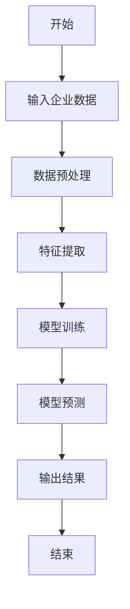
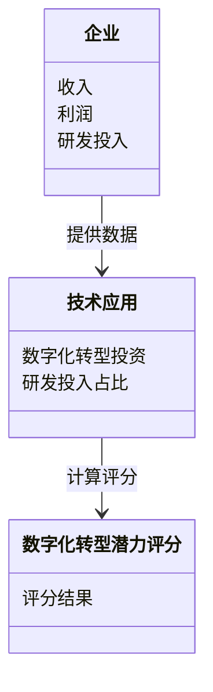
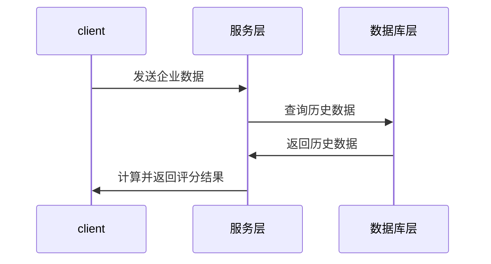

                 


# 巴菲特的数字化转型投资：传统企业在新时代的机遇

## 关键词：巴菲特, 数字化转型, 传统企业, 投资机会, 企业价值, 数字化投资, 长期价值

## 摘要

数字化转型正在重塑全球商业模式和企业价值，传统企业面临前所未有的挑战和机遇。本文从巴菲特的投资理念出发，分析传统企业在数字化转型中的潜在投资机会，探讨数字化转型如何重构企业价值，并为企业提供具体的数字化转型投资策略和系统架构设计方案。

---

# 第一部分：数字化转型的背景与巴菲特投资理念

## 第1章：数字化转型的背景与挑战

### 1.1 数字化转型的定义与现状

#### 1.1.1 数字化转型的定义
数字化转型（Digital Transformation）是指利用数字技术（如人工智能、大数据、云计算等）对企业的业务模式、流程、文化进行根本性改变，以创造新的价值或提升效率。数字化转型不仅仅是技术升级，更是对企业战略、组织结构和文化的重大变革。

#### 1.1.2 当前数字化转型的全球趋势
近年来，数字化转型成为全球企业关注的焦点。根据麦肯锡的报告，全球500强企业中有超过80%已经将数字化转型列为战略重点。数字化转型正在改变企业的运营方式、客户互动方式以及价值创造方式。

#### 1.1.3 传统企业在数字化转型中的挑战
传统企业在数字化转型中面临多重挑战，包括技术落后、组织结构僵化、缺乏数字化人才等。这些挑战使得传统企业难以快速适应数字化时代的竞争。

### 1.2 巴菲特投资理念的核心要素

#### 1.2.1 巴菲特投资理念概述
巴菲特的投资理念以长期价值投资为核心，注重企业基本面分析、财务健康状况和管理层素质。他倾向于投资那些具有持续竞争优势和良好治理结构的企业。

#### 1.2.2 巴菲特对企业价值的评估标准
巴菲特的“护城河”理论是其投资理念的核心。他关注企业的竞争优势是否持久，管理层是否诚信，以及企业是否具备良好的财务状况。

#### 1.2.3 巴菲特对长期投资价值的关注
巴菲特强调长期投资价值，认为短期市场波动不应影响长期投资决策。他倾向于投资那些具有稳定增长潜力的企业。

---

## 第2章：数字化转型与传统企业的机遇

### 2.1 数字化转型对企业价值的影响

#### 2.1.1 数字化转型如何重构企业价值
数字化转型通过优化业务流程、提升客户体验、降低运营成本等方式重构企业价值。例如，零售企业通过数字化手段实现线上线下的融合，提升客户满意度和销售额。

#### 2.1.2 数字化转型对企业竞争优势的提升
数字化转型可以帮助传统企业建立新的竞争优势。例如，制造企业通过引入工业互联网技术实现智能化生产，提高生产效率和产品质量。

#### 2.1.3 数字化转型对传统企业商业模式的改变
数字化转型促使传统企业从传统的“以产品为中心”向“以客户为中心”转变。例如，传统银行通过数字化手段提供个性化的金融服务，提升客户忠诚度。

### 2.2 巴菲特视角下的数字化转型投资机会

#### 2.2.1 数字化转型中的长期投资机会
数字化转型为传统企业提供了长期的投资机会。例如，医疗企业通过数字化转型实现远程诊疗和健康管理，具备长期的增长潜力。

#### 2.2.2 巴菲特对数字化转型企业的筛选标准
巴菲特在选择数字化转型企业时，会关注企业的竞争优势是否可持续、管理层是否具备数字化转型能力、财务状况是否健康等。

#### 2.2.3 数字化转型对企业长期价值的潜在影响
数字化转型可以通过提升效率、降低成本、拓展市场等方式提升企业的长期价值。例如，物流企业通过数字化手段实现智能配送，提升运营效率和客户满意度。

---

# 第二部分：数字化转型的核心概念与投资分析

## 第3章：数字化转型的核心概念与关键要素

### 3.1 数字化转型的核心概念

#### 3.1.1 数字化转型的关键技术趋势
数字化转型依赖于多项关键技术，包括人工智能、大数据、云计算、物联网等。这些技术为企业提供了新的工具和方法，帮助企业在数字化时代保持竞争力。

#### 3.1.2 数字化转型的业务模式创新
数字化转型要求企业重新设计业务模式。例如，传统媒体通过数字化转型实现内容付费和订阅模式，提升收入来源。

#### 3.1.3 数字化转型的组织变革
数字化转型不仅仅是技术问题，更是组织结构和文化的变革。企业需要建立灵活的组织结构，鼓励创新和协作。

### 3.2 数字化转型的关键要素对比分析

#### 3.2.1 技术要素对比表格
| 技术要素 | 传统企业 | 数字化转型企业 |
|----------|----------|----------------|
| IT系统  | 离散化、孤立 | 集成化、互联   |
| 数据管理 | 离散、低效 | 集中、高效     |
| 人工智能 | 缺乏应用   | 广泛应用       |

#### 3.2.2 业务要素对比表格
| 业务要素 | 传统企业 | 数字化转型企业 |
|----------|----------|----------------|
| 客户互动 | 线下为主 | 线上线下融合   |
| 产品开发 | 串行开发 | 并行开发       |
| 供应链管理 | 低效、信息孤岛 | 高效、信息共享 |

#### 3.2.3 组织要素对比表格
| 组织要素 | 传统企业 | 数字化转型企业 |
|----------|----------|----------------|
| 组织结构 | 垂直化 | 网络化、扁平化 |
| 管理模式 | 以命令为中心 | 以数据为中心    |
| 文化 | 保守 | 创新、开放       |

---

## 第4章：数字化转型与企业价值重构

### 4.1 数字化转型对企业价值重构的影响

#### 4.1.1 数字化转型如何改变企业收入结构
数字化转型通过拓展新的收入来源（如订阅模式）和优化现有收入结构（如提高客户忠诚度）改变企业的收入结构。例如，软件企业通过SaaS模式实现稳定的收入来源。

#### 4.1.2 数字化转型如何优化企业成本结构
数字化转型通过自动化、智能化技术降低企业的运营成本。例如，制造业通过工业互联网技术实现智能化生产，降低生产成本。

#### 4.1.3 数字化转型如何提升企业资产效率
数字化转型通过优化资源配置和提高资产利用率提升企业资产效率。例如，物流企业通过智能调度系统实现资源的最优配置。

### 4.2 巴菲特视角下的企业价值重构分析

#### 4.2.1 巴菲特对企业价值重构的判断标准
巴菲特关注企业价值重构的可持续性和长期增长潜力。他倾向于投资那些能够通过数字化转型实现长期价值增长的企业。

#### 4.2.2 数字化转型对企业长期盈利能力的影响
数字化转型可以通过提升效率、降低成本、拓展市场等方式提升企业的长期盈利能力。例如，零售企业通过数字化转型实现精准营销和个性化服务，提高客户忠诚度和销售额。

#### 4.2.3 数字化转型对企业竞争优势的持续性评估
数字化转型帮助企业建立新的竞争优势，如数据驱动的决策能力和快速响应能力。这些竞争优势能够帮助企业在长期竞争中保持领先地位。

---

# 第三部分：数字化转型投资的算法与系统架构

## 第5章：数字化转型投资的算法原理

### 5.1 数字化转型投资的算法模型

#### 5.1.1 数字化转型投资模型的构建
数字化转型投资模型基于机器学习算法，结合企业的财务数据、市场表现和技术应用情况，评估企业的数字化转型潜力。

#### 5.1.2 数字化转型投资模型的输入变量
- 企业财务数据（收入、利润、现金流）
- 企业市场表现（股价、市盈率、市净率）
- 企业技术应用情况（数字化转型投资、研发投入）

#### 5.1.3 数字化转型投资模型的输出结果
- 数字化转型潜力评分（0-100分）
- 数字化转型投资建议（买入、持有、卖出）

### 5.2 数字化转型投资的算法流程图



### 5.3 数字化转型投资的数学模型

$$
\text{数字化转型潜力评分} = \alpha \cdot \text{收入增长率} + \beta \cdot \text{研发投入占比} + \gamma \cdot \text{技术应用评分}
$$

其中，$\alpha$、$\beta$、$\gamma$是权重系数，通常通过历史数据回归分析确定。

---

## 第6章：数字化转型的系统架构设计

### 6.1 数字化转型系统功能设计

#### 6.1.1 领域模型（Mermaid类图）


#### 6.1.2 系统架构（Mermaid架构图）
```mermaid
client ---(http)--> 服务层
服务层 ---(rest)--> 数据库层
数据库层 <---> 数据存储
```

#### 6.1.3 系统接口设计
- 输入接口：企业财务数据、市场表现、技术应用情况
- 输出接口：数字化转型潜力评分、投资建议

#### 6.1.4 系统交互（Mermaid序列图）


---

## 第7章：数字化转型投资的项目实战

### 7.1 环境搭建

```bash
# 安装Python环境
python --version
pip install numpy
pip install scikit-learn
```

### 7.2 核心实现代码

```python
import numpy as np
from sklearn.linear_model import LinearRegression

# 示例数据
X = np.array([[1, 2, 3], [4, 5, 6], [7, 8, 9]])
y = np.array([10, 11, 12])

# 模型训练
model = LinearRegression()
model.fit(X, y)

# 模型预测
new_X = np.array([[10, 11, 12]])
predicted_y = model.predict(new_X)
print(predicted_y)
```

### 7.3 代码应用解读与分析
上述代码展示了如何使用线性回归模型进行数字化转型潜力评分。企业可以基于历史数据训练模型，并使用模型预测未来的数字化转型潜力。

### 7.4 案例分析与详细讲解
以零售企业为例，通过数字化转型实现线上线下的融合，提升客户体验和销售额。企业可以使用上述模型评估数字化转型的潜力，并制定相应的投资策略。

### 7.5 项目小结
通过数字化转型投资模型，企业可以科学地评估数字化转型的潜力，并制定相应的投资策略。模型基于历史数据和机器学习算法，提供准确的投资建议。

---

## 第8章：最佳实践与总结

### 8.1 最佳实践 tips
1. **数据驱动决策**：企业应基于数据进行数字化转型投资决策。
2. **持续优化模型**：定期更新模型参数和数据，确保模型的准确性。
3. **关注长期价值**：巴菲特的投资理念强调长期价值，企业应关注数字化转型的长期收益。

### 8.2 小结
数字化转型为传统企业提供了新的发展机遇。通过科学的投资模型和系统架构设计，企业可以抓住数字化转型的机遇，实现长期价值增长。

### 8.3 注意事项
- 数据隐私和安全问题
- 技术选型和实施风险
- 数字化转型的组织变革挑战

### 8.4 拓展阅读
1. 巴菲特投资理念的相关书籍
2. 数字化转型的技术书籍
3. 机器学习在金融领域的应用

---

# 作者：AI天才研究院/AI Genius Institute & 禅与计算机程序设计艺术 /Zen And The Art of Computer Programming

---

**本文结合了巴菲特的长期价值投资理念与数字化转型的技术实践，为企业提供了科学的投资策略和系统架构设计方案。通过理论与实践相结合，帮助企业抓住数字化转型的机遇，实现可持续发展。**

