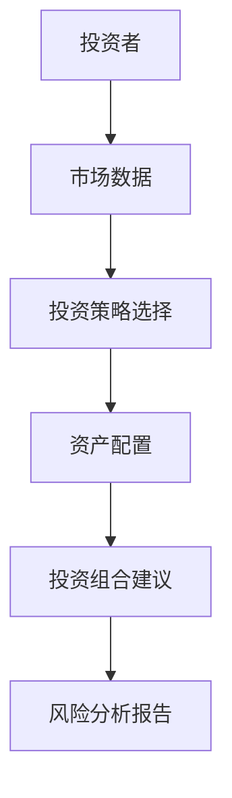

                 


# 巴菲特的焦点投资：集中vs分散的争论

> 关键词：巴菲特，集中投资，分散投资，投资策略，风险管理，金融模型

> 摘要：本文深入探讨了巴菲特的集中投资策略与分散投资策略的争论，分析了两者的理论基础、实践案例、优缺点及适用场景，结合数学模型和系统架构，提供了全面的投资策略对比和实际应用指南。

---

## 第1章：投资的基本概念与背景介绍

### 1.1 投资的基本概念

#### 1.1.1 什么是投资

投资是指将资金投入到某种资产或项目中，以期在未来获得收益的行为。投资的核心目标是通过合理配置资产，实现财富的增值。投资的对象可以是股票、债券、房地产、基金等多种形式。

#### 1.1.2 投资的目的与意义

投资的主要目的是为了实现财富的保值与增值。通过投资，个人或机构可以将闲置资金投入到能够产生收益的领域，从而提高资金的利用效率。此外，投资还可以分散风险，避免将所有资金集中在单一资产上。

#### 1.1.3 投资的基本原理

投资的基本原理包括风险与收益的权衡、时间价值和复利效应。投资者需要在风险和收益之间找到平衡点，选择适合自己的投资策略。复利效应则是投资增长的重要驱动力，长期投资能够带来更大的收益。

### 1.2 集中投资与分散投资的背景

#### 1.2.1 投资策略的定义

投资策略是指投资者在选择和管理资产时所采用的方法和原则。常见的投资策略包括集中投资、分散投资、价值投资、成长投资等。

#### 1.2.2 集中投资与分散投资的起源

集中投资的起源可以追溯到巴菲特的投资理念，他主张将资金集中在少数优质资产上，以获取超额收益。分散投资则源于现代投资组合理论，由哈里·马科维茨提出，强调通过多样化投资来降低风险。

#### 1.2.3 两种策略的优缺点对比

集中投资的优点在于能够聚焦于优质资产，获得更高的收益；缺点是风险较高，一旦投资失败，损失可能较大。分散投资的优点在于风险较低，适合风险厌恶型投资者；缺点是收益相对有限，难以获得超额收益。

---

## 第2章：集中投资的理论与实践

### 2.1 集中投资的核心理念

#### 2.1.1 集中投资的定义

集中投资是指将大部分资金投入到少数几只优质资产上，通过深度研究和长期持有来实现收益最大化。

#### 2.1.2 集中投资的理论基础

集中投资的理论基础是巴菲特的价值投资理念，即寻找具有持续竞争优势和良好治理结构的企业，长期持有并获得分红和股价增长的双重收益。

#### 2.1.3 集中投资的实践案例

巴菲特的经典投资案例包括可口可乐和苹果公司。他通过深入研究企业的基本面，选择具有长期竞争优势的企业进行投资。

### 2.2 巴菲特的集中投资策略

#### 2.2.1 巴菲特的投资哲学

巴菲特的投资哲学是“买入并持有”，即选择优质企业长期持有，避免频繁交易和短期波动的影响。

#### 2.2.2 巴菲特的选股标准

巴菲特选股的标准包括企业具有持续竞争优势、良好的管理层、合理的估值和稳定的财务状况。他注重企业的护城河和长期盈利能力。

#### 2.2.3 巴菲特的经典投资案例

巴菲特投资可口可乐和苹果公司的案例展示了集中投资的成功。通过长期持有这些优质资产，巴菲特实现了巨大的收益。

---

## 第3章：分散投资的理论与实践

### 3.1 分散投资的核心理念

#### 3.1.1 分散投资的定义

分散投资是指将资金分散投入到多种资产或多个行业中，以降低投资风险。

#### 3.1.2 分散投资的理论基础

分散投资的理论基础是现代投资组合理论，即通过多样化投资来降低非系统性风险。马科维茨的有效前沿理论指出，最优投资组合应位于有效前沿上，即在相同风险下收益最高，或相同收益下风险最低。

#### 3.1.3 分散投资的实践案例

分散投资的实践案例包括投资指数基金和ETF。通过投资广泛的指数基金，投资者可以分散风险，获得市场的平均收益。

### 3.2 现代投资组合理论

#### 3.2.1 现代投资组合理论的提出

现代投资组合理论由哈里·马科维茨在1952年提出，强调通过分散投资来降低风险。

#### 3.2.2 马科维茨的有效前沿

有效前沿是指在给定风险下，能够提供最高收益的投资组合的集合。投资者应选择位于有效前沿上的投资组合。

#### 3.2.3 分散投资的风险与收益

分散投资通过降低非系统性风险来提高收益。随着资产数量的增加，投资组合的收益趋近于市场平均收益，同时风险逐渐降低。

---

## 第4章：集中投资与分散投资的比较

### 4.1 两种策略的核心差异

#### 4.1.1 风险与收益的对比

集中投资的风险较高，但潜在收益也较大；分散投资的风险较低，但收益相对有限。

#### 4.1.2 投资门槛与复杂度的对比

集中投资需要较高的投资门槛和较高的研究能力；分散投资适合各类投资者，操作相对简单。

#### 4.1.3 适用场景的对比

集中投资适用于风险承受能力强、具备较高投资能力的投资者；分散投资适用于风险厌恶型投资者和中小投资者。

### 4.2 集中与分散投资的优缺点分析

#### 4.2.1 集中投资的优点与风险

优点：潜在收益高，操作灵活。

风险：风险较高，需要选择优质资产。

#### 4.2.2 分散投资的优点与局限

优点：风险低，收益稳定。

局限：难以获得超额收益，操作复杂度低。

---

## 第5章：集中与分散投资的结合与平衡

### 5.1 集中与分散投资的平衡之道

#### 5.1.1 投资组合的多样化策略

通过集中投资优质资产，同时分散投资于多个行业和资产类别，投资者可以在控制风险的同时追求超额收益。

#### 5.1.2 根据市场环境调整投资策略

在牛市中，可以适当增加集中投资的比例；在熊市中，可以通过分散投资来降低风险。

#### 5.1.3 长期投资与短期投资的结合

长期投资者可以通过集中投资优质资产实现收益；短期投资者则需要通过分散投资来降低波动风险。

### 5.2 投资策略的动态调整

#### 5.2.1 根据市场变化调整投资策略

投资者需要根据市场环境和经济周期调整投资策略，灵活应对市场的变化。

#### 5.2.2 根据个人风险承受能力调整策略

不同投资者的风险承受能力不同，需要根据自身情况选择适合的投资策略。

---

## 第6章：集中与分散投资的系统架构与数学模型

### 6.1 集中与分散投资的数学模型

#### 6.1.1 集中投资的风险收益模型

集中投资的风险可以用方差来衡量，收益可以用期望收益来衡量。

公式：$$ \text{风险} = \text{方差} = \frac{1}{n}\sum_{i=1}^{n}(x_i - \mu)^2 $$

其中，\( x_i \) 是投资收益，\( \mu \) 是平均收益，\( n \) 是样本数量。

#### 6.1.2 分散投资的有效前沿模型

有效前沿的数学模型可以用马科维茨的均值-方差模型来描述。

公式：$$ \text{最优投资组合} = \arg \min_w \left( \sigma^2 \right) \quad \text{subject to} \quad \mathbb{E}[r] = \mu $$

其中，\( \sigma^2 \) 是投资组合的方差，\( \mathbb{E}[r] \) 是投资组合的期望收益。

### 6.2 投资策略的系统架构

#### 6.2.1 系统架构设计

- **输入层**：市场数据、投资者风险偏好。
- **处理层**：投资策略选择、资产配置。
- **输出层**：投资组合建议、风险收益分析。

#### 6.2.2 系统接口设计

- **输入接口**：市场数据接口、投资者信息接口。
- **输出接口**：投资组合建议接口、风险分析报告接口。

#### 6.2.3 系统交互流程图



---

## 第7章：集中与分散投资的项目实战

### 7.1 环境安装

#### 7.1.1 投资分析工具

- Python编程环境
- 数据分析库：Pandas、NumPy
- 可视化工具：Matplotlib、Seaborn

#### 7.1.2 数据源

- 股票数据：Yahoo Finance API
- 基金数据：Morningstar API

### 7.2 核心实现源代码

#### 7.2.1 集中投资策略实现

```python
import pandas as pd
import numpy as np

# 数据加载
data = pd.read_csv('stock_data.csv')

# 集中投资策略：选择表现最好的资产
def concentrated_strategy(data, top_n=5):
    returns = data.pct_change().mean().sort_values(ascending=False)
    selected = returns.head(top_n)
    return selected

# 策略应用
selected_assets = concentrated_strategy(data)
print(selected_assets)
```

#### 7.2.2 分散投资策略实现

```python
import pandas as pd
import numpy as np

# 数据加载
data = pd.read_csv('stock_data.csv')

# 分散投资策略：等权重投资组合
def diversified_strategy(data):
    portfolio = data.columns
    weights = pd.Series([1/len(portfolio)] * len(portfolio), index=portfolio)
    return weights

# 策略应用
weights = diversified_strategy(data)
print(weights)
```

### 7.3 代码应用解读与分析

#### 7.3.1 集中投资策略代码解读

上述代码展示了如何选择表现最好的资产进行集中投资。通过计算每只资产的平均收益率，并选择收益率最高的前5只资产作为投资标的。

#### 7.3.2 分散投资策略代码解读

上述代码展示了如何构建一个等权重投资组合。通过将资金平均分配到所有资产上，实现分散投资的效果。

### 7.4 实际案例分析

#### 7.4.1 集中投资案例

假设我们选择5只表现最好的股票进行集中投资，通过长期持有实现收益。

#### 7.4.2 分散投资案例

假设我们选择10只股票构建一个等权重投资组合，通过分散投资降低风险。

### 7.5 项目小结

通过实际案例分析，我们可以看到集中投资和分散投资在实际操作中的效果。集中投资能够在优质资产上获得超额收益，但风险较高；分散投资能够降低风险，但收益相对有限。

---

## 第8章：集中与分散投资的最佳实践与注意事项

### 8.1 投资策略的最佳实践

#### 8.1.1 根据市场环境调整策略

投资者应根据市场环境和经济周期调整投资策略，灵活应对市场的变化。

#### 8.1.2 结合自身风险承受能力

投资者应根据自身的风险承受能力和投资目标选择适合的投资策略。

#### 8.1.3 长期投资与短期投资的结合

投资者可以通过长期投资实现资产增值，同时通过短期投资应对市场的短期波动。

### 8.2 投资中的注意事项

#### 8.2.1 避免盲目跟风

投资者应根据自己的研究和判断选择投资标的，避免盲目跟风。

#### 8.2.2 定期调整投资组合

投资者应定期审视和调整投资组合，确保投资策略与市场环境相匹配。

#### 8.2.3 保持耐心和纪律性

投资需要耐心和纪律性，避免频繁交易和情绪化决策。

---

## 第9章：集中与分散投资的未来展望

### 9.1 投资策略的未来发展趋势

#### 9.1.1 数字化投资

随着技术的发展，数字化投资将更加普及，投资者可以通过算法和大数据分析优化投资决策。

#### 9.1.2 人工智能在投资中的应用

人工智能将被广泛应用于投资领域，通过机器学习算法预测市场走势和优化投资组合。

### 9.2 未来投资策略的挑战与机遇

#### 9.2.1 技术进步带来的投资机会

技术进步将为投资者提供更多投资机会，如区块链、人工智能等领域。

#### 9.2.2 全球化投资的趋势

随着全球经济的进一步一体化，投资者可以通过全球化投资分散风险，获取更多收益。

---

## 结论

集中投资和分散投资各有优缺点，投资者应根据自身的风险承受能力、投资目标和市场环境选择适合的投资策略。集中投资适合风险承受能力强的投资者，分散投资适合风险厌恶型投资者。通过合理配置资产，投资者可以在控制风险的同时实现收益最大化。

---

## 作者：AI天才研究院/AI Genius Institute & 禅与计算机程序设计艺术 /Zen And The Art of Computer Programming

---

这篇文章系统地探讨了集中投资和分散投资的理论与实践，通过数学模型和系统架构的分析，为读者提供了全面的投资策略对比和实际应用指南。无论是集中投资的巴菲特理念，还是分散投资的现代投资组合理论，本文都进行了详细的解读和分析，帮助读者更好地理解这两种投资策略的优缺点及其在实际中的应用。

