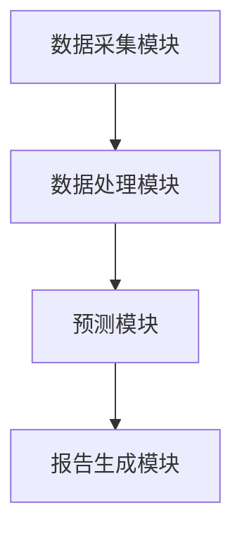

                 


# 巴菲特的现金储备策略：应对全球经济不确定性

## 关键词：巴菲特，现金储备策略，全球经济不确定性，投资哲学，风险管理，现金流预测模型

## 摘要：  
在全球经济不确定性加剧的背景下，现金储备策略成为投资者关注的焦点。本文以巴菲特的现金储备策略为核心，结合技术语言和分析方法，详细探讨现金储备策略的定义、数学模型、系统架构设计以及实战案例。通过理论与实践相结合的方式，本文旨在为投资者提供应对全球经济波动的有效策略，并通过具体的算法和系统设计，帮助读者更好地理解和应用这些策略。

---

## 第1章: 引言

### 1.1 全球经济不确定性概述  
全球经济的不确定性主要来源于经济周期波动、地缘政治风险、疫情冲击等多重因素。在这样的背景下，现金储备作为一种重要的风险管理工具，能够为投资者提供安全性和灵活性。  
**现金储备的重要性：**  
- 现金储备是应对突发事件和市场崩盘的关键手段。  
- 现金储备能够为投资者提供投资机会的灵活性。  
- 现金储备是实现长期投资目标的重要保障。  

### 1.2 巴菲特的现金储备策略  
巴菲特作为全球著名投资者，其投资哲学以长期价值投资为核心，而现金储备是其投资策略的重要组成部分。巴菲特强调在市场低迷时期储备足够的现金，以便抓住优质资产的投资机会。  
**巴菲特现金储备策略的特点：**  
- **安全性**：避免在市场高位投资，确保资金安全。  
- **灵活性**：在市场底部或优质资产出现时，能够迅速行动。  
- **长期性**：通过长期储备，实现资本的稳健增值。  

### 1.3 本书的目的与结构  
本文旨在通过技术化的分析方法，详细解读巴菲特的现金储备策略，并结合数学模型和系统设计，为读者提供实用的工具和方法。文章结构如下：  
- 第2章：现金储备策略的核心概念。  
- 第3章：现金流预测的数学模型与算法。  
- 第4章：现金流管理系统的系统分析与架构设计。  
- 第5章：现金储备策略的实战案例。  
- 第6章：最佳实践与小结。  

---

## 第2章: 现金储备策略的核心概念

### 2.1 现金储备的定义与特点  
**现金储备的定义：**  
现金储备是指将部分资金以现金形式储备起来，以应对未来不确定性的投资策略。  
**现金储备的特点：**  
- **流动性**：现金储备可以随时用于投资或支付。  
- **安全性**：现金储备的风险较低，能够在市场波动中保持资产安全。  
- **灵活性**：现金储备能够根据市场变化迅速调整投资方向。  

### 2.2 现金储备策略的核心要素  
**现金储备策略的核心要素包括：**  
1. **现金流预测**：通过数学模型预测未来现金流的变化。  
2. **资产配置**：根据市场情况调整现金储备的比例。  
3. **风险管理**：通过分散投资降低风险。  

### 2.3 现金储备策略的实施步骤  
**实施步骤：**  
1. **确定投资目标**：明确长期和短期的投资目标。  
2. **评估市场风险**：分析当前市场环境，评估风险程度。  
3. **制定储备计划**：根据目标和风险评估结果，制定现金储备计划。  
4. **动态调整**：定期评估储备情况，根据市场变化进行调整。  

---

## 第3章: 现金流预测的数学模型与算法

### 3.1 现金流预测的背景与意义  
**背景：**  
现金流预测是现金储备策略的核心环节，通过预测未来的现金流，投资者可以更好地规划资金的使用和储备。  
**意义：**  
- 现金流预测能够帮助投资者提前规划，避免资金链断裂。  
- 通过预测现金流的变化，投资者可以更好地把握投资机会。  

### 3.2 现金流预测的数学模型  
**时间序列分析模型：**  
时间序列分析是一种常用的现金流预测方法，其核心是通过历史数据预测未来值。  
**ARIMA模型：**  
ARIMA（自回归积分滑动平均模型）是一种广泛应用于时间序列预测的模型。  
$$ ARIMA(p, d, q) $$  
其中，p为自回归阶数，d为差分阶数，q为滑动平均阶数。  

### 3.3 现金流预测的Python实现  
**代码实现：**  
```python
from statsmodels.tsa.arima_model import ARIMA
import pandas as pd
import matplotlib.pyplot as plt

# 加载数据
data = pd.read_csv('cash_flow.csv')

# 拆分训练集和测试集
train_data = data['2018-01-01':'2022-12-31']
test_data = data['2023-01-01':]

# 建立ARIMA模型
model = ARIMA(train_data, order=(5, 1, 0))
model_fit = model.fit()

# 预测未来值
forecast = model_fit.forecast(steps=12)

# 可视化预测结果
plt.plot(train_data, label='Training Data')
plt.plot(test_data, label='Test Data')
plt.plot(forecast[0], label='Forecast')
plt.legend()
plt.show()
```

---

## 第4章: 现金流管理系统的系统分析与架构设计

### 4.1 系统功能设计  
**功能模块：**  
1. 数据采集模块：采集现金流数据。  
2. 数据处理模块：对数据进行清洗和预处理。  
3. 预测模块：利用ARIMA模型预测现金流。  
4. 报告生成模块：生成现金流预测报告。  

### 4.2 系统架构设计  
**架构图：**  


### 4.3 系统接口设计  
**输入接口：**  
- 数据采集接口：从数据库中读取现金流数据。  
- 参数设置接口：设置ARIMA模型的参数。  

**输出接口：**  
- 预测结果接口：输出预测的现金流数据。  
- 报告生成接口：输出现金流预测报告。  

---

## 第5章: 现金储备策略的实战案例

### 5.1 项目背景与目标  
**背景：**  
某企业希望通过储备现金来应对全球经济不确定性，确保在市场波动中能够灵活调整投资策略。  
**目标：**  
- 建立现金流预测模型，预测未来现金流。  
- 根据预测结果制定现金储备计划。  

### 5.2 核心代码实现  
**现金流预测代码：**  
```python
import pandas as pd
from statsmodels.tsa.arima_model import ARIMA

# 加载数据
data = pd.read_csv('cash_flow.csv')

# 建立ARIMA模型
model = ARIMA(data['cash'], order=(5, 1, 0))
model_fit = model.fit()

# 预测未来值
forecast = model_fit.forecast(steps=12)

# 输出预测结果
print(forecast)
```

### 5.3 案例分析  
**案例分析：**  
通过上述代码，企业可以预测未来12个月的现金流。根据预测结果，企业可以制定相应的现金储备计划，确保在市场波动中能够灵活应对。  

---

## 第6章: 最佳实践与小结

### 6.1 最佳实践  
1. **定期评估**：定期评估现金流预测模型，确保模型的有效性。  
2. **动态调整**：根据市场变化动态调整现金储备比例。  
3. **分散投资**：通过分散投资降低风险。  

### 6.2 小结  
本文通过技术化的分析方法，详细解读了巴菲特的现金储备策略，并结合数学模型和系统设计，为读者提供了实用的工具和方法。通过本文的分析，读者可以更好地理解和应用现金储备策略，应对全球经济不确定性。

---

## 作者：AI天才研究院 & 禅与计算机程序设计艺术

