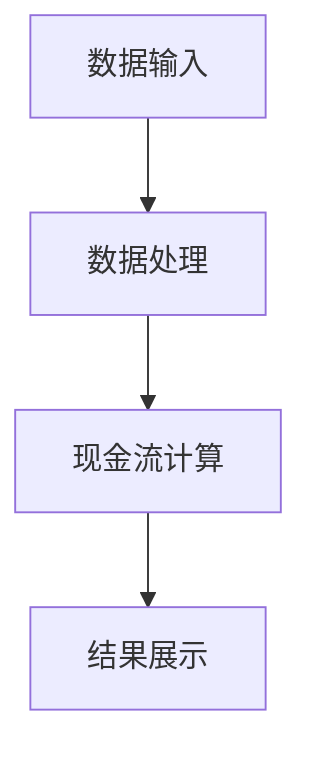
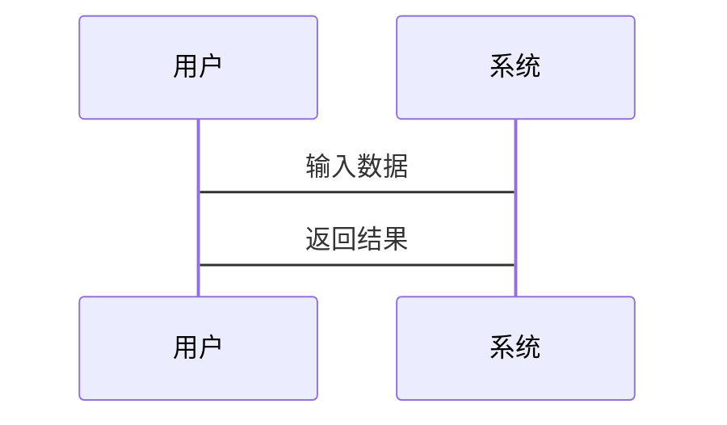

                 


# 巴菲特的现金流分析方法

> 关键词：现金流、巴菲特、投资分析、自由现金流、DCF模型

> 摘要：本文深入探讨了巴菲特的现金流分析方法，从基本概念到实际应用，详细分析了现金流在企业估值中的重要性。通过实例分析和数学模型，揭示了现金流分析的核心原理和实际操作方法。

---

## 第一部分：现金流分析的背景与重要性

### 第1章：现金流分析的背景与重要性

#### 1.1 现金流分析的基本概念

现金流是企业在一定时期内所有现金流入和流出的总和，反映了企业的财务健康状况。现金流可以分为经营活动、投资活动和筹资活动三类。

现金流的重要性在于它直接关系到企业的生存和发展。充足的现金流可以确保企业正常运营，而现金流的短缺可能导致企业面临破产风险。

巴菲特对现金流的分析尤为重视，他将自由现金流视为企业价值的核心驱动因素。自由现金流（Free Cash Flow，FCF）是企业在扣除所有支出后的剩余现金流，可以用于偿还债务、分红或再投资。

#### 1.2 巴菲特的背景与投资理念

巴菲特是世界著名的投资家，其投资哲学以价值投资为核心，强调长期持有优质股票。他认为，企业的内在价值是其未来现金流的现值，因此现金流分析是评估企业价值的关键。

巴菲特的现金流分析方法基于以下原则：
1. 企业价值取决于其未来现金流的现值。
2. 自由现金流是企业创造价值的核心。
3. 现金流的质量和可持续性比数量更重要。

#### 1.3 现金流分析的现实意义

现金流分析在企业财务管理中具有重要作用，可以帮助企业制定合理的财务策略。在投资决策中，现金流分析是评估投资项目可行性的重要工具。对于个人投资者，现金流分析也是制定个人财务计划的重要依据。

---

## 第二部分：现金流的核心概念与联系

### 第2章：现金流的核心概念与联系

#### 2.1 现金流的类型与计算方法

现金流可以分为三类：
1. **经营活动现金流**：来自企业日常经营的现金流，包括销售收入和支付的费用。
2. **投资活动现金流**：来自投资活动的现金流，如购买或出售资产。
3. **筹资活动现金流**：来自筹资活动的现金流，如发行债券或偿还债务。

#### 2.2 现金流与企业价值的关系

现金流与企业价值密切相关。企业的未来现金流的现值决定了企业的内在价值。自由现金流是企业价值的核心，因为它是企业在满足所有支出后的剩余现金流，可以用于再投资或回报股东。

#### 2.3 巴菲特现金流分析的核心要素

巴菲特的现金流分析方法主要包括以下要素：
1. **自由现金流（FCF）**：企业的自由现金流是衡量企业创造价值能力的重要指标。
2. **现金流的质量**：高质量的现金流意味着企业能够持续产生正现金流。
3. **现金流的可持续性**：企业应具备持续产生自由现金流的能力。

---

## 第三部分：现金流分析的算法原理

### 第3章：现金流分析的算法原理

#### 3.1 现金流折现模型（DCF模型）

现金流折现模型（DCF模型）是巴菲特常用的估值方法之一。DCF模型的基本原理是将企业未来的所有现金流折现为现值，以此作为企业的内在价值。

公式为：
$$
\text{现值} = \sum_{t=1}^{n} \frac{\text{现金流}}{(1 + r)^t}
$$

其中，$r$ 是折现率，$t$ 是时间周期。

#### 3.2 巴菲特现金流分析的独特方法

巴菲特的现金流分析方法强调自由现金流的重要性。他通常使用以下公式计算自由现金流：
$$
\text{FCFF} = \text{EBIT} \times (1 - \text{税率}) + \text{折旧} - \text{资本支出}
$$

$$
\text{FCFE} = \text{FCFF} + \text{利息支出} \times (1 - \text{税率}) - \text{债务偿还}
$$

其中，$\text{EBIT}$ 是息税前利润，$\text{税率}$ 是企业所得税率，$\text{折旧}$ 是折旧费用，$\text{资本支出}$ 是资本支出，$\text{利息支出}$ 是利息支出，$\text{债务偿还}$ 是债务偿还金额。

#### 3.3 算法实现与代码示例

以下是计算自由现金流的Python代码示例：

```python
def calculate_fcf(EBIT, tax_rate, depreciation, capital_expenditure, interest_expense, debt_repayment):
    FCFF = EBIT * (1 - tax_rate) + depreciation - capital_expenditure
    FCFE = FCFF + interest_expense * (1 - tax_rate) - debt_repayment
    return FCFF, FCFE

EBIT = 100000000
tax_rate = 0.2
depreciation = 5000000
capital_expenditure = 10000000
interest_expense = 2000000
debt_repayment = 5000000

FCFF, FCFE = calculate_fcf(EBIT, tax_rate, depreciation, capital_expenditure, interest_expense, debt_repayment)
print(f"FCFF: {FCFF}")
print(f"FCFE: {FCFE}")
```

---

## 第四部分：现金流分析的系统架构与设计

### 第4章：现金流分析的系统架构与设计

#### 4.1 系统分析与设计概述

现金流分析的系统架构设计包括以下步骤：
1. **需求分析**：确定系统的功能需求，如数据输入、计算、结果展示等。
2. **功能模块设计**：将系统划分为数据输入模块、计算模块和结果展示模块。
3. **系统架构设计**：采用分层架构，包括数据层、业务逻辑层和表现层。

#### 4.2 现金流分析的系统架构图

以下是一个简单的系统架构图：



#### 4.3 系统接口与交互设计

以下是系统交互的序列图：



---

## 第五部分：现金流分析的项目实战

### 第5章：现金流分析的项目实战

#### 5.1 项目环境与工具安装

##### 5.1.1 环境搭建

安装Python和必要的库，如NumPy和Pandas。

##### 5.1.2 工具安装与配置

安装Jupyter Notebook用于数据处理和可视化。

#### 5.2 项目核心实现

##### 5.2.1 现金流数据的获取与处理

从财务报表中提取现金流数据，并进行清洗和整理。

##### 5.2.2 现金流的计算与分析

使用Python代码计算自由现金流，并进行分析和可视化。

##### 5.2.3 现金流分析的可视化

使用Matplotlib或Seaborn绘制现金流的柱状图或折线图。

#### 5.3 项目小结

通过实际案例分析，读者可以掌握现金流分析的基本方法和实际操作技巧。

---

## 第六部分：最佳实践与小结

### 第6章：最佳实践与小结

#### 6.1 最佳实践

1. 在进行现金流分析时，应关注企业的自由现金流。
2. 确保数据的准确性和完整性。
3. 结合企业的行业特点和市场环境进行分析。

#### 6.2 小结

巴菲特的现金流分析方法是一种强大的工具，可以帮助投资者评估企业的内在价值。通过本文的介绍，读者可以掌握现金流分析的核心原理和实际操作方法。

---

## 作者信息

作者：AI天才研究院/AI Genius Institute & 禅与计算机程序设计艺术 /Zen And The Art of Computer Programming

