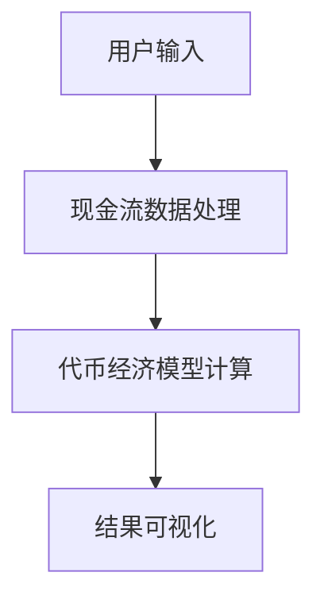
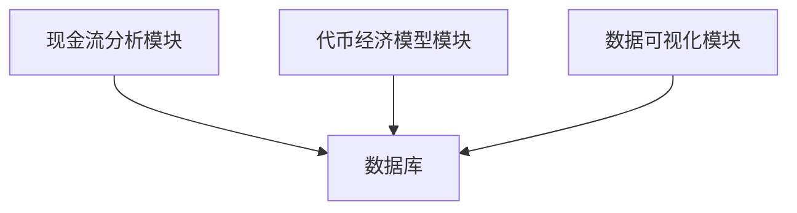
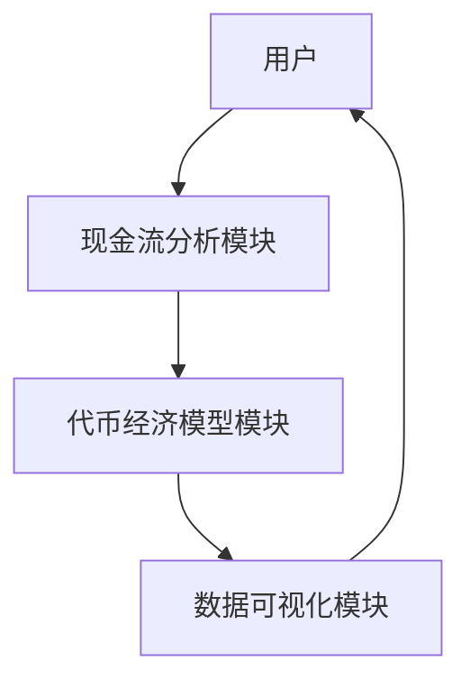

                 


# 巴菲特的现金流分析：代币经济学下的新指标

---

## 关键词
- 巴菲特
- 现金流分析
- 代币经济学
- 代币经济模型
- 现金流预测
- 现金流估值
- 投资分析

---

## 摘要
本文从巴菲特的经典现金流分析方法出发，结合代币经济学的新兴领域，探索如何将传统金融分析方法与区块链经济模型相结合，提出一种全新的现金流分析指标。文章首先介绍现金流分析的基本概念和巴菲特的核心投资理念，然后深入探讨代币经济模型的构建与现金流预测方法，最后结合实际案例分析现金流分析在代币项目评估中的应用。通过本文的分析，读者可以掌握如何在代币经济中运用现金流分析，从而做出更科学的投资决策。

---

# 第一部分：现金流分析概述

## 第1章：现金流分析的基本概念

### 1.1 现金流的定义与分类
- **现金流入**：企业通过销售产品、提供服务或其他经营活动获得的现金。
- **现金流出**：企业为了购买资产、支付债务或其他经营活动支出的现金。
- **净现金流**：现金流入减去现金流出，反映企业现金净变化。

### 1.2 巴菲特的现金流分析方法
- **自由现金流（Free Cash Flow）**：企业在支付了所有运营成本、税费和资本支出后的剩余现金，是企业真正能用于偿还债务和创造股东价值的部分。
- **现金流收益率（Cash Flow Yield）**：将自由现金流除以企业价值，衡量企业创造现金流的能力。

### 1.3 代币经济学的基本原理
- **代币经济模型**：通过代币的发行、流通和激励机制，构建一个去中心化的经济系统。
- **代币的经济属性**：包括稀缺性、可分割性、可编程性等。

---

## 第2章：现金流分析的核心指标

### 2.1 现金流的三张报表分析
- **现金流量表**：分为经营活动、投资活动和筹资活动的现金流。
- **净现金流公式**：  
  $$ \text{净现金流} = \text{现金流入} - \text{现金流出} $$

### 2.2 巴菲特现金流分析的关键指标
- **自由现金流公式**：  
  $$ \text{自由现金流} = \text{净利润} - \text{非现金费用} - \text{资本支出} $$
- **现金流收益率公式**：  
  $$ \text{现金流收益率} = \frac{\text{自由现金流}}{\text{企业价值}} $$

### 2.3 代币经济中的现金流指标
- **代币项目的现金流特点**：代币的流动性和价格波动直接影响现金流的稳定性。
- **代币经济中的现金流模型**：通过代币的供给和需求模型，预测未来现金流的变化。

---

## 第3章：现金流分析与代币经济学的结合

### 3.1 代币经济中的现金流分析框架
- **代币项目的现金流分析**：通过代币的发行量、交易量和价格波动，评估项目的现金流状况。
- **现金流预测与估值**：结合代币经济模型，预测未来现金流并进行估值。

### 3.2 代币经济中的现金流模型构建
- **现金流模型的基本假设**：代币的供给弹性、市场需求和价格波动。
- **现金流模型的构建步骤**：
  1. 确定代币的发行总量和分配机制。
  2. 分析代币的市场需求和价格波动。
  3. 计算代币项目的未来现金流。

### 3.3 现金流分析在代币项目评估中的应用
- **现金流预测与投资决策**：通过现金流分析，评估代币项目的可行性和投资回报。
- **现金流风险分析**：识别代币项目中的现金流风险，如市场波动和流动性风险。

---

# 第二部分：系统分析与架构设计

## 第4章：系统功能设计

### 4.1 系统功能模块
- 现金流分析模块：计算自由现金流和现金流收益率。
- 代币经济模型模块：构建代币的供给和需求模型。
- 数据可视化模块：展示现金流和代币经济数据。

### 4.2 系统功能流程图


---

## 第5章：系统架构设计

### 5.1 系统架构图


### 5.2 接口设计
- 现金流分析模块接口：接收企业财务数据，输出现金流分析结果。
- 代币经济模型模块接口：接收代币市场数据，输出代币经济模型结果。

---

## 第6章：系统交互流程图

### 6.1 系统交互流程图


---

# 第三部分：项目实战

## 第7章：环境安装与核心代码实现

### 7.1 环境安装
- Python 3.8+
- 数据分析库：Pandas、NumPy
- 图表库：Matplotlib、Seaborn

### 7.2 核心代码实现
```python
import pandas as pd
import numpy as np

def calculate_free_cash_flow(net_income, non_cash_expenses, capital_expenditure):
    return net_income - non_cash_expenses - capital_expenditure

def calculate_cash_flow_yield(free_cash_flow, enterprise_value):
    return free_cash_flow / enterprise_value

# 示例数据
net_income = 100
non_cash_expenses = 20
capital_expenditure = 30
enterprise_value = 500

# 计算自由现金流
free_cash_flow = calculate_free_cash_flow(net_income, non_cash_expenses, capital_expenditure)
print(f"自由现金流：{free_cash_flow}")

# 计算现金流收益率
cash_flow_yield = calculate_cash_flow_yield(free_cash_flow, enterprise_value)
print(f"现金流收益率：{cash_flow_yield}")
```

---

## 第8章：案例分析与代码解读

### 8.1 案例分析
- 某代币项目：代币总量为1亿枚，初始价格为1美元，年交易量为1000万美元。
- 现金流预测：基于代币的交易量和价格波动，预测未来三年的现金流。

### 8.2 代码解读
```python
# 示例数据
token_supply = 100000000
initial_price = 1
annual_volume = 10000000

# 现金流预测
def predict_cash_flow(years):
    cash_flows = []
    for year in range(1, years + 1):
        # 假设每年价格波动率为10%
        price = initial_price * (1 + 0.10) ** (year - 1)
        cash_flow = annual_volume * price
        cash_flows.append(cash_flow)
    return cash_flows

# 输出预测结果
print(predict_cash_flow(3))
```

---

## 第9章：项目小结

### 9.1 项目总结
- 成功构建了一个结合现金流分析和代币经济模型的系统。
- 通过实际案例验证了系统的可行性和有效性。

### 9.2 注意事项
- 代币经济模型的假设需要根据实际情况调整。
- 现金流预测需要结合市场数据和历史经验。

---

# 第四部分：扩展阅读

## 第10章：最佳实践与注意事项

### 10.1 最佳实践
- 定期更新代币经济模型，适应市场变化。
- 结合多种分析方法，全面评估代币项目。

### 10.2 注意事项
- 代币经济模型的复杂性可能增加分析难度。
- 市场波动和政策变化会影响现金流预测的准确性。

---

## 第11章：未来展望

### 11.1 未来研究方向
- 研究更复杂的代币经济模型，如博弈论模型。
- 结合人工智能技术，提高现金流预测的准确性。

---

## 第12章：小结

### 12.1 总结
- 巴菲特的现金流分析方法在代币经济中具有重要的应用价值。
- 通过本文的分析，读者可以掌握如何在代币项目中运用现金流分析，做出更科学的投资决策。

---

## 作者
作者：AI天才研究院 & 禅与计算机程序设计艺术

