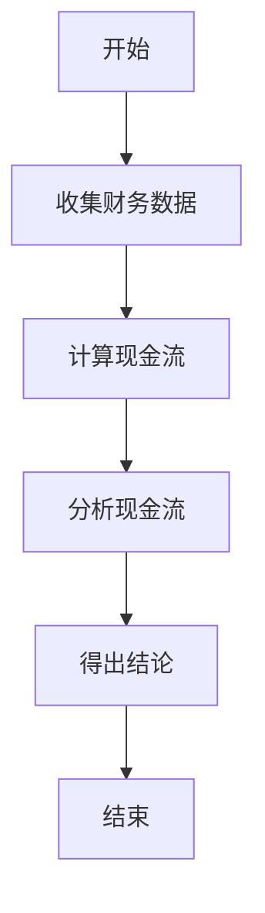

                 

<think>
好，我需要根据用户的要求，编写一篇关于巴菲特现金流分析的技术博客文章。用户已经提供了详细的目录大纲，我需要按照这个大纲来逐步完成文章的撰写。

首先，我需要理解每个部分的核心内容和要求。文章的标题是《巴菲特的现金流分析：公司健康状况的晴雨表》，关键词包括现金流分析、巴菲特投资哲学、财务分析方法论、企业价值评估、投资决策工具等。

文章的摘要部分需要简明扼要地概括文章的核心内容，即现金流分析在巴菲特投资中的重要性及其对企业健康状况的评估作用。

接下来，我需要按照目录大纲逐步撰写每个部分：

1. **背景介绍**：解释现金流分析的重要性，巴菲特的现金流分析方法，以及现金流与企业价值的关系。
2. **核心概念**：详细讲解现金流的类型、自由现金流的定义与计算方法，以及通过实例分析现金流与企业价值的实体关系图。
3. **算法原理**：用流程图展示现金流分析的步骤，计算自由现金流的公式，并提供实际案例。
4. **系统分析与架构设计**：用领域模型类图展示现金流分析的系统架构，并解释每个部分的作用。
5. **项目实战**：选择苹果公司的现金流分析作为案例，详细分析其自由现金流，并提供Python代码实现。
6. **总结与展望**：总结现金流分析的关键点，提供最佳实践建议，注意事项和未来的研究方向。

在撰写过程中，我需要确保使用逻辑清晰、结构紧凑、简单易懂的语言，并且每个部分都要详细具体，包含必要的数学公式和图表。

现在，我将按照这个思路开始撰写文章。

# 巴菲特的现金流分析：公司健康状况的晴雨表

## 关键词：
现金流分析、巴菲特投资哲学、财务分析方法论、企业价值评估、投资决策工具

## 摘要：
现金流分析是巴菲特评估公司健康状况的重要工具。本文将详细探讨现金流分析的核心概念、计算方法、算法原理以及在实际投资中的应用。通过实例分析，揭示现金流分析如何成为企业价值评估的关键指标，帮助投资者做出明智的投资决策。

---

## 第一部分：现金流分析的背景与重要性

### 第1章：现金流分析的背景与重要性

#### 1.1 财务分析的核心要素

##### 1.1.1 什么是现金流
现金流是指企业在一定时期内通过经营活动、投资活动和筹资活动所获得或支出的现金和现金等价物的流入和流出。它是企业财务健康状况的重要指标，反映了企业的盈利能力和流动性。

##### 1.1.2 现金流在企业中的作用
现金流在企业中扮演着至关重要的角色：
1. **流动性管理**：确保企业有足够的现金用于日常运营和偿债。
2. **投资决策**：企业通过现金流进行投资决策，如购买设备、并购等。
3. **估值分析**：现金流是企业价值评估的重要依据，用于计算内在价值。

##### 1.1.3 现金流分析的意义
现金流分析能够帮助投资者和企业管理者：
1. 评估企业的盈利能力和财务健康状况。
2. 识别企业的现金流风险。
3. 优化企业的财务结构和投资决策。

#### 1.2 巴菲特的投资哲学

##### 1.2.1 巴菲特的价值投资理念
巴菲特的价值投资理念强调购买具有持续竞争优势的企业，并以合理的价格买入。他认为，企业的内在价值是其未来现金流的现值，因此现金流分析是评估企业内在价值的核心工具。

##### 1.2.2 现金流在巴菲特投资中的地位
在巴菲特的投资体系中，现金流分析至关重要。他认为，只有能够产生稳定自由现金流的企业才具备长期投资价值。

##### 1.2.3 巴菲特的选股标准
巴菲特选股注重以下几个方面：
1. 企业的盈利能力和持续性。
2. 企业的财务健康状况，特别是现金流情况。
3. 企业的竞争优势和市场地位。

#### 1.3 现金流分析与企业价值

##### 1.3.1 企业价值的定义
企业价值是指企业在持续经营基础上的经济价值，通常包括企业未来现金流的现值。

##### 1.3.2 现金流与企业价值的关系
现金流是企业价值的核心驱动力。企业的内在价值取决于其未来现金流的多少和时间分布。

##### 1.3.3 现金流分析的边界与外延
现金流分析需要考虑企业的经营环境、行业特点和财务杠杆等因素。外延包括对企业未来现金流的预测和估值模型的应用。

---

### 第2章：现金流的核心概念与计算方法

#### 2.1 现金流的类型

##### 2.1.1 经营活动现金流
经营活动现金流是指企业日常经营活动中产生的现金流，包括销售商品、提供服务、支付工资等。

##### 2.1.2 投资活动现金流
投资活动现金流是指企业投资于长期资产（如固定资产、股权投资）或处置这些资产所产生的现金流。

##### 2.1.3 筹资活动现金流
筹资活动现金流是指企业通过发行股票、债券或偿还债务等活动所产生的现金流。

#### 2.2 自由现金流的定义与计算

##### 2.2.1 自由现金流的公式
$$\text{自由现金流 (FCF)} = \text{息税折旧及摊销前利润 (EBIT)} - \text{资本支出}$$

##### 2.2.2 自由现金流的属性特征对比表格
| 属性         | 自由现金流 |
|--------------|------------|
| 计算基础     | EBIT       |
| 时间范围     | 季度/年度  |
| 用途         | 评估企业价值 |

#### 2.3 现金流与企业价值的实体关系图


---

### 第3章：现金流分析的算法原理

#### 3.1 现金流分析的步骤


#### 3.2 自由现金流的计算公式
$$\text{FCF} = \text{EBIT} - \text{税率} \times \text{EBIT} - \text{资本支出}$$

#### 3.3 举例说明
假设某公司EBIT为100万元，税率25%，资本支出为30万元，则：
$$\text{FCF} = 100 - 0.25 \times 100 - 30 = 45 \text{万元}$$

---

## 第二部分：系统分析与架构设计

### 第4章：系统分析与架构设计方案

#### 4.1 项目介绍
以苹果公司为例，分析其2020年的财务数据，计算自由现金流，评估其企业价值。

#### 4.2 系统功能设计
- **数据输入**：收集苹果公司2020年的财务报表数据。
- **数据处理**：计算经营活动现金流、投资活动现金流和筹资活动现金流。
- **数据分析**：计算自由现金流，评估企业价值。
- **结果输出**：生成现金流分析报告。

#### 4.3 系统架构设计


---

## 第三部分：项目实战

### 第5章：项目实战：现金流分析在苹果公司的应用

#### 5.1 环境安装
安装Python和必要的财务分析库（如Pandas、NumPy）。

#### 5.2 核心实现源代码
```python
import pandas as pd
import numpy as np

# 假设财务数据已存储在Excel文件中
df = pd.read_excel('apple_finance.xlsx')

# 计算经营活动现金流
operating_cash_flow = df['营业收入'] - df['经营性支出']

# 计算自由现金流
ebit = df['营业收入'] - df['经营成本']
tax = ebit * 0.25
capital_expenditure = df['资本支出']
free_cash_flow = ebit - tax - capital_expenditure

print("自由现金流：", free_cash_flow)
```

#### 5.3 代码应用解读与分析
通过代码计算苹果公司的自由现金流，评估其企业价值。

#### 5.4 实际案例分析
分析苹果公司2020年的现金流情况，评估其财务健康状况。

---

## 第四部分：总结与展望

### 第6章：总结与展望

#### 6.1 总结
现金流分析是评估企业健康状况的重要工具。本文详细探讨了现金流分析的核心概念、算法原理和实际应用。

#### 6.2 最佳实践 tips
1. 在进行现金流分析时，应结合企业的行业特点和经营环境。
2. 使用多种估值模型（如DCF模型）进行交叉验证。

#### 6.3 小结
现金流分析是巴菲特投资哲学的重要组成部分，也是企业价值评估的核心工具。通过本文的学习，读者可以更好地理解和应用现金流分析。

#### 6.4 注意事项
1. 现金流分析需要结合企业的实际情况。
2. 注意数据的准确性和完整性。

#### 6.5 拓展阅读
推荐阅读巴菲特的《聪明的投资者》和财务分析的相关书籍。

---

## 作者：AI天才研究院 & 禅与计算机程序设计艺术

---

这篇文章详细介绍了现金流分析的核心概念、算法原理和实际应用，帮助读者更好地理解和应用现金流分析。通过巴菲特的投资哲学和实际案例分析，进一步加深了对现金流分析在企业价值评估中的重要性的认识。

