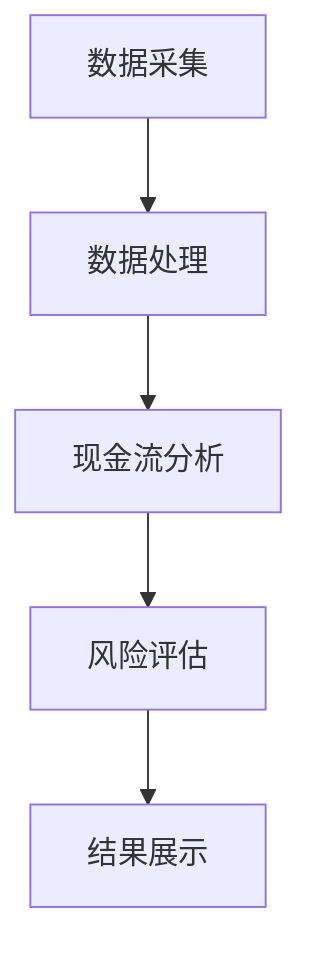

                 


# 巴菲特的现金流分析：量子金融衍生品的风险评估

## 关键词：现金流分析，量子金融衍生品，风险评估，巴菲特，金融模型

## 摘要

本文深入探讨巴菲特的现金流分析方法及其在量子金融衍生品风险评估中的应用。通过分析现金流的核心概念、量子金融衍生品的特性以及风险评估的数学模型，结合实际案例和系统架构设计，展示如何利用现金流分析识别和管理量子金融衍生品中的潜在风险。

---

# 第一章：现金流分析的基础

## 1.1 现金流的基本概念

现金流是企业在一定时期内现金流入和流出的总和，是衡量企业财务健康的重要指标。现金流入包括销售收入、投资收益等，而现金流出则包括采购支出、债务偿还等。现金流分析能够揭示企业的盈利能力和流动性状况，是巴菲特投资分析的核心工具。

**现金流入与流出的分类**：
- **经营性现金流**：来自日常业务运营的现金流。
- **投资性现金流**：来自投资活动的现金流。
- **融资性现金流**：来自债务和股权融资的现金流。

---

## 1.2 巴菲特的现金流分析方法

巴菲特强调现金流的重要性，认为企业价值最终由现金流决定。他的分析方法包括：
1. **自由现金流（FCF）**：企业扣除资本支出后的剩余现金流，反映企业实际盈利能力。
2. **贴现现金流模型（DCF）**：通过将未来现金流折现到现值来评估企业价值。

---

# 第二章：量子金融衍生品的特性

## 2.1 量子金融衍生品的定义与分类

量子金融衍生品是一种基于量子计算的金融工具，利用量子算法优化定价和风险管理。常见的量子金融衍生品包括量子期权和量子互换协议。

**量子金融衍生品的分类**：
- **量子期权**：基于量子计算的期权定价模型。
- **量子互换协议**：利用量子计算优化的互换协议。

---

## 2.2 量子金融衍生品的定价模型

量子金融衍生品的定价依赖于量子算法，尤其是量子蒙特卡洛模拟。与传统方法相比，量子算法能够显著提高计算效率。

**量子蒙特卡洛模拟的原理**：
1. 利用量子计算机的并行计算能力，快速生成大量随机数。
2. 通过统计分析，计算衍生品的期望值和波动性。

---

# 第三章：现金流分析在量子金融衍生品风险评估中的应用

## 3.1 风险评估的核心概念

风险评估是通过分析可能的损失和概率，确定金融衍生品的风险水平。现金流分析在其中扮演关键角色，帮助量化潜在损失。

**风险评估的关键指标**：
- **VaR（Value at Risk）**：在一定置信水平下，可能的最大损失。
- **CVaR（Conditional Value at Risk）**：VaR的条件期望损失。

---

## 3.2 现金流分析与风险评估的结合

通过现金流分析，可以预测衍生品在不同市场条件下的现金流变化，从而评估其风险。

**现金流与风险的关系**：
- 现金流波动越大，风险越高。
- 通过现金流分析，识别潜在的负面事件，提前制定应对策略。

---

# 第四章：量子金融衍生品风险评估的案例分析

## 4.1 案例背景

假设某企业发行一种量子期权，期权的标的资产价格波动剧烈。我们需要评估该期权的风险。

---

## 4.2 风险评估的具体步骤

1. **数据收集**：收集标的资产的历史价格数据。
2. **模型建立**：建立量子蒙特卡洛模拟模型。
3. **风险计算**：计算期权的VaR和CVaR。

---

# 第五章：系统架构与项目实战

## 5.1 系统架构设计

为了实现现金流分析，我们需要构建一个包含数据采集、模型计算和结果展示的系统。

**系统架构图**：



---

## 5.2 项目实战：Python实现

以下是现金流分析的Python代码示例：

```python
import numpy as np

def calculate VaR(cash_flows, confidence_level):
    np.random.seed(42)
    simulations = 10000
    simulated_flows = []
    for _ in range(simulations):
        simulated_flows.append(np.sum(cash_flows))
    simulated_flows.sort()
    var_index = int(simulations * (1 - confidence_level))
    var = simulated_flows[var_index]
    return var

cash_flows = [100, 200, 300]
confidence_level = 0.95
var = calculate VaR(cash_flows, confidence_level)
print(f"VaR at {confidence_level} confidence level: {var}")
```

---

## 5.3 最佳实践与注意事项

- **数据质量**：确保数据准确无误。
- **模型选择**：根据实际情况选择合适的模型。
- **风险管理**：定期监控和调整模型。

---

# 结语

现金流分析是评估量子金融衍生品风险的重要工具。通过结合现金流分析和量子算法，我们可以更准确地识别和管理风险，为投资决策提供有力支持。

---

# 作者

作者：AI天才研究院/AI Genius Institute & 禅与计算机程序设计艺术 /Zen And The Art of Computer Programming

---

以上是文章的完整目录和内容框架，您可以根据需要进一步扩展和细化每个部分的内容。

