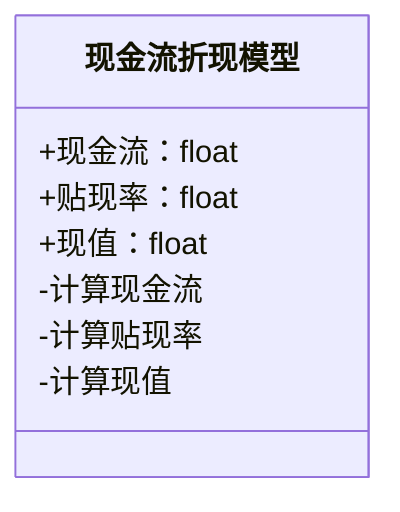

                 


```markdown
# 巴菲特的现金流折现模型：公司估值的核心方法

## 关键词：现金流折现模型, 巴菲特, 公司估值, 财务分析, 投资策略

## 摘要：现金流折现模型（DCF模型）是巴菲特评估公司价值的核心方法之一。本文详细介绍了现金流折现模型的理论基础、分析框架、系统设计、实际案例和最佳实践，帮助读者全面理解如何利用现金流折现模型进行公司估值。通过深入分析现金流的定义、贴现率的计算、永续增长假设以及系统架构设计，本文为读者提供了从理论到实践的完整指导，帮助投资者和分析师准确评估公司价值。

---

## 第1章: 现金流折现模型概述

### 1.1 巴菲特投资理念与现金流折现模型

#### 1.1.1 巴菲特投资理念的核心思想
沃伦·巴菲特的投资理念以“价值投资”为核心，强调以低于公司实际价值的价格买入优质股票。他主张长期持有，关注企业的内在价值而非市场波动。

#### 1.1.2 现金流折现模型在巴菲特投资中的地位
现金流折现模型（DCF模型）是巴菲特评估企业内在价值的核心工具。通过DCF模型，巴菲特能够估算出企业未来现金流的现值，从而判断其是否被市场低估。

#### 1.1.3 现金流折现模型的基本原理
DCF模型基于“钱的时间价值”这一基本金融原理，通过将未来现金流按适当贴现率折现，计算其当前价值，从而评估企业的公平市场价值。

---

### 1.2 现金流折现模型的背景与意义

#### 1.2.1 传统估值方法的局限性
传统估值方法如市盈率（P/E）和市净率（P/B）存在局限性，无法准确反映企业的内在价值，尤其是在企业盈利不稳定或负增长的情况下。

#### 1.2.2 现金流折现模型的优势与适用场景
DCF模型的优势在于其基于现金流的计算，能够更准确地反映企业的盈利能力。它适用于评估具有稳定现金流的企业，尤其是那些未来现金流可预测的行业。

#### 1.2.3 现金流折现模型在现代投资中的应用
DCF模型不仅是巴菲特的工具，现已成为现代金融分析的重要方法，广泛应用于企业估值、并购交易和投资决策等领域。

---

## 第2章: 现金流折现模型的理论基础

### 2.1 现金流折现模型的基本原理

#### 2.1.1 DCF模型的核心假设
- 企业未来现金流可预测。
- 贴现率反映资金的时间价值和风险。

#### 2.1.2 DCF模型的基本公式
$$
\text{企业价值} = \sum_{t=1}^{n} \frac{\text{现金流}_t}{(1 + r)^t}
$$
其中，r为贴现率，n为现金流预测期。

#### 2.1.3 DCF模型的数学模型
DCF模型通过将未来现金流折现，计算其现值，并与企业当前市值进行比较，判断其是否被低估或高估。

---

### 2.2 现金流折现模型的现金流量定义

#### 2.2.1 自由现金流的定义与计算
自由现金流（FCFF）是企业在扣除所有支出后的剩余现金流，可用于偿还债务和股东分红。

$$
\text{FCFF} = \text{净利润} + \text{折旧} - \text{资本支出}
$$

#### 2.2.2 现金流的分类与特征
现金流分为经营现金流、投资现金流和筹资现金流，分别反映企业经营活动、投资活动和筹资活动的现金流量。

#### 2.2.3 现金流的时间价值与风险调整
现金流的时间价值通过贴现率进行调整，反映资金的机会成本和风险溢价。

---

### 2.3 现金流折现模型的贴现率计算

#### 2.3.1 贴现率的定义与作用
贴现率是将未来现金流折现为现值的利率，综合考虑了资金的时间价值和投资风险。

#### 2.3.2 贴现率的计算方法
贴现率通常基于无风险利率和企业特定风险溢价之和。

$$
r = r_f + \text{风险溢价}
$$

#### 2.3.3 贴现率的敏感性分析
贴现率的变化对现值的影响较大，需进行敏感性分析以评估其对估值结果的影响。

---

### 2.4 现金流折现模型的永续增长假设

#### 2.4.1 永续增长的定义与应用
永续增长假设企业在稳定状态下现金流将以恒定速度增长。

#### 2.4.2 永续增长率的估算方法
永续增长率通常基于行业平均增长率或企业历史增长率。

#### 2.4.3 永续增长假设的合理性分析
永续增长假设简化了模型，但需谨慎评估其合理性，特别是在高增长行业。

---

## 第3章: 现金流折现模型的分析框架

### 3.1 现金流折现模型的分析步骤

#### 3.1.1 确定企业的现金流
识别企业的自由现金流，包括经营现金流和资本支出。

#### 3.1.2 确定合理的贴现率
基于企业的风险特征和市场环境确定贴现率。

#### 3.1.3 计算未来现金流的现值
将未来现金流按贴现率折现，计算其现值。

#### 3.1.4 确定企业的公平价值
将现值与企业当前市值进行比较，判断其是否被低估或高估。

---

### 3.2 现金流折现模型的分析工具

#### 3.2.1 财务报表分析工具
通过财务报表提取关键数据，如净利润、折旧和资本支出。

#### 3.2.2 DCF模型的Excel实现
使用Excel进行DCF模型的搭建，包括现金流输入、贴现率计算和现值计算。

#### 3.2.3 软件辅助工具
利用专业软件（如Python）进行DCF模型的高级分析和自动化计算。

---

### 3.3 现金流折现模型的分析案例

#### 3.3.1 案例一：制造业企业的DCF分析
以某制造企业为例，计算其未来五年的现金流，并按10%的贴现率折现，得出企业价值。

#### 3.3.2 案例二：科技公司的DCF分析
以某科技公司为例，评估其未来现金流，并考虑技术更新和市场风险。

---

## 第4章: 现金流折现模型的系统分析与架构设计

### 4.1 系统功能设计

#### 4.1.1 领域模型（Mermaid类图）


#### 4.1.2 系统架构设计（Mermaid架构图）


---

## 第5章: 现金流折现模型的项目实战

### 5.1 环境安装

#### 5.1.1 安装Python环境
使用Anaconda安装Python 3.9及以上版本。

#### 5.1.2 安装必要的库
安装`pandas`, `numpy`, 和 `matplotlib`。

---

### 5.2 系统核心实现源代码

#### 5.2.1 DCF模型实现代码
```python
import pandas as pd
import numpy as np

def calculate_dcf(cash_flows, discount_rate):
    present_value = 0
    for t, cf in enumerate(cash_flows, start=1):
        present_value += cf / (1 + discount_rate) ** t
    return present_value

# 示例数据
cash_flows = [100, 150, 200, 250, 300]
discount_rate = 0.10

# 计算现值
pv = calculate_dcf(cash_flows, discount_rate)
print(f"现值为：{pv:.2f}")
```

---

### 5.3 代码应用解读与分析

#### 5.3.1 环境变量配置
确保Python环境和相关库已正确安装。

#### 5.3.2 代码实现细节
解释代码中每个部分的功能，如`calculate_dcf`函数的实现。

#### 5.3.3 算法优化与扩展
讨论如何优化DCF模型，例如加入情景分析或蒙特卡洛模拟。

---

## 第6章: 最佳实践和注意事项

### 6.1 小结与展望

#### 6.1.1 本章小结
总结现金流折现模型的核心要点和实际应用。

#### 6.1.2 未来展望
探讨DCF模型在数字化转型和人工智能辅助分析中的应用前景。

---

## 第7章: 结论

### 7.1 现金流折现模型的核心要点
现金流折现模型是评估企业内在价值的重要工具，通过预测未来现金流和合理贴现率计算现值。

### 7.2 系统化分析与实战应用
通过系统化分析和实战案例，读者可以掌握DCF模型的使用方法，并在实际投资中应用。

---

## 作者：AI天才研究院 & 禅与计算机程序设计艺术
```

