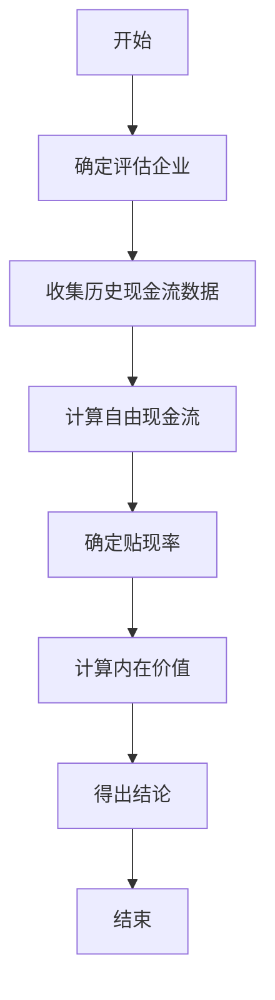

                 


# 巴菲特的现金流评估方法

## 关键词：
- 巴菲特
- 现金流评估
- 投资决策
- 企业价值
- 自由现金流
- DCF模型

## 摘要：
本文深入探讨了巴菲特的现金流评估方法，从核心概念到数学模型，再到实际案例分析，系统地展示了如何通过现金流评估企业价值。文章详细讲解了自由现金流模型和现金流贴现模型（DCF模型），并结合实际案例进行分析，帮助读者理解如何在投资决策中应用这些方法。

---

# 第一部分：现金流评估的核心概念

## 第1章：现金流评估的背景与重要性

### 1.1 现金流评估的重要性
现金流是企业财务健康状况的核心指标，直接反映了企业的盈利能力和偿债能力。巴菲特认为，企业价值的真正体现在于其产生的自由现金流，而不是单纯的利润数字。

#### 1.1.1 现金流是企业价值的核心
现金流反映了企业的实际盈利能力，而不仅仅是会计利润。通过现金流评估，投资者可以更准确地判断企业的价值。

#### 1.1.2 巴菲特对现金流的独特见解
巴菲特强调，企业的内在价值来源于其未来现金流的现值。他通过分析企业的自由现金流，来评估其长期盈利能力。

#### 1.1.3 现金流评估在投资决策中的作用
现金流评估帮助投资者识别高价值企业，避免被虚假利润迷惑。通过分析现金流，投资者可以更准确地判断企业的可持续发展能力。

### 1.2 巴菲特现金流评估方法的背景
#### 1.2.1 巴菲特的投资哲学概述
巴菲特的投资哲学基于价值投资，他注重企业的基本面分析，尤其是现金流和盈利能力。他通过分析企业的现金流，来判断其内在价值。

#### 1.2.2 现金流评估方法的演变
现金流评估方法经历了从简单到复杂的演变，从最初的利润分析，到后来的自由现金流模型和DCF模型的出现，使得企业价值评估更加科学。

#### 1.2.3 现金流评估方法与其他估值方法的对比
现金流评估方法与传统估值方法（如市盈率、市净率等）相比，更加注重企业的实际盈利能力，能够更准确地反映企业的内在价值。

---

## 第2章：现金流评估的核心概念

### 2.1 现金流的基本定义与分类
#### 2.1.1 现金流的定义
现金流是指企业在一定时期内，通过经营活动、投资活动和筹资活动所产生的现金流入和流出。

#### 2.1.2 现金流的分类
- 经营活动现金流：企业日常经营活动中产生的现金流，如销售收入和成本支出。
- 投资活动现金流：企业投资于固定资产、无形资产等长期资产所产生的现金流。
- 筹资活动现金流：企业通过发行股票、债券等筹集资金所产生的现金流。

#### 2.1.3 现金流与企业价值的关系
现金流是企业价值的核心，自由现金流是衡量企业盈利能力的重要指标。通过分析现金流，可以判断企业的可持续发展能力和内在价值。

### 2.2 自由现金流模型
#### 2.2.1 自由现金流的定义与计算公式
自由现金流（FCFF）是指企业在偿还了所有债务之后，能够自由分配给股东的现金流。

$$ FCFF = EBIT(1 - t) + D(1 - t) + W \cdot t $$

其中：
- EBIT：息税前利润
- t：税率
- D：折旧与摊销
- W：净营运资本变化

#### 2.2.2 自由现金流与企业价值的关系
自由现金流是企业价值的核心驱动力。通过计算自由现金流的现值，可以得出企业的内在价值。

#### 2.2.3 自由现金流的正向与反向评估
- 正向评估：根据企业未来现金流预测，计算其现值，得出企业价值。
- 反向评估：根据企业当前市值，计算其隐含的现金流增长率，判断其合理性。

### 2.3 现金流贴现模型（DCF模型）
#### 2.3.1 DCF模型的基本原理
DCF模型通过将未来现金流贴现到现值，来评估企业的内在价值。

#### 2.3.2 现金流贴现率的计算公式
贴现率通常采用加权平均资本成本（WACC）。

$$ WACC = w_d \cdot k_d + w_l \cdot k_l(1 - t) $$

其中：
- $w_d$：债务权重
- $k_d$：债务成本
- $w_l$：股权权重
- $k_l$：股权成本
- t：税率

#### 2.3.3 DCF模型的优缺点
- 优点：能够准确反映企业未来现金流的现值，是企业价值评估的重要工具。
- 缺点：依赖于未来现金流的预测和贴现率的估计，具有一定的主观性。

---

## 第3章：现金流评估的数学模型与算法

### 3.1 自由现金流模型的数学公式
$$ FCFF = EBIT(1 - t) + D(1 - t) + W \cdot t $$

### 3.2 现金流贴现率的计算
$$ WACC = w_d \cdot k_d + w_l \cdot k_l(1 - t) $$

### 3.3 现金流评估的算法流程


---

## 第4章：现金流评估的系统分析

### 4.1 企业现金流结构图
```mermaid
classDiagram
    class 现金流 {
        现金流入
        现金流出
    }
    class 自由现金流 {
        FCFF = EBIT(1 - t) + D(1 - t) + W \cdot t
    }
    class 内在价值 {
        Intrinsic Value = \sum_{t=1}^{n} \frac{CF_t}{(1 + r)^t}
    }
```

### 4.2 现金流评估流程图


---

## 第5章：项目实战——现金流评估案例分析

### 5.1 案例选择
以苹果公司为例，分析其现金流情况。

### 5.2 环境安装
需要安装财务分析工具，如Excel或Python的pandas库。

### 5.3 核心代码实现
```python
import pandas as pd

# 假设现金流数据已导入
cash_flows = pd.read_csv('apple_cash_flows.csv')

# 计算自由现金流
FCFF = cash_flows['EBIT'] * (1 - t) + cash_flows['D'] * (1 - t) + cash_flows['W'] * t

# 计算内在价值
discount_rate = 0.08
intrinsic_value = sum(FCFF / (1 + discount_rate)**t for t in range(len(FCFF)))
```

### 5.4 案例分析与解读
通过计算苹果公司的自由现金流和内在价值，验证其市值是否合理。

---

## 第6章：现金流评估的总结与最佳实践

### 6.1 总结
现金流评估是巴菲特投资哲学的核心，通过分析企业的自由现金流和内在价值，可以帮助投资者做出更明智的投资决策。

### 6.2 投资建议
- 优先选择自由现金流稳定且增长的企业。
- 结合企业的财务报表和行业环境，综合评估其内在价值。
- 避免仅依赖市盈率等简单指标，深入分析企业的现金流情况。

### 6.3 小结
现金流评估是价值投资的重要工具，通过科学的方法和持续的学习，投资者可以更准确地判断企业的内在价值，做出更明智的投资决策。

---

## 作者：
AI天才研究院/AI Genius Institute & 禅与计算机程序设计艺术/Zen And The Art of Computer Programming

