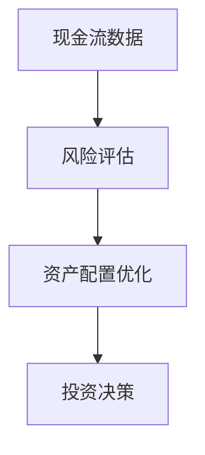
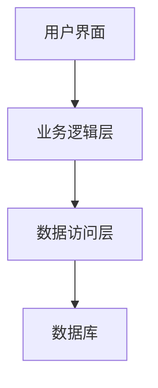

                 


# 巴菲特的现金管理策略：在低利率环境中的调整

## 关键词：巴菲特，现金管理，低利率环境，资产配置，风险管理，现金流

## 摘要：  
本文深入探讨了巴菲特的现金管理策略，特别是在低利率环境下的调整。通过分析现金流、资产配置和风险管理的核心概念，结合数学模型和算法原理，展示了巴菲特的投资哲学在实际操作中的应用。文章从系统架构设计到项目实战，详细阐述了如何在低利率环境下优化现金管理，实现稳健投资回报。

---

# 第1章: 巴菲特的现金管理策略背景

## 1.1 巴菲特的生平与投资理念  
沃伦·巴菲特作为投资界的传奇人物，其成功不仅源于对市场的深刻理解，更源于他对现金管理的独特见解。他强调安全边际和长期价值投资，认为现金是企业的氧气，必须谨慎管理。  

### 1.1.1 巴菲特的成长经历  
巴菲特出生于1934年，早年展现出对投资的浓厚兴趣。他在大学期间开始研究投资理论，并在职业生涯中积累了丰富的投资经验。  

### 1.1.2 巴菲特的投资哲学  
巴菲特的投资哲学以“价值投资”为核心，强调购买低估的优质资产，并长期持有。他认为市场的短期波动不应影响长期投资决策。  

### 1.1.3 巴菲特的现金管理理念  
巴菲特认为，现金是企业的流动性最强的资产，但也面临通胀和市场波动的风险。因此，现金管理的核心在于在风险可控的前提下，最大化资产的流动性与收益性。  

## 1.2 低利率环境下的经济背景  
低利率环境通常由央行通过降息等手段刺激经济，但同时也带来了货币贬值、资产收益率下降等问题。  

### 1.2.1 什么是低利率环境  
低利率环境是指市场利率低于历史平均水平，通常由央行货币政策调整引发。  

### 1.2.2 低利率环境对投资的影响  
低利率环境下，债券等固定收益资产的收益率下降，投资者转向股票等风险资产以寻求更高回报。  

### 1.2.3 现金管理在低利率环境中的重要性  
在低利率环境下，现金管理尤为重要。投资者需要在安全性、流动性和收益性之间找到平衡。  

## 1.3 现金管理的核心概念  
现金流、资产配置和风险管理是现金管理的三大核心概念。  

### 1.3.1 现金流的基本定义  
现金流是指企业在一定时间内流入和流出的现金和现金等价物。  

### 1.3.2 现金管理的目标与原则  
现金管理的目标是确保企业有足够的流动性，同时实现资产的保值和增值。其原则包括安全性、流动性、收益性等。  

### 1.3.3 现金管理的边界与外延  
现金管理的边界在于其涉及的范围和时间跨度，外延则包括与之相关的投资决策和风险管理。  

## 1.4 巴菲特现金管理策略的框架  
巴菲特的现金管理策略以防御性投资为核心，注重安全边际和股息策略。  

### 1.4.1 现金流的来源与去向  
现金流的来源包括营业收入、投资收益等，去向则包括偿还债务、股息分配等。  

### 1.4.2 现金管理的决策过程  
巴菲特通过分析企业的财务状况、行业前景和市场趋势，制定现金管理策略。  

### 1.4.3 现金管理的动态调整机制  
根据市场变化和企业需求，巴菲特会动态调整现金管理策略，以应对不确定性。

---

# 第2章: 巴菲特现金管理策略的核心概念与联系

## 2.1 现金流与资产配置的关系  
现金流是资产配置的基础，而资产配置则决定了现金的使用效率。  

### 2.1.1 现金流的分类与特征  
现金流可分为经营性、投资性和筹资性三类，每类都有其独特的特征和影响。  

### 2.1.2 资产配置的理论基础  
资产配置基于现代投资组合理论，通过分散投资降低风险，提高收益。  

### 2.1.3 现金流与资产配置的关联  
现金流的稳定性直接影响资产配置的策略选择。  

## 2.2 现金管理中的风险管理  
风险管理是现金管理的重要组成部分，旨在降低潜在损失。  

### 2.2.1 风险的定义与分类  
风险包括市场风险、流动性风险和信用风险等，需根据不同类型制定应对策略。  

### 2.2.2 现金管理中的风险来源  
市场波动、政策变化和企业自身财务状况都可能影响现金管理的风险。  

### 2.2.3 风险管理的工具与方法  
常用的工具包括期权、保险和多样化投资等，方法包括情景分析和压力测试。  

## 2.3 现金流与投资决策的关联  
现金流是投资决策的核心依据，影响着项目的可行性和收益潜力。  

### 2.3.1 投资决策的基本框架  
投资决策基于对现金流的预测和资本预算分析。  

### 2.3.2 现金流在投资决策中的作用  
现金流折现法（DCF）是评估投资项目的重要工具。  

### 2.3.3 投资组合的优化策略  
通过优化资产配置，可以提高投资组合的收益，同时降低风险。  

## 2.4 现金管理的数学模型与公式  
数学模型是现金管理的重要工具，帮助投资者量化分析和决策。  

### 2.4.1 现金流的现值计算公式  
$$ PV = \sum_{t=1}^{n} \frac{CF_t}{(1 + r)^t} $$
其中，\( PV \) 表示现值，\( CF_t \) 表示第 \( t \) 年的现金流，\( r \) 表示折现率。  

### 2.4.2 现金管理中的资产配置模型  
$$ w = \frac{w_m + w_c}{1 + w_m + w_c} $$
其中，\( w \) 表示资产配置权重，\( w_m \) 表示市场权重，\( w_c \) 表示调整系数。  

### 2.4.3 风险调整后的回报公式  
$$ R_a = R - \beta \times (R_m - R_f) $$
其中，\( R_a \) 表示风险调整后的回报，\( R \) 表示预期回报，\( \beta \) 表示贝塔系数，\( R_m \) 表示市场回报，\( R_f \) 表示无风险回报。  

---

# 第3章: 巴菲特现金管理策略的算法原理

## 3.1 现金流预测算法  
现金流预测是现金管理的基础，通常采用时间序列分析法。  

### 3.1.1 时间序列分析法  
通过分析历史现金流数据，预测未来的现金流情况。  

### 3.1.2 预测模型的构建与优化  
使用回归分析和机器学习算法优化预测模型，提高预测准确性。  

### 3.1.3 算法实现的步骤与流程  
1. 数据收集与清洗  
2. 模型选择与训练  
3. 模型评估与优化  
4. 预测结果输出  

## 3.2 资产配置优化算法  
资产配置优化是实现现金管理目标的关键。  

### 3.2.1 基于均值-方差的优化模型  
$$ \text{Minimize } \sigma^2 \text{ subject to } \mu = w_1 r_1 + w_2 r_2 + \dots + w_n r_n $$
其中，\( \sigma^2 \) 表示风险，\( \mu \) 表示预期回报，\( w_i \) 表示资产权重，\( r_i \) 表示资产回报。  

### 3.2.2 资产配置的数学推导  
通过拉格朗日乘数法求解优化问题，找到最优资产组合。  

### 3.2.3 算法的实现与应用  
使用Python中的优化库（如scipy）实现算法，应用于实际资产配置中。  

## 3.3 风险评估与控制算法  
风险评估是现金管理的重要环节，需采用多种方法量化风险。  

### 3.3.1 风险评估指标的计算  
计算VaR（在险值）和CVaR（条件在险值）等指标，评估投资组合的风险。  

### 3.3.2 风险控制的策略选择  
根据风险评估结果，调整资产配置和投资策略。  

### 3.3.3 算法的流程图与实现代码  

代码示例：
```python
import numpy as np
from scipy.optimize import minimize

def portfolio_risk(weights, returns, covariance):
    return np.sqrt(weights.T @ covariance @ weights)

def optimization_function(weights, returns, covariance):
    return portfolio_risk(weights, returns, covariance)

# 使用遗传算法优化资产配置
bounds = [(0, 1) for _ in range(len(weights))]
result = minimize(optimization_function, initial_weights, bounds=bounds, args=(returns, covariance))
```

---

# 第4章: 巴菲特现金管理策略的系统分析与架构设计

## 4.1 系统需求分析  
现金流管理系统需满足数据采集、分析和决策支持等功能。  

### 4.1.1 现金流管理系统的功能需求  
包括数据录入、预测分析、风险评估和决策支持等功能。  

### 4.1.2 系统的性能需求  
要求系统具备高效率和高可靠性，支持实时数据分析。  

### 4.1.3 系统的约束条件  
包括数据隐私、系统兼容性和用户界面友好性等。  

## 4.2 系统架构设计  
采用分层架构，确保系统的模块化和可扩展性。  

### 4.2.1 系统的模块划分  
包括数据采集模块、预测分析模块、资产配置模块和决策支持模块。  

### 4.2.2 系统架构的mermaid图  


### 4.2.3 接口的交互流程  
用户通过界面输入数据，系统处理后输出结果，实现人机交互。  

## 4.3 系统接口设计  
接口设计需清晰明确，便于集成和维护。  

### 4.3.1 系统接口的定义  
包括数据接口、算法接口和用户接口等。  

### 4.3.2 接口的交互流程  
用户通过接口提交请求，系统处理后返回响应。  

### 4.3.3 接口的实现方式  
采用RESTful API设计，支持JSON数据格式。  

---

# 第5章: 巴菲特现金管理策略的项目实战

## 5.1 环境安装与配置  
安装必要的软件和库，如Python、NumPy、Pandas等。  

### 5.1.1 安装Python环境  
使用Anaconda安装Python 3.8及以上版本。  

### 5.1.2 安装必要的库  
运行以下命令安装所需库：
```bash
pip install numpy pandas scikit-learn
```

## 5.2 系统核心实现源代码  
以下是现金流管理系统的实现代码：
```python
import numpy as np
import pandas as pd
from sklearn.linear_model import LinearRegression

# 数据预处理
data = pd.read_csv('cash_flow.csv')
X = data[['revenue', 'expenses']]
y = data['net_cash_flow']

# 建立线性回归模型
model = LinearRegression()
model.fit(X, y)

# 预测现金流
new_data = pd.DataFrame({'revenue': [1000000], 'expenses': [500000]})
predicted_cash_flow = model.predict(new_data)
print(predicted_cash_flow)
```

## 5.3 代码应用解读与分析  
上述代码利用线性回归模型预测现金流，帮助企业进行现金流管理。  

### 5.3.1 数据预处理  
将原始数据转换为适合模型训练的形式。  

### 5.3.2 模型训练与预测  
使用训练好的模型对新数据进行预测，输出结果。  

### 5.3.3 模型评估与优化  
通过交叉验证等方法评估模型性能，优化参数以提高预测准确性。  

## 5.4 实际案例分析  
以某企业为例，分析现金流管理系统的应用效果。  

### 5.4.1 案例背景  
企业面临低利率环境，希望通过优化现金管理提高收益。  

### 5.4.2 数据分析与建模  
基于历史数据，建立现金流预测模型，评估不同资产配置策略的效果。  

### 5.4.3 结果分析与策略调整  
根据预测结果和模型评估，调整现金管理策略，实现收益最大化。  

## 5.5 项目小结  
通过实际案例，验证了现金流管理系统在低利率环境下的有效性。

---

# 第6章: 总结与展望

## 6.1 总结  
本文详细探讨了巴菲特的现金管理策略，分析了低利率环境下的调整方法，并通过数学模型和系统设计展示了其实现过程。  

## 6.2 展望  
未来，随着技术的发展，现金管理将更加智能化和个性化，投资者需不断学习和适应新的挑战。  

## 6.3 最佳实践 tips  
1. 定期评估和优化现金管理策略。  
2. 注重风险管理和资产配置的动态调整。  
3. 利用技术工具提高现金管理的效率和准确性。  

---

# 作者：AI天才研究院 & 禅与计算机程序设计艺术

通过本文，读者可以深入了解巴菲特的现金管理策略，并在实际操作中灵活运用这些方法，实现稳健的投资回报。

